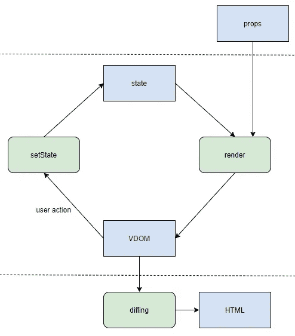
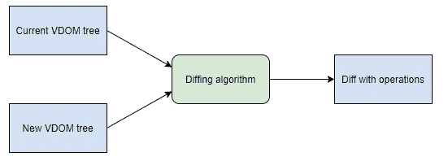
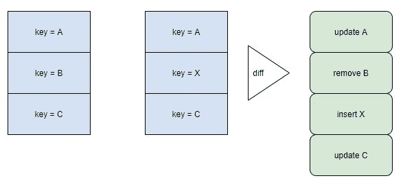
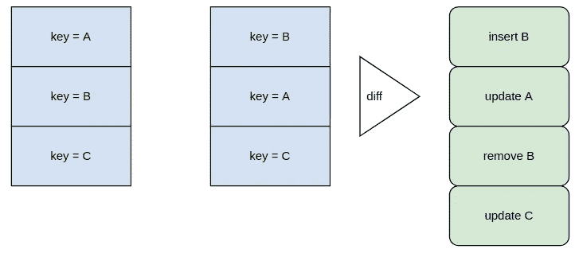
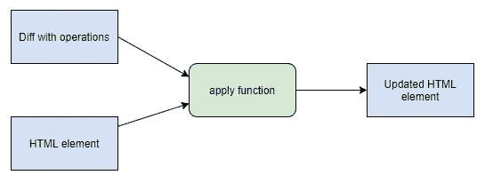
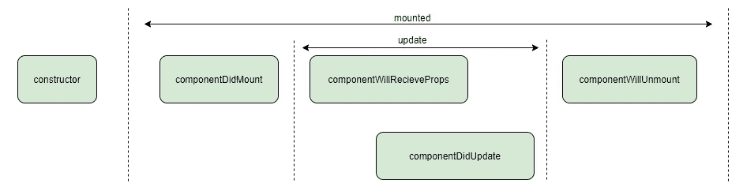
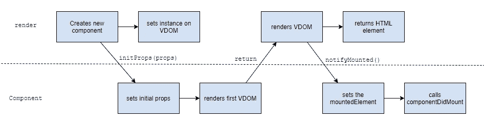
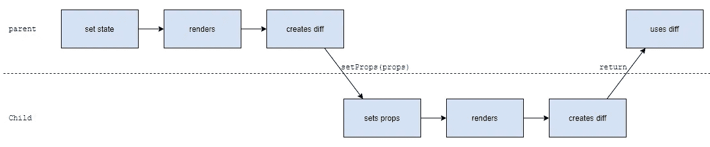

# 从头开始创造我们自己的反应

> 原文：<https://itnext.io/creating-our-own-react-from-scratch-82dd6356676d?source=collection_archive---------0----------------------->

## 通过构建我们自己的组件，包括虚拟 DOM、有状态组件和生命周期挂钩，来揭开 React 的神秘面纱

约翰尼斯·普莱尼奥在 [Unsplash](https://unsplash.com/s/photos/virtual-tree?utm_source=unsplash&utm_medium=referral&utm_content=creditCopyText) 拍摄的照片

在过去的十年中，我们看到了 web 应用程序开发方式的巨大变化。过去，只需在客户端编写少量脚本就可以在服务器上生成界面，而现在，使用各种反应式渲染库之一来创建复杂的有状态客户端应用程序已成为标准。

虽然许多开发人员无疑非常擅长利用 React 或 Vue 等库来创建丰富的用户交互，但对其确切内部工作方式的理解却远未普及。在这篇文章中，我想带你踏上创建我们自己的反应渲染库的旅程，并以这种方式揭开这些令人印象深刻的工具的神秘面纱。

但是在我们开始之前，有一个小小的警告。虽然我们的库非常有用(参见最后的示例应用程序)，但它只是一个演示工具，而不是 React 的轻量级替代方案。整个项目也可以在 [GitHub](https://github.com/WimJongeneel/ts-reactive-rendering) 上找到。

# 1.反应式渲染库体系结构

任何反应式渲染库中的主要内容都是组件。管理所谓的“反应范围”是组件的工作。这意味着一个组件包含一个变量(“状态”)，并负责将该变量呈现到 DOM 中。在这里，我们已经看到了一些你在编写 react 组件时可能知道的概念:`this.state`、`this.setState`和`render`。

基本电抗元件的结构。每次交互都会创建一个新的状态，这个新的状态会创建一个新的 VDOM，这个新的状态会更新应用程序的 HTML

反应式思维方式的一个关键点是，我们没有为应用程序状态可能发生的每一件事情指定 DOM 修改(就像您在 jQuery 代码库中看到的那样)。取而代之的是，有一个呈现函数，每当状态发生变化时，就会使用该呈现函数。虽然“只有一个渲染函数”的想法很棒(代码更少，DOM 中没有状态等)，但它确实提出了另一个问题:如果我们只是在每次更新时替换整个 DOM 结构，我们会产生相当多的问题。除了性能损失之外，它还会破坏用户的任何焦点，在滚动时产生奇怪的跳跃等等。

为了防止这些事情发生，反应式渲染库使用一个虚拟 DOM 和一个不同的算法来首先生成一个可以应用于真实 DOM 的更新策略。在这个虚拟 DOM 中，我们可以随心所欲地重新渲染，它只是一个有着花哨名字的 JavaScript 对象，而不是真正的 DOM。使用智能区分算法，我们可以确保对真实 DOM 的修改尽可能少，使得实际的 DOM 修改比任何手动编写的 DOM 更新函数都更有效。

我将从这样一个虚拟 DOM 的实现开始这篇文章。当然，这比你在 React 源代码中看到的要简单得多，但是它可以做同样的事情，更重要的是，演示了虚拟 DOM 的内部工作方式。在这之后，我们将研究用状态和属性创建有状态组件，以及有状态组件的概念如何与虚拟 DOM 结合。最后，我将通过一些真实的示例应用程序向您展示这个库的运行情况。

# 2.虚拟世界

实质上，虚拟 DOM 存在两种数据结构:HTML 语法树和 diff 树。HTML 树表示 JavaScript 对象中 HTML 的状态。它是组件的 render 方法的返回类型，也是使用该库的开发人员将与之交互的内容。diff 树描述了将 HTML 元素从一种语法树状态更新到另一种语法树状态需要采取的步骤。

VDOM 树、差分算法和 diff 之间的关系

## 2.1 HTML 语法树

这个数据结构将存储我们的虚拟 DOM 的状态。目前我们只支持普通元素和文本节点。稍后，这将被扩展到允许在树中使用有状态的组件。类型定义可以在下面找到。key 属性将在区分子元素时使用，熟悉 React 的人应该已经意识到了这一点。

VDOM 类型定义

我们的库不支持 JSX，所以我们需要一些帮助函数来方便地创建 VDOM 元素。这些函数将在组件的渲染方法中使用。它们相当于您可能在 JavaScript 包中看到的`React.createElement`调用。

创建 VDOM 元素的函数

## 2.2 diff 数据结构

我们将首先从在单个元素上工作的不同机制开始，然后我们将扩展它以支持子元素。首先我们将创建一个包含所有操作的类型。操作是对单个 HTML 元素进行的 DOM 变异。主要操作是`update`和`replace`。紧接着我们还有一个`skip`操作，用来表示不需要做任何修改。

可以应用于单个元素的操作类型

`update`操作包含一个实际的 diff 树，并且存在处理大多数`setState`调用结果所需的小步骤。在这里，您还可以看到对子元素更新的引用。子元素的操作略有不同，因为它们将应用于元素的集合。除了我们已经定义的操作之外，它们还包括`insert`和`remove`:

可应用于元素的子元素的操作类型

# 3.创造差异

现在我们能够构造一个虚拟 DOM 和一个 diff，是时候创建一个值得我们为之努力的 VDOM 了:diffing 算法。这将允许我们的组件有效地在它们的状态之间转换，并且对于反应式应用程序的平滑性来说，这是唯一最重要的事情。一个缓慢的甚至崩溃的 diffing 算法将完全破坏任何应用程序的用户体验，不管实际的组件是如何精心制作的。

我们将分两部分处理这一部分:首先是单个元素的差异，然后是(子)元素集合的差异，就像我们对类型定义所做的那样。

## 3.1 创建元素的差异

当区分我们的 VDOM 时，我们必须处理两种不同的可以更新的东西:文本节点和 HTML 元素。我将从处理文本节点开始，因为它们非常简单。如果两个元素都是文本节点，并且值没有改变，我们返回一个`skip`操作。在任何其他情况下，如果我们有一个文本节点，我们将不得不用新的元素替换旧的元素:

文本节点的区分

运行这些检查后，我们确信两个节点都是常规元素。然而，我们还有一种情况需要完全替换节点:当新旧元素的`tagname`不同时。这是我们将添加到函数中的下一个案例:

更新的标记名意味着必须重新安装整个组件

现在，我们可以确定我们拥有的两个元素属于同一类型，并且可以从一种状态更新到另一种状态，而不必创建新元素。为此，我们必须生成三种不同的东西:已经删除的属性、需要设置的属性和对孩子的更新:

为更新操作生成所有数据

至此，我们完成了单个元素的差分逻辑。就像 HTML 语法树一样，我们将在本文后面添加对组件差异和挂载的支持。现在是时候转移到子元素的不同逻辑上了。

## 3.2 为子代创建差异

区分算法的最后一部分是子元素的区分。这是 VDOM 中最复杂的部分，因为元素的子元素可能会发生许多不同的事情。例如:我们可以在开头、中间或结尾插入一个新元素。我们还可以删除元素、更新元素或对现有元素进行重新排序。这就是元素的`key`发挥作用的地方:我们假设如果键是相同的，那么元素就是相同的(但是仍然可以被修改)。通过这些键，我们可以确定当前树中的第一个元素对应于新树中的第三个元素，因为我们在前面添加了两个新元素。没有钥匙，这实际上是不可能知道的。

两个 VDOM 元素集合之间的 diff 操作示例(图片由作者提供)

为了简单起见，我们将采用一点简化的实现，它不支持键的重新排序(如果你重新排序，将会导致`remove`和`insert`子键顺序混乱)。这节省了很多没什么意思的代码，但是如果你真的感兴趣的话，你可以随意添加你自己的实现。我们将通过创建两个堆栈来开始我们的函数，这两个堆栈包含旧树和新树的剩余未处理的子树:

childsDiff 函数的基本结构

在第 6 行，我们将添加处理所有子节点的逻辑，并用从旧树转换到新树所需的操作填充`operations`数组。这种算法的核心是寻找在新旧 VDOM 中都存在的元素。对于这些元素，我们需要生成更新，而所有其他元素要么被删除，要么被插入。下面显示的是这部分逻辑。只要有更新的孩子留在堆栈中，我们就一直为他们生成`update`操作。

当区分子元素时，我们主要关心为更新的元素生成更新操作，以防止现有元素的重新装载

在这个函数中需要注意的一点是，`nextUpdatedKey`不一定是`remainingOldChilds`和`remainingNewChilds`的第一个元素。在堆栈中，在它们之前可能存在已经被移除或插入的元素，因此在两个集合中都不存在。为了解决这个问题，我们首先必须删除所有旧的元素并插入所有新的元素，然后才能创建更新。

在将更新操作添加到结果之前，必须删除旧的元素并插入新的元素

我们必须考虑的最后一点是，在处理完所有更新的节点之后，仍然会有剩余的元素。当在树的底部添加或删除了孩子时，就会发生这种情况。这最后一点代码可以在下面找到。

最后，在处理完所有更新后，我们必须处理剩余的删除和插入操作

有了这个添加，我们现在有了一个完整的 diffing 算法，它能够生成复杂树的键控 diffs，并将得出一个合理有效的 diffs。有很多可能的优化，例如每一对`remove`和`insert`都可以用一个`replace`来完成。除此之外，您还可以支持根据元素的键对元素进行重新排序，这对于某些应用程序来说是一个坚实的需求。

重排序键的一个例子。在这种情况下，B 将被移除并插入。如果 B 是一个有状态的组件，这将意味着 B 被重置到它的初始状态(图片由作者提供)

# 4.连接虚拟和真实的 DOM

现在我们有了一个完整的虚拟 DOM，是时候把它和真实的 DOM 连接起来了。为此，我们需要两个独立的部分:一个接受 VDOM 并将其呈现到 DOM 中的函数，一个接受 diff 并将其应用到 DOM 中的元素的函数。

diff、HTML 元素和 apply 函数之间的关系(图片由作者提供)

## 4.1 渲染虚拟 DOM

开始使用我们全新的虚拟 DOM 时，我们需要做的第一件事是将它渲染到实际的 DOM 中。该函数将用于呈现组件的第一个版本。在此之后，将由`applyDiff`函数负责连接虚拟和真实 DOM。这个函数本质上可以归结为对树中每个元素的一个`document.createElement`调用:

将 VDOM 转换成 HTML 元素

这里值得注意的一点是，我们将每个属性直接分配给元素。这当然不是 React 这样的公司实现这种逻辑的方式。正确的做法应该包括用`setAttribute`设置属性，并使用合成事件系统将 DOM 中的事件与 VDOM 中的事件联系起来。这是其中一个地方，我削减了一个角落，以保持这篇文章有点合理的大小。

## 4.2 将 diff 应用于 HTML 元素

渲染的另一半是 diff 的应用。该函数将接受一个`HTMLElement`和一个 diff，并将其应用于元素。这里您可以看到与我们之前定义的相同的操作。为了简洁起见，我省略了 TypeScript 允许我进行的所有验证，我们唯一要验证的是我们是否将属性赋给了一个实际的元素而不是一个文本节点。

将两个 VDOM 元素之间的差异应用于 DOM 元素

在`applyChildrenDiff`中，我们循环操作，并将它们应用到当前的子元素。这里的大部分复杂性与`offset`有关，它用于知道 DOM 中的哪个元素是当前操作所涉及的元素。这里重要的是要记住，可以有比子元素更多的操作。

将操作集合应用于 HTML 元素的子元素

通过这个函数，我们总结了 VDOM 和与之相关的一切。我们旅程的下一站是将有状态组件添加到混合物中，并将它们组合成一个真正的反应式应用程序。

# 5.组件和反应范围

许多熟悉 React 的人都知道组件是包含状态的东西。虽然从用户的角度来看，这确实是组件的重要部分，但在反应式框架的源代码中，组件的主要工作是管理反应式范围。那么什么是反应式范围呢？反应式作用域是负责自身更新的 VDOM 树的一部分。这意味着一个组件在装载它的 DOM 中有一个对 html 元素的引用，并根据状态和属性为这个元素创建差异。即使该组件为父组件所有，它仍将负责自己的渲染和差异。

我们组件的生命周期挂钩(作者图片)

## 5.1 创建组件类

我们将从布局所有组件的基类开始。这个类将存储当前的道具、状态、根元素和 VDOM。这堂课的基本大纲可以在下面找到。React 等库中的许多属性和方法都很熟悉，例如`props`、`state`、`setState`、`componentDidMount`和`render`。

还有一些方法是缩进的，仅供内部使用。`setProps`将在父组件更新时被调用，为该组件提供新的道具。此函数将 VDOM 和新 VDOM 之间的差异返回给其父级。`initProps`将在挂载过程中被调用，并返回将在真实 DOM 中呈现的初始 VDOM。完成后，将调用`notifyMounted`，组件将完全安装在 DOM 中。接下来我们还有一个`unmount`方法，当组件从 DOM 中移除时会用到它。

组件类的大纲

您看到的另一件事是单个组件可以覆盖的空钩子方法。我们将把它们连接到我们库的内部。

## 5.2 安装组件

开始在渲染函数中使用组件的第一步是用组件的节点类型扩展 VDOM。这将使我们能够在另一个组件的呈现功能中使用一个组件，从而创建一个包含多个有状态组件的真正的组件树。在渲染函数中，开发人员将指定应该渲染什么组件以及使用什么道具。这种节点的类型定义如下所示。

组件 VDOM 定义的扩展

`instance`属性仅供内部使用。这将存储组件的实际实例，以及状态等。在里面。在 diffing 函数中，我们将确保将现有的组件实例从旧的树复制到新的树中，以便它们在树之间得以保留。需要注意的是，组件的呈现功能不会创建子组件的任何实例。相反，它将返回一个带有组件类引用和 props 值的节点。组件的构造将在后台完成。

在渲染函数中构造组件节点的函数

我们将考虑的在 VDOM 中使用组件的第一个场景是组件的初始呈现。当一个组件是应用程序的根组件或者出现在其父组件的第一次呈现时，就会发生这种情况。稍后，我们将研究如果一个组件替换了 VDOM 中的现有元素会发生什么。

当谈到“安装”一个组件时，有两种进一步的子情况需要考虑:组件已经被实例化或者仍然需要被创建。当一个组件已经有一个实例时，这个过程相当简单:我们调用`render`函数来获得其状态的当前 VDOM 表示，从中创建一个 HTML 元素，并在组件上调用`notifyMounted`。

在渲染函数中安装组件期间发生的所有事情，都在渲染函数和组件类的职责之间进行划分。向下的箭头是来自渲染函数的调用，向上的箭头是来自方法的返回

当仍然需要创建一个组件时，还需要几个步骤。首先，我们将使用`new`关键字创建一个组件实例。这个实例被分配给 VDOM 的`instance`道具。通过这种方式，它被保存下来，以便在下一次渲染时使用，这样我们就不会不断地重新创建我们的有状态组件。之后，我们初始化组件的属性。这将返回我们可以呈现到 DOM 中的组件的初始 VDOM。最后我们也叫`notifyMounted`。为`renderElement`功能实现该逻辑的附加代码如下所示。

在渲染函数中挂载组件

为了使这实际工作，我们还必须在组件类中实现各种方法。我们要解决的第一个方法是`initProps`。该方法负责初始化`props`并执行第一个`render`。它将存储生成的 VDOM 树并返回给调用者。然后调用者将负责把它放入 DOM。

组件中道具的初始化

我们需要完成安装过程的另一个方法是`notifyMounted`。这是当我们为最初的 VDOM 树创建了一个 HTML 元素时，`render`(可能通过`applyUpdate`)将调用的回调函数。这个方法还将调用`componentDidMount`，这是一个钩子，组件可以在渲染到 DOM 之后实现它来做一些事情。这是在一个`setTimeout`中完成的，以确保钩子在当前函数安装完组件后被调用，而不是在安装过程中。

呈现和 componentDidUpdate 挂钩的回调

## 5.3 更新组件

现在我们能够将组件挂载到 DOM 中了，是时候开始处理更新它们了。更新有两种方式:组件可以更新它的`state`或者从它的父组件获取新的`props`。在第一种情况下，是组件负责将更新应用到 DOM，在后一种情况下，它将向其父组件返回一个 diff。

但是在这两种情况下，过程是非常相似的:我们渲染组件，用这个新树和保存的现有树创建一个 diff，用新的 VDOM 树更新`currentRootNode`并返回 diff。这一点的实现如下所示。`getUpdateDiff`方法将被`setState`和`setProps`使用，并承担管理组件反应范围的重任。这也是我们计划在更新完成后运行对`componentDidUpdate`的调用的地方。

在组件的当前状态和 render 方法的先前结果之间生成更新

你在这里看到的另外一件事是`replace`操作上的`callback`。这需要确保组件的`mountedElement`属性在根元素被替换的情况下一直指向正确的 HTML 元素。为此，我们需要对 VDOM 和渲染做一些补充:

向替换操作和 applyUpdate 函数添加回调

## 5.4 使用 setState 更新组件

当一个组件通过`setState`更新时，我们需要做三件事:设置`state`属性，用`getUpdateDiff`获得一个 diff，并将这个 diff 应用到`mountedElement`。接下来，我还添加了一个 if 语句，如果您试图更新一个未安装的组件，它会抛出一个错误。相反，你也可以更新状态，然后返回，新的状态将在`initProps`的第一次渲染中使用。您可能认为这是 React 发出的警告。因为我们已经实现了更新组件的所有逻辑，所以这个方法现在相当简短:

我们组件的著名的 setState 方法

## 5.5 用 setProps 更新组件

组件更新的另一种方式是通过`setProps`。这种方法本质上和`setState`非常相似。你可以在下面找到它的完整定义。这里，如果组件还没有挂载，我们也会抛出一个错误。与经典的 React 生命周期挂钩的一个区别是，我们允许`componentWillRecieveProps`返回一个新的状态，这个状态将在我们用新的道具重新渲染组件之前使用。

父组件将用于更新组件属性的方法

与`setState`相反，当一个组件节点的属性发生变化时，`setProps`会在 diffing 函数中被调用。为了实现这一点，我们将在差异中添加组件支持。在此过程中，组件可能会发生三种情况:更新现有组件、卸载现有组件或装载新组件。

具有子组件的组件更新时会发生什么的概述。请注意，父组件不区分子组件的 VDOM，但是父组件负责应用子组件生成的差异

我们首先要实现的场景是更新一个现有的组件。第一步是将现有实例从`oldNode`复制到`newNode`。之后，我们检查`props`是否已经改变，如果已经改变，设置组件的`props`。这样得到的差就是我们从函数中直接返回的差。如果`props`没有改变，我们返回一个`skip`操作。

更新差异代码中现有组件的属性

我们将实现的第二个场景是用组件替换任何节点。这非常类似于我们已经看到的挂载，但是现在是在 diffing 函数内部完成的，以生成一个`replace`操作。这里值得注意的是，我们使用了`replace`操作的`callback`来确保`notifyMounted`仍然在渲染函数中被调用。

将组件安装在差速器内

## 5.6 卸载组件

最后一种情况是用其他东西替换一个组件。这导致了组件的“卸载”。在卸载过程中需要做几件事:我们调用组件上的`unmount`，组件调用`componentWillUnmount`钩子，组件清空它对 DOM 的引用，最后我们从 DOM 中移除 HTML 元素。

卸载将被移除的组件的不同代码的更新

我们组件的最后一个实现方法是`unmount`。这个方法调用了`componentWillUnmount`钩子，这次没有使用`setTimeout`，因为我们想在实际卸载之前运行钩子。接下来，我们将`mountedElement`设置为空。这有两个原因:对这个组件的任何更新现在都会给出一个错误，它确保 HTML 元素被释放到垃圾收集中。

组件的卸载

这最终结束了我们的反应渲染库的代码。有了我们现在拥有的所有部件，就有可能创建真正现代的单页应用程序。

# **6。构建示例应用程序**

在最后一章中，我将向您展示一个用本文中介绍的库制作的示例应用程序。就像每个示例应用程序一样，它当然是一个待办事项列表。这个应用程序的第一个组件向您展示了一个标准的控制器表单。第二个组件在其 render 函数中使用该组件，并呈现一个包含所有添加项的列表。

一个带有我们的反应式渲染库的受控表单组件

一个简单的 todo 应用程序与我们的反应渲染库

除了缺少的 JSX 支持，任何使用过 React 的人都应该对这段代码很熟悉。如您所见，我们的库支持 React 之类的大多数主要特性，并且完全能够支持小型应用程序。

# 7.结论

如果你做到了这一步，感谢你的阅读！我希望这个练习能帮助你理解反应式渲染是如何工作的。完整的源代码可以在[这个库](https://github.com/WimJongeneel/ts-reactive-rendering)中找到。