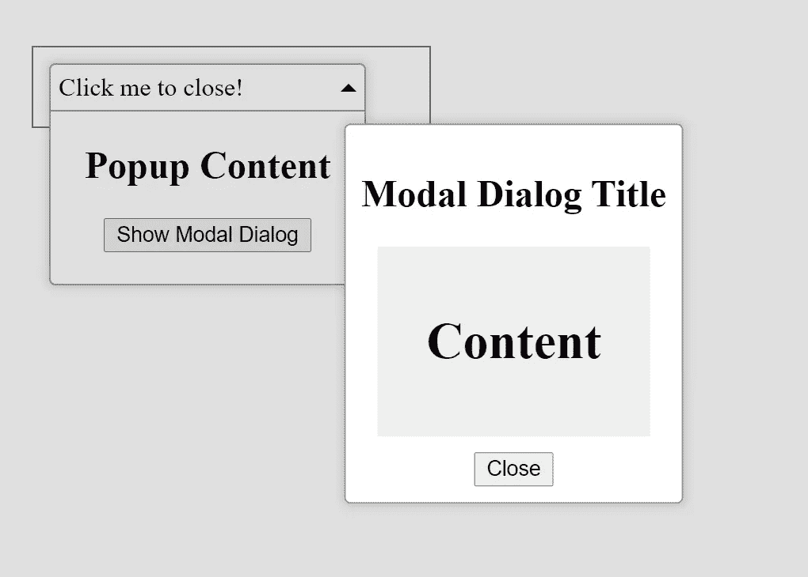
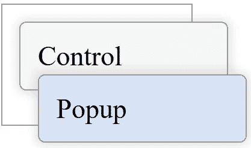
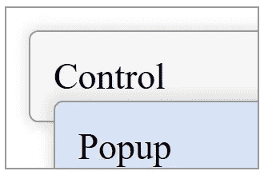
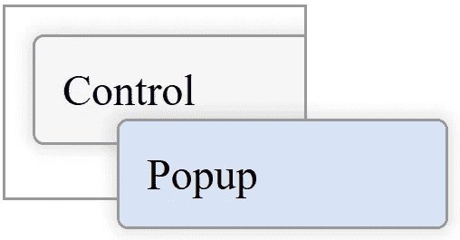
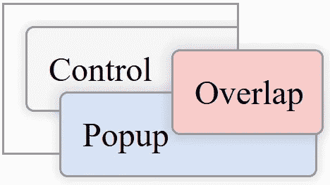
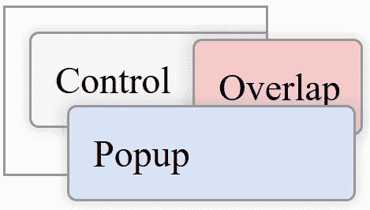
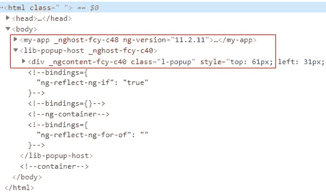

# 在 Angular 中创建弹出控件

> 原文：<https://itnext.io/creating-popup-controls-in-angular-bacb5a411caa?source=collection_archive---------2----------------------->



有许多控件类型可以被认为是弹出控件，例如选择、日期时间选择器、模态对话框等。所有这些控件都有脱离布局流并与其他 UI 元素重叠的部分。在 HTML 中实现重叠行为有一些众所周知的方法，但是在 Angular 中开发自己的组件库时，使用这些方法可能会有问题。接下来，我们将看看弹出控件的潜在问题以及避免这些问题的一些技巧。

## HTML 中的覆盖图

创建本地弹出窗口的最简单有效的方法是对宿主元素使用相对位置，对弹出窗口使用绝对位置:

```
<div id="host">
  <div id="control">
    Host
    <div id="popup">
      Popup
    </div>
  </div>
</div>
<style>
  #host{
    width: 90px;
    height: 50px;
  } #control{
    position: relative;
  } #popup{
    position: absolute;
    top: 30px;
    left: 10px;
  }
</style>
```



如果宿主元素不隐藏溢出，它会工作得很好，否则弹出窗口可能会被剪切，并且 z-index 也没有帮助:

```
#host{
  width: 90px;
  height: 50px;
  overflow: hidden;
}#control{
  position: relative;    
  z-index: 10000; /*It does not help*/
}
```



库控件可以放在任何主机中，因此上述解决方案不能视为通用的。

另一个解决方案是使用**固定**位置弹出:

```
<div id="host">
  <div id="control">
    Control
      <div id="popup">
        Popup
      </div>
  </div>  
</div>
<style>
  #host{
    width: 90px;
    height: 50px;
    overflow: hidden;
  } #popup{
    position: fixed;
    top: 50px;
    left: 50px;
  }
</style>
```



这种方法的缺点是弹出窗口和控件位置需要通过 JavaScript 同步，但主要问题是控件主机可以启动[一个新的堆栈上下文](https://developer.mozilla.org/en-US/docs/Web/CSS/CSS_Positioning/Understanding_z_index/The_stacking_context)，因此，弹出窗口可能会被其他元素覆盖，z 索引也不会有帮助:

```
<div id="host">
  <div id="control">
    Control
      <div id="popup">
        Popup
      </div>
  </div>  
</div>
<div id="overlap">
  Overlap
</div>
<style>
  #host{
    width: 90px;
    height: 50px;
    overflow: hidden; /*New stacking context*/
    position: relative;
    z-index: 0;
  } #popup{
    position: fixed;
    top: 50px;
    left: 35px;
    z-index: 1000;/*It does not help*/
  } #overlap{
    transform: translate(80px, -50px);
  }
</style>
```



这里的解决方案是在根堆栈上下文中呈现弹出窗口:

```
<div id="host">
  <div id="control">
    Control
  </div>  
</div>
<div id="overlap">
  Overlap
</div>
<div id="popup">
  Popup
</div>
```



这一招很管用，但是那些倒霉的角度控制的创造者应该怎么做呢？这些控件可以放在任何地方，它们的弹出窗口如何移动到应用程序根目录之后？此外，我将向您展示如何做到这一点。

## **实现内角**

第一个目标是在除控件本身之外的任何地方呈现一个弹出部件。

例如，我们正在开发一个下拉控件，我们希望在应用程序根组件之后呈现“向下”部分:

```
<div class="l-box">
  <ng-content select="lib-drop-down-label">
  </ng-content>
</div>
<div class="l-popup">
  <ng-content select="lib-drop-down-content">
  </ng-content>
</div>
```

使用[一个角度结构指令](https://stackblitz.com/edit/angular-popup-modals?file=src/app/lib/directives/popup-rect.directive.ts)我们可以捕获弹出部分作为模板，并将其存储在某个服务中:

[服务](https://stackblitz.com/edit/angular-popup-modals?file=src/app/lib/services/popup.service.ts):

这就是侦探的用法:

```
...
<div
  *libPopupRect="isOpen;top:rect.top;left:rect.left;width:rect.width;"
    class="l-popup"><ng-content select="lib-drop-down-content">
  </ng-content>
</div>
```

现在我们需要[一个主机组件来呈现存储的模板](https://stackblitz.com/edit/angular-popup-modals?file=src/app/lib/components/popup-host/popup-host.component.html):

```
<ng-container *ngFor="let p of popups">
  <div 
    class="l-popup"
    [style.top.px]="p.rect.top" 
    [style.left.px]="p.rect.left" 
    [style.bottom.px]="p.rect.bottom" 
    [style.right.px]="p.rect.right" 
    [style.width.px]="p.rect.width" 
    [style.height.px]="p.rect.height"
    [style.z-index]="p.rect.zIndex"
  >
    <ng-container [ngTemplateOutlet]="p.tr"></ng-container>
  </div>
</ng-container>
<style>
  .l-popup {
    position: fixed;
    pointer-events: initial;
  }  
</style>
```

[组件类](https://stackblitz.com/edit/angular-popup-modals?file=src/app/lib/components/popup-host/popup-host.component.ts):

```
[@Component](http://twitter.com/Component)(...)
export class PopupHostComponent { popups: PopupData[];

  constructor(private readonly _cd: ChangeDetectorRef) { } update(popups: PopupData[]) {
    this.popups = popups;
    this._cd.detectChanges();
  }
}
```

现在，使用该服务，我们可以在应用程序根之后动态创建主机组件:

在 DOM 中，打开的下拉菜单如下所示:



## 弹出窗口的定位

弹出窗口使用**固定的**位置，这意味着它们应该相对于锚点明确定位:

对于[下拉菜单](https://stackblitz.com/edit/angular-popup-modals?file=src/app/lib/components/drop-down/drop-down.component.ts)，我们可以使用组件元素 ref 作为锚点，并在弹出菜单出现时对其进行定位:

这里的问题是，我们不能保持下拉菜单始终打开，因为主机 DOM 布局的任何变化(调整大小，滚动等。)可能导致不正确的定位。该问题最简单的解决方案是关闭任何外部活动的下拉弹出窗口:

其他弹出控件也可以用同样的方式开发。例如 [**模态对话框**](https://stackblitz.com/edit/angular-popup-modals?file=src/app/lib/components/modal-dialog/modal-dialog.component.html) 。

—

上面描述的技术可能看起来有点过于复杂，但这是一个很好的解决方案，可以 99%确保您的弹出窗口不会被任何其他东西覆盖。

链接到[堆栈上的示例](https://stackblitz.com/edit/angular-popup-modals):[https://stackblitz.com/edit/angular-popup-modals](https://stackblitz.com/edit/angular-popup-modals)