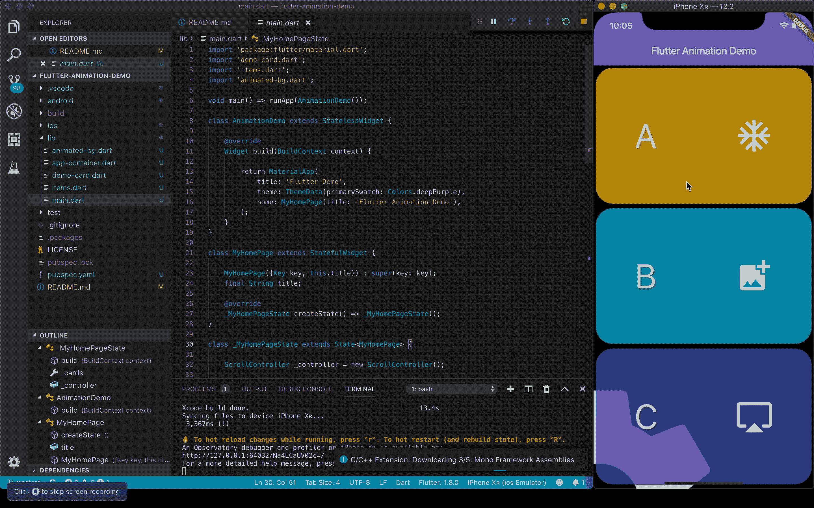

# 在 Flutter 中创建滚动动画

> 原文：<https://itnext.io/creating-scroll-animations-in-flutter-74eb340627d9?source=collection_archive---------2----------------------->

## 使用 Flutter 从头开始构建流畅的滚动动画

运行中的[演示应用](https://github.com/kenreilly/flutter-scroll-animation-demo)的屏幕记录

## 介绍

在本文中，我们将看看如何使用 [Flutter SDK](https://flutter.dev) 从头开始创建自定义滚动动画。Flutter 是创建运行良好的原生移动应用程序的强大工具，它在创建丰富的用户体验(如动画)方面提供了令人难以置信的灵活性。

如果您没有颤振环境，请前往[安装页面](https://flutter.dev/docs/get-started/install)。本文中示例项目的源代码可以在[这里](https://github.com/kenreilly/flutter-scroll-animation-demo)获得。

## 入门指南

对于这个演示，我使用`flutter create`创建了一个默认的 Flutter 项目，并且只使用了 Flutter 中直接可用的类，没有向项目添加任何依赖项。在许多情况下，任务(如自定义动画)可以直接完成，不需要额外的库。

这个示例应用程序的基本思想是创建一个包含几个项目的简单列表视图，当视图上下滚动时，让一个齿轮在后台顺时针/逆时针旋转。我们将通过获取用于列表视图的滚动控制器并将其传递给动画背景来实现这一点，这将构建一个与滚动位置同步旋转的自定义小部件。

## 应用程序入口点

我们将从主应用程序文件 **lib/main.dart** 开始:

在 **main.dart** 文件中，有以下组件的导入:

*   **demo-card.dart**
*   **items . dart**(为演示应用定义项目类和模拟内容)
*   **animated-bg.dart** *(构建动画背景小工具)*

主应用程序类( **AnimationDemo** )设置了一个基本应用程序，它包装了默认的主页小部件( **MyHomePage** )。在 **MyHomePage** 类中有一个 *_controller* 属性，它被初始化为[**scroll controller**](https://api.flutter.dev/flutter/widgets/ScrollController-class.html)类的一个新实例，随后被传递到 **AnimatedBackground** (它在后台驱动齿轮旋转动画)和 **ListView** (它呈现演示项目的滚动列表)。还有一个 *_cards* 属性，它以从 *items.dart* 导入的 **Item** 对象列表开始，并返回要在 ListView 中呈现的 **DemoCard** 小部件列表。

## 项目类别

我们将签出的第一个导入文件是 **lib/items.dart** :

**Item** 类提供了一个数据结构，该数据结构将被传递给**列表视图**中呈现的**演示卡**的实例。除了名称、描述(目前在演示中没有使用)、颜色和要为每个项目渲染的**图标**之外，没有什么其他的了。一个**项目**对象的列表将作为一个简单内容的列表在**列表视图**中呈现。

## DemoCard 类

下一个要检查的文件是 **lib/demo-card.dart** :

**DemoCard** 类在其构造函数中接收一个**项目**并返回一个 Card 小部件，该小部件呈现**文本**和**图标**元素，这些元素显示为每个项目定义的*名称*和*图标*。使用**阴影**、**文本样式**和**圆形矩形边框**以及卡片的仰角(设置为`3`)来应用一些基本样式。**列**和**行**小部件用于跨越卡片上的子元素。

## 动画背景类

把最好的留到最后，让我们看看 **lib/animated-bg.dart** :

在该文件的顶部，导入了`dart:math`库以访问 **π** 常量，用于旋转齿轮的旋转变换计算。 **AnimatedBackground** 类构造函数采用将驱动旋转的 **ScrollController** 。 *_offset* 属性将返回控制器偏移量(如果控制器有客户端*)(即控制器被正确初始化并连接到实际的滚动元素，如 ListView)* 或者它将简单地返回零。 *build* 方法返回一个[**animated builder**](https://api.flutter.dev/flutter/widgets/AnimatedBuilder-class.html)，它接受控制器(用作 [**Listenable**](https://api.flutter.dev/flutter/foundation/Listenable-class.html) 在滚动事件上重新绘制自身)并构建一个**溢出框**，该溢出框被对齐以将齿轮置于屏幕外。

值`4`和`3`将齿轮放在被测设备——iphonexʀ模拟器——的左下角。在实践中，**校准**值应该根据设备屏幕高度和宽度计算，以给出将齿轮放置在任何设备上的期望位置(左下角、向侧面居中等)的精确值，但是对于这个示例，我们将保持简单。

最后是精彩的部分，动画本身发生在 **Transform** 类的 *rotate* 静态方法中。这个类使用一个`angle`和一个`child`，按照预期的角度旋转子元素。对于这个演示，我希望齿轮移动缓慢，感觉更符合滚动物理，而不是 1:1 值的疯狂惯性效应，我希望齿轮逆时针滚动，就好像它在物理上驱动列表一样，所以我将`offset`乘以`math.pi`，然后将乘积除以 *-1024* 。

## **结论**

本文和示例项目展示了 Flutter 为创建定制动画用户体验所提供的一些功能。仅仅使用几个基本的类和简单的数学，我们就有了一个完整的动画，为一些无聊的东西(比如设置屏幕)增加了一个有趣得多的元素。

这些概念可以扩展到创建闪屏、加载动画、页面转换、通知效果或任何其他可以想象的东西。几乎任何以`double`作为参数的东西都可以被动画化，这导致效果的直接实现，比如本例中使用的旋转，以及不透明度、位置和许多其他属性。

感谢您的阅读，祝您的下一个颤振项目好运！

> 肯尼斯·雷利( [8_bit_hacker](https://twitter.com/8_bit_hacker) )是 [LevelUP](https://lvl-up.tech/) 的 CTO