# 使用 EasyAuth & FastAPI 创建安全的 API

> 原文：<https://itnext.io/creating-secure-apis-with-easyauth-fastapi-6996a5e42d07?source=collection_archive---------0----------------------->


本文将介绍如何使用 EasyAuth 保护现有的 FastAPI 应用程序

```
**APP LAYOUT**├── app
│   ├── __init__.py
│   ├── main.py
│   └── marketing
│   │   ├── __init__.py
│   │   ├── marketing.py
│   └── finance
│   │   ├── __init__.py
│   │   ├── finance.py
│   └── hr
│       ├── __init__.py
│       └── hr.py
```

**main.py**

**finance.py**

看看 OpenAPI 网页上的 API:

```
$ uvicorn --host 0.0.0.0 --port 8320 main:server
INFO:     Started server process [93409]
INFO:     Waiting for application startup.
INFO:     Application startup complete.
INFO:     Uvicorn running on [http://0.0.0.0:8320](http://0.0.0.0:8320) (Press CTRL+C to quit)
INFO:     127.0.0.1:46184 - "GET / HTTP/1.1" 404 Not Found
INFO:     127.0.0.1:46184 - "GET /docs HTTP/1.1" 200 OK
INFO:     127.0.0.1:46184 - "GET /openapi.json HTTP/1.1" 200 OK
```

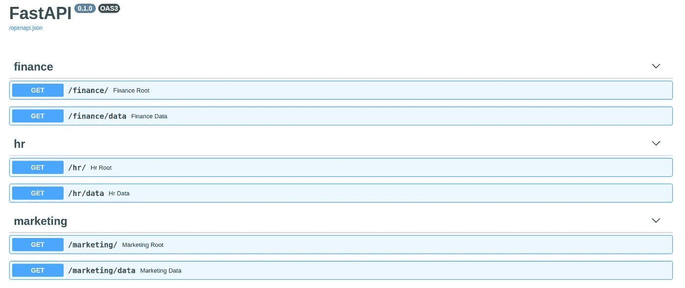

目前，任何人都可以通过网络连接到服务器来访问和使用该 API:

```
$ curl 0.0.0.0:8320/marketing/
"marketing_root"
$ curl 0.0.0.0:8320/finance/data
"finance_data"
```

# **使用 EasyAuth 保护端点**

EasyAuth 可以作为独立的认证服务运行，也可以与现有的应用程序一起运行。

## **创建独立的授权服务**

无需重新创建用户、组、角色和权限，而是集中到一个可跨多个应用程序使用的身份验证服务中

1.  准备环境

```
$ virtualenv -p python3 auth-env
$ source auth-env/bin/activate
```

2.安装依赖项

```
(auth-env)$ pip install easy-auth[server]
```

3.设置 EasyAuthConfig 文件

4.配置 EasyAuthServer

5.启动服务器

```
$ uvicorn --host 0.0.0.0 --port 8090 auth_server:serverINFO:     Started server process [115918]
INFO:     Waiting for application startup.
.
..
...
05-04 17:09 EasyAuthServer ERROR    detected new EasyAuth server, created admin user with password: rgpgltou
.
..
05-04 17:09 EasyAuthServer WARNING  EasyAuthServer Started! - Loaded Tokens {}
05-04 17:09 EasyAuthServer WARNING  adding routers
INFO:     Application startup complete.
05-04 17:09 uvicorn.error INFO     Application startup complete.
INFO:     Uvicorn running on [http://0.0.0.0:8090](http://0.0.0.0:8090) (Press CTRL+C to quit)
05-04 17:09 uvicorn.error INFO     Uvicorn running on [http://0.0.0.0:8090](http://0.0.0.0:8090) (Press CTRL+C to quit)
```

要访问 GUI，请浏览至[**http://0 . 0 . 0 . 0:8090**](http://0.0.0.0:8090)**/**admin 并使用 admin/rgpgltou 登录

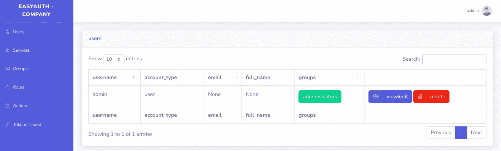

## 将 EasyAuth 与现有的 FastAPI 应用程序一起使用

使用 EasyAuthServer 或 EasyAuthClient 可以保护现有的 FastAPI 应用程序。

下一个示例将演示如何使用 EasyAuthClient 连接到刚刚创建的独立 EasyAuthServer，以及初始的 FastAPI 应用程序。

**先决条件**

```
$ pip install easy-auth[client]**APP LAYOUT**├── app
│   ├── __init__.py
│   ├── main.py
│   └── web
│   │   ├── __init__.py
│   │   ├── web.py
│   └── marketing
│   │   ├── __init__.py
│   │   ├── marketing.py
│   └── finance
│   │   ├── __init__.py
│   │   ├── finance.py
│   └── hr
│       ├── __init__.py
│       └── hr.py
```

启动应用程序

```
$ uvicorn --host 0.0.0.0 --port 8190 main:server
INFO:     Started server process [162292]
INFO:     Waiting for application startup.
05-04 21:35 EasyRpc-server /ws/easyauth WARNING  creating cron or get_upstream_registered_functions - interval 30
05-04 21:35 EasyRpc-server /ws/easyauth WARNING  creating cron or get_upstream_registered_functions - interval 30
05-04 21:36 EasyAuthServer WARNING  adding routers
INFO:     Application startup complete.
05-04 21:36 uvicorn.error INFO     Application startup complete.
INFO:     Uvicorn running on [http://0.0.0.0:8190](http://0.0.0.0:8190) (Press CTRL+C to quit)
```

请注意，所有端点在需要认证的 OpenAPI 文档中都有更改。


当使用 html response-/web/访问端点时

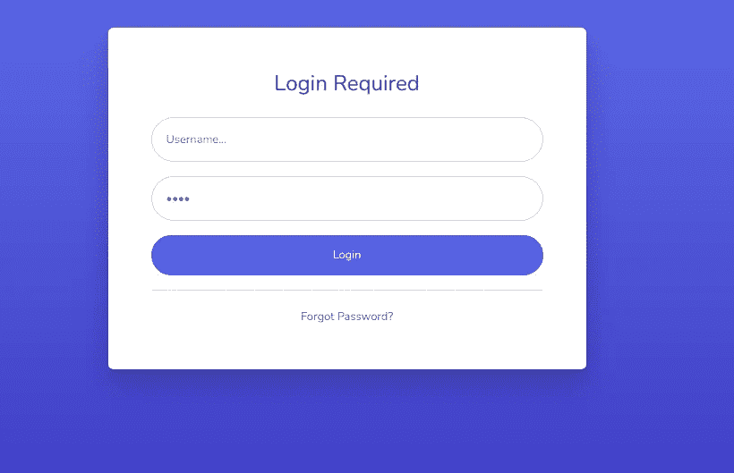

包括 403、404 和 401 响应的异常处理程序:


## **使用现有应用程序旁边的 EasyAuthServer**

EasyAuthServer 也可以直接插入到现有的应用程序中，但是需要相同的服务器先决条件:配置和依赖关系:

EasyAuthServer 端点和应用程序端点合并在 OpenAPI 文档中

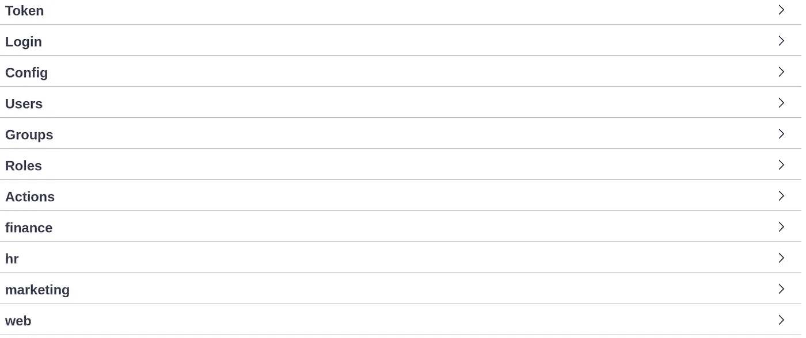

# 认证和授权

EasyAuth 身份验证基于非对称 RSA JSON Web 令牌，这保证了使用的 Web 令牌是有效的。[这篇](https://medium.com/intelligentmachines/istio-jwt-step-by-step-guide-for-micro-services-authentication-690b170348fc#:~:text=In%20Istio%20JWT%20authentication%20is,who%20issued%20the%20JWT%20token.)关于这个主题的大文章。

使用 RBAC 方法实施 EasyAuth 授权，以提供对端点的精细控制。

## RBAC

RBAC，即基于角色的访问控制，根据分配的组、角色和操作为用户提供非常具体的权限集

## 类型—用户

用户被定义为访问端点的最终用户/服务。

用户通过提供发送用户名和密码来请求令牌

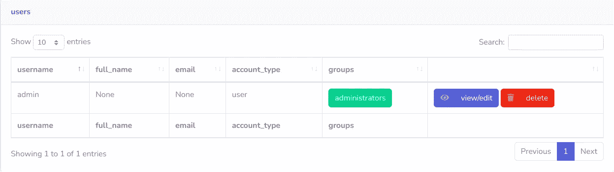

## 类型—服务

服务令牌必须由管理员组中的用户生成-服务帐户不存在密码

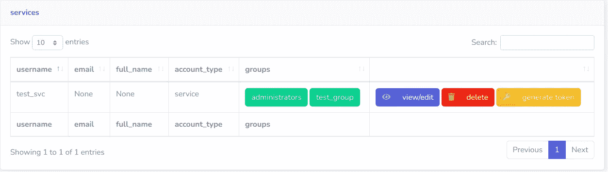

## 许可

权限来自分配给特定用户的一个或多个组。

# 组

分配给用户，包含指定角色的列表。

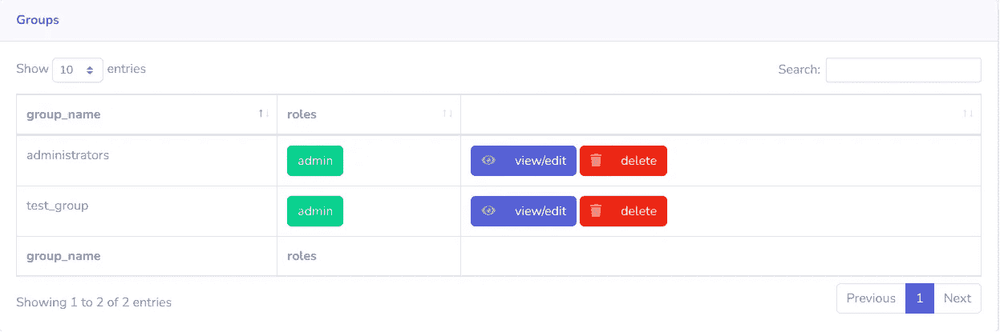

权限来自分配给特定组的角色。

# 作用

分配给组，并包含一个动作列表。

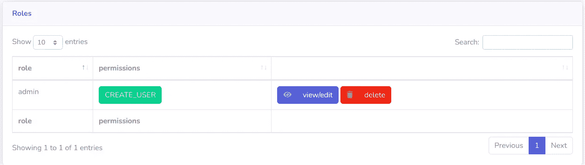

权限源自分配给特定角色的操作

# 行动

操作是可以创建的最细粒度的权限，用于定义可以允许的内容。

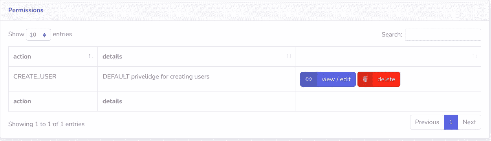

# 代币

令牌是为特定用户创建的，包含特定用户(组、角色、操作)的完整权限树

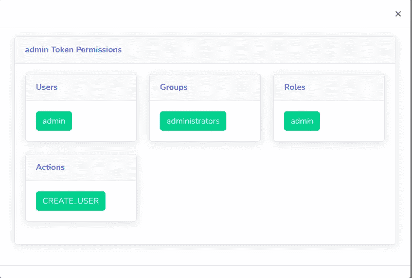

## 用户令牌—过期

```
Expires after ~ 60 Minutes
```

## 服务令牌—到期

```
Expires ~900 days
```

如果 cookie 中的令牌已经过期/被撤销，那么 cookie 将被 EasyAuthClient 失效

## 撤销令牌

令牌一旦创建，在到期或 EasyAuthServer rsa 密钥轮换之前一直有效。

EasyAuthServer 维护已颁发令牌的令牌注册表，其中包含底层用户名、颁发日期、到期日期& token_id。

当添加/撤销令牌时，EasyAuthServer 更新所有 EasyAuthServer 工作器和连接的 EasyAuthClients。

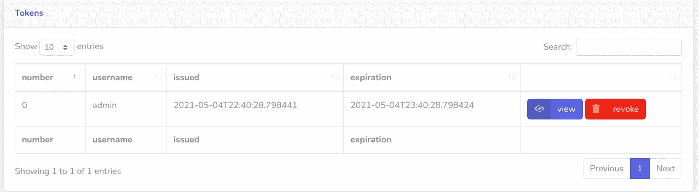

注册表中列出的令牌被视为有效，被撤销或注册表中不存在的令牌将返回 403。

# 资源

最全面的文档可从[这里](https://easyauth.readthedocs.io/en/latest/)获得

# 捐助

[EasyAuth](https://github.com/codemation/easyauth/) 在不断完善，有想法，建议，bug？制造一个[问题](https://github.com/codemation/easyauth/issues)！