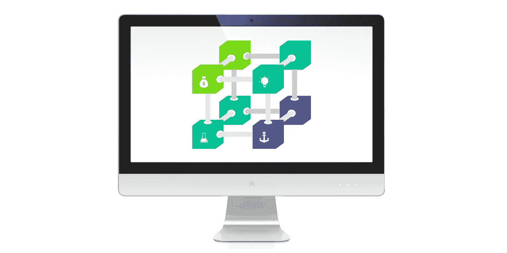
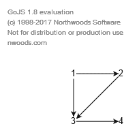

# 用 GoJS 创建简单的应用程序—第 1 部分

> 原文：<https://itnext.io/creating-simple-application-with-gojs-part-1-e3c320765def?source=collection_archive---------2----------------------->

在本文中，我将通过用非常简单的代码创建一个应用程序来展示 GoJS 的基本功能。它将被设计用于绘制不复杂的图表。

> 与 [Synergy Codes](http://www.synergycodes.com) 合作撰写的帖子。

# 从图书馆开始

GoJS 是一个 JavaScript 库，它获取复杂的数据，并通过灵活的建模选项运行这些数据，以创建易于理解并付诸实施的可视化效果。你可以在[官方网站](https://gojs.net/latest/index.html)或 [Synergy Codes 的博客](http://www.synergycodes.com/blog/gojs-easy-data-visualization)上了解更多关于 GoJS 的信息。

我们的起点是导入库的 HTML 文件。我们可以直接从[网站](https://gojs.net/latest/doc/download.html)下载，从 npm 下载，或者我们可以使用 CDN。下一步是添加 **div** 元素——图的未来位置。注意:我们不自己创建画布，因为库为我们做了。然而，div 本身可以被自由地改进以使其与网站相匹配。该文件应该大致如下所示:

清单 1。index.html 文件的初始外观

# 代码结构

下一步是编写创建图表的 JavaScript 代码。我们创建一个 diagram.js 文件，将应用程序的整个逻辑放在其中。我们可以用任何约定来创建它——GoJS 没有规定任何特定的构建源代码的方式。出于这个例子的目的，我将创建一个 IIFE(立即调用的函数表达式)，这将是一个带有外部可用的 **initDiagram** 函数的命名图。通过使用 IIFE，我们将能够从外部访问隐藏我们实现的一部分。

对于 GoJS，我们创建所有对象的起点是 **go。GraphObject.make** 函数，该函数调用所选类的工厂方法。它用得太频繁了，所以我们应该把它赋给一个名字短一点的变量。为此，普遍接受的惯例是使用美元符号。但是，在并行使用 jQuery 的情况下，我们需要小心。作为第一个参数，该函数接受应该创建其实例的类，而对象的各个字段的值作为后续参数被接受。值得强调的是，通常字符串作为第二个参数给出，带有对象中定义的一个选定字段的值。通常，在给定的上下文中，字段的值是最重要的，比如创建的人物的类型。

# 创建 GoJS 图—准备

我们首先要创建的是图表本身。它位于 **go 的下面。图**类。最重要的参数是它应该被放入的元素的 **id** 。这就是为什么我们叫它$(go。图表，“图表-内容”)。

为了更好地指定图表对象的操作，请检查它在文档中有哪些字段。例如，我们可以赋值 **go。点中心**到场**初始内容对齐**。这首先将图的元素放置在应用程序的中心(默认情况下，它们在左上角)。让我们把它放到 **initDiagram** 中。我们必须记住在 HTML 文件中调用这个函数。我们应该得到以下 JS 和 HTML 文件:

清单 2。diagram.js 框架和空图的创建

图表是空的，所以很遗憾我们还看不到任何动作。唯一能让我们看到 GoJS 正在工作的是在图上单击鼠标右键的默认动作锁。

# 图表上的数据显示

该图的基础是为其操作创建一个数据模型。该模型由两个表组成— **nodeDataArray** (节点的数据)和 **linkDataArray** (边的数据)。节点是图形表示对象的图的主要元素(例如，实体关系图中的实体)。链接(边)是节点之间的连接(有向或无向)，根据图的类型，可能有不同的含义(如 ERD 图中实体之间的关系)。

我们将单个节点定义为对象，其中唯一必需的字段是键，例如，唯一标识符。此外，我们可以选择定义对象的类别，以及用任何数据来完成它们，这些数据将与图中的节点一起存储。边也被定义为具有两个必需字段的对象——从到**和从**到**，它们的值决定了哪些节点被连接。与节点的情况一样，我们也可以添加自己的附加数据。**

图表模型位于图表对象的模型字段之下。最好通过创建一个 **go 来定义它。我们向其传递节点和边的 GraphLinksModel** 对象。下面是一个模型定义的示例:

清单 3。图表模型的定义

在将它放入 initDiagram 并运行之后，我们应该会得到一个非常简单的图表。它将向我们显示在由边连接的关键字段中输入的值。

图一。第一张图

下一步是为对象提供外观。通过创建 **go 来设置外观。节点**对象，我们随后在其中创建定义形状的对象( **go。形状**。对象外观(模板)的最简单定义如下:

清单 4。物体外观的最简单定义

在这种情况下，我们将创建一个黑色圆圈来表示对象。**自动**表示单个形状的排列。在 **Auto** 的情况下，内部定义的每个形状都运行。节点将被放置在对象中心的层中。在形状的例子中，这里选择了**圆**，但是在[https://gojs.net/latest/samples/shapes.html](https://gojs.net/latest/samples/shapes.html)还有很多其他的可用。我们还可以在 shape 对象中设置字段值——这将让我们指定类似于以下的元素:**填充**、**描边**或**大小**。此外，我们可以使用 **go 从数据模型中加载这些值。绑定**。

定义外观的另一种方法是使用 SVG 路径定义创建一个形状。然后，我们使用这个路径作为**几何字符串**字段的值。下面是在这种情况下模板定义的一个例子(我们还将设置填充的大小和颜色):

清单 5。使用 SVG 路径定义外观

还可以使用任何格式(包括 SVG)的图像来定义外观。在这样的情况下，与其**走。形状**我们得用**走。图片**。有意思的是，**走。图片**不仅可以存储图片，还可以存储其他画布类型的元素。这允许我们创建更高级的可视化。

定义物体外观的另一种方法是将许多不同的形状组合成一个形状。这种方法的优点是，在将对象分成几个更小的部分后，我们可以为每个部分定义不同的行为(例如，其中一个形状可能是一个按钮，我们可以在其上定义一个单击动作—在这种情况下，只有这个片段会被分配这个事件)。为了创建复杂的对象，有必要了解在对象上排列形状的方法。我们用了 **Auto** ，意思是把所有东西都放在中间。我们还有其他的选择，最基本的包括:**水平**(从左到右)**垂直**(从上到下)**点**(放置在预定位置，如**中心**、**顶部**、**底部**等。).后续形状作为创建节点的函数的下一个参数传递，它们按以下顺序放置。例如，两个矩形，每一个都有不同的外观，一个放在另一个的上面，定义如下:

清单 6。由几种形状组成的外观的定义

然而，如果我们想要不同类型的对象呢？为此，我们没有将外观分配给**节点模板**，而是完成了映射— **节点模板映射**，其中键是对象的类别(**类别**，我们已经在模型中定义了)，而**模板**是值。出于这个例子的目的，让我们假设我们将使用上面给出的类别定义:**第一个**将是一个圆形，**第二个**将是 SVG 形状，**第三个**将是两个矩形。然而，出于实际原因，我们不应该将 template 直接分配给 map，而是应该创建一个函数来返回我们将分配给哪个类别的模板，然后使用其中的数据来补充 map — nodeTemplateMap。请注意，在我们提供带有模型的图表之前，应该完成该图。例如，它可能是这样的(为了清楚起见，省略了一些代码片段):

清单 7。使用 nodeTemplateMap 的建议

这样写应该会产生以下效果:

图二。具有三种不同节点模板的图表

正如你所看到的，图表开始成形了。另外，值得一提的是，除了节点的外观，还可以确定边的外观。这是以类似的方式定义的，不同之处在于，我们用 **linkTemplate** 和 **linkTemplateMap** 代替了 **nodeTemplate** 和 **nodeTemplateMap** ，而在模板定义期间，我们没有创建 **go。节点**对象我们创建一个 **go。链接**对象。

你可以在这里查看本教程的结果:

想要更多吗？查看本教程的第二部分！

帖子也发表在 [Synergy Codes 的博客](http://www.synergycodes.com/blog/)上，你可以在这里查看[。](http://www.synergycodes.com/blog/how-do-i-create-a-simple-gojs-application)

你想了解更多关于 GoJS 的知识吗？你可以在这里下载免费的电子书！