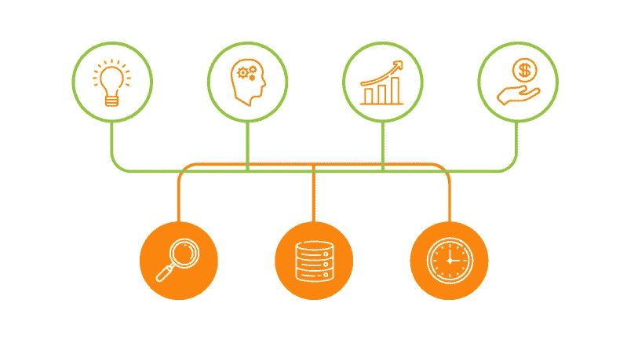
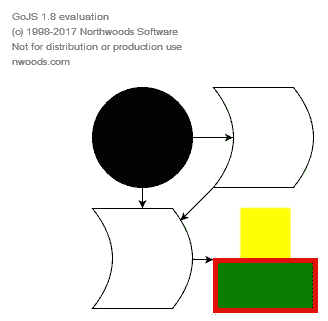
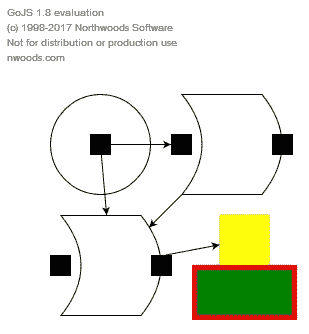

# 用 GoJS 创建简单的应用程序，第 2 部分

> 原文：<https://itnext.io/creating-simple-application-with-gojs-part-2-c33139e934ba?source=collection_archive---------6----------------------->

在上一篇文章中，我向您展示了如何开始使用 GoJS 应用程序。我解释了如何创建一个图表，以及如何使用它来显示数据。让我们更进一步，以适当的方式设置边。

> 与 [Synergy Codes](http://www.synergycodes.com) 合作撰写的帖子。

找第一部分？在 [ITNEXT](/creating-simple-application-with-gojs-part-1-e3c320765def) 上检查。

# **港口**

虽然我们的图表看起来越来越好，但仍有一些突出的问题。首先，它不能被编辑(你唯一能做的就是移动节点并使用 CTRL 键克隆它们)，其次，我们可能希望在节点的特定点之间绘制边。这在从 SVG 路径创建的对象中尤其明显——最好是从左边设置入口，从右边设置出口。但是要做到这一点，我们首先需要定义端口。

图一。完成本教程的第一部分后，我们有什么

端口是节点的一部分，只有一个功能，即相对于对象的其余部分设置边。它们可能由已经存在的节点元素组成(甚至是一个完整的节点)，也可能是专门为此目的而创建的新元素。通过设置 **portId** 字段的值来定义端口。我们还可以做一些其他的事情，例如:定义我们是否可以从端口创建新的链接( **fromLinkable** field)以及我们是否可以向它附加新的链接( **toLinkable** )。出于此示例的目的，端口将被定义为可见的形状，但它们可以是任何对象(包括不可见的对象)。

# 为节点模板设置端口

在第一个节点模板(黑色圆圈)的情况下，我们希望将端口放在正中间。为了清楚地表明这是边缘的位置，我们将改变圆的颜色，并为它设置一个固定的大小。我们还将对其进行配置，使其能够从该端口双向创建连接。在这种情况下，我们将这样定义形状:

清单 1。用端口展开的形状的定义

正如我已经提到的，为 **portId** 字段设置一个值很重要。但是，该值可以是空字符串。如果我们分配一个空字符串，这个端口将是默认端口。

对于第二个节点模板(SVG 路径)，我们希望在它的左侧和右侧定义端口。有两种方法可以做到这一点:将元素的排列方式更改为水平，并按照端口-主形状-端口的顺序设置形状，或者更改为定点，然后将端口设置在主形状居中的左右位置。第二种方法更灵活，所以我们将使用这种方法。在左侧，我们将插入与第一个形状相同的矩形，并设置它，以便您只能链接到它。在右边，我们将插入一个矩形，从这里我们只能引导边缘。为了区分它们，我们应该给它们不同于空字符串的标识符(例如，入口和出口)。这个定义是这样的:

清单 2。用两个端口扩展的形状的定义

对于第三个模板(两个矩形)，让我们只修改顶部的正方形。我们将通过添加一个带有空字符串的 **portId** 来使它成为一个端口，并且我们将把**从可链接的**和**设置为可链接的**到**真的**。创建端口后，图表应该是这样的:

图二。端口的初步配置图

# 设置链接以使用端口

如上图所示，端口在第一和第三种情况下工作得很好，但在第二种情况下就不行了。在绘制链接时也会发生同样的事情。在第一类和第三类之间绘图没有问题，但是第二类的边会跳出端口。出现这种情况有两个原因。首先，我们没有在链路模型中定义应该在哪个端口之间建立连接。其次，我们还没有在模型中设置如何存储端口之间的连接。所以让我们回到 **initDiagram** 和模型的定义。我们需要给 **GraphLinksModel** 添加两个字段: **linkFromPortIdProperty** 和 **linkToPortIdProperty** 。这些决定了我们如何定义模型中使用的端口。此外，我们应该在 **linkDataArray** 中定义如何处理节点 2 和 3(属于第二类的节点)的边。这些变化应该是这样的:

清单 3。允许使用端口的模型变化

图中的边应该是这样的:

图 3。正确配置端口后的示意图

在下一部分，我们将对这张图进行最后的润色。至于目前的部分，你可以在这里查看结果:

想要更多吗？查看本教程的第三部分！

帖子也发表在 [Synergy Codes 的博客](http://www.synergycodes.com/blog/)上，你可以在这里查看[。](http://www.synergycodes.com/blog/simple-gojs-application-setting-and-editing-edges)

你想了解更多关于 GoJS 的知识吗？[你可以在这里下载免费电子书](https://synergycodes.com/gojs-ebook/)！