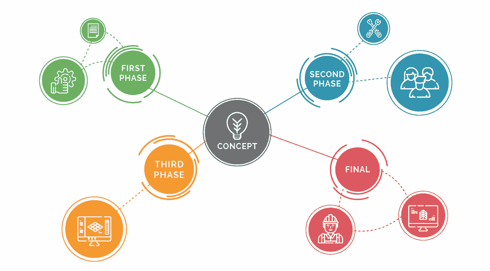
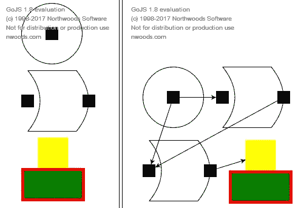
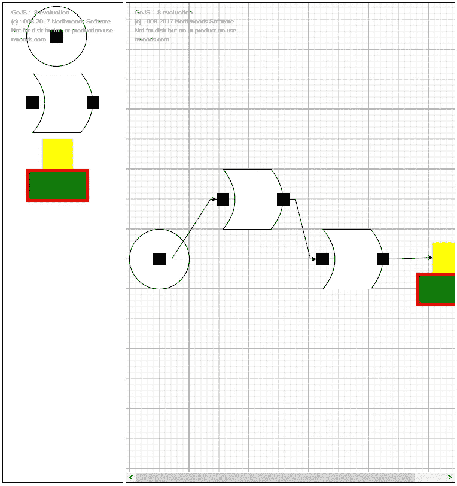

# 用 GoJS 创建简单的应用程序，第 3 部分

> 原文：<https://itnext.io/creating-simple-application-with-gojs-part-3-9bfc8aa8813b?source=collection_archive---------3----------------------->

最近我解释了如何创建 GoJS 图，以及如何设置和样式化边。为了使图表具有充分的交互性，我们仍然需要提供插入元素的选项。为此，我们将创建一个内置于 GoJS 中的调色板。

> 与 [Synergy Codes](http://www.synergycodes.com) 合作撰写的帖子。

第一次参加这个系列赛？检查以前的部分！

*   [第一部分——制图基础知识](/creating-simple-application-with-gojs-part-1-e3c320765def)
*   [第二部分——设置节点边](/creating-simple-application-with-gojs-part-2-c33139e934ba)

# 调色板

调色板是一个单独的画布，显示其中定义的所有节点，并允许您将它们转移到主图中。其配置方式与图表类似，但通过创建一个 **go。调色板**对象。然而，为了做到这一点，我们应该首先在包含调色板的 HTML 文件中添加一个额外的 **div** 。我们还可以在 JS 文件中添加一个函数来初始化调色板，我们也可以在外部使用这个函数( **initPalette** )。在我们的例子中，我们将把面板放在图的旁边。下面是我们编辑 HTML 文件的方式:

清单 1。将调色板添加到 HTML 文件中

下一步是完成我们创建的 initPalette 函数。正如我前面提到的，面板的初始化与图表的初始化没有太大的不同。在这里，我们将第二次使用 getTemplates()函数—当我们这样做时，我们不必再次定义形状的外观，只需为调色板定义即可。然而，应该强调的是，我们还可以为形状创建其他外观——当移动到图中时，重要的是元素的类别，而不是它的外观。此外，为了能够从面板传输到图表，我们需要将 allowDrop 字段添加到图表初始化中，并将其值设置为 true。代码应该是这样的:

清单 2。调色板的初始化

现在这个应用程序看起来是这样的:

图一。添加了调色板的图表

# 最后的润色—添加网格

最后，为了改善应用程序的外观，让我们再添加两件事情:元素将被捕捉到的网格，以及它们的自动定位。

让我们从网格开始。你会在 **diagram.grid** 下找到它，我们唯一要做的就是把它的 visible 属性改成 **true** 。为了添加拖动，必须在**diagram . tool manager . dragging tool**下的内置拖动工具中进行配置。我们可以在这里使用两个属性:**isgridsnapanenabled**来启用拖动，以及 **gridSnapCellSize** 来定义网格的大小(对于我们的示例，让我们定义一个 50x50 的大小)。如果我们使用节点大小修改(resizingTool)，我们也将在其中设置类似的字段。下面是负责设置网格的代码:

清单 3。在图表上设置网格

# 最后一点——节点定位

定位元素最简单的方法是改变图表的布局。默认布局没有定义元素的任何自动排列，它只是排列它们，使它们彼此不重叠。然而，这是由其他布局提供的: **GridLayout** (放置在网格上) **TreeLayout** (树) **ForceDirectedLayout** (将元素相互推开的图形) **LayeredDigraphLayout** (以列和行排列的图形)和 **CircularLayout** (圆形上节点的排列)。

在图的初始化过程中，我们将布局设置为另一个字段——我们将所选布局的新实例及其可能的配置传递给这个布局。这里有一个我们如何为 **LayeredDigraphLayout** 实现它的例子:

清单 4。为图表设置分层有向图布局

效果如下所示:

图二。启用网格并设置图层的图表

您也可以查看其他可用的布局，但是您需要记住它们的局限性。例如， **TreeLayout** 将无法处理两条边通向一个节点的情况。

整个教程的结果你可以在 [GitHub 库](https://github.com/tswistak/diagram-example-gojs)或者 Codepen 上查看:

# 摘要

正如您在阅读本文时肯定已经理解的那样，我们已经开发了一个高级应用程序，只使用了 GoJS 库的功能，没有额外的黑客攻击。总共有大约 120 行 JavaScript 代码，这清楚地表明我们没有做任何困难的事情。GoJS 让我们节省了大量时间，否则我们会花在创建调色板、处理画布上的元素或其他重要的事情上，比如自动定位元素。这个库还提供了其他的优势，比如透明的文档，大量现成的例子，以及来自制作者的非常好的支持。TypeScript 用户也会感到满意，因为可以获得官方的类型，以及用 TypeScript 编写的库的免费扩展。

尽管我们很想在这一系列文章中展示该库的所有功能，但这是不可能的。我强烈建议你浏览一下开发者网站上的例子。

帖子也发表在[协同代码的博客](http://www.synergycodes.com/blog/)上，你可以在这里查看[。](http://www.synergycodes.com/blog/simple-gojs-application-finishing-touches)

你想了解更多关于 GoJS 的知识吗？你可以在这里下载免费的电子书！