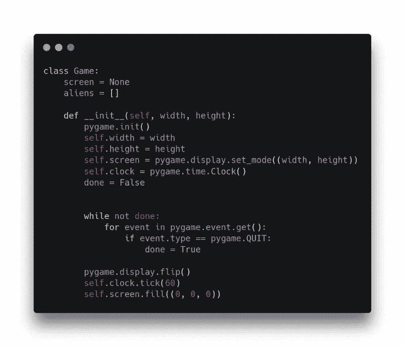
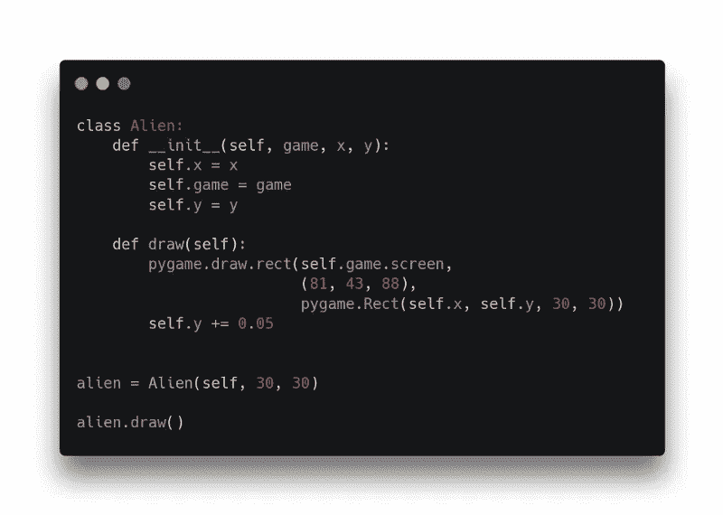
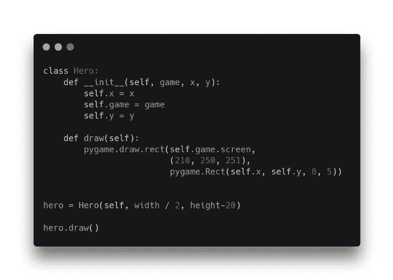
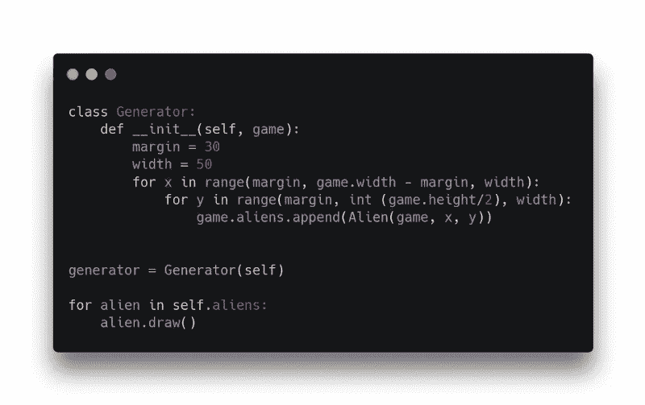
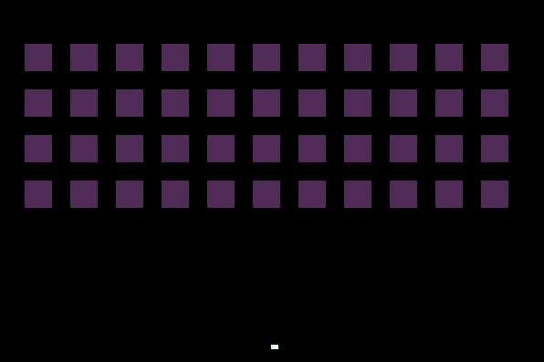
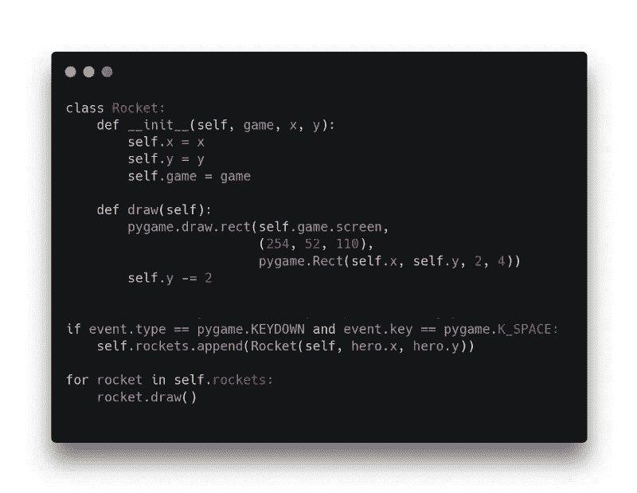
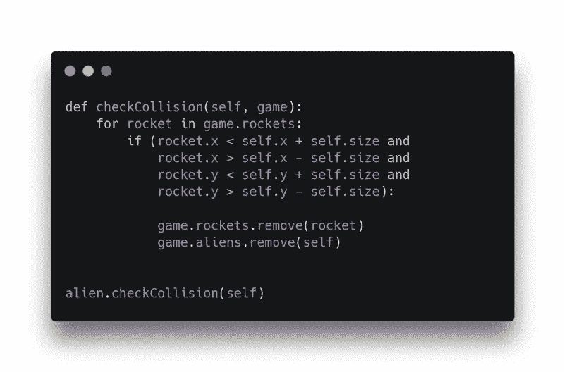
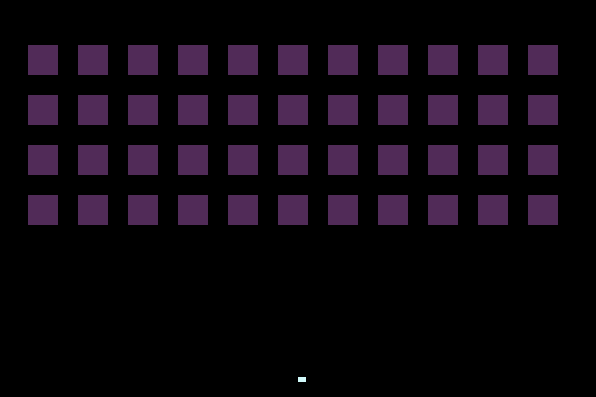
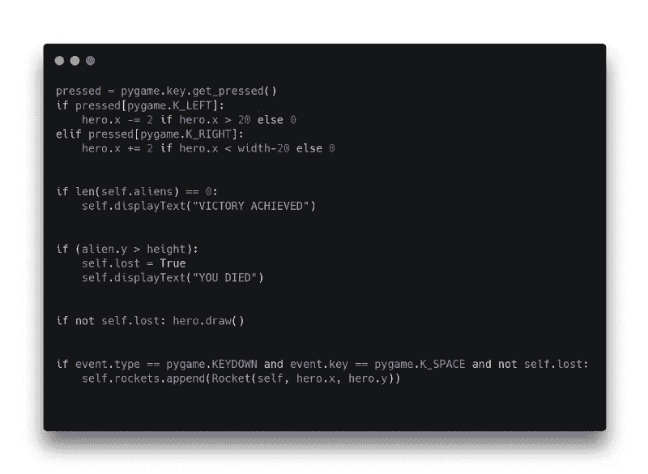
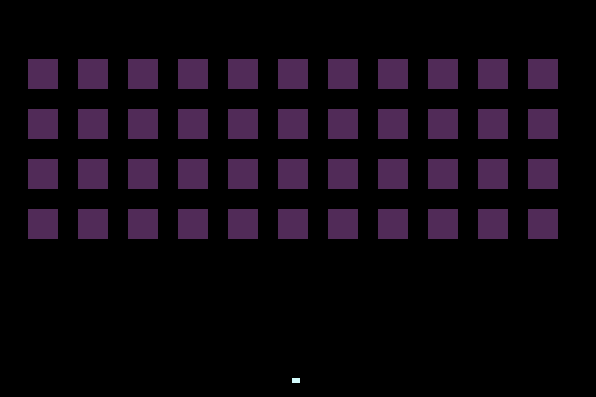

# 用 100 行或更少的代码用 PyGame 创建太空入侵者克隆

> 原文：<https://itnext.io/creating-space-invaders-clone-in-pygame-ea0f5336c677?source=collection_archive---------0----------------------->

如果你曾经想用 Python 制作《太空入侵者》,但是懒得去做，这里有一个 GIFS 的简短教程！

# > >基本设置

首先我创建游戏类来控制游戏。然后我初始化 *pygame* 实例和外星人列表。我把刷新率设为 60，运行游戏循环。

# > >敌人

我创建了一个新的 Alien 类，它保存坐标、颜色和大小，并将对象绘制到屏幕上。我设置了“下落”效果，y 值每帧减少 5 个像素。
(未缩进的代码块不会像你看到的那样工作——alien =…和 alien.draw 需要一个“游戏”实例引用，而不是 self。下面的英雄和发电机也一样。完整代码见 github 链接的结尾)

到目前为止我只有一个外星人。

# > >主要英雄

被玩家控制的英雄，和异形很像。他的大小和位置都不同，他被放在屏幕中央。

# > >榨汁！

我会用“外星发电机”创造更多的敌人。在一个简单的 for 循环中，它用外星人填充屏幕的上半部分。

现在我给英雄加一些火箭。火箭级和《异形》、《英雄》差不多，只是垂直速度是每帧 2 个像素。当玩家按下空格键时，他的位置上会出现一个火箭。

现在我检查火箭和外星人的碰撞。每个外星人反复检查所有可用的火箭，并检查是否有任何火箭与他的身体相撞。当它发生时，他就毁灭了自己。

我要补充的最后一点是运动。玩家可以左右移动。我还设置了输赢条件——如果玩家消灭了所有人，他就赢了。如果任何外星人接触地面，游戏结束。

Github 代码可用[此处](https://github.com/janjilecek/pygame-invaders/blob/master/main.py)。

如果你刚刚开始学习如何开发游戏，你可以关注我的关于 Unity 初学者开发的 Skillshare 课程:

 [## 完整指南:Unity 2020 中的动作恐怖 3D 游戏

### 解锁无限制访问此技能共享课程以及由来自世界各地的创作者讲授的数千门课程…

www.skillshare.com](https://www.skillshare.com/tedx?teacherRef=896200912&via=teacher-referral&utm_campaign=teacher-referral&utm_source=ShortUrl&utm_medium=teacher-referral&t=Complete-guide-Action-horror-3D-game-in-Unity-2020&sku=418230537)