# 创建您的第一个 Docker 应用程序

> 原文：<https://itnext.io/creating-your-first-docker-application-b0ce40ac67d1?source=collection_archive---------1----------------------->

## Docker:图像和容器

## 在这一课中，我们将了解创建 Docker 图像和 Docker 容器的过程。因为 Dockerfile 对于创建 Docker 图像是必不可少的，所以我们也将理解 Dockerfile 的语义。

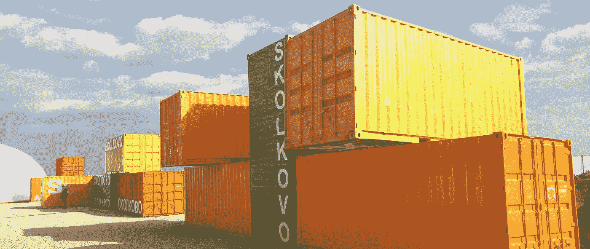

(来源:【unsplash.com】**)**

**在 [**上一课**](https://medium.com/sysf/getting-started-with-docker-1-b4dc83e64389) 中，我们学习了 Docker 集装箱的结构以及集装箱化的简单工作原理。然而，我们并没有真正使用 Docker 创建任何应用程序，也没有从头开始理解映像构建过程。在本课中，我们将这样做。**

**在我们继续之前，让我们先了解一些术语。Docker **容器**是一个短暂的(*短命*)进程。这个过程类似于具有私有文件系统、网络端口、内存空间等的客户操作系统。您可以执行各种操作，如启动 HTTP 服务器、启动数据库服务器或执行 IO 操作的任何进程。**

**Docker **图像**是容器的**蓝图**。将 Docker 图像看作一个类，而 Docker 容器则是该类的一个实例。在一个标准程序中，你可以使用`new Image()`来创建一个`container`。类似地，我们使用`$ docker run <image>`命令从图像创建一个容器，其中`image`是 Docker 图像的惟一 id。**

**然而，要创建一个图像，我们需要一个 **Dockerfile** 。这是一个纯文本文件，包含组装图像的指令。这些指令被称为**构建指令**或简称为**指令**。一旦图像被创建，我们就可以用它来制作容器。**

**Docker 引擎协调图像的创建和容器的生命周期。Docker 守护进程是 Docker 引擎中的一个长期运行的进程，负责处理这些任务。Docker 引擎通过命令行接口(CLI)和 REST API 接口公开 Docker 守护进程。**要安装**Docker 引擎(*和其他资源*)，请遵循此 文档。它还附带了一个 GUI 来管理容器。**

# **文档文件**

**在本课中，我们将使用 [**ExpressJS**](https://expressjs.com/) 创建一个 Docker 容器来启动一个简单的 HTTP 服务器。这个 HTTP 服务器返回一个带有用户列表的 JSON 响应。仅此而已。**

> ***💡*您需要在系统上安装 Node.js 来**测试**我们正在构建的 Docker 应用程序。可以从 [**这个**](https://nodejs.org/en/) 官网下载或者使用 [**NVM**](https://github.com/nvm-sh/nvm) ( *节点版本管理器* ) CLI 实用程序。但是，这一步不是必需的，因为我们希望在 Docker 容器中运行这个应用程序，该容器将安装 Node.js。**

**众所周知，要创建一个容器，我们需要一个 Docker 映像，而要创建一个 Docker 映像，我们需要一个 Docker 文件。嗯，不总是这样。有人可能已经创建了这样一个图像，做完全相同的事情。你可以在 [**Docker Hub**](https://hub.docker.com/) 注册表上找到公开图片。所以您可以使用`$ docker pull <image_name>`命令从这个注册表下载它。**

**但是由于我们试图理解创建 Docker 映像的过程，我们将使用 Docker 文件自己构建一个映像。你可以在 [**这个**](https://github.com/course-one/docker-express-example) GitHub 仓库里找到这个项目的源代码。因此，让我们创建项目目录并安装依赖项。**

```
$ mkdir docker-express-example && cd docker-express-example
$ npm init -y
$ npm install --save express
```

**以上命令将在我们的项目中生成`package.json`和`package-lock.json`文件以及`node_modules`目录。到目前为止，我们的项目结构如下所示。**

```
**docker-express-example/**
├── .dockerignore
├── .gitignore
├── Dockerfile
├── db.json
├── images
|  ├── female.png
|  └── male.png
├── node_modules/...
├── package-lock.json
├── package.json
└── server.js
```

**我们将讨论项目中的其他文件，但是现在，让我们把重点放在服务器实现上。`db.json`文件包含一个用户列表。`server.js`文件服务于来自`/`端点的`db.json`和来自`/images`端点的`images/`目录中的图像。**

**(来源:[**gist.github.com**](https://gist.github.com/thatisuday/64f4ca7166c77410b11364e68802798b))**

**该服务器将监听的端口是从`SERVER_PORT`环境变量接收的。因此，当我们启动服务器时，需要为这个环境变量提供一个值。我已经通过`package.json`中的`start`命令完成了。**

**(来源:[**gist.github.com**](https://gist.github.com/thatisuday/ced5c79dc70135d789ad569c5947144d))**

**现在，当我们从项目目录中运行`$ npm run start`命令时，我们应该在终端中收到`Server started at port 3000.`消息，并且应该能够在`http://localhost:3000`端点的浏览器中看到 JSON 响应。**

**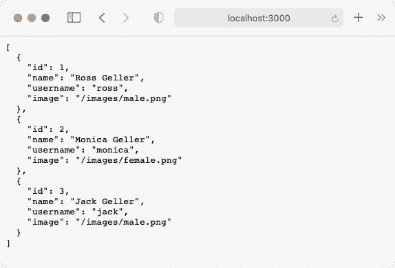**

**( [http://localhost:3000](http://localhost:3000) )**

**既然我们的 HTTP 服务器如预期的那样工作，让我们讨论一下为什么我们想要**容器化**它。Docker 的 USP 在一个隔离的环境中运行应用程序，而不必安装依赖项来运行它们。此外，由于容器很便宜，我们可以很快产生应用程序的许多副本。**

**例如，如果您想与您的同事或用户共享这个应用程序，那么您必须共享源代码，并要求他们安装 Node.js 才能运行这个应用程序。现在，这也可能导致各种问题，比如运行时相关问题(*由于 Node.js 版本差异*)，平台相关问题( *Mac vs Windows* )，或者其他成千上万的事情。**

**要解决这个问题，我们能做的就是创建一个 Docker 镜像，把这个项目的所有内容都放在里面。这个映像还将拥有运行这个应用程序所需的所有依赖项，比如标准的 Node.js 安装等等。然后，我们可以公开或私下发布图像，以便其他人可以下载它。一旦他们下载了图像，他们可以用它创建一个容器，并在几秒钟(*或几分之一秒(*)内启动应用程序( *HTTP 服务器*)。**

**好吧。因此，我们已经大致了解了 Docker 的用处。因此，让我们开始为这个应用程序构建 Docker 映像。正如我们所讨论的，要构建一个映像，我们需要一个 Dockerfile 文件。这个文件通常放在项目的根目录下，但是我们可以把它放在项目的任何地方。稍后会详细介绍。**

**在我们开始处理 Dockerfile 文件之前，让我们了解成功运行这个应用程序的要求。首先，我们需要一个安装了 Node.js 的操作系统(*带 NPM* )。然后我们需要`package.json`和`package-lock.json`文件来安装依赖项。然后我们需要项目的所有源代码。然后我们需要`SERVER_PORT`环境变量来启动服务器。为此，docker 文件如下所示。**

**(来源:[**gist.github.com**](https://gist.github.com/thatisuday/9ea53836b823da98ee4eddf5b00654de))**

**Dockerfile 是一个简单的文本文件，它包含 Docker 守护进程组装映像的指令。任何以`#`开头的文本都是注释，但也可以是 [**解析器指令**](https://docs.docker.com/engine/reference/builder/#parser-directives) 。让我们仔细阅读 docker 文件中的每条指令，了解它们对映像构建过程的贡献。**

## **来自指令**

**`[FROM](https://docs.docker.com/engine/reference/builder/#from)`指令为我们将要使用这个 docker 文件创建的新图像设置一个**父图像**。父映像包括我们需要的所有必要的东西，例如操作系统环境( [*alpine*](https://hub.docker.com/_/alpine) )和 Node.js 安装( *v12.20.0* )。可以在 [**Docker Hub**](https://hub.docker.com/search?q=&type=image&image_filter=store%2Cofficial) 上寻找官方图片。这里，我们使用`[node:12.20.0-alpine3.10](https://hub.docker.com/_/node)`图像作为我们的父图像。**

> ***💡在* `node:12.20.0-alpine3.10`图像名称格式中，`node`部分是图像名称， `*:*` *之后的`*12.20.0-alpine3.10*` *称为* ***标记*** *。如果没有提供* `*:tag*` *部分，将默认使用* `*:latest*` *标签。我们将在* [***的另一课***](https://medium.com/sysf/understanding-docker-image-tags-and-publishing-images-to-docker-hub-b7a4f900f201) *中谈到这种格式。****

**您可能会听到术语“**基础映像”**与**父映像**互换使用，但有一点细微的区别。基础图像是父子层次结构中的最后一个图像。例如，我们的新图像源自`node`图像，`[node](https://hub.docker.com/_/node)`图像源自`[alpine](https://hub.docker.com/_/alpine)`图像( [*见此处*](https://github.com/nodejs/docker-node/blob/ecab21f67543ce370cca404b925b21fdc35ea0b2/12/alpine3.10/Dockerfile) )，而`[alpine](https://hub.docker.com/_/alpine)`图像源自`[scratch](https://hub.docker.com/_/scratch)`图像( [*见此处*](https://github.com/alpinelinux/docker-alpine/blob/7d751912c8925b5dbcef03522f5edad6acfd175b/x86_64/Dockerfile) )。**

**现在,`[scratch](https://hub.docker.com/_/scratch)`图像包含了与 Docker 引擎一起工作的绝对最少的东西，它是父子层次结构中的最后一个图像，这意味着它不基于任何其他图像。您可以使用此映像来安装操作系统、软件、工具等。，并制作父映像。因此，任何使用`FROM scratch`指令继承`scratch`的映像都是基础映像。要创建您自己的基础映像，请遵循此 文档。**

> ***💡*docker 文件中的指令**不区分大小写**，这意味着您也可以使用`from <image>`代替`FROM <image>`。但是建议使用大写字母作为指令名，以增加可读性。**

**理想情况下，`FROM`指令应该是 Dockerfile 文件中的第一条指令。在**多阶段构建**的情况下，我们可以在 Dockerfile 中有不止一个`FROM`指令，我们将在 [**的另一课**](https://medium.com/sysf/docker-container-as-an-executable-to-process-images-using-go-golang-5233f9bd3bf7) 中介绍。**

## **工作目录指令**

**Dockerfile 文件中的第二个重要指令是`[WORKDIR](https://docs.docker.com/engine/reference/builder/#workdir)`。该指令为 Dockerfile 中的指令(*如* `*RUN*` *，* `*CMD*` *，* `*ENTRYPOINT*` *，* `*COPY*` *，* `*ADD*` *等)设置了一个**工作目录。***)使用相对路径访问或修改镜像的文件系统。如果文件系统中不存在该目录，将在创建映像时创建它。**

> ***💡Dockerfile 文件中可以有多个`WORKDIR`指令。每条指令将为下一条指令设置一个新的工作目录。我们可以提供下一条`WORKDIR`指令的相对路径，该路径将与前一条`WORKDIR`路径相关。***

**在我们的例子中，我们已经将`/app`目录(*相对于映像*的文件系统的根)设置为工作目录。因为这个目录不存在于`node`映像的文件系统中，所以它将被创建。**

**您可以将工作目录视为映像中的目录，终端 shell 将在该目录中打开，并且命令中用于访问或修改文件的所有相对路径都将相对于该目录。**

**类似地，**构建上下文**是主机(*，我们在其上创建 Docker 映像*)上的一个目录，在构建包含`Dockerfile`、`.dockerignore`和`package.json`、`images/`.等应用相关文件的映像时，该目录被发送到 Docker 守护程序。该目录通过用于创建映像的`$ docker build <path>`命令提供，其中`path`是构建上下文目录的路径。在我们的例子中，它将是到`docker-express-example`目录的路径。**

## **添加说明**

**`[ADD](https://docs.docker.com/engine/reference/builder/#add)`指令将文件从构建上下文复制到工作目录(*表示相对目标路径*)或镜像的任何其他目录(*表示绝对路径*)。我们可以将一个或多个源文件从构建上下文复制到映像中的目的地。使用该指令有两种方式，如下所示。后者对于包含空白的文件很有用。**

```
ADD <src>... <dest>
ADD ["<src>",... "<dest>"]
```

> ***💡*`ADD`指令也可以从远程 URL(如 Git 存储库)复制文件。如果`src`是一个本地 tar 存档文件，那么它将在复制操作期间在`dest`被提取。从 [**本**](https://docs.docker.com/engine/reference/builder/#add) 文档中了解有关此行为的更多信息。该功能在`COPY`指令中不受支持。**

**在我们的例子中，我们首先将`package.json`和`package-lock.json`文件复制到工作目录( `*./*` *路径*指定的*，这样我们就可以安装 NPM 依赖项了。但是构建上下文不是已经包含了包含所有依赖项的`node_module`目录吗？难道我们不能把它从构建上下文中复制到工作区目录中吗？***

**首先，我们应该真正避免向 Docker 守护进程发送大的、不必要的和敏感的文件，这些文件可能会使用`ADD`或`COPY`指令复制到映像中。`.[dockerignore](https://docs.docker.com/engine/reference/builder/#dockerignore-file)`文件的工作方式类似于`.gitignore`文件，但是在将文件发送到 Docker 守护进程时，会将其从构建上下文中排除。我们通过在`.[dockerignore](https://github.com/course-one/docker-express-example/blob/master/.dockerignore)`文件中添加`node_modules`行来排除`node_module`目录。**

> ***💡*如果`*src*`路径不属于`*../file.txt*`等构建上下文，那么`*ADD*`或`*COPY*`操作将失败。**

## **运行指令**

**`[RUN](https://docs.docker.com/engine/reference/builder/#run)`指令在构建时运行命令。这可能是 bash 命令，如`rm -rf ./file.txt`或任何复杂的命令，如下载文件、访问或修改文件系统等。`RUN`命令的结果被提交到映像，如文件修改。如下图所示，有两种类型的`RUN`命令。**

```
RUN <command>
RUN ["executable", "param1", "param2"]
```

**指令的前一种格式被称为**外壳格式**，因为默认情况下它是用`/bin/sh -c`执行的，而后一种格式被称为**执行格式**，因为你可以传递一个定制的可执行文件。**

**在我们的例子中，我们使用映像的默认 shell 运行`npm install`命令，该 shell 将 NPM 依赖项安装在工作区目录中。**

## **环境指令**

**`[ENV](https://docs.docker.com/engine/reference/builder/#env)`指令在图像中设置一个环境变量。该指令的值是一系列的`key=value`对，但是，在 docker 文件中可以有多个`ENV`指令。**

```
ENV <key>=<value> ...
```

**我们可以在其他指令中使用环境变量的值。例如，我们在`EXPOSE`指令中使用了`SERVER_PORT`环境变量的值。您可以对`RUN`或`CMD`指令进行同样的操作，但在使用`exec`表单时有一些注意事项，请阅读[了解更多信息](https://docs.docker.com/engine/reference/builder/#run)。**

**这些环境变量也将保存在容器中。这意味着当我们从这个图像创建一个容器时，您可以访问这个环境变量的值(例如在节点上运行 JavaScript 程序的情况下使用 `*process.env.SERVER_PORT*` *)。您可以使用从图像创建容器的`$ docker run`命令的`--env`或`-e`标志覆盖由`ENV`设置的环境变量的值。***

**如果您不希望环境变量在容器中可访问，而是只在构建期间存在，那么考虑使用`[ARG](https://docs.docker.com/engine/reference/builder/#arg)`指令。您也可以像使用`--env`标志一样使用`--build-arg`标志来覆盖`ARG`指令的默认值。**

## **暴露指令**

**容器是一个独立的环境，拥有自己的文件系统和网络，就像拥有一个虚拟客户操作系统一样。因此，容器不使用主机的端口。容器中的所有端口都被防火墙封闭，主机(*运行容器的那个*)无法访问它。**

```
EXPOSE <port> [<port>/<protocol>...]
```

**`[EXPOSE](https://docs.docker.com/engine/reference/builder/#expose)`指令指示容器打开某个端口，并对主机公开。Dockerfile 文件中可以有任意多的`EXPOSE`指令。在从映像创建容器时，您可以选择将主机上的一个端口绑定到这些开放端口之一，以便使用`$ docker run`命令的`--publish`或`-p`标志将流量从`host_port`发送到`container_port`。**

**在我们的例子中，由于环境变量`SERVER_PORT`的默认值是`8000`，当容器运行时，只有端口`8000`会暴露给主机。但是这个值可以通过使用`--env`标志改变`SERVER_PORT`环境变量的值来改变，这意味着我们可以控制在运行时暴露哪个端口。**

> ***💡*您可以使用`*--expose*`标志和`*$ docker run*`命令在运行时从容器中公开一个端口。**

## **复制指令**

**`[COPY](https://docs.docker.com/engine/reference/builder/#copy)`指令的工作方式与`[ADD](https://docs.docker.com/engine/reference/builder/#add)`指令相同。它将文件从构建上下文复制到工作区目录或映像的任何其他目录。**

```
COPY <src>... <dest>
COPY ["<src>",... "<dest>"]
```

**然而，`COPY`指令不支持 URL，也不提取 tar 存档的源代码。所以建议用`COPY`代替`ADD`，以免误下载文件或解压档案。**

**然而，`COPY`的亮点是能够使用带有`COPY`指令的`--from=<name>`标志从另一个映像复制文件。这里，`name`是在多阶段构建过程中生成的映像的名称。我们将在 [**的单独课程**](https://medium.com/sysf/docker-container-as-an-executable-to-process-images-using-go-golang-5233f9bd3bf7) 中了解更多关于这一点和多阶段构建的内容。**

**在我们的例子中，我们将文件从`.`复制到`.`，这意味着通过考虑`.[dockerignore](https://github.com/course-one/docker-express-example/blob/master/.dockerignore)`文件中提到的被排除的文件，将构建上下文的内容递归地复制到工作区目录中。**

## **CMD 指令**

**`[CMD](https://docs.docker.com/engine/reference/builder/#cmd)`指令的工作方式与`[RUN](https://docs.docker.com/engine/reference/builder/#run)`指令相似，但它们有很大的不同。如前所述，`RUN`指令在构建期间执行一个命令，并将命令的结果提交给映像。**

```
CMD <command>
CMD ["executable", "param1", "param2"]
```

**然而，`CMD`命令在构建过程中不会被执行。默认情况下，当我们创建容器时，它会被执行。这意味着`CMD`将在运行时生效。因此，如果您想在创建容器后立即启动服务器或任何进程，`CMD`是正确的选择。**

**与其他指令不同，`CMD`在 Dockerfile 中只能出现一次。如果 docker 文件中有`[ENTRYPOINT](https://docs.docker.com/engine/reference/builder/#entrypoint)`指令，那么就不需要有`CMD`指令，然而，`CMD`可以为`ENTRYPOINT`设置默认参数，并且它们可以被提供给`$ docker run`命令的参数覆盖。我们将在另一课 的 [**中详细讨论`ENTRYPOINT`指令及其与`CMD`的关系。**](https://medium.com/sysf/docker-container-as-an-executable-to-process-images-using-go-golang-5233f9bd3bf7)**

# **图像构建过程**

**我希望你还和我在一起，因为我们现在要讨论酷的部分，从 docker 文件构建一个图像。Docker 附带了一个 CLI 来访问 Docker 引擎的内部。它使我们能够构建图像、管理容器，以及做 Docker 引擎能做的几乎任何事情。**

**您可以通过运行`docker --version`命令来检查 Docker 安装。为了构建一个图像，我们使用`docker [build](https://docs.docker.com/engine/reference/commandline/build/)`命令。**

```
$ docker build [options] PATH
```

**这里，`PATH`是我们想要发送给 Docker 守护进程的构建上下文的目录。`options`标志控制如何创建图像。**

> ***💡* `PATH`也可以是 Git 资源库之类的 URL。它也可以是一个 tar 存档文件。如果不想传递构建上下文，使用`-`作为`PATH`值。**

**理想情况下，Dockerfile 应该在构建上下文的根目录中，但这不是一个硬性的规则。您可以将 Dockerfile 存储在文件系统中的任何地方，并使用`--file`或`-f`标志提供到它的路径。也可以通过 STDIN ( [*阅读更多*](https://docs.docker.com/develop/develop-images/dockerfile_best-practices/#pipe-dockerfile-through-stdin) )提供 Dockerfile。**

**首先，因为我们的图像将基于`node:12.20.0-alpine3.10`图像，所以我们需要事先准备好。为了从 Docker Hub 下载 Docker 映像，我们使用了`docker pull`命令。**

```
$ docker pull node:12.20.0-alpine3.10
```

****然而**,`docker build`命令足够智能，如果本地存储库中没有图像，它会自动下载。所以上面的步骤是不必要的。让我们在项目目录的根目录下打开终端并运行`docker build`命令。**

```
$ cd docker-express-example
$ docker build .
```

**这里，`.`是到`docker-express-example`目录的路径，该目录是发送到 Docker 守护进程的构建上下文，它包含 Docker 文件。让我们看看这个命令执行的结果。**

**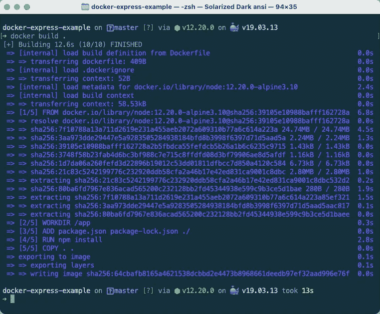**

**$ docker 构建。**

**`docker build`命令( *Docker 守护进程*)在将构建上下文发送到 Docker 守护进程之前分析 Docker 文件。然后它一次遍历 docker 文件中的一条指令。由于第一条指令是`FROM`，它将试图找到`node:12.20.0-alpine3.10`映像的本地副本，如果不存在，它将等待，直到从 Dockerhub 下载。**

**正如我们在 [**上一课**](https://medium.com/sysf/getting-started-with-docker-1-b4dc83e64389) 中所讨论的，Docker 映像由多个只读层堆叠而成。当 Docker 守护进程从 Docker hub 下载图像时，您可以在上面的日志输出中看到这些层的`node`图像。我们的图像也将以类似的方式组装。**

**一旦执行完`FROM`指令，构建上下文将被转移到 Docker 守护进程，其大小为 58.53kb。这乍一看似乎不太寻常，但是请记住，我们已经忽略了`.dockerignore`文件中的`node_modules`目录，因此不会包括它。**

**下一个指令是设置`WORKDIR`，这被认为是一个步骤，因此它是图像构建过程的步骤 2。从这里开始，任何使用相对路径来访问或修改镜像文件系统的指令都是相对于`/app`目录的。**

**下一条`ADD`指令将`package.json`和`package-lock.json`从构建上下文(*与* `*./package.json*`相同)复制到工作区目录(*，因为* `*.*` *路径被用作目的地*)。之后，`RUN`指令执行`npm install`命令( *shell form* )并生成`node_modules`目录。**

**一旦`RUN`指令成功运行，`ENV`指令设置环境变量，`EXPOSE`指令公开由`SERVER_PORT`值指示的端口。这些指令不被认为是构建步骤，但是它们由 Docker 守护进程执行。**

**`COPY . .`指令将构建上下文的内容复制到工作区目录。这一步是必要的，因为我们需要`server.js`、`db.json`和其他文件来运行应用程序。然而，该指令也复制了我们在开始时已经使用`ADD`指令复制的`package.json`和`package-lock.json`。那么为什么我们不能在那个地方使用这个`COPY`指令呢？**

## **构建缓存**

**在 [**上一课**](https://medium.com/sysf/getting-started-with-docker-1-b4dc83e64389) 中，我们讨论了 Docker 映像的剖析以及容器如何使用 Docker 映像。docker 图像由只读层组成。每一层都包含从前一层修改的文件。因此，每个`RUN`、`COPY`和`ADD`指令创建一个单独的层。这些层会根据修改或添加的文件数量增加图像的大小。**

**在构建映像时，Docker 守护程序还会为 Docker 文件中的每个指令临时创建中间映像(在 `*FROM*` *指令*之后的*),一旦构建了最终映像，这些中间映像将被删除，但是，它们将成为**构建缓存**的一部分。***

**每当我们尝试使用 Docker 文件构建映像时，Docker 守护程序都会检查构建缓存，查找从它正在分析的 Docker 文件中提到的相同父映像创建的映像。然后，它将处理当前 docker 文件中的下一条指令，并检查在构建缓存中是否存在具有相同指令的中间映像。**

**如果指令不同，或者指令中提到的文件内容(如`ADD package.json`)与构建缓存中的中间映像不同，那么 Docker 守护程序将停止寻找缓存，并通过处理发生**缓存未命中**的后续指令来创建映像。你可以从 [**这里**](https://docs.docker.com/develop/develop-images/dockerfile_best-practices/#leverage-build-cache) 阅读更多关于构建缓存的内容。**

> ***💡*如果您不想在构建映像时使用构建缓存，请在`docker build`命令中使用`--no-cache=true`标志。如果您想要持久化构建期间生成的中间映像，请使用`--rm=false`标志。**

**由于项目源代码的内容更有可能改变，我们在 docker 文件的末尾添加了`COPY . .`指令。由于`package.json`和`package-lock.json`文件不太可能更改，因此在创建新的构建时，Docker 可以使用来自早期构建的构建缓存的中间映像来执行`ADD`指令。缓存未命中可能发生在`COPY`指令处，但是到那时，我们已经使用了大部分缓存。这大大减少了构建时间。**

> ***💡*如果你想删除所有构建缓存，使用`$ docker builder prune -a`命令。你也可以使用`$ docker system prune -a`命令来删除所有没有运行的容器、映像和网络。**

**Docker 文件中的最后一条指令是`CMD`，但它不会被 Docker 守护进程执行。当从这个 Docker 映像创建一个容器时，它将被注册和执行。一旦这一步完成，我们的 docker 图像将被创建。**

**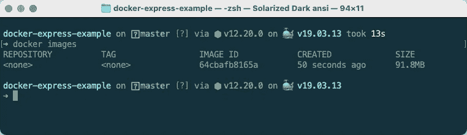**

**$ docker 图像**

**要查看本地显示的 Docker 图像，我们使用`$ docker images`或`$ docker image ls`命令。它列出了我们从 docker Hub 获取或在本地创建的所有 Docker 图像。此刻，我们可以看到我们几秒钟前创建的 Docker 图像。**

**`REPOSITORY`列包含我们刚刚创建的图像的名称，而`TAG`列包含用于识别同一图像的不同版本的标签。我们可以使用带有`$ docker build`命令的`--tag`或`-t`标志来提供这些值。因为我们没有使用这个标志，所以这些值是空的(`*<none>*`)。我们将在 [**的另一课**](https://medium.com/sysf/understanding-docker-image-tags-and-publishing-images-to-docker-hub-b7a4f900f201) 中谈到这些领域。**

**每个 Docker 图像都有一个独特的 SHA-256 摘要，由`IMAGE ID`列表示。当我们使用`$ docker images`命令列出图像时，它只显示前 12 个字符。但是，使用`--no-trunc`标志，您可以看到完整的摘要值。**

> ***💡* Docker 通过查看图像的内容为图像生成这个 SHA-256 哈希值。如果两个 Docker 映像包含完全相同的文件，它们的 ID 将是相同的。但是，你不要把所有的信任都放在这个逻辑上。**

**让我们使用相同的 docker 文件创建另一个构建，但是这一次，我们将使用`-t`标志来命名图像。`--tag`或`-t`的值的一般格式是`name:tag`，但是我们可以删除`:tag`部分，Docker 将默认使用`:latest`值。让我们更改`.gitignore`的内容，以便`COPY . .`指令导致缓存未命中。**

**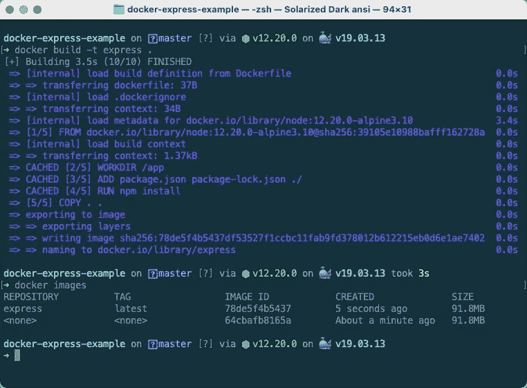**

**$ docker build -t expserver。**

**这个构建用了 3.7 秒完成，比上一个构建快了 10 秒。这样做的主要原因是我们已经有了先前构建的`node:12.20.0-alpine3.10`映像的本地副本。因此 Docker 守护进程不会从 Docker Hub 再次下载它。**

**如果您检查上面的输出日志，除了`COPY`之外的所有步骤都在使用构建缓存(它们用 `*CACHED*` *标签*提到*)。如果我们没有更改`.gitignore`文件，那么`COPY`步骤( *step5/5* )也会从构建缓存中被提取出来。因此，我们应该总是将可能导致缓存未命中的指令放在 docker 文件的末尾。***

**现在，如果我们使用`$ docker images`命令再次看到这些图像，我们将看到一个带有`express:latest`标签和唯一 SHA256 摘要值的新图像。我们可以使用这个标签值和`IMAGE ID`来识别一个图像，以执行一些操作，比如从它创建一个容器或者删除它。**

**让我们删除 id 为`64cbafb8165a`的未标记图像。要删除图像，我们使用`$ docker [rmi](https://docs.docker.com/engine/reference/commandline/rmi/)`命令( *rmi 代表删除图像*)。如果从这个映像创建的容器仍然在运行，那么您需要在这个命令中使用`--force`或`-f`标志。**

**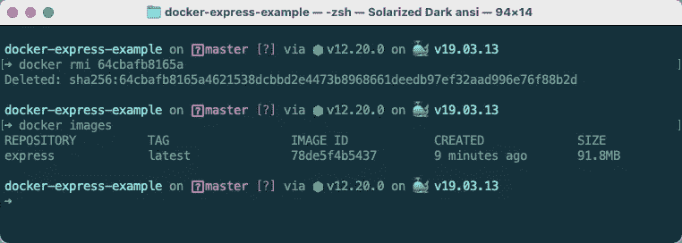**

**64cbafb8165a**

**如果我们要删除第二个图像，我们可以使用`$ docker rmi 78de5f4b5437`命令和`$ docker rmi express:latest`命令。如果我们使用`$ docker rmi express`命令，默认情况下它会扩展为`$ docker rmi express:latest`命令，所以它也能工作。**

**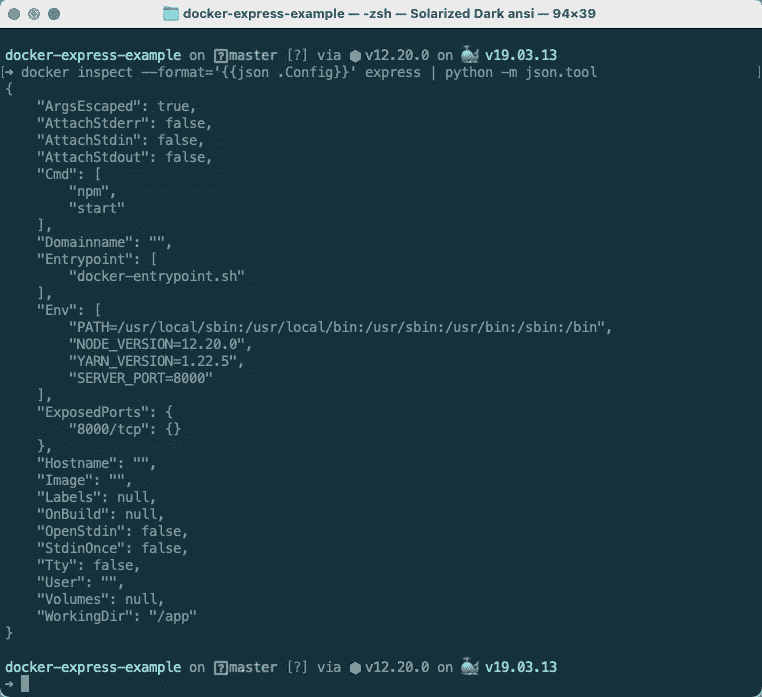**

**$码头工人检查**

**您可以使用`$ docker [inspect](https://docs.docker.com/engine/reference/commandline/inspect/) <image_id|image_name>`命令查看 JSON 格式的图像信息。在上面的截图中，我们只提取了由`docker inspect`返回的 JSON 的`Config`属性，而`python -m json.tool`用于美化 JSON。**

# **运行和管理容器**

**我希望你还和我在一起。到目前为止，我们已经成功创建了一个 Docker 映像，它将作为创建容器的蓝图。容器是一个正在运行的应用程序。我们的`express`图像包含一个 HTTP 服务器应用程序，当我们从它创建一个容器时，它将运行 docker 文件中的`CMD`指令指定的`$ node server`命令。**

**为了从图像创建一个容器，我们使用了`$ docker [run](https://docs.docker.com/engine/reference/commandline/run/) [options] <image>`命令，其中`image`参数是图像的惟一 SHA256 ID，或者图像名称( *repo:tag* )和`options`是可选标志，用于控制正在运行的容器的行为。**

**首先，当我们使用`docker run`创建一个容器时，Docker 将调用与`CMD`指令相关的命令来启动应用程序，在我们的例子中是`node server`。如果该命令退出(*完成*，集装箱将被停止。在我们的例子中，`node server`命令停止进程，所以容器将永远不会停止运行，除非我们发送一个**停止信号** ( *例如通过按 CTRL-C* )。**

> ***💡*您应该使用`--interactive`或`-i`和`-t`或`--tty`标志将信号从主机上打开的终端传递到容器。您可以使用`-it`标志作为组合标志，以交互模式启动容器。**

**我们需要使用`--publish`或`-p`标志将流量从主机发送到容器，因为正在运行的容器不使用主机的端口。该标志的值为`host_port:container_port`。在我们的例子中，我们已经公开了 HTTP 服务器的`8000`端口( `*SERVER_PORT*` *env 变量*的*默认值)，我们将使用`-p "9000:8000"`值将流量从主机上的`9000`端口发送到容器的`8000`端口。***

> ***💡*如果一个容器公开了多个端口，我们可以在`docker run`命令中有多个`-p`标志。如果您想自动将主机的随机端口分配给容器的暴露端口，则使用`-P`或`--publish-all`标志。**

**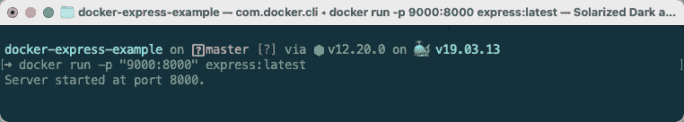**

**$ docker 运行**

**使用`$ docker run -p "9000:8000" express:latest`命令，我们从`express:latest` ( *ID: 78de5f4b5437* )映像创建一个容器，并将流量从主机的`9000`端口发送到容器的`8000`端口。所以我们打开浏览器，访问`http://localhost:9000`网址。**

**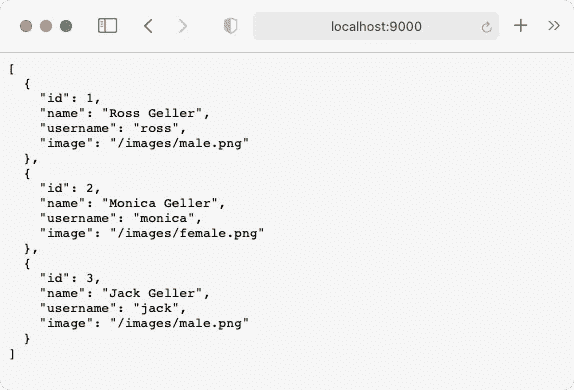**

**( [http://localhost:9000](http://localhost:9000) )**

**在容器内部运行的 HTTP 服务器按照应用程序中设计的 JSON 格式返回用户列表。只要上面的终端打开，该服务器就会运行。要停止容器，我们只需要通过终止 HTTP 服务器来退出进程。通常，我们通过按`CTRL+C`来实现，但这次不行。在运行 Node.js 进程时，我们需要使用`--init`标志。更多阅读从 [**这里**](https://github.com/nodejs/docker-node/blob/master/docs/BestPractices.md#handling-kernel-signals) 。**

**因为我们不能离开当前的终端，所以让我们打开一个新的终端窗口并查看正在运行的容器。要查看正在运行的容器，我们使用`docker [ps](https://docs.docker.com/engine/reference/commandline/ps/)`或`docker container ls`命令。**

**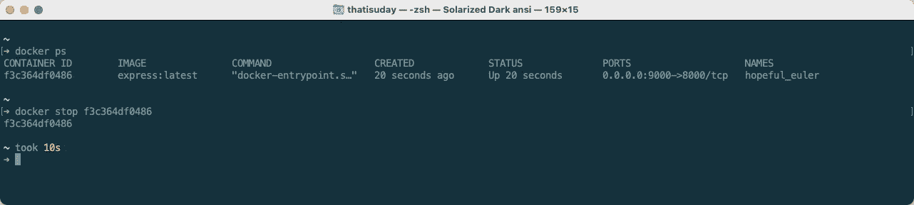**

**$ docker ps**

**从上面的结果中，我们可以看到 ID 为`9b18ffbe6ed2`的容器启动并运行了 15 分钟。它是根据`express:latest`图像创建的，其名称为`hopeful_euler`。这个唯一的名称是由 Docker 自动分配的，但是我们可以使用`--name`标志提供一个自定义名称，它将用于识别一个容器。上述结果还显示了打开的端口及其与主机的连接方式。**

**让我们停止容器，我们使用`$ docker stop <container>`命令，其中`container`是`CONTAINER ID`或唯一名称。一旦容器停止，第一个终端将退出，您将无法在浏览器中访问`http://localhost:9000` URL。**

**一旦容器不再运行，它就不会出现在`$ docker ps`结果中。为了查看运行和非运行容器的完整列表，我们在这个命令中使用了`-a`或`--all`标志。**

**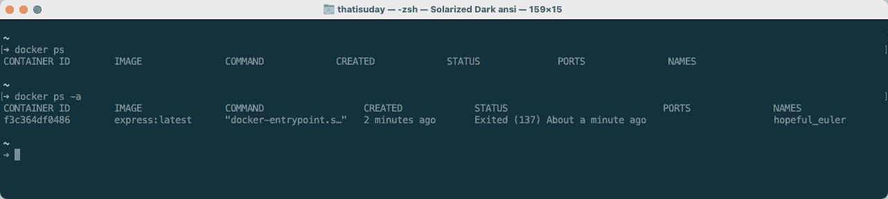**

**$ docker ps -a**

**您可以使用`$ docker [restart](https://docs.docker.com/engine/reference/commandline/restart/) <container>`命令重启停止的容器。如果你想暂停正在运行的容器，你可以使用`$ docker [pause](https://docs.docker.com/engine/reference/commandline/pause/) <container>`命令。为了解除暂停的容器，我们使用`$ docker [unpause](https://docs.docker.com/engine/reference/commandline/unpause/) <container>`命令。**

**让我们从`express:latest`映像创建一个新容器，而不是重启停止的容器。这一次，我们将使用`--init`标志，并为我们的新容器命名。**

**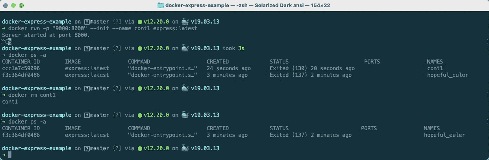**

**$ docker 运行**

**现在我们可以使用`CTRL-C`来停止正在运行的节点流程，这将停止容器并从终端退出。要移除容器，我们使用`$ docker [rm](https://docs.docker.com/engine/reference/commandline/rm/) <container>`命令。您可能需要使用`-f`或`--force`标志来移除正在运行的容器。**

> ***💡*如果你想自动移除存在的容器，使用`--rm`标志和`$ docker run`命令。**

**现在，你会想，如果我必须在生产中使用这个容器，我是否需要保持终端打开。这听起来不太理想。嗯，你是对的。我们不想让容器进程(*服务器*)与终端耦合，而是希望它作为后台进程运行。为了在后台运行容器，或者更准确地说，在**分离模式**下，我们需要使用`-d`或`--detach`标志。**

**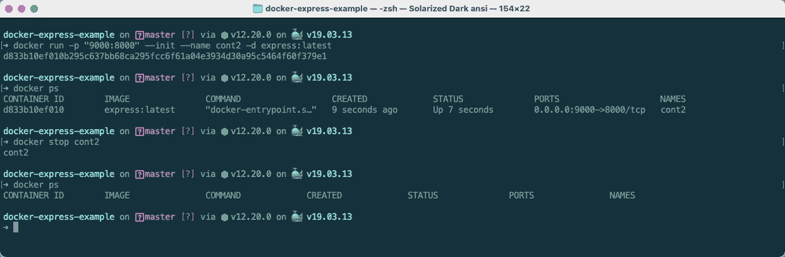**

**$ docker 运行**

**当我们在分离模式下运行容器时，`$ docker run`命令返回容器的 SHA256 ID 并退出终端会话。从`$ docker ps`命令的结果可以看出，容器正在后台运行。您可以使用`$ docker stop`命令来停止容器，这将停止容器中的 HTTP 服务器进程。**

**您可以通过在`$ docker run`命令中提供额外的参数来覆盖默认的`CMD`命令。为此，我们需要使用`-it`标志以交互模式启动容器，这样我们就可以从主机上打开的终端控制容器的外壳。**

**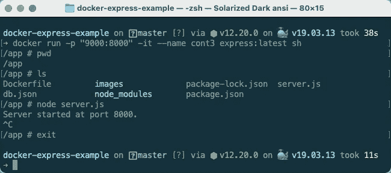**

**$ docker 运行**

**这里，我们用`sh`命令覆盖默认的`CMD`命令( *node server.js* )来启动一个 shell 会话。shell 进程将在容器的`WORKDIR`目录中启动。在那里，我们可以手动启动和存在 HTTP 服务器。一旦我们退出这个 shell 进程(*使用* `*exit*`)，容器将会停止，因为它唯一保持其活动的进程已经死亡。**

**我已经 [**在 Docker Hub 上以**](https://medium.com/sysf/understanding-docker-image-tags-and-publishing-images-to-docker-hub-b7a4f900f201)**`[thatisuday/express-example](https://hub.docker.com/r/thatisuday/express-example)`的名字发布了** 这张 Docker 图片。因此，您可以使用`$ docker pull thatisuday/express-example`命令从 Docker Hub 下载它，或者使用`$ docker run -it --init thatisuday/express-example`命令直接运行它。如果您不想在创建容器时启动服务器，请使用`$ docker run -it --init thatisuday/express-example sh`来代替。**

**您可以从下面的 GitHub 资源库中找到本课中使用的示例的 docker 文件和源代码。如果您想改进这个图像或它的文档，请随时提出拉取请求。**

**[](https://github.com/course-one/docker-express-example) [## 课程-一/码头-快速-示例

### 一个用于创建 sample express . js HTTP server GitHub 的 Docker 项目是超过 5000 万开发人员的家园…

github.com](https://github.com/course-one/docker-express-example) 

## 资源:

1.  Dockerfile 最佳实践:[https://docs . docker . com/develop/develop-images/docker file _ best-practices/](https://docs.docker.com/develop/develop-images/dockerfile_best-practices/)
2.  https://docs.docker.com/engine/reference/commandline/cli/
3.  Docker 引擎 API:【https://docs.docker.com/engine/api/ ** ****

**([](http://thatisuday.com)**/[**GitHub**](https://github.com/thatisuday)/[/**Twitter**](https://twitter.com/thatisuday)/[**stack overflow**](https://stackoverflow.com/users/2790983/uday-hiwarale)**/[**insta gram**](https://www.instagram.com/thatisuday/))******

********