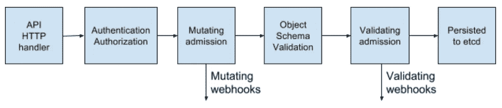

# 使用 Golang 在 Kubernetes 中创建自己的准入控制器

> 原文：<https://itnext.io/creating-your-own-admission-controller-in-kubernetes-using-golang-3fad3b3e0c81?source=collection_archive---------4----------------------->

库伯内特 API 是一个令人惊叹的领域。由于是围绕 REST 模型构建的，它使我们有可能使用 HTTP 请求来管理我们所有的工作负载。像`kubectl`或`Kubernetes dashboard`这样的工具利用了这一点，帮助管理不同的资源。但是 Kubernetes API 远不止这些。让我们更深入地看看它是如何构成的:



这张图片突出显示了 API 组件中的不同组件。该请求启动了与身份验证控制器通信的 API 旅程。一旦请求被认证，授权模块指示请求发布者是否可以执行操作。请求被适当授权后，入场魔法开始发挥作用。

Kubernetes 中有两种类型的准入控制器。它们的工作方式略有不同。第一种类型是**验证接纳控制器**，它将请求代理给订阅的 webhooks。Kubernetes API 根据资源类型和请求方法注册 webhooks。每个 webhook 都运行一些逻辑来验证传入的资源，并用一个结论来回复 API。如果验证 webhook 拒绝请求，Kubernetes API 会向用户返回一个失败的 HTTP 响应。否则，它继续下一次准入。

在第二种类型中，有一个**变异接纳控制器**，它修改用户提交的资源，因此您可以进行一些默认设置或验证模式。集群管理员可以将变异 webhooks 附加到 API 上，以与验证相同的方式运行。事实上，变异逻辑在验证之前运行。

# 目标

我们这里的目标是创建一个简单的验证控制器，使我们能够影响 pod 的创建。尽管有更多的可能性，并且逻辑可以根据您的需要而变得复杂。目标是创建一个进行简单验证的基本版本。你可以在底部的链接中找到更多真实的例子。

我们的示例控制器将被称为`grumpy`，并将拒绝所有名称不同于`smooth-app`的新 pod。我们认识到在真实的集群中部署这个控制器可能很有诱惑力；).

# API 如何代理请求

Kubernetes API 服务器需要知道何时将传入的请求发送给我们的准入控制器。Kubernetes 哲学主张总是使用声明性策略，这也不例外。下面我们定义一个`ValidationWebhookConfiguration`,它向 API 提供所需的信息:

```
apiVersion: admissionregistration.k8s.io/v1beta1 kind: ValidatingWebhookConfiguration metadata: name: grumpy webhooks: - name: grumpy clientConfig: service: name: grumpy namespace: default path: "/validate" caBundle: "${CA_BUNDLE}" rules: - operations: ["CREATE"] apiGroups: [""] apiVersions: ["v1"] resources: ["pods"]
```

您可以看到有两个主要部分需要考虑。在第一个例子中，`clientConfig`，我们定义了在哪里可以找到我们的服务(它可以是一个外部 URL)，以及我们的验证服务器将监听的`path`。另外，你会注意到有一个`CA`需要定义。由于安全性总是很重要，添加 cert authority 将告诉 Kubernetes API 使用 HTTPS，并使用传递的资产验证我们的服务器。在下一节中，您将看到关于如何生成所有需要的证书的解释。

第二部分指定 API 将遵循哪些规则来决定是否将请求转发给`grumpy`进行验证。此处配置为仅转发方法等于`CREATE`且资源类型为`pod`的请求。

# 生成证书和 CA

由于本指南的范围不是教您如何构建 PKI 包，我们在 [grumpy 存储库](https://github.com/giantswarm/grumpy)中创建了一个脚本`gen_cert.sh`，它为我们的 grumpy 服务器生成一个 CA 包和一个密钥对。我们还需要在上面显示的 webhook 中提供 CA，以便允许 Kubernetes API 创建一个针对我们的 shiny 控制器的安全连接。

```
// Clone repository in case you did not do it before $ git clone https://github.com/giantswarm/grumpy // Run the command to generate the certs under 'certs' folder $ cd grumpy $ ./gen_cert.sh
```

**注意:**在前面提到的脚本中，有注释解释了执行的命令，以防您对幕后发生的事情感兴趣。

出于本教程的目的，我们的验证 webhook 配置必须包含一个编码的证书颁发机构。除了创建证书和 CA 之外，脚本稍后会将它注入到用于部署我们的服务器的清单中。

```
$ cat manifest.yaml | grep caBundle
```

在下一步中，我们需要创建一个放置证书的密码。在我们应用了清单之后，pod 将能够把秘密文件存储到一个目录中。

```
$ kubectl create secret generic grumpy -n default \ --from-file=key.pem=certs/grumpy-key.pem \ --from-file=cert.pem=certs/grumpy-crt.pem
```

# 部署验证控制器

为了部署服务器，我们将使用一个带有单个副本的部署，该副本安装生成的证书以公开一个安全的 REST 端点，pod 请求将提交到该端点。同时，我们将通过服务公开控制器，以配置我们在 webhook 资源中定义的 DNS。

```
apiVersion: apps/v1beta1 kind: Deployment metadata: name: grumpy namespace: default spec: replicas: 1 template: spec: containers: - name: webhook image: giantswarm/grumpy:1.0.0 ... volumeMounts: - name: webhook-certs mountPath: /etc/certs ... volumes: - name: webhook-certs secret: secretName: grumpy --- apiVersion: v1 kind: Service metadata: name: grumpy namespace: default spec: ports: - name: webhook port: 443 targetPort: 8080 ...
```

应用清单应该足够了。还包含了之前评论过的 webhook。

```
$ kubectl apply -f manifest.yaml
```

现在，服务器应该正在运行，并准备好验证新 pod 的创建。

# 验证验证控制器工作正常

让我们尝试创建一个名称不匹配的简单 pod。

```
apiVersion: v1 kind: Pod metadata: name: non-smooth-app spec: containers: - image: busybox name: non-smooth-app
```

现在让我们尝试应用 pod 资源 yaml。

```
$ kubectl apply -f non-smooth-app.yaml Error from server: error when creating "non-smooth-app.yaml": admission webhook "grumpy-webhook" denied the request: Keep calm and don't add more crap to the cluster!
```

准入控制已截获该请求，它检查了名称，它与预期值不匹配，所以它被拒绝。

为了确认它的工作，现在让我们用一个正确的名字来试一试。

```
apiVersion: v1 kind: Pod metadata: name: smooth-app spec: containers: - image: busybox name: smooth-app
```

在这种情况下，Kubernetes API 允许我们创建 pod。

```
$ kubectl apply -f smooth-app.yaml pod/smooth-app created $ kubectl get pod smooth-app 0/1 Completed 0 6s
```

# 解释验证逻辑

在这个例子中，我们选择在 Go 中创建准入控制器，只是因为它是 Kubernetes 事实上的语言，但是您可以使用您喜欢的任何语言，并且它应该以相同的方式工作。

让我们开始创建一个 HTTP 服务器，并从 secret 挂载证书。服务器将监听我们在 webhook 中定义的路径`validate`。

**注意:**为了更容易理解，代码示例已经被去掉了。要获得更详细的信息，请浏览[库](https://docs.giantswarm.io/guides/creating-your-own-admission-controller/github.com/gianstwarm/grumpy)。

```
// Read the certs from the convined path and convert it to a X509 keypair flag.StringVar(&tlscert, "tlsCertFile", "/etc/certs/cert.pem", "x509 Certificate for HTTPS.") flag.StringVar(&tlskey, "tlsKeyFile", "/etc/certs/key.pem", "x509 private key to --tlsCertFile.") certs, _ := tls.LoadX509KeyPair(tlscert, tlskey) // Create a secure http server server := &http.Server{ Addr: ":8080", TLSConfig: &tls.Config{Certificates: []tls.Certificate{certs}}, } // Create a handler listening to the 'validate' path and start the server gs := GrumpyServerHandler{} mux.HandleFunc("/validate", gs.serve) server.ListenAndServeTLS("", "")
```

在 grumpy 包中，我们定义了一个读取请求体的`serve`函数，然后它将数据转换为`Pod`数据类型，最后检查资源名是否有效。

```
// Convert raw data in a Pod data type raw := arRequest.Request.Object.Raw pod := v1.Pod{} json.Unmarshal(raw, &pod) // Actual validation logic if pod.Name != "smooth-app" { return }
```

如果请求名称不是预期的名称(`smooth-app`，我们的处理程序将创建一个响应，通知拒绝。否则，它返回，Kubernetes API 服务器将跟踪请求的处理。

```
// Create a response to return to the Kubernetes API ar := v1beta1.AdmissionReview{ Response: &v1beta1.AdmissionResponse{ Allowed: false, Result: &metav1.Status{ Message: "Keep calm and not add more crap in the cluster!", }, }, } resp, err := json.Marshal(ar)
```

正如您从本教程中看到的，实现一个简单的准入控制器是相当容易的。很明显，有很多方法可以让你的集群更加安全，更加坚固(接受已知的注册表，禁止最新的标签等等)。

同时，它拥有强大的力量，因为它可以影响集群中运行的关键组件。举个例子，你可以阻止 CNI 插件运行，以防你犯了一个错误，导致整个集群崩溃。所以要小心，尽量将准入逻辑的范围限定在一个名称空间或一组较小的动作上。

此外，值得一提的是，已经有一些项目利用这种模式来实现更高级别的功能。例如[kubernetes-policy-controller](https://github.com/open-policy-agent/kubernetes-policy-controller)使用准入 webhooks 来实现策略引擎( [OPA](https://www.openpolicyagent.org/) )以在云本地环境上实施策略。

# 进一步阅读

*   [官方文件](https://kubernetes.io/docs/reference/access-authn-authz/extensible-admission-controllers/)
*   [转到创建变异/验证控制器的框架](https://github.com/slok/kubewebhook/)
*   [变异控制器教程](https://github.com/morvencao/kube-mutating-webhook-tutorial/)
*   [实现 OPA 框架的变异和验证控制器](https://github.com/open-policy-agent/kubernetes-policy-controller)

由解决方案工程师 Fernando Ripoll 撰写@ [巨型蜂群](https://giantswarm.io/)

[](https://twitter.com/pipo02mix) [## 费尔南多·里波尔(@pipo02mix) |推特

### 费尔南多·里波尔的最新推文(@pipo02mix)。生命开发者。特鲁埃尔

twitter.com](https://twitter.com/pipo02mix)