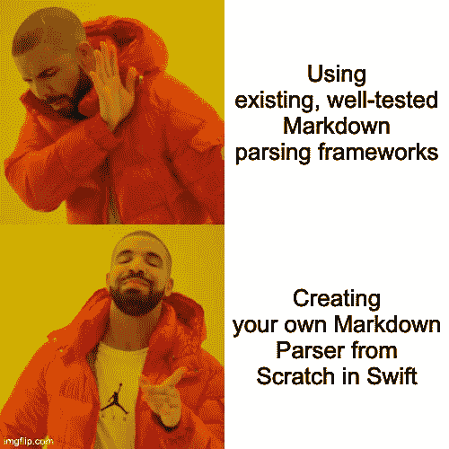
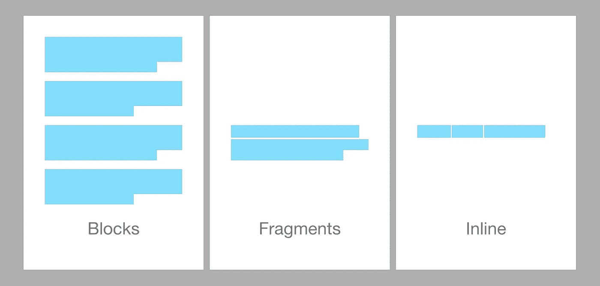
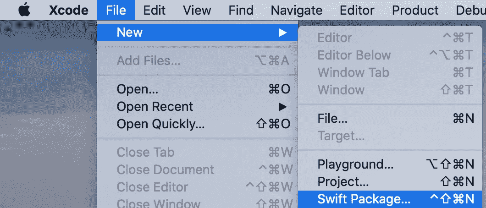

# 在 Swift 中从头开始创建您自己的 Markdown 解析器

> 原文：<https://itnext.io/creating-your-own-markdown-parser-from-scratch-in-swift-a8fa6f185bc8?source=collection_archive---------2----------------------->

你知道 Markdown 吧？这种文本格式使用时髦的字符如`#`、`**`或`>`来创建格式良好的文档？厉害！许多平台每天都在使用它，所以你最终也会使用它。

现在，如果您的 Swift 应用程序需要一个 markdown 解析器，该怎么办呢？好吧，我们可以只使用其中一个经过良好测试的版本(可以在 GitHub 上使用您最喜欢的搜索引擎找到)，但取而代之的是……您也可以创建自己的版本。



德雷克可能也更喜欢写自己的解决方案

玩笑归玩笑:如果可能，不要重新发明轮子。如果一个现有的框架有一个活跃的维护者能满足你的需求，就使用那个。在 [techprimate](https://techprimate.com) 我们决定创建自己的解决方案，[冷却](https://github.com/techprimate/CoolDown)，因为即将推出的应用程序使用 Markdown 和许多自定义扩展，因此完全控制更方便。

本文还将向您介绍如何解析结构化的纯文本文档。下面简单介绍一下我们将涉及的内容:

1.  降价文档结构
2.  文档解析器的结构
3.  实施准则
4.  按字符解析片段

# 降价文档结构

Markdown 文档完全用纯文本编写，任何额外的资源只作为 URL 引用添加。

多年来，出现了多种 Markdown 规范，许多平台(例如 GitHub)都采用并扩展了它。最终它被标准化以消除歧义。对于本教程，我们将使用 [CommonMark 0.29](https://spec.commonmark.org/0.29/) 规范作为参考，因为它是一个相当常见的规范(双关语)。

## 结构元素

文档的一个主要结构元素是*双换行符/空行*，因为它将我们的文档组织成一系列的*块*。请看下面的例子:

很明显，这些应该被认为是两个块，但是下面仅仅是单个块:

这些块甚至可以进一步分类为*叶块*(例如标题)、*容器块*(例如列表)和*内联*(例如代码跨度)。我现在不会进一步深入细节，因为您可以查看详细的 CommonMark 文档。

现在我们需要更仔细地看一下单个块:

```
This is a full text *with some cursive* and some **bold text**.
```

这仍然是一个块，但它由 5 个内嵌块/元素组成:

1.  纯文本:`This·is·a·full·text·`(包括尾部空白)
2.  草书文字:`with·some·cursive`
3.  纯文本:`·and·some·`
4.  粗体文本:`bold·text`
5.  纯文本:`.`

# 文档解析器的结构

好了，现在你对我们要处理的数据有了一些基本的了解。现在您需要知道如何解析一个普通的文本文档。一条经验法则:

> 在处理每个块之前，将文本分成尽可能小的块

如前所述，我们的文档由一系列块组成。这已经让我们的生活变得更容易了，因为我们现在可以单独分析积木了。

接下来，我们知道没有一个减价元素的跨度超过一行。即使是下面这个例子，一个多行代码段，也可以看成三个“子块”。为了简化我们的命名，从现在开始我将把它们称为*片段:*

我们已经将一个大文档分解成块，然后再分解成片段。由于各个片段的内容各不相同，我们无法再进一步细分。



Markdown 文档由块组成，而块又由片段和内联组成

记住这种结构，我们可以创建以下基本算法:

# 实施准则

你的时间到了。是时候写一些代码了🔥

由于我们的库是完全基于逻辑的，并作为一个黑盒工作(文本作为输入，解析的文档作为输出)，这是一个很好的**测试驱动开发(TDD)** 的用例。
这种开发策略的主要思想是首先定义一个测试用例，它会故意失败，然后编写代码来修复它。

第一步，使用您选择的终端和`swift package init --type library`或使用 Xcode 创建一个新的 Swift 包***MarkdownParser***:



Xcode 还提供了创建 Swift 包的选项

接下来，打开`MarkdownParserTests.swift`并创建您的第一个测试用例:

这段代码很简单，但是为了方便起见，我将解释一下:首先定义输入文本，然后使用输入文本创建一个解析器，并调用`parse()`将它转换成一个节点树。最后，我们编写一个测试断言来检查它是否返回了预期的结果。

Xcode 通常会很快告诉你语法问题:


Xcode 会抱怨，但这是在进行测试驱动开发时所期望的

解决这种情况的唯一方法是实现满足测试期望的类`MarkdownParser`:

再次运行测试，它将不会再失败(现在**伏笔加剧* *)🎉

## 创建我们的第一个内容节点

在添加更多功能之前，添加一个新的测试用例:

我们再次需要修改代码，通过向已知的节点类型添加新的内容节点类型来满足期望

并更改我们的解析器以满足两个测试用例:

> **注意:**
> 在本教程中，我使用一个`enum`来定义不同的节点，因为它很简单。您还可以创建`struct's`甚至`classes`来返回解析后的节点。

## 加快我们的解析游戏

好吧，好吧，好吧…简单的文本解析已经足够了。到目前为止，您有望理解 TDD 是如何工作的，所以让我们向前跳几步，创建一个更高级的测试用例:

处理这个复杂示例的第一步是创建必要的节点类型:

现在记住引言中的算法:首先我们需要将文本分成块，然后迭代它们。我们通过创建一个所谓的`Lexer`，一个将我们的原始内容分割成更小块的类(所谓的 *lexems* )，以一种可测试的方式做到这一点。
此外，它实现了迭代器协议，以使用标准化的循环机制:

我们的 Markdown 解析器正在发展，我们算法的前两步已经实现:

进展顺利！接下来让我们关注第 3 步和第 4 步:

> 3.将每个块分割成碎片
> 4。迭代所有片段并将它们解析成节点(例如粗体文本)

创建另一个类`BlockParser`,它将迭代块中的每个片段并单独解析它们:

调整`MarkdownParser.parse()`以将其用于每个模块，并完成我们算法的第 3 步:

# 按字符解析片段

到目前为止，文档的结构是众所周知的(由空行分割的块，由换行符分割的片段)。

对于实际的片段解析逻辑，您可以从多种方法中进行选择(比如使用 Regex ),但是在这种方法中，我们使用的是基于字符的词法分析器。

片段词法分析器与前面的不同，因为它通过每个字符迭代内容，并且还提供了额外的方法来使*在更多的字符处到达峰值*(不增加迭代器计数器)和*回退*以向后移动迭代器。

使用我们在本教程中收集的所有知识，让我们创建最后一个缺失的解析器`FragmentParser`。这个类将使用我们的`FragmentLexer`并通过特定的字符来标识不同的节点，正如规范中所声明的。
在第一个版本中，我们将每个字符连接成一个`.text(...)`节点，以完成我们的第二个测试用例:

这对于简单的用例很好，但是对于更复杂的用例，我们需要一个额外的数据结构来有效地跟踪片段中的抽象嵌套位置。

## 内联堆栈

为了理解发生了什么，我们通过一个更复杂的块(甚至比前面的更复杂)的解析逻辑来思考:

```
This is a text block **with bold *and cursive*** text.
```

应该映射以下结构:

```
.paragraph(nodes: [
    .text("This is a text block"),
    .bold("with bold"),
    .boldCursive("and cursive"),
    .text(" text.")
]),
```

因此，我们的片段解析算法将如下工作:

请记住，这是伪代码，应该只帮助理解发生了什么。

现在看看下面这个略有不同的例子:

```
This is a text block **with bold *and none cursive** text.
```

删除最后一个星号后，解析后的结构看起来会有点不同:

```
.paragraph(nodes: [
    .text("This is a text block"),
    .bold("with bold *and none cursive"),
    .text(" text.")
]),
```

不幸的是，这也取决于我们的解析器，因为下面的输出也可能是有效的:

```
.paragraph(nodes: [
    .text("This is a text block *"),
    .cursive("with bold "),
    .text("and none cursive"),
    .cursive(""),
    .text(" text."),
]),
```

这是一个你必须做出的软件设计决定。如果你想知道我是如何实现的，请查看 GitHub 上的[boldcursiveinlinespec . swift](https://github.com/techprimate/CoolDown/blob/main/Tests/CoolDownParserTests/BoldCursiveInlineSpec.swift)的冷却时间。

作为跟踪嵌套的一种有效方式，我决定使用一个堆栈，它在开始字符(比如`**`)上添加一个额外的节点，并在找到结束字符时将它从堆栈中移除。

为了不进一步增加本教程的复杂性，我将不讨论堆栈机制的确切实现。如果你现在想了解更多，[冷却](https://github.com/techprimate/CoolDown)评论的很好。

## 完成我们的解析器

好了，这是本教程范围的最后一个`FragmentParser`:

代码被注释了，所以它应该是不言自明的。在这个例子中，你也可以看到为什么我们的`FragmentLexer`有额外的`peak`和`rewind`方法。

当您再次运行测试用例时，它们仍然会失败，结果如下:

如果你对将两个块合并成一个块感到满意，做得好，改变测试，你就完成了😄

如果没有，改变`MarkdownParser.parse()`方法，将每个块的节点分组，如果发现不止一个块，它将把它们包装在段落节点中:

# 结论

你成功了！祝贺你🥳

本教程只涵盖了使用和解析 Markdown 的一小部分可能性。显然，这三个测试不足以转换实现的功能，所以请确保编写更多的测试！

我还多次引用了我们的自定义解析器@ techprimate，名为 CoolDown，它仍在开发中，但最终会投入生产。我们决定将其构建为一个开源的 Swift 包，所以检查一下 [GitHub 库](https://github.com/techprimate/CoolDown)。

除了实际编写一个小的工作解析器之外，您还对文档格式本身有了更多的了解。现在，您应该能够从那里开始学习，并继续研究解析器。

如果你想了解更多，请查看我的其他文章，在 [Twitter](https://twitter.com/philprimes) 上关注我，并随时给我发短信。
你有具体的话题想让我报道吗？让我知道！😃