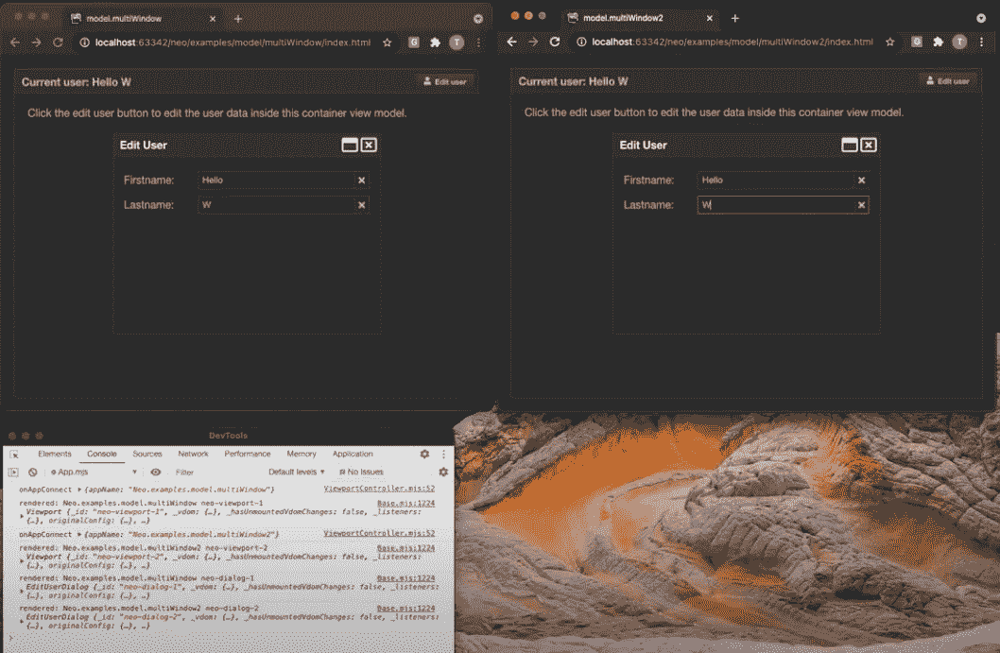

# 跨浏览器窗口状态管理

> 原文：<https://itnext.io/cross-browser-window-state-management-77bf837b6574?source=collection_archive---------2----------------------->

这种新方法非常强大，而且易于使用。

实现依赖于使用[的共享工作人员](https://developer.mozilla.org/en-US/docs/Web/API/SharedWorker)。



# 内容

1.  运行中的演示应用
2.  应用程序架构的魔力
3.  访问状态数据的绑定
4.  在线演示
5.  关于 neo.mjs 中状态管理的更多信息
6.  我们能为这个演示获得一个独立的存储库吗？

# 1.运行中的演示应用

我让演示应用程序尽可能简单。

下面是一个简短的视频，看看我们将要谈论的内容:

# 2.应用程序架构的魔力

自动生成的索引文件:

我们正在使用`useSharedWorkers`框架配置从使用普通 web workerss 切换到共享 web worker(多窗口上下文需要)。

我们指向我们的 app.mjs 文件。

窗口(主线程)将**而不是**包含它。相反，它会被应用程序工作人员拾取(单独的线程→ CPU)。

两个应用程序都是从一个空的视窗开始的:

主应用程序正在使用 ViewportController:

[旁注]有了 [webpack ^5.35.1](https://github.com/webpack/webpack) ，我们终于可以在 dist/*输出中使用[公共类字段](https://developer.mozilla.org/en-US/docs/Web/JavaScript/Reference/Classes/Public_class_fields)。

在 SharedWorkers 范围内，我们可以使用`connect`和`disconnect`事件，它们在主线程到达或离开时发生。这也包括当前的应用程序。

`onAppConnect()`已经是本文的重点部分。

当第一个应用程序(浏览器窗口)连接时，我们将创建一个包含状态(数据)的视图模型。

之后连接的所有应用程序都将收到对此模型的父引用。

在 [neo.mjs](https://github.com/neomjs/neo) 上下文中的“视图模型”意味着一个完全可选的构造，使子组件可以访问数据。

事实上，这是两个应用程序都在使用的唯一一个视图模型(以防我们没有计算纯父参考模型)。

# 3.访问状态数据的绑定

两个视口都添加了这个主容器:

标题工具栏中的标签包含一个绑定的文本配置。

我们正在使用[模板文字](https://developer.mozilla.org/en-US/docs/Web/JavaScript/Reference/Template_literals)，并且可以访问整个父模型链来自动找到每个数据属性的最接近匹配。

在我们的视图控制器中，我们将延迟加载对话框 JS 模块，以防它还不在那里，并再次将父引用指向最近的模型。

默认情况下，模型会自动找到最近的父节点，但是对话框是特殊的，因为它们位于组件树之外(直接的子节点`document.body`)。

在对话框视图中，我们将两个文本字段值 config 绑定到模型数据。

我们还添加了更改监听器，我们将在最近的视图控制器中接收这些监听器。

我们使用`this.getModel().setData()`来访问每个数据属性的最近视图模型。

正确，这意味着我们的第一个应用程序的视图模型，即使它存在于不同的浏览器窗口中。

这就是了。就这么简单。

# 4.在线演示

**重要提示**:先打开主应用，然后在不同的窗口打开子应用。要“重新加载”应用程序，您需要关闭 window2 并重新加载 window1(一个 SharedWorker 一直存在，直到没有连接剩下)。

我们当然可以增强应用程序(例如，给子应用程序添加一个视口控制器)，这样你就可以先打开这个应用程序。

浏览器支持桌面: **Chrome，Edge，Firefox**

主应用:
[分销/生产/示例/模型/多窗口/](https://neomjs.github.io/pages/node_modules/neo.mjs/dist/production/examples/model/multiWindow/index.html)

子 App:
[dist/production/examples/model/multi window 2/](https://neomjs.github.io/pages/node_modules/neo.mjs/dist/production/examples/model/multiWindow2/index.html)

要访问控制台，您需要打开，例如:

```
chrome://inspect/#workers
```

然后选择 app worker(您也可以在这里终止它们)。

对于非共享工作人员，您可以在“普通”控制台中获得所有日志。

如果你对 Webkit (Safari)有疑问，这里有相关的标签:

 [## 149850 -恢复对共享工作者的支持

### 错误 149850:恢复对共享工作人员的支持

bugs.webkit.org](https://bugs.webkit.org/show_bug.cgi?id=149850) 

# 5.关于 neo.mjs 中状态管理的更多信息

本文是版本 2 发布系列的一部分:

[](/the-webworkers-driven-ui-framework-neo-mjs-version-2-release-announcement-b91b476d6f16) [## webworkers 驱动的 UI 框架 neo.mjs 第 2 版发布公告

### 新产品的概念必须是颠覆性的，否则就没什么必要。然而，使用它们的方法…

itnext.io](/the-webworkers-driven-ui-framework-neo-mjs-version-2-release-announcement-b91b476d6f16) 

这篇文章指向了前两篇文章，其中包含了更多关于如何使用视图模型以及它们是如何详细实现的背景信息。

[](/enhance-your-frontend-state-management-with-view-models-7bf49e1a0991) [## 使用视图模型增强您的前端状态管理

### 您很可能使用过 MobX、Redux 或 React 上下文 API。

itnext.io](/enhance-your-frontend-state-management-with-view-models-7bf49e1a0991) [](https://tobiasuhlig.medium.com/enhance-your-frontend-state-management-with-view-models-part2-5a9384bd863c) [## 使用视图模型增强您的前端状态管理—第 2 部分

### 设计目标&谈基于模板文字的视图模型实现。

tobiasuhlig.medium.com](https://tobiasuhlig.medium.com/enhance-your-frontend-state-management-with-view-models-part2-5a9384bd863c) 

您可以在以下位置找到 neo.mjs 存储库:

[](https://github.com/neomjs/neo) [## 近地天体

### neo.mjs 使您能够使用一个以上的 CPU 创建可扩展的高性能应用程序，而无需使用…

github.com](https://github.com/neomjs/neo) 

# 6.我们能为这个演示获得一个独立的存储库吗？

已经有了这个问题，答案是肯定的:

 [## neomjs/跨浏览器状态

### 此时您不能执行该操作。您已使用另一个标签页或窗口登录。您已在另一个选项卡中注销，或者…

github.com](https://github.com/neomjs/cross-browser-state) 

虽然您可以使用`npx neo-app`来创建自己的工作空间，但它可能更方便，例如，转而使用这个 repo 并将其作为起点。

应用程序内容几乎完全相同，除了调整后的应用程序名称:

对于框架回购中的例子来说,`Neo.examples.model.multiWindow`是可以的，但是通常应用程序的名字都很短。这里的`MyApp`和`MyApp2`。

视图内容也被移到了一个`view`文件夹中。

问候&快乐编码，
托拜厄斯