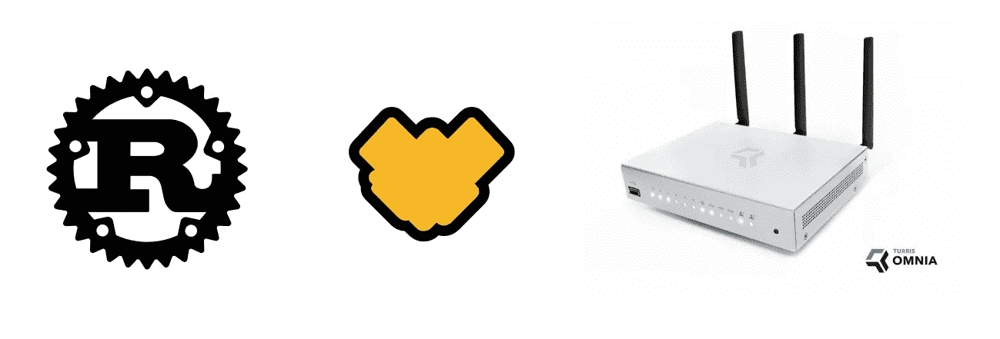

# 交叉编译 Rust 程序以在 Turris Omnia 上运行

> 原文：<https://itnext.io/cross-compile-rust-programs-to-run-on-turris-omnia-e592b555e2aa?source=collection_archive---------5----------------------->



Rust 遇到 Omnia。Rust 徽标归 Mozilla 所有，并在 4.0 版的 CC 下获得许可。

在我之前的[博客文章](https://medium.com/@bajtos/how-to-run-unifi-controller-on-turris-omnia-f9c178594bff)中，我描述了如何使用 LXC 容器在 Turris Omnia 上运行任意的 Ubuntu 包。虽然易于配置，但我发现这样的设置相当浪费。我不想在我的路由器上运行另一个完整的 Linux 发行版来运行小型(家庭)自动化程序。

我们还有其他选择吗？

*   用 Python 写程序。Turris OS 附带了 Python 2.7 版本，许多管理工具也是用 Python 编写的。然而，我从未爱上 Python，而且它是一种带有垃圾收集器的高级解释语言——也不是最有效的选择🤷‍♂️
*   使用 C 或 C++等低级语言，并为 Turris 交叉编译程序。事实证明，交叉编译很容易设置，我们可以用最低的内存使用获得最佳性能。但是，只要我们不引入内存泄漏，或者在访问已经释放回来的内存时使进程崩溃🙈(更不用说安装第三方依赖项的复杂性了，因为 C/C++没有包管理器。)
*   使用 [Rust](https://www.rust-lang.org/) 来获得两个世界的最佳效果:像 Python 这样的高级语言的生产力和可靠性以及像 C 这样的低级语言的性能💪

我们来看看锈道。要在 Turris 上运行 Rust 程序，我们需要:

1.  找到路由器硬件使用的平台，这将是交叉编译的目标。
2.  安装交叉编译构建工具，验证我们可以交叉编译一个简单的 C 程序，并在路由器上运行。
3.  安装 Rust 并设置交叉编译，验证我们可以交叉编译一个简单的 Rust 程序并在路由器上运行它。

*注意:以下说明适用于 Ubuntu 18.04 LTS 版。我正在使用*[*Linux 的 Windows 子系统*](https://docs.microsoft.com/en-us/windows/wsl/install-win10) *在我的 Windows 机器上运行 Ubuntu。*

# 找到目标平台🕵️‍♂️

交叉编译目标通常表示为以下格式的三元组:

```
{architecture}-{vendor}-{system}-{abi}
```

我们已经知道 Turris Omnia 的处理器有 ARMv7 架构。对于 Linux 系统，供应商通常是`unknown`,因为哪个供应商创建了发行版并不重要。最后缺失的部分是什么 ABI(应用二进制接口)是 Turris 操作系统使用？在 Linux 上，这指的是 libc 实现，您可以通过`ldd --version.`找到它

```
$ ssh root@192.168.1.1 "ldd --version"
musl libc (armhf)
Version 1.1.19
Dynamic Program Loader
Usage: ldd [options] [--] pathname
```

Turris Omnia 的三重目标是`armv7-unknown-linux-musleabihf`，对我们来说幸运的是，这个目标得到了 Rust 作为[二级平台](https://forge.rust-lang.org/release/platform-support.html#tier-2)的支持:

> 第二层平台可以被认为是“保证要建造的”。自动化测试没有运行，所以不能保证产生一个工作的构建，但是平台通常工作得很好，补丁总是受欢迎的！

# 设置 c 交叉编译器⚙

在开始之前，让我们确保安装了常规的构建工具。

```
$ sudo apt-get install build-essential
```

现在，如果我们的目标是`gnueabihf`而不是`musleabihf`，我们的任务会简单得多，因为 Ubuntu 为`gnueabihf`目标提供了带有交叉编译工具链的包。 [MUSL](https://www.musl-libc.org/) 对我来说有点神秘，我对这种风格的标准 C 库几乎一无所知。

幸运的是，有一个名为 [musl-cross-make](https://github.com/richfelker/musl-cross-make) 的项目提供了一个*“基于 makefile 的 musl cross compiler 的简单构建”*,并且它非常有效！首先从 GitHub 下载源代码:

```
$ wget https://github.com/richfelker/musl-cross-make/archive/master.tar.gz
$ tar xzf master.tar.gz
$ cd musl-cross-make-master
```

在开始构建之前，让我们调整一些配置选项。将配置模板文件`config.mak.dist`复制到`config.mak`，设置以下选项(可以取消模板提供的相关行的注释):

```
TARGET=arm-linux-musleabihf
OUTPUT=/usr/local
MUSL_VER = 1.1.19
```

(最好在你的 Turris 上使用与`ldd --version`报道的相同的 MUSL 版本。我的是`1.1.19`写的时候。)

建造时间！

```
$ make
$ make install
```

现在，我们应该在`/usr/local`中安装好所有工具，因此在`PATH`中也可以使用。让我们运行 gcc 来验证:

```
$ arm-linux-musleabihf-gcc --version
arm-linux-musleabihf-gcc (GCC) 9.2.0
Copyright (C) 2019 Free Software Foundation, Inc.
(...)
```

# 交叉编译 C 程序🌍

到目前为止，我们有一个与 Turris 平台匹配的目标三联体的假设。现在是时候在实践中验证我们的假设了。

用 C 编写一个简单的“Hello world”程序——将下面的代码保存到一个名为`hello.c`的文件中:

```
#include <stdio.h>
int main() {
   printf("Hello, World!\n");
   return 0;
}
```

为 Turris 交叉编译这个程序:

```
arm-linux-musleabihf-gcc hello.c -o hello
```

将程序上传到路由器并在那里执行。我将文件存储在`/srv`中，它由 mSATA SSD 驱动器支持，以避免对内部闪存进行不必要的写入。如果一切顺利，你会得到熟悉的问候。

```
$ scp hello root@192.168.1.1:/srv
hello                                 100% 7292     1.6MB/s   00:00
$ ssh root@192.168.1.1 /srv/hello
Hello, World!
```

# 安装 Rust 并设置交叉编译🏎

安装 Rust 有不同的方法，我决定使用基于`rustup`的推荐方法。

```
$ curl https://sh.rustup.rs -sSf | sh
```

我们还需要为我们的目标平台安装交叉编译的标准板条箱(Rust core 模块)。

```
$ rustup target add armv7-unknown-linux-musleabihf
```

最后一步，我们告诉 Rust 编译器在为我们的目标平台编译时使用哪个链接器。将以下部分添加到`~/.cargo/config`:

```
[target.armv7-unknown-linux-musleabihf]
linker = "arm-linux-musleabihf-gcc"
```

# 交叉编译 Rust 程序🎉

在 Rust 中创建一个“Hello world”程序并编译它:

```
$ cargo new --bin hello
$ cd hello
$ cargo build --target=armv7-unknown-linux-musleabihf
   Compiling hello v0.1.0 (/home/bajtos/src/hello)
    Finished dev [unoptimized + debuginfo] target(s) in 2.53s
```

将程序上传到路由器并在那里执行。如果一切顺利，你应该会再次收到同样的问候。

```
$ scp target/armv7-unknown-linux-musleabihf/debug/hello root@192.168.1.1:/srv
hello                                  100% 2903KB  10.8MB/s   00:00 $ ssh root@129.168.1.1 /srv/hello
Hello, World!
```

恭喜你，现在你可以在你的 Turris Omnia 路由器上运行任何 Rust 程序了。例如，如果您使用的是乳齿象和 Twitter，您可以使用乳齿象-twitter-sync 在这两个网络之间同步您的帖子:

[](https://github.com/klausi/mastodon-twitter-sync/) [## 克劳斯/乳齿象-推特-同步

### 这个工具可以同步乳齿象和 Twitter 之间的帖子。不管你把你的东西贴在哪里，它都会…

github.com](https://github.com/klausi/mastodon-twitter-sync/) 

# 学分和参考🙇‍♂️

这篇博文中的很多信息都是基于下面这篇关于交叉编译 Rust 程序的很棒的指南。谢谢，[豪尔赫·阿帕里西奥](https://github.com/japaric)！

[](https://github.com/japaric/rust-cross/blob/master/README.md) [## 日本/锈十字

### 关于交叉编译 Rust 程序你需要知道的一切！如果你想把你的生锈工具链设置成十字…

github.com](https://github.com/japaric/rust-cross/blob/master/README.md) 

Rust 支持的平台列表可以在以下官方项目文档中找到:

 [## 防锈平台支架

### Rust 编译器可以在很多平台上运行并编译，尽管不是所有的平台都一样…

forge.rust-lang.org](https://forge.rust-lang.org/release/platform-support.html) 

最后，如果没有里奇·费尔克出色的 musl-cross-make 项目，我要花很长时间才能弄清楚如何为 MUSL·ABI 进行交叉编译。

[](https://github.com/richfelker/musl-cross-make) [## richfelker/musl-cross-make

### 这是第二代 musl-cross-make，一种快速、简单但先进的基于 makefile 的制作方法…

github.com](https://github.com/richfelker/musl-cross-make) 

# 附言

你有没有注意到我们的 C 程序有 7kB，而 Rust 版本有 2903kB？有几个窍门可以减少 Rust 程序的可执行大小。通过启用链接时间优化，我能够将发布版本的大小快速减少到 1408kB。您可以在*“最小化 Rust 二进制大小”*中了解更多高级技术:

 [## 约翰哈根/最小尺寸-铁锈

### 这个库演示了如何最小化 Rust 二进制文件的大小。默认情况下，Rust 会优化…

github.com](https://github.com/johnthagen/min-sized-rust)