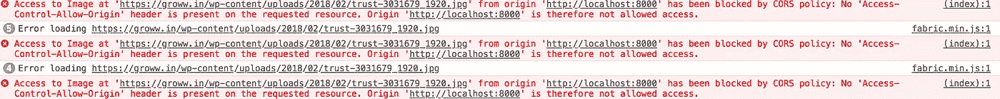

# 跨原点图像结构 JS

> 原文：<https://itnext.io/cross-origin-resource-sharing-cors-fabric-js-95d44b727373?source=collection_archive---------1----------------------->


【www.rockwellcollins.com 号

> 一种机制，允许从提供第一个资源的域之外的另一个域请求网页上的受限资源(例如字体)。

[*点击这里在 LinkedIn 上分享这篇文章*](https://www.linkedin.com/cws/share?url=https%3A%2F%2Fitnext.io%2Fross-origin-resource-sharing-cors-fabric-js-95d44b727373)

当图像有交叉原点时，在 chrome 上访问图像上下文数据会抛出这个错误。无法从画布获取图像数据，因为画布已被跨原点数据污染。



为了使用 fabric js 解决这个问题，我在这里主要分享三种方法。

# 将 crossOrigin 设置为匿名

您必须在 fabric 中设置一个标志 [CrossOrigin](http://fabricjs.com/docs/fabric.Image.html#crossOrigin) ，告诉它允许来自未知来源的图像。设置这个很容易。

```
fabric.Image.fromURL( URL, 
   **function** (img) {
      canvas.add(img);
      canvas.renderAll();
   },{ crossOrigin: 'anonymous', ... }
);
```

# 使用 fabric.util.loadImage

你不需要设置 crossOrigin，当使用 [loadImage](http://fabricjs.com/docs/fabric.util.html#.loadImage) 时，这个方法隐式处理 CORS。

```
fabric.util.loadImage(URL, 
    **function** (img) {
       **var** fab_image = **new** fabric.Image(img);
       canvas.add(fab_image);
       canvas.renderAll();
    },{left:0, top:0, ... });
});
```

# 使用代理图像加载

这意味着总是从你所在的同一个域渲染图像。

为此，我创建了一个 Django 视图，它将从跨域读取图像，将其写入一个临时文件，并用图像数据进行响应。

> 你可以对 rails、php、java 采用同样的方法..也是。

```
import requests
import tempfile
from django.http.response import HttpResponsedef proxy_image(request):
    image = requests.get(request.GET['url'], stream=True)

    # Was the request OK?
    if image.status_code != requests.codes.ok:
        return ""

    # Create a temporary file
    lf = tempfile.NamedTemporaryFile()

    # Read the streamed image in sections
    for block in image.iter_content(1024 * 8):
        # If no more file then stop
        if not block:
            break

        # Write image block to temporary file
        lf.write(block)
    lf.seek(0)
    image_data = lf.read()
    lf.close()

    return HttpResponse(image_data, content_type="image/jpg")
```

现在图像 URL 看起来会像这样

> **获取:**http://yourdomain.com/proxy_image?url=<跨域图片网址>

```
**var** URL = 'http://yourdomain.com/proxy_image?url=http://crossdomain.com/image.jpg';fabric.Image.fromURL( URL, 
   **function** (img) {
      canvas.add(img);
      canvas.renderAll();
   },{}
);
```

所以每当你需要渲染跨域图像时，只需用查询参数`url`向`proxy_image`发出 GET 请求

如果您使用 AWS s3 存储桶来存储您的媒体文件，请参考 [*如何修复 AWS S3 Chrome 和 Safari CORS 在图像上的错误*](https://zyst.io/how-to-fix-aws-s3-chrome-and-safari-cors-on-images) 进行故障排除。

*(通过给别人*帮助别人找到我在 Medium 上的文章)👏🏽*下图。)*