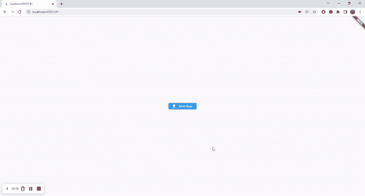

# 使用 Flutter 进行跨平台文件下载

> 原文：<https://itnext.io/cross-platform-file-downloads-using-flutter-6723d40ee730?source=collection_archive---------0----------------------->

来源:Unsplash | [链接](https://images.unsplash.com/photo-1544396821-4dd40b938ad3?ixlib=rb-1.2.1&ixid=MnwxMjA3fDB8MHxwaG90by1wYWdlfHx8fGVufDB8fHx8&auto=format&fit=crop&w=873&q=80)

# 介绍

嗨，在这篇文章中，我想分享一个我以前没有找到的关于使用 Flutter 下载文件的解决方案。对于每个特定的平台，这个问题已经解决了，但是对于跨平台应用程序(包括 web)还没有一个标准的解决方案。

这对于在移动设备和网络上运行的应用程序尤其重要。由于每一个平台的环境和硬件都不同，我们需要一个通用的 flutter 实现，它为所有平台抽象出相同的功能，并在幕后定制实现。

# 定义问题

现在为了更好地理解我们想要做什么，让我们定义什么是**前提条件**和**预期行为**。

作为先决条件，我们有一个运行在 Android、iOS 和 web 上的 Flutter 应用程序，一个指向服务器上托管的文件(在这种情况下是 PDF)的 URL。

Android 和 iOS 的**预期行为**是将文件存储在手机文件系统中，并在手机的状态栏中显示结果，在 web 应用程序的情况下，我们希望以常规浏览器下载的方式下载文件，在这种情况下，我们将打开浏览器选项卡并显示 PDF 文件。

# 实用解决方案:DownloadButton 小部件

由于(几乎)Flutter 中的所有东西都是一个小部件，我认为这不会是例外。我们将创建一个下载文件的自定义按钮，该小部件只接收我们想要执行下载的 URL，它应该做所有的工作。

让我们创建一个简单的 Flutter 应用程序，在支架主体的中心只有一个按钮。

为了将实现放入按钮中，让我们为按钮创建一个新文件。

## 添加必需的依赖项

现在，我们需要一些方便的依赖项来访问文件系统、查找目录路径和请求权限等。

为此，我们将向 pubspec.yaml 添加以下包

> **注意**:检查依赖版本。
> 
> **注意#2:** 查看 [permission_handler 设置指南](https://pub.dev/packages/permission_handler)在继续之前，您需要为 iOS 和 Android 配置设置一些权限。

`**path_provider**`:对于移动实现，您需要访问应用文档目录，`path_provider`包为其提供了一个简单的功能。

`**dio**`:用于执行下载的便捷包，无需担心底层实现(在大文件的情况下，它还提供下载进度回调)。

`**permissin_handler**` **:** 此库用于下载前要求 Android/iOS 权限。

`**open_file**` **:** 用于直接从应用程序中打开下载的文件。

`**universal_html**`:这对于避免兼容性问题尤为重要。由于手机应用程序不支持`dart:html`包。

## 按平台分离实现

在这种情况下，我们不能使用平台 API，因为它在 Flutter Web 上不受支持，但幸运的是，Flutter 团队提供了一个常量来检测应用程序是否是 Web。

为了使它变得清晰，我们将创建一个抽象服务，它根据平台采取不同的实现。

## 颤振网络实现

让我们从最简单的部分开始，web 解决方案。在这里，我们只需要打开一个指向所提供的 URL 的新浏览器选项卡，浏览器就会完成剩下的工作。听起来很简单，对吗？让我们看看代码。

正如你所看到的，这非常简单，因为我们可以让浏览器通过打开一个带有 URL 的新标签来完成所有的工作。

## Flutter 移动实现

不幸的是，在这一部分中，解决方案并不简单明了。为了正确处理下载，我们必须做更多的微观管理。

我们应该注意文件系统和应用程序的权限，以实现访问。所以它需要一些额外的配置。

# 把所有的放在一起

现在让我们看看下载按钮小部件如何正确下载文件。

> **注意**:现在下载按钮有了一个必需的参数`url`，它将由父小部件(在本例中是主页)提供。

# 结果

让我们在移动和网络中测试应用程序，看看结果如何。我们可以使用一个[虚拟 pdf](https://www.w3.org/WAI/ER/tests/xhtml/testfiles/resources/pdf/dummy.pdf) 作为输入。

Web 示例

移动示例

# 结论

Flutter 很棒，但仍处于成长过程中，并在为常见场景寻找标准解决方案，就像本文中描述的那样。

尽管如此，它还是带来了解决问题的强大功能和灵活性，widgets 方法使得在世界各地的开发人员之间扩展和共享解决方案变得容易，这非常好，尤其是对于开源社区。

我希望这篇文章对你有所帮助，如果你发现一些可以改进的地方或任何建议，请在评论中告诉我，如果你正在阅读这篇文章，非常感谢你的时间。😊

> 你可以使用[这个链接](https://github.com/MCarlomagno/flutter_download_button)获得完整的代码