# AWS 上带有代码管道的跨区域操作

> 原文：<https://itnext.io/cross-region-actions-with-codepipeline-on-aws-dcd786eb5fc?source=collection_archive---------4----------------------->

在 [Unsplash](https://unsplash.com/search/photos/code?utm_source=unsplash&utm_medium=referral&utm_content=creditCopyText) 上由 [Max Duzij](https://unsplash.com/@max_duz?utm_source=unsplash&utm_medium=referral&utm_content=creditCopyText) 拍照

在过去的几年中，我参与的许多项目都使用了 TeamCity for CI/CD，但是，最近我开始使用 AWS 代码管道构建新的 CI/CD 管道。作为我一直在做的一个项目的一些其他变化的一部分，我决定我们应该将管道从 TeamCity 迁移到 CodePipeline。

TeamCity 是一个很好的工具，但是我一直将项目从 TeamCity 转移到 CodePipeline 有几个原因:

*   我们必须管理底层的 EC2 服务器，保持服务器之间的依赖关系是最新和常见的，这开始变得令人痛苦。
*   随着项目数量的增加，TeamCity 服务器开始成为我们部署过程中的瓶颈。
*   缺少 TeamCity 的模板系统，使得在阶段之间重复部署管道变得困难。GUI 需要太多的点击，这带来了潜在的人为错误。

下图粗略描述了之前的部署流程；它分为两个主要部分——我们基于 API Gateway 和 Lambda 构建的无服务器后端，以及基于两者结合构建的前端。NET MVC 和 React，运行在 EC2 上。在 TeamCity 为后端和前端编译了我们的代码之后，CloudFormation 处理我们的 API 和 Lambda 函数部署的编排。网络前端。

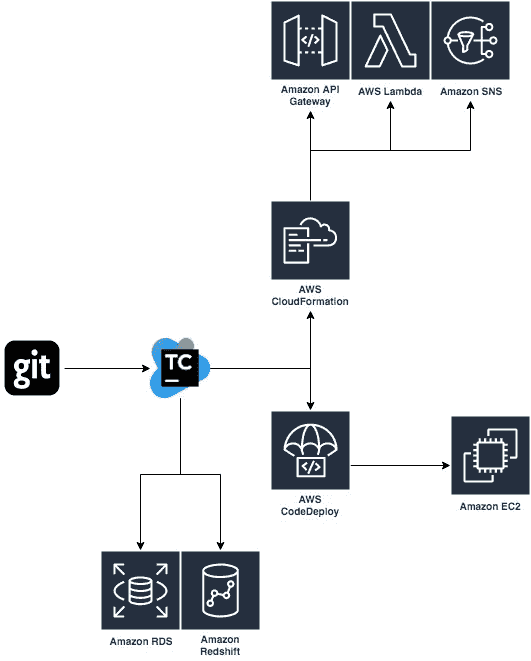

虽然 CodePipeline 接管了整个流程的编排，但 CodeBuild 是主要的服务，承担了 TeamCity 正在执行的工作。CodePipeline 阶段的一个很酷的特性是每个阶段的多个操作可以并行运行，以帮助减少管道完成的总时间。

经过一段时间的反复试验，我们的管道现在看起来如下所示(我们还从内部回购中偷偷移植了 GitHub)。

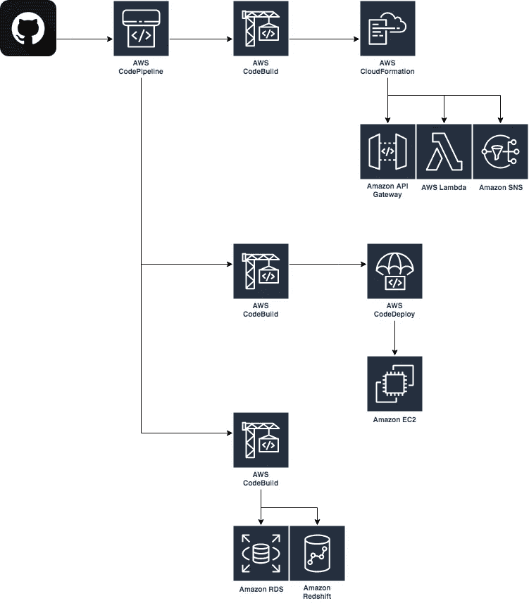

你可能会想，跨区域行动是从哪里来的，为什么有人会费心去使用它们呢？在这个项目中，目标客户群是澳大利亚人，因此所有资源都部署在 ap-southeast-2 中——在 ap-southeast-2 中使用 CodePipeline 也是有意义的。还记得我说过前端是一个. NET MVC 应用吗？我漏掉了一个小细节它是建立在。NET 框架而不是。网芯。这意味着我需要在 CodeBuild 上使用一个 Windows Docker 映像，在撰写本文时，这个映像在 ap-southeast-2 中是不可用的。为了解决这个问题，跨区域行动来拯救！

跨区域操作允许 CodePipeline 在管道所在的不同区域执行操作。如果使用 AWS 控制台中的向导，您会注意到在构建和部署阶段，您不仅可以选择部署提供者，还可以选择您希望发生该操作的区域。这对于我需要使用 CodeBuild 中的一个特性的情况很有用，这个特性在我所在的地区不可用，但也可以用于并行执行多地区部署。

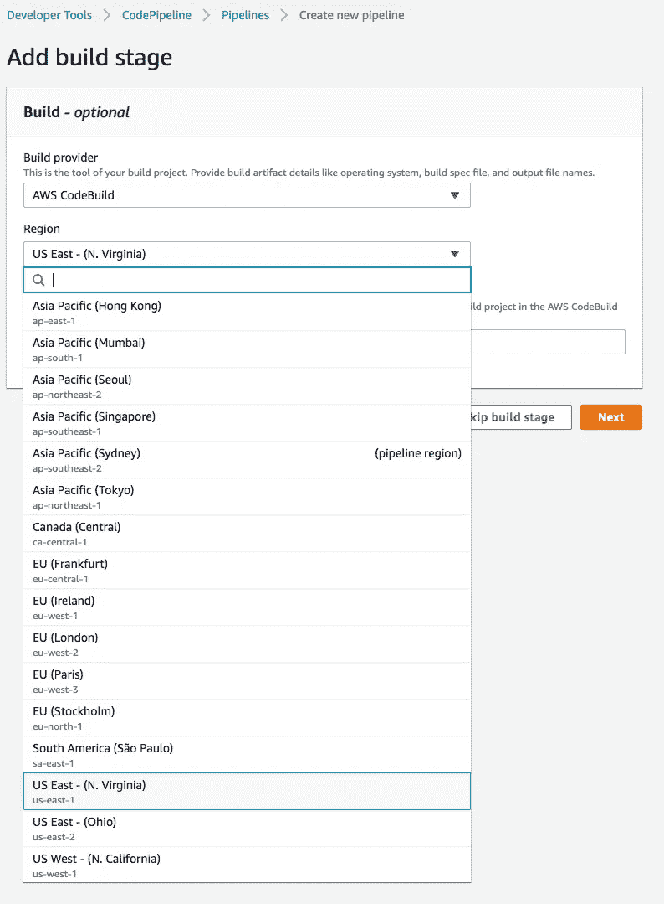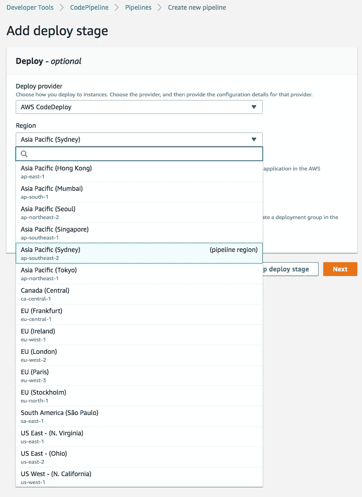

# 让我们动手吧！

首先，我们需要代码管道将与之交互的服务。因为我们的部署管道将包含三个主要组件；来源、构建和部署，我们需要确保我们拥有:

1.  用我们的代码建立的 GitHub 或 CodeCommit 库或 S3 桶
2.  与我们的管道在不同区域的 CodeBuild 项目
3.  CodeDeploy 应用程序和组已配置—您还需要有一个部署位置！

## 代码构建

虽然我将在悉尼创建我的整个管道，但我的 CodeBuild 项目将在北弗吉尼亚创建，所以我可以利用 Windows 映像。如果你以前从未研究过 CodeBuild，它是基于 Docker 构建的，可以使用预先制作的 Docker 映像，也可以通过 ECR 自带映像。在开始之前，值得[阅读一下关于它的](https://docs.aws.amazon.com/codebuild/latest/userguide/welcome.html)。

对于该环境，您的配置应该如下所示，其他一切应该相当简单，但是请确保您没有选择输入或输出工件，因为 CodePipeline 将有助于这一点。另外，记得用一些命令填充 [buildspec](https://docs.aws.amazon.com/codebuild/latest/userguide/build-spec-ref.html) (甚至一个简单的 echo 也可以)。

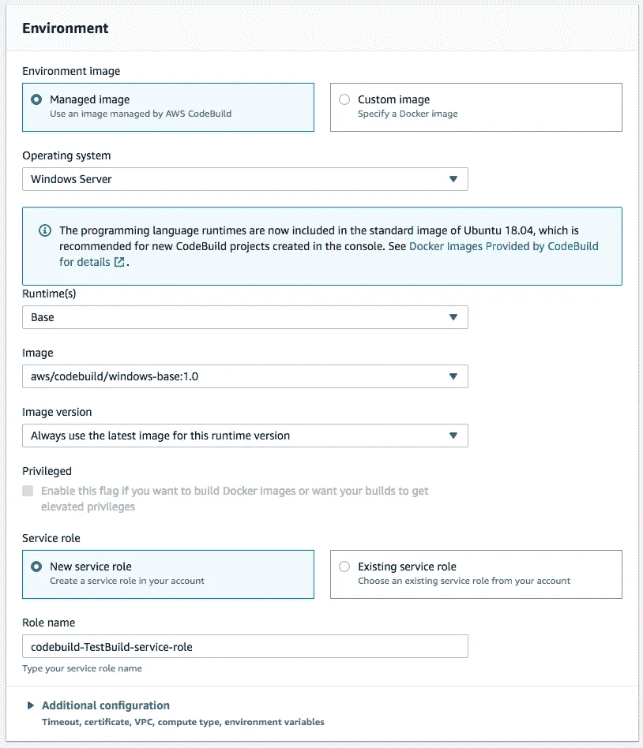

## 代码部署

在 CodeBuild 完成构建我的应用程序之后，我们可以将它的构建工件(编译后的代码)输出为一个包，供 CodeDeploy 使用。 [CodeDeploy](https://docs.aws.amazon.com/codedeploy/latest/userguide/welcome.html) 是一种很好的协调应用程序变更的方式，无论是逐步推出还是执行蓝/绿更新。

尽管 CodeDeploy 现在支持许多不同的目标服务，但我将使用 EC2 作为我的应用程序和组的目标。当部署到 EC2 时，需要包含一个 [appspec](https://docs.aws.amazon.com/codedeploy/latest/userguide/reference-appspec-file.html) 文件，为 CodeDeploy 提供如何处理部署的指令。

设置 CodeDeploy 的第一部分是配置应用程序。由于这只是一个示例，我将把它命名为 TestApplication，但您可能希望根据在该特定基础架构上运行的应用或服务来命名它。

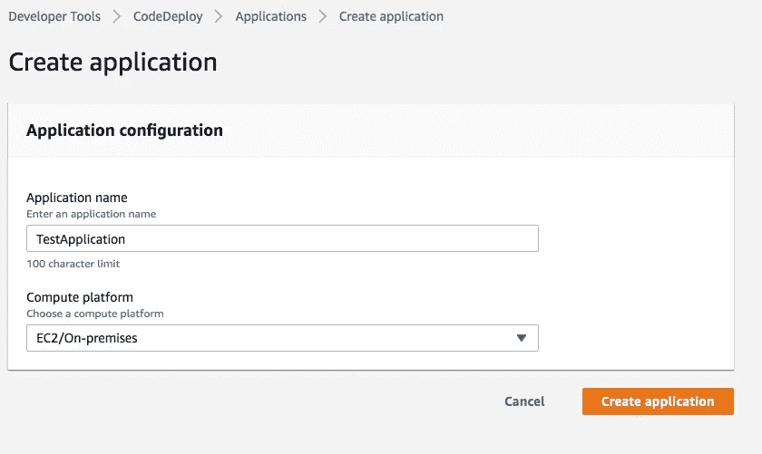

接下来，我们需要创建一个部署组。部署组包含设置和配置，在 EC2 部署的情况下，这些设置和配置与查找应该将应用程序部署到的实例相关，这也可以针对自动扩展组，并允许您绑定到负载平衡器，以确保整个部署的连续性。

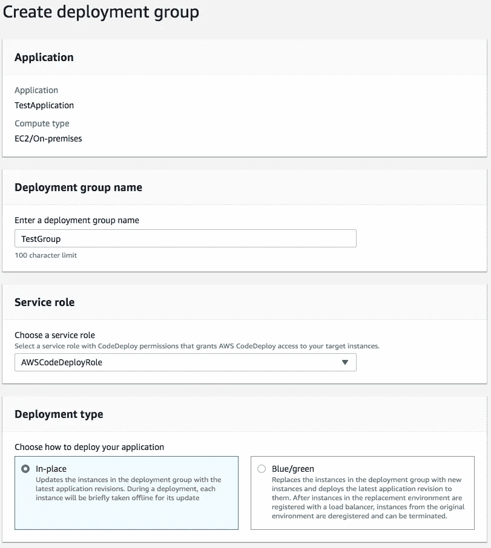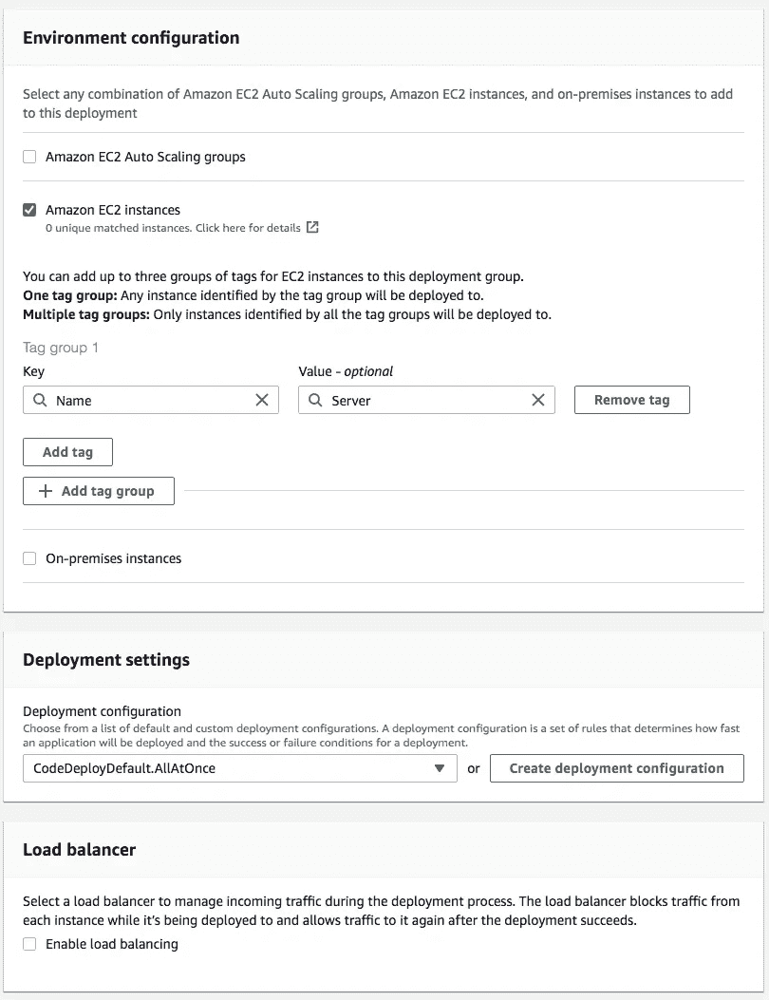

## 代码管道

一切都将使用 CodePipeline 联系在一起，code pipeline 在高层次上是 CodeBuild、CodeDeploy 和许多其他服务的协调者。管道可以配置几个阶段；即。源代码、构建、测试、批准、部署，每个阶段都可以包含多个操作，因此如果需要，您可以为应用程序的多个部分并行执行构建。

这个示例管道要简单得多，只包含三个阶段(源代码、构建、部署),每个阶段只有一个操作。

首先创建一个管道，给它一些基本信息，并配置您的代码源。

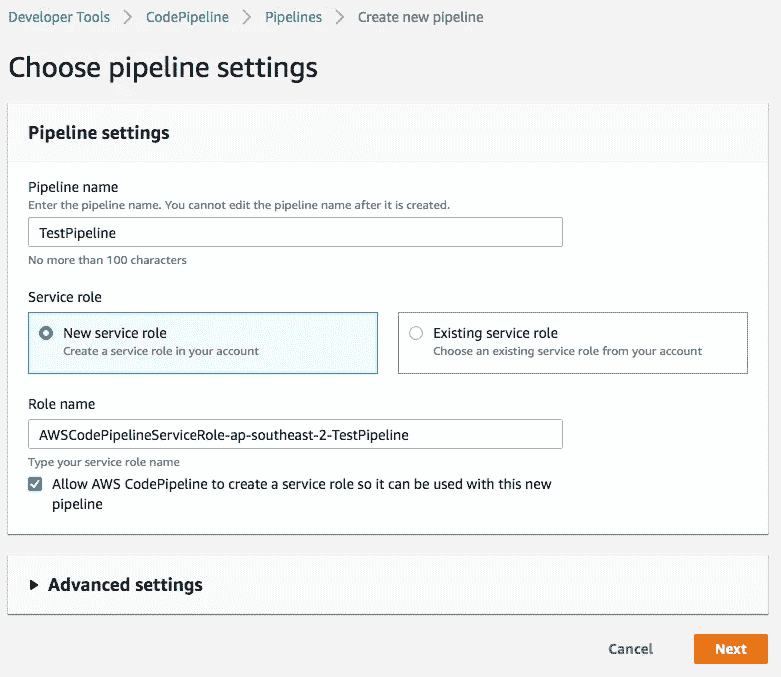

接下来的两个步骤将允许您添加一个构建和部署阶段—您可以跳过任何一个，但是至少需要配置一个构建或部署阶段。因为我们将使用我们之前创建的预先存在的 CodeBuild 项目，所以选择它创建的地区(在我的例子中，是 N. Virginia)和项目。

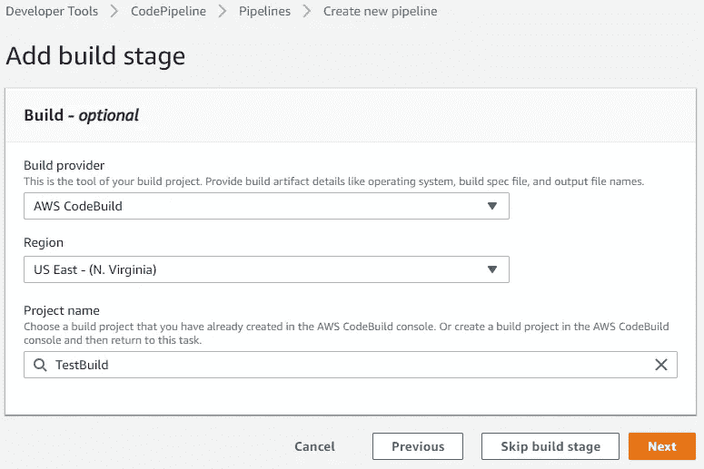

现在，在我们的部署阶段，回到悉尼，但如果我们愿意，我们也可以选择在不同地区进行代码部署。

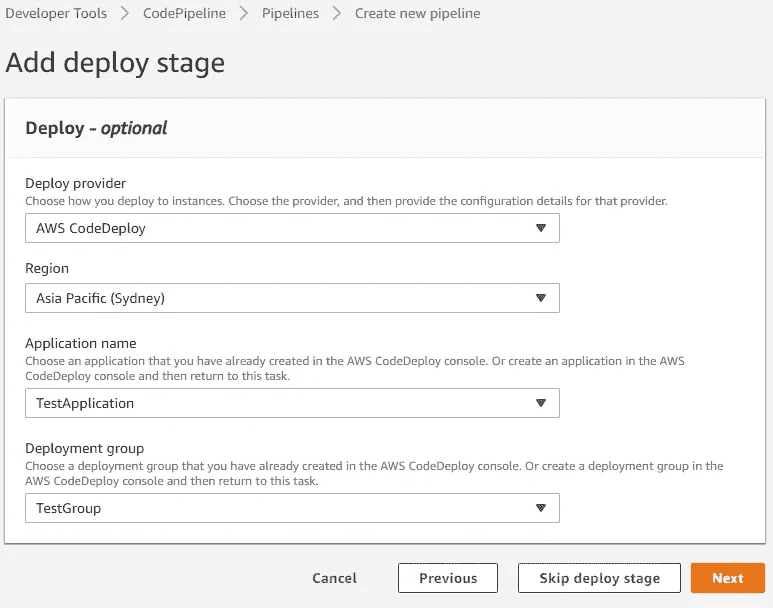

检查和创建管道后，将首次尝试运行整个管道。假设您的源代码、buildspec 和 appspec 都配置正确，并且您的代码是可构建的，那么这个过程应该是成功的。否则，CodeBuild 和 CodeDeploy 都包含全面的日志记录，允许您深入查看可能发生了什么错误。

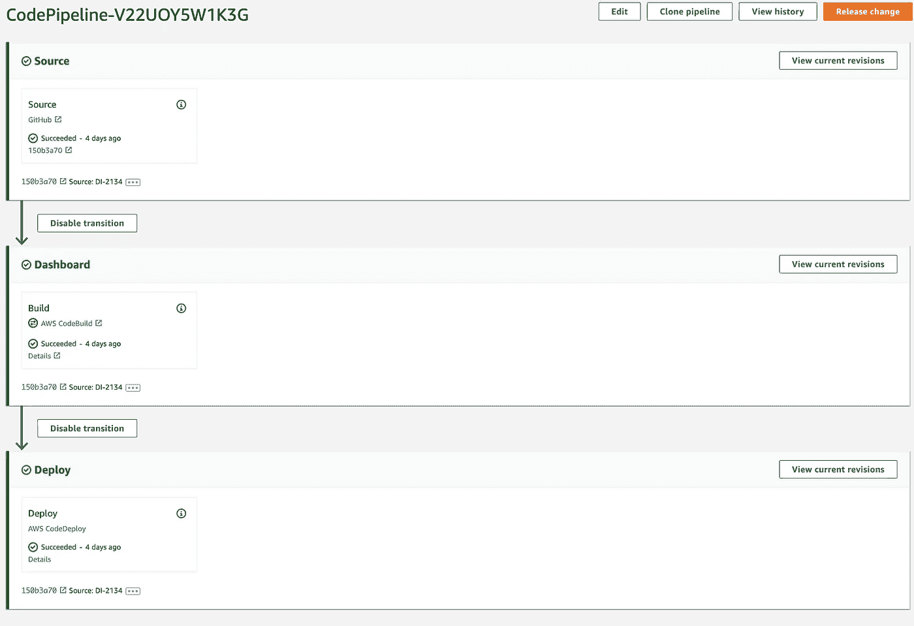

# 在幕后

在幕后，除了 IAM 角色和管道之外，还创建了两个 S3 存储桶，一个在您的管道主要操作的区域，另一个在构建操作所在的区域，然后您的构建工件在这些 S3 存储桶之间为您复制。

查看我们的管道的 YML(如果您使用 CloudFormation 构建它)，现在有了对您的管道的不同组件所在的区域的引用，如果在默认区域之外。

# 结论

跨区域管道非常适合那些边缘情况，或者有助于通过单个管道执行多区域部署。它们可能有点复杂，因为我发现并不是所有的细节都有详细的记录，但是只要坚持一点，它就会工作。

如果您想更深入地使用代码部署管道，我已经上传了一组构建在无服务器框架上的模板到 [GitHub](https://github.com/GavL89/CrossRegionPipeline) 。如果你不想使用无服务器框架，这些可以很容易地转换成本地云格式。