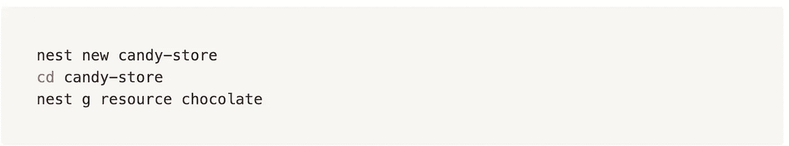
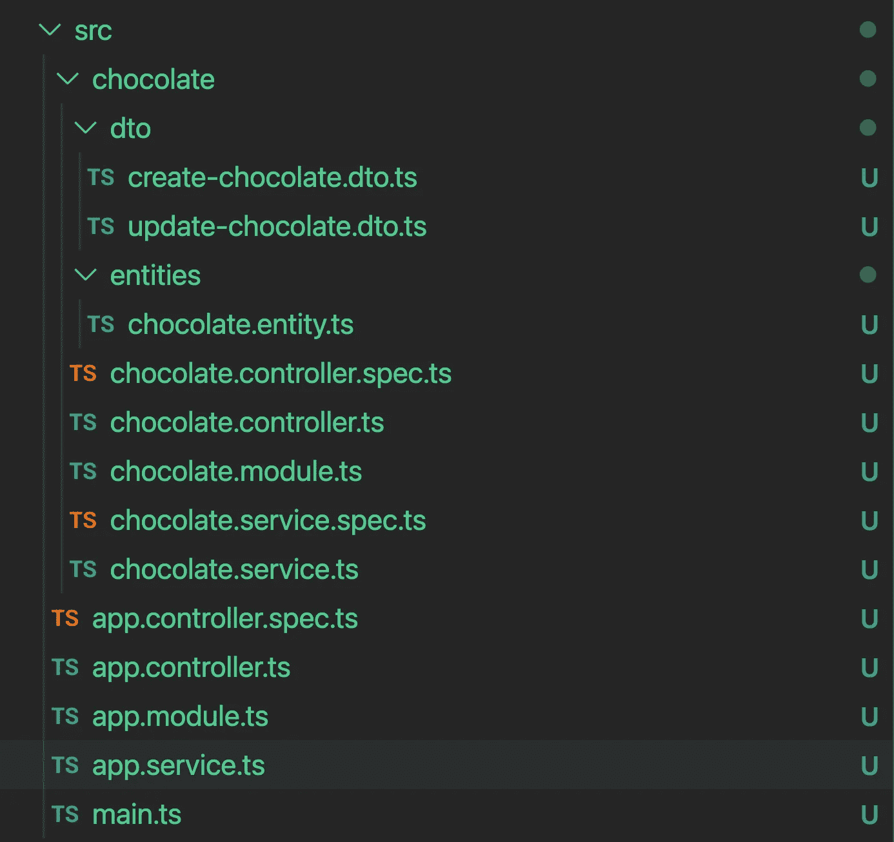

# 使用 NestJS 的 3 行 CRUD API

> 原文：<https://itnext.io/crud-api-in-3-lines-using-nestjs-692df3d61160?source=collection_archive---------2----------------------->

在 [Unsplash](https://unsplash.com?utm_source=medium&utm_medium=referral) 上 [Kier In Sight](https://unsplash.com/@kierinsight?utm_source=medium&utm_medium=referral) 的照片

如果它听起来像点击诱饵，看起来像点击诱饵，闻起来像点击诱饵，那它一定是…它不是。

下面是用 crud api 为卖巧克力的糖果店创建一个 web 服务器的 3 行代码

我承认这不是一个完整的应用程序，但如果你仔细看，我说的是一个 API。

# 我为什么要写这篇文章？

和 NestJS 一起工作超级好。它有一个自以为是的结构(你可以喜欢或不喜欢)，但你不得不同意，它减少了许多时间浪费在修补目录结构，设置测试，路由，数据库连接等，一切都是为平均用例解决。

它甚至附带了一个很棒的可扩展的 CLI 来方便使用生成器的一切。

但是即使使用 CLI，每当我需要某种 crud API 的模板代码时，我也必须做同样的事情。创建模块、控制器和服务。

> 嵌套 g 模块巧克力
> 
> nest g 控制器巧克力
> 
> 雀巢服务巧克力

然后，我必须添加对每个资源都相同的 crud APIs。最后，如果我真的很投入，我必须有一些 d to 和实体定义。

甚至在我编写任何与我的应用程序相关的实际逻辑之前，我必须完成所有这些工作。所以发电机很神奇，但还不够。

但是我错了！发电机比较多，主要是**资源**发电机

使用 bash 的以下代码行

> 嵌套 g 资源巧克力

我可以在一个命令中完成所有的事情！

使用生成器创建的所有资源

参考资料:

 [## 文档| NestJS——一个渐进的 Node.js 框架

### 在项目的整个生命周期中，当我们构建新的特性时，我们经常需要添加新的资源到我们的…

docs.nestjs.com](https://docs.nestjs.com/recipes/crud-generator)