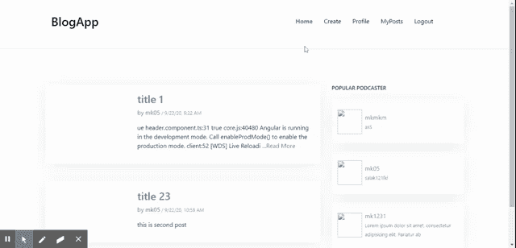
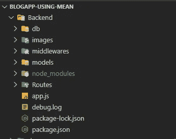
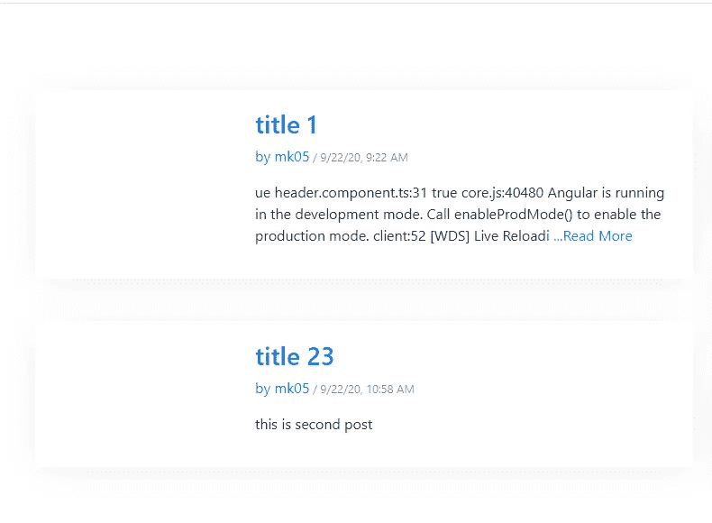

# 使用平均堆栈的 CRUD 操作

> 原文：<https://itnext.io/crud-operation-using-mean-stack-7dfa2f51ec8c?source=collection_archive---------0----------------------->

关于如何从头开始使用 mean stack 应用程序进行 crud 操作的博客

**Github:**[**https://github.com/mehulk05/Blog-using-mean**](https://github.com/mehulk05/Blog-using-mean)

**现场演示:**[**https://mehulk05.github.io/Blog-using-mean/**](https://mehulk05.github.io/Blog-using-mean/#/)

**视频解说:**[**https://www.youtube.com/watch?v=0iqnZgLwNIY**](https://www.youtube.com/watch?v=0iqnZgLwNIY)

## 我们正在创造的演示



现场演示

## 查看完整的解释视频

录像

## 让我们了解一下 stack 的意思是什么。

*   这是一个开源的 NoSQL 跨平台面向文档的数据库。
*   `Express JS`–这是一个基于 web 的应用程序框架，与 Node JS 一起工作，它有助于构建 web 应用程序和 RESTful APIs。
*   `Angular 7/8/9`–这是一个基于打字稿的完整前端框架，由谷歌团队开发。
*   `Node JS`–这是一个免费的 JavaScript 运行时环境，它在浏览器之外执行 JavaScript 代码。它适用于 macOS、Windows、Linux 和 Unix。

## 我将使用以下插件和工具来创建平均堆栈应用程序。

*   [节点 JS](https://nodejs.org/en/)
*   [MongoDB](https://www.mongodb.com/)
*   [猫鼬 JS](https://mongoosejs.com/)
*   [快递 JS](https://expressjs.com/)
*   [角度 CLI 7.2.3](https://cli.angular.io/)
*   [Visual Studio 代码](https://code.visualstudio.com/)

## #1 设置节点 JS 开发环境

跟随此链接到[在您的系统中设置节点 JS。根据您的系统位，即 32 位和 64 位以及操作系统，简单地下载并安装节点](https://nodejs.org/en/download/)

## #2 建立一个节点。JS 后端

为了编写易于管理的代码，我们应该将平均堆栈后端文件夹分开。在 Angular 的根目录下，用 backendor 或者你喜欢的名字创建一个文件夹。这个文件夹将处理我们的应用程序的后端代码，记住它将有一个来自 Angular 7/8/9 的单独的 node_modules 文件夹。

```
mkdir backend
cd backendnpm init -y
```

以上命令将带您进入后端文件夹，然后使用所有默认配置生成 package.json。

## –安装和配置 MEAN Stack 应用开发所需的 NPM 包

使用以下命令安装以下节点模块。

```
npm install --save body-parser cors express mongoose
```

*   **body-parser:**body-parser NPM 模块是一个 JSON 解析中间件。它有助于解析 JSON 数据、纯文本或整个对象。
*   **CORS** :这是一个 Node JS 包，也叫 express js 中间件。它允许启用具有多个选项的 CORS。可通过国家预防机制登记处获取。
*   **Express.js** : Express js 是一个免费开源的 Node js web 应用框架。它帮助创建 web 应用程序和 RESTful APIs，并充当中间件
*   **mongose**:mongose 是节点的 MongoDB ODM。它允许您与 MongoDB 数据库进行交互。

每次进行更改时启动和停止服务器是一项耗时的任务。为了解决这个问题，我们使用了`nodemon`NPM 模块。每次我们做出更改时，该软件包都会自动重启服务器。我们将使用下面给出的命令在本地安装它。

```
npm install nodemon --save-dev
```

此外，确保将 package.json 更改为启动 nodemon

## #3 后端的文件夹结构。



## #4 编写 App.js

```
const path = require("path");
const express = require("express")
const mongoose = require("mongoose")const db = require("./db/db")
const postRouter = require("./Routes/post");const app = express();
app.use(bodyParser.json());
app.use(bodyParser.urlencoded({
   extended: false
}));
app.use(cors());const PORT = process.env.PORT || 3000app.use("/api/posts", postRouter)app.listen(PORT, (req, res) => {
console.log(`app is listening to PORT ${PORT}`)
})
```

## #5 编写 db.js

要创建数据库，您可以到[这里](https://www.mongodb.com/cloud/atlas)注册并创建一个新的数据库。此外，您将获得我将在代码中使用的连接 URL

```
const mongoose = require('mongoose');mongoose.Promise = global.Promise;const url = "mongodb://testuser:<password>[@cluster0-shard-00-00.ecaql.mongodb.net](mailto:9eVH8YT0rVZ0X1uj@cluster0-shard-00-00.ecaql.mongodb.net):27017?ssl=true&replicaSet=atlas-ceza4t-shard-0&authSource=admin&retryWrites=true&w=majority"// Connect MongoDB at default port 27017.let mong = mongoose.connect(url, {
    useNewUrlParser: true,
    useCreateIndex: true,
    useUnifiedTopology: true
}, (err) => {
    if (!err) {
        console.log('MongoDB Connection Succeeded.')
    } else {
        console.log('Error in DB connection: ' + err)
    }
});
```

## #6 用 Mongoose JS 创建模型

```
const mongoose = require('mongoose');const Post = mongoose.model('Post', {
    title: {
        type: String,
        required: true
    },content: {
        type: String,
        required: true
    },

});module.exports = Post
```

## #7 使用快速 JS 路线创建 RESTful APIs

**# 8 创建前端**

现在转到前端，我们将在服务文件中获取数据。跳过安装让 2 个组件

1.  后期创建组件
2.  后置列表组件
3.  邮政服务

## #9 创建邮政服务

## # 10 创建组件(创建后组件)

为了创建一个帖子，我们将使用 Angular service 和 RESTful APIs。我使用反应式表单来注册员工。我们还将在我们的 MEAN Stack 应用教程中介绍反应式表单验证。

**# 10.1 Post-create.component.html**

**#10.2 创建 post.component.ts**

## # 11 在 MEAN Stack 应用程序中使用 RESTful API 显示帖子列表并删除帖子对象

在这里，我们将获取所有帖子及其内容。此外，我们将在这里执行删除操作，我们提供了一个按钮，当我们单击它时，帖子将被删除。

**# 11.1 Postlist.component.html**

**# 11.2 post list . component . ts**

## #12 编辑平均堆栈中的帖子数据

为了编辑帖子数据，我们需要在 createPost 组件中添加以下代码，我们也将重用这些代码来编辑数据。还要注意，html 标记对于编辑文章也是一样的。所以我跳过这部分。

**# 12.1 create post . component . ts(用于编辑)**

我们已经创建了基本的 MEAN Stack Angular 7 CRUD 应用程序，现在输入下面的命令在浏览器上启动您的项目。

```
ng serve
```

## 演示


创建帖子



发布列表

## 结论

最后，我们使用 Angular 9/8/7 和 Bootstrap 4 完成了这个均值堆栈教程。我试图在本教程中强调每个重要的主题。然而，如果你跳过了什么，你可以看看我的 [Github 回购](https://github.com/mehulk05/Blog-using-mean)

**此外，阅读 MEAN Stack** 中使用 JWT 的认证

[](https://medium.com/@mehulkothari05/authentication-using-jwt-in-mean-stack-6b425247b7d8) [## 在均值堆栈中使用 JWT 的认证

### 从头开始在一个平均堆栈应用程序中使用 JWT 进行身份验证

medium.com](https://medium.com/@mehulkothari05/authentication-using-jwt-in-mean-stack-6b425247b7d8)