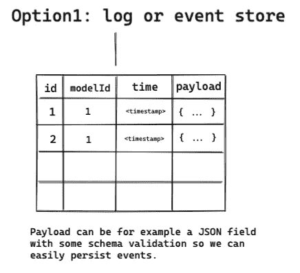
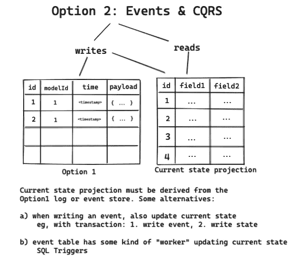

# CRUD 表需要被淘汰。

> 原文：<https://itnext.io/crud-tables-need-to-die-93d213b0d18a?source=collection_archive---------0----------------------->

## 大多数业务数据都需要一个(双)时态的、不可变的、基于事件的模型。为什么我们不默认这个呢？


许多 web 编程项目和特性都是从 CRUD(创建、读取、更新、删除)模型中的数据建模开始的。这是 Rails 或 Django 风格的框架和 ORM 中的默认设置。这是他们在 SQL 课程里教的。您有一个“事物”表，然后您可以插入、选择、更新、删除查询。这很简单，也很有效。直到有人问你上周有多少东西处于“foo”状态，包括那些从那以后被删除或改变状态的东西。

# 示例:贸易公司

先说个例子。Joe 决定创办一家名为“贸易公司”的电子商务公司，作为第一项业务，他用一些简单的状态机创建了一个订单表。让我们暂时忽略一些东西，比如账单、运输、产品和钱。Joe 启动了一个 web 框架，生成了第一个数据库表:

订单数据的 CRUD 表。使用基于 enum 的状态机。

经过一段时间的发展和运营，该贸易公司聘请了一批营销，运营，财务，商业分析师等。Joe 开始收到这样的请求:

*   **客户完成订单平均需要多长时间**？(订单状态:“待定”- >“已完成”)
*   **我们需要经常为客户编辑打错的信息吗？**(某些订单字段多久编辑一次？)
*   有人篡改了订单金额字段吗？(假设订单有一个`total_amount`列，或者我们可以从一个`order_rows`表中对其求和；不管是哪种方式，我们都不能轻易地从一个简单的 CRUD 表中分辨出它们是否被编辑过。)
*   **我们所有的退款真的是来自“已完成”的订单，还是之前我们也对一些“失败”的订单进行了退款？CRUD 失去了很多审计能力，这种能力不仅在业务用例中有用，在调试和错误修复中也很有用。**

这对 Joe 来说很尴尬，因为他无法回答这些问题，因为他的设计很粗糙。接下来，我们将研究几个不同的理论主题、行业术语以及从不同方向解决这个问题的术语。

# 尺寸缓慢变化

Joe 正在处理一个在某些圈子里被称为渐变维度(SCD)的问题。这意味着他正在处理变化相对缓慢且不可预测的数据点。这与“所有时间和可预测的”相反，在这种情况下，我们的系统可能已经以一种好的方式处理它了。现在，在我们的例子中，当订单被退款时，我们通过将它翻转到“已退款”来覆盖告诉我们该订单在某个点“已完成”的信息。实际上，CRUD 表中的任何更新也是如此，因为我们只存储任何列的当前状态。

幸运的是，有一个系统来思考 SCD 以及如何处理它们。在我们深入之前，请注意 SCD 是一个数据仓库概念，它们强调该领域的一些问题，而不是像我们的电子商务示例那样的在线交易系统。然而，这些差异并没有那么大。让我们列举不同的 SCD 案例:

*   第 0 类:永远不会改变的事实。 *出生日期，原始分数等。这里的想法是，这些是静态的事实，不会随着时间的推移而改变。轻松点。*
*   **类型 1:覆盖。** *又名 CRUD，或 Joe 正在做的事情。换个领域然后点击它。保存()！*
*   类型 2:改为添加新行。 *Joe 可以在 order 表中添加一个“version”列，并将所有更新转换为 INSERTs！我们已经进入了不可改变的、只能附加的领域……*

Type2 订单，order_id 不能再作为主键。

*   **类型 3:添加新列。** *对于某些字段，使用“原始值”或“先前值”和“当前值”等列可能更有意义。这很容易做到，但不是很强大。*
*   **类型 4:历史表。** *Joe 可以创建一个名为“orders_history”的表，并在每次订单发生变化时对其进行快照。这很好，因为他不需要改变原始的“订单”表，并且有许多现有的工具可以实现这一点。您可能听说过“变更数据捕获”，我们稍后会谈到这一点。*

这里的实现类似于 type1 和 type2:原始表只是常规的 type1 CRUD 表，而历史表看起来像我们的 type2 不可变的仅追加表。然后，我们只需将数据复制到历史表中(在事务内部！)每次有写操作。

*   **Type5:N/a .**短篇小说:type 5 不存在。说来话长，确实如此，但是类型有点不同。如果想更深入地了解这一点，可以对比一下 [*这些*](https://adatis.co.uk/introduction-to-slowly-changing-dimensions-scd-types/) [*两个*](https://www.kimballgroup.com/2013/02/design-tip-152-slowly-changing-dimension-types-0-4-5-6-7/) *来源。*
*   **类型 6** : **类型 1+2+3 = 6 的组合。他们在命名惯例上的确很聪明。我将推迟向 [*维基百科*](https://en.wikipedia.org/wiki/Slowly_changing_dimension) *解释这一点，因为它主要只是类型 2 的优化。***

# 变更数据捕获

在讨论 type4 历史表时，我们提到了变更数据捕获(CDC)。我们还提到有很多工具可以做到这一点。在我们的例子中，CDC 的目的是跟踪 CRUD 表的所有变化，这样我们就不需要在每次修改表中的内容时都手动进行。

进行 CDC 的一些巧妙方法包括读取 MySQL 的二进制日志或 PostgreSQL 的预写日志，它们可以用来精确跟踪 SQL 表中的所有更改。这一类别中流行的替代产品是 Debezium，它可以将一个变更日志从 CRUD 表传输到 Apache Kafka。正如你可能想象的那样，对于许多项目来说，这有点像核选项。一个更快的选择可能是使用 ETL/ELT 库，如 [Singer](https://github.com/singer-io) ，它们通常有许多不同的集成策略可用，可以将数据捕获到各种数据仓库产品中，如雪花、BigQuery 或 Redshift。

# ETL 与 ELT、OLTP 与 OLAP、数据湖与仓库

有些人谈论 OLTP(在线事务处理)和 OLAP(在线分析处理)。因此，您在 PostgreSQL 中的 CRUD 表是 OLTP，然后您通过 ETL 或 ELT(提取、加载、转换)将数据带到 OLAP 系统进行分析。那么这个 OLAP 系统是一个数据仓库、数据湖还是一个分析数据库呢？这要看情况，让我们来定义这些词:

*   **OLTP** :事务数据库，如 MySQL 或 PostgreSQL，通常运行您的生产应用程序。
*   **OLAP** :分析数据库，典型的是你用 CDC、ETL、ELT 加载数据的地方……*参见:数据仓库*
*   **数据湖**:以非常原始的格式转储数据的地方，主要供数据科学家和数据工程师使用。*工具示例:S3、拼花地板、Avro、…*
*   **数据仓库**:放置具有良好查询功能的结构化数据的地方。也适用于业务分析师，而不仅仅是技术人员。*例子:雪花，红移，BigQuery。*
*   **ETL** :读取数据，处理数据，将数据索引到数据仓库。*例子:CDC 将原始数据带到 Kafka，在将数据加载到数据仓库之前，经过几个非平凡逻辑步骤的处理和组合。*
*   ELT :读取数据，将它原样转储到某个地方，在分析系统中进行进一步的处理。*示例:CDC 将原始数据从 OLTP 转换为 BigQuery，并使用 SQL 进行进一步转换。*

[安德森·霍洛维茨对 2020 年的行业做了一个很好的分析](https://a16z.com/2020/10/15/the-emerging-architectures-for-modern-data-infrastructure/)如果你想了解更多信息。他们还解释了 [ETL 与 ELT](https://www.youtube.com/watch?v=voC0ewDeltA) 的区别，如果你想知道更多关于这种区别的话。这里的要点是，你可以继续在生产中进行 CRUD，只需将更改历史转储到你的工具中(湖、仓库、OLAP，谁在乎呢…)的选择。但你需要投资相当多的额外的铃铛和口哨来做到这一点。

# 活动采购和 CQRS

事件源的基本思想是，我们不是直接改变 CRUD 表，而是将*事件*生成到某种日志、流或事件存储中，然后作为这些*事件的结果，*我们可以在某处改变*状态*，比如在 CRUD 表中。*状态*总是必须直接从事件中导出，以便在任何时候都可以重新计算。



持续事件。在我们的例子中,“modelId”指的是“订单 Id”。

因此，基本上有两种选择:1)写&读事件或 2)写*事件*并从*投影(*即本例中的*状态**)。*



命令查询责任分离(CQRS)只是一种把你的读和写放在不同地方的花哨说法。如果没有 CQRS，读取将只是读取事件流。然而，对于 CQRS，写操作进入事件存储，读操作进入从事件流/日志维护的*投影(状态)*表。

可以想象，这里有各种各样的实现方法。我们的例子只是实现事件采购和 CQRS 的一种方式。通用的解决方案是写入某种类型的事件流，读取投影(甚至可能不是表)。事件可以在一个表中，也可以在一些事件队列系统中。您可以在事务数据库中使用事务来实现一致性，或者当某个工作者从队列中读取事件，然后创建状态投影时，您可能最终会实现一致性。等等。然而，Joe 也许可以用`order_events`和`order_state`表走得很远。

# 时间建模

在时态数据库中，我们存储与时间相关的数据。例如，在我们的 Orders 表中，我们可以有一个订单到达时间的时间戳。也许我们可以使用上面描述的方法之一，用时间戳存储订单状态的转换，这样我们就知道何时发生了变化。然而，时间和历史不止一个维度。

*   **有效时间**是现实世界中某个事实为真的时间段。
    **1992 年乔住在哪里？”
    “客户什么时候下的订单？”**
*   ***事务时间**是在数据库中记录事实的时间。
    *“1992 年，数据库认为乔住在哪里？”
    “我们什么时候把订单写到数据库的？”**
*   ***决策时间**是对事实做出决策的时间。
    *“我们什么时候知道了 1992 年乔的家乡？”
    “我们什么时候意识到需要将订单写入数据库？”**

*这可能看起来像是吹毛求疵，但是请考虑下面这种相当常见的财务审计情况，它需要一个**双时态**(有效时间+交易时间)建模:*

1.  *“请现在从系统中报告 2016 年 1 月以来的销售情况，包括此后对数据的所有修正”*
2.  *“请报告 2016 年 1 月的销售额，因为最初是在 2016 年 2 月 1 日报告的”(因此不包括从那时到现在的数据修正)*

*如果 Joe 决定使用某种不可变的基于事件的系统，如 SCD type2 或 type4 表或事件源，他将遇到一个问题。如果数据是不可变的，那么如何修复数据库中已经存在的错误呢？双时态建模解决了这个问题，因为您可以在事件、行或快照中声明信息为真时的有效时间*和信息写入数据库时的事务时间*。现在，您可以通过向新事件/行/快照添加一个到达过去的*有效时间范围*和`now()`的*事务时间*来写入过去。你可以拥有永恒不变的蛋糕，也可以吃掉它。***

*例如:假设订单(id=123)在数据库中标记为“2020-01-01 完成”，但我们后来发现该订单实际上已经在 2019 年退款。对于 SCD 类型 2 表中的双时间建模，我们可以用以下方式表达这种情况:*

```
*| order_id | valid_from | transaction_time | order_state | 
|========================================================|
| 123      | 2020-01-01 | 2020-01-01       | "completed" |
| 123      | 2019-11-28 | 2021-09-07       | "refunded"  |*
```

*不过这确实需要仔细读取数据，我们可能还需要在那里添加一个可变的`valid_to`列(或者使用一个更好的方案或者一个为我们处理双临时的系统)。*

# *从理论到实践:乔要做什么？*

*既然 Joe 不能及时回到过去并修复他的数据库模型，这就引出了一个问题，为什么我们总是首先制作丢失业务关键信息的 CRUD 表？他可以用我们上面描述的几种不同的选择来创建贸易公司，他可以很容易地从他的同事那里找到问题的答案。*

*幸运的是，根据我们目前所了解的一切，我们可以指导 Joe 采取他喜欢的解决方案，这样他至少可以从现在开始保存贸易公司的数据。无论是他当前 PostgreSQL 数据库中的事件源或 SCD，还是具有 CDC +成熟分析堆栈的更大项目，Joe 的同事都可以在未来获得答案。*

## *为什么我们不默认使用仅追加(双)时态数据存储？*

*由于我们无法预测业务数据的所有未来用例，这就引出了一个问题，为什么我们不总是从不可变的、仅追加的、双时态的数据模型开始，这种模型不会丢失信息，从而支持大多数用例？如果性能是一个因素，那么我们总是可以在那些罕见的情况下选择退出这些功能。*

*为什么流行的 web 框架止步于 CRUD，而把其他的都变成了粘在上面的插件、第三方库或 DIY 的东西？为什么感觉像是“危险的，只有在万不得已的情况下才使用”的方法是标准的，也是每个入门教材所教授的？世界上有哪些企业不需要可审计性、可靠的财务报告、历史分析等？？为什么像 WooCommerce 这样的流行电子商务框架完全忽略了这些概念(他们的订单模型实际上只是一个 CRUD 表)？*

*幸运的是，我们有很多方法来设计我们自己摆脱这种混乱……对于那些有兴趣购买摆脱这种混乱的方法的人来说，有很多有趣的发展正在发生。*

## *数据库支持*

*虽然用户可以在大多数数据库上实现(双)时态建模，但我们开始在一些产品中看到原生支持。*

*   *[SQL:2011](https://en.wikipedia.org/wiki/SQL:2011) 包含简单时态建模的基本原语，支持我的许多数据库，如 MariaDB、PostgreSQL(扩展)、Oracle 12c、Microsoft SQL、IBM DB2、SAP HANA、CockroachDB*
*   *[Datomic](https://www.datomic.com) 提供了一个只附加的时态数据库，它也支持双时态建模*
*   *[XTDB](https://xtdb.com/main/index.html) (以前: [Crux](https://opencrux.com) )是一个新的时态数据库，支持双时态*
*   *像 BigQuery、RedShift、Snowflake 这样的数据仓库工具倾向于在仅追加逻辑上操作，这意味着行不应该被更新或删除(即使您可能能够这样做)。*

# *结论*

*是时候让 CRUD 表寿终正寝了。也许他们有一些用例，但它们不应该成为通行的标准。是时候默认面向未来的解决方案，停止覆盖有价值的业务数据了。幸运的是，我们有很多工具可以使用，而这篇文章只是触及了皮毛。*

> *我会写更多关于这里提到的各种主题的文章，所以请点击“鼓掌并继续关注:)*