# CSS 对齐变得简单

> 原文：<https://itnext.io/css-alignment-made-simple-41994049afaf?source=collection_archive---------2----------------------->

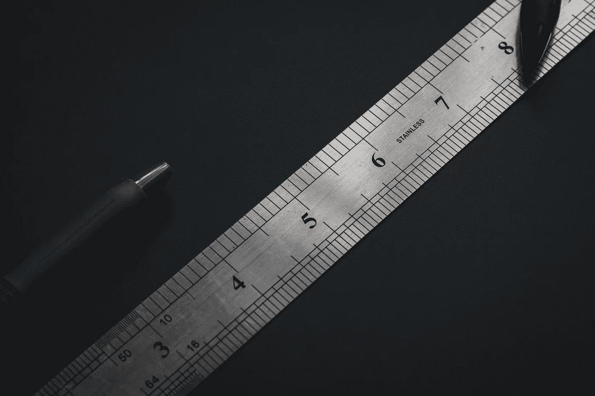

由 [Ashkan Forouzani](https://unsplash.com/@ashkfor121?utm_source=unsplash&utm_medium=referral&utm_content=creditCopyText) 在 [Unsplash](https://unsplash.com/s/photos/math?utm_source=unsplash&utm_medium=referral&utm_content=creditCopyText) 上拍摄

对于我们许多人来说，CSS 被视为 web 开发的障碍。大多数时候，看起来即使你遵守了规则，一切似乎都很清楚，它仍然没有按照你想要的方式工作。

因此，本文的目的是使 CSS 的一些特性更容易理解。

我现在要解决的问题是元素的对齐。

事不宜迟，这里是一些最常见的场景，人们可能会遇到这个话题，以及如何处理它们。

大多数 CSS 东西的基石，包括这个，是[盒子模型](https://www.w3schools.com/css/css_boxmodel.asp)。

记住这一点，我们可以将用例分成两类。第一种是当我们有一个盒子(容器)时，我们想把里面的所有元素都放在同一个位置。第二种情况是，我们有一个容器，我们想改变一个元素的位置，而不影响其他元素。

这两个类别的区别在于，在第一个类别中，我们对盒子(容器)应用 CSS 规则，在第二个类别中，我们对子元素应用 CSS 规则。

# 在容器内定位元素

为了在容器内定位元件， [flex-box](https://css-tricks.com/snippets/css/a-guide-to-flexbox/) 是最方便的。它易于使用，并带有跨浏览器支持。

## 案例一

一个常见的场景包括类似导航的东西，我们希望将所有元素垂直居中。

更准确地说，我们希望从第一幅图像中的内容转移到第二幅图像中的内容。

从这个

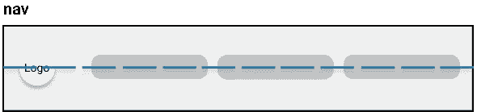

对此

为此，我们可以将容器显示为一个 **flex-box** 并利用`align-items`属性。

`[align-items](https://developer.mozilla.org/en-US/docs/Web/CSS/align-items)`是定义伸缩项如何在当前行沿[**横轴**](https://developer.mozilla.org/en-US/docs/Web/CSS/CSS_Flexible_Box_Layout/Aligning_Items_in_a_Flex_Container) 布局的属性。

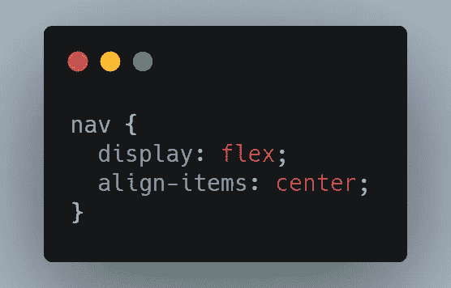

[生](https://carbon.now.sh/?bg=rgba%28171%2C+184%2C+195%2C+1%29&t=seti&wt=none&l=css&ds=true&dsyoff=20px&dsblur=68px&wc=true&wa=true&pv=16px&ph=27px&ln=false&fl=1&fm=Hack&fs=14px&lh=133%25&si=false&es=2x&wm=false&code=nav%2520%257B%250A%2520%2520display%253A%2520flex%253B%250A%2520%2520align-items%253A%2520center%253B%250A%257D)

## 案例二

继续上面的例子，我们现在把元素放在横轴的中心，但是我们想把内容分开。我们希望左边有**标志**和**标题**，右边有**导航按钮**。

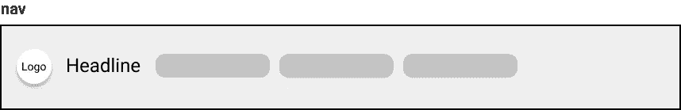

从这个

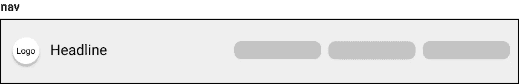

对此

最简单的方法是将每个部分的内容添加到一个包装器中，并在左边的包装元素上设置`flex`属性。这将导致左侧包装元件扩展并占据整个可用宽度。

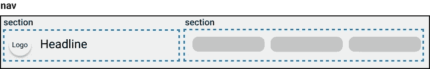

将每个部分包装在一个新元素中

这是 HTML 和 CSS 中的通讯器。

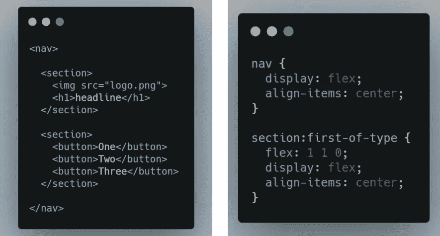

[左](https://carbon.now.sh/?bg=rgba%28171%2C+184%2C+195%2C+1%29&t=seti&wt=none&l=htmlmixed&ds=true&dsyoff=20px&dsblur=68px&wc=true&wa=true&pv=16px&ph=27px&ln=false&fl=1&fm=Hack&fs=14px&lh=133%25&si=false&es=2x&wm=false&code=%253Cnav%253E%250A%2520%2520%250A%2520%2520%253Csection%253E%250A%2520%2520%2520%2520%253Cimg%2520src%253D%2522logo.png%2522%253E%250A%2520%2520%2520%2520%253Ch1%253Eheadline%253C%252Fh1%253E%250A%2520%2520%253C%252Fsection%253E%250A%2520%2520%250A%2520%2520%253Csection%253E%250A%2520%2520%2520%2520%253Cbutton%253EOne%253C%252Fbutton%253E%250A%2520%2520%2520%2520%253Cbutton%253ETwo%253C%252Fbutton%253E%250A%2520%2520%2520%2520%253Cbutton%253EThree%253C%252Fbutton%253E%250A%2520%2520%253C%252Fsection%253E%250A%2520%2520%250A%253C%252Fnav%253E) — [右](https://carbon.now.sh/?bg=rgba%28171%2C+184%2C+195%2C+1%29&t=seti&wt=none&l=css&ds=true&dsyoff=20px&dsblur=68px&wc=true&wa=true&pv=16px&ph=27px&ln=false&fl=1&fm=Hack&fs=14px&lh=133%25&si=false&es=2x&wm=false&code=nav%2520%257B%250A%2520%2520display%253A%2520flex%253B%250A%2520%2520align-items%253A%2520center%253B%250A%257D%250A%250Asection%253Afirst-of-type%2520%257B%250A%2520%2520flex%253A%25201%25201%25200%253B%250A%2520%2520display%253A%2520flex%253B%250A%2520%2520align-items%253A%2520center%253B%250A%257D)

如果您想知道为什么左边的部分是一个灵活的盒子，并且具有与`nav`相同的属性，那么检查下一个场景，它与第一个非常相似。

## 案例三

在这个场景中，我们有一对两个元素，并且两个或至少一个都以[块](https://www.w3schools.com/cssref/pr_class_display.asp)模式显示，我们希望以内嵌模式显示它们。
换句话说，我们有两个元素，一个在另一个下面，我们想一个接一个地显示它们。

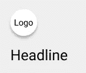

从这个

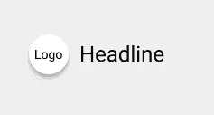

对此

解决方案是将它们添加到一个容器中，并使用与上面相同的规则:`display:flex`和`align-items:center`(这是可选的，如果您想将它们放在横轴的中心，可以使用它)

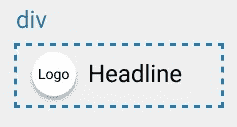

将它们放置在包装元件内

## 案例四

另一个常见的对齐选项是让所有内容水平和垂直居中。

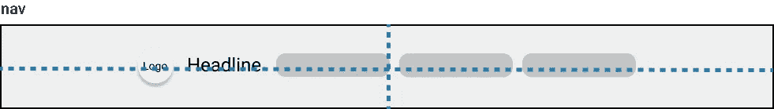

在 X 轴和 Y 轴上居中

类似于`align-items`我们有`justify-content.`

*   `align-items` —用于定义横轴(Y 轴)上的对齐
*   `justify-content` —用于定义主轴(X 轴)上的对齐

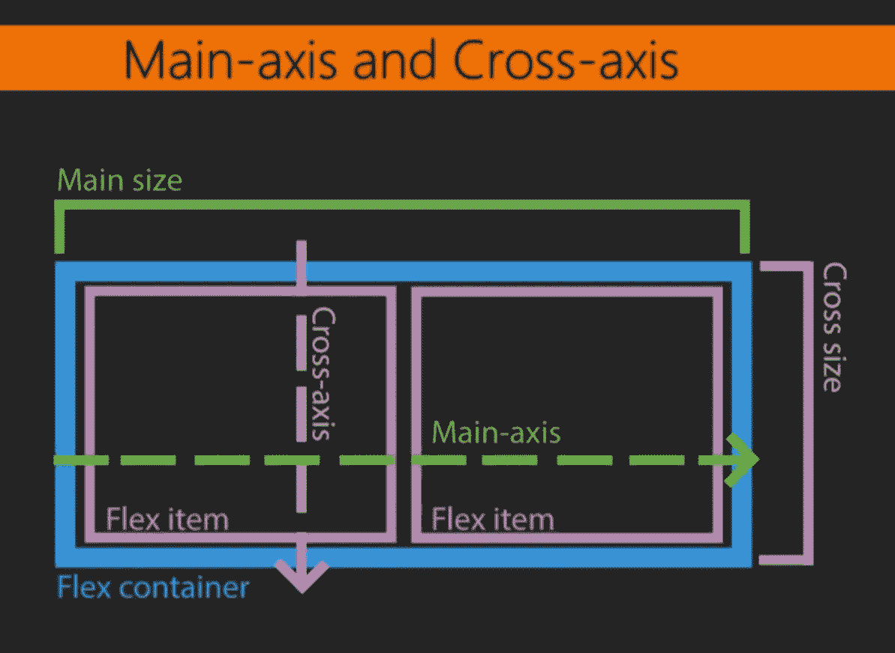

[来源](https://www.oreilly.com/library/view/mastering-css/9781787281585/e13a0b13-1d1b-4ace-aa36-ea7c18442213.xhtml)

用于此目的的 CSS 和 HTML 代码如下:

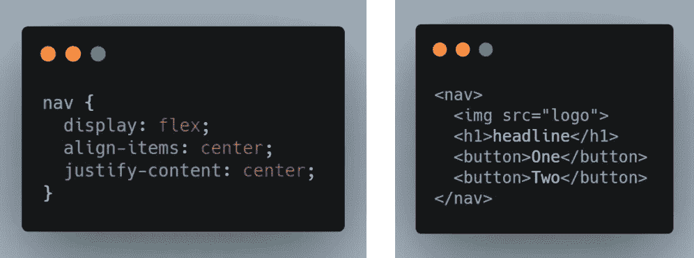

[左](https://carbon.now.sh/?bg=rgba%28171%2C+184%2C+195%2C+1%29&t=seti&wt=none&l=htmlmixed&ds=true&dsyoff=20px&dsblur=68px&wc=true&wa=true&pv=21px&ph=18px&ln=false&fl=1&fm=Hack&fs=14px&lh=133%25&si=false&es=2x&wm=false&code=%253Cnav%253E%250A%2520%2520%253Cimg%2520src%253D%2522logo%2522%253E%250A%2520%2520%253Ch1%253Eheadline%253C%252Fh1%253E%250A%2520%2520%253Cbutton%253EOne%253C%252Fbutton%253E%250A%2520%2520%253Cbutton%253ETwo%253C%252Fbutton%253E%250A%253C%252Fnav%253E) - [右](https://carbon.now.sh/?bg=rgba%28171%2C+184%2C+195%2C+1%29&t=seti&wt=none&l=css&ds=true&dsyoff=20px&dsblur=68px&wc=true&wa=true&pv=21px&ph=18px&ln=false&fl=1&fm=Hack&fs=14px&lh=133%25&si=false&es=2x&wm=false&code=nav%2520%257B%250A%2520%2520display%253A%2520flex%253B%250A%2520%2520align-items%253A%2520center%253B%250A%2520%2520justify-content%253A%2520center%253B%250A%257D)

# 在容器内定位特定元素

第二类用例较少，通常发生在我们希望将一个项目放在容器的中心，但不同于其他内容的时候。

让我们从下面的例子开始:

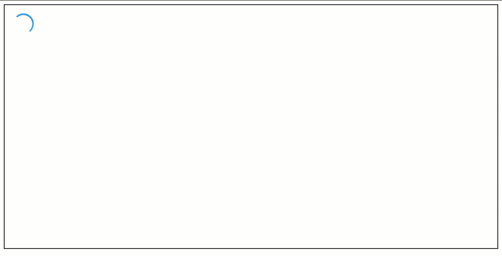

我们有一个[微调器](https://loading.io/css/)，它表示某件事情正在进行中，过一会儿，微调器消失，内容显示出来。

文本没有特定的对齐方式，只有微调器。因此，我们只需在不影响其他元素的情况下操作微调器。

在这种情况下，最简单的 CSS 规则是**位置、左/上、**和**变换。**

我们将首先尝试使它在 X 轴上居中，然后在 Y 轴上居中，最后在两个轴上都居中。

该微调器的 HTML 如下所示:

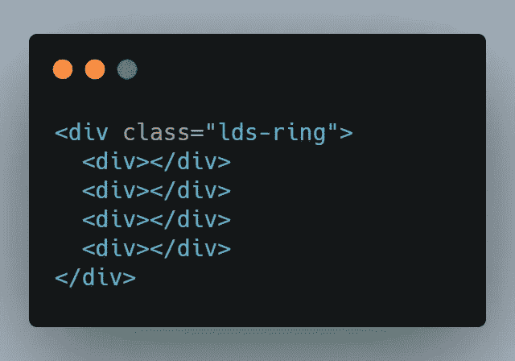

[原始](https://carbon.now.sh/?bg=rgba%28171%2C+184%2C+195%2C+1%29&t=seti&wt=none&l=htmlmixed&ds=true&dsyoff=20px&dsblur=68px&wc=true&wa=true&pv=21px&ph=18px&ln=false&fl=1&fm=Hack&fs=14px&lh=133%25&si=false&es=2x&wm=false&code=%253Cdiv%2520class%253D%2522lds-ring%2522%253E%250A%2520%2520%253Cdiv%253E%253C%252Fdiv%253E%250A%2520%2520%253Cdiv%253E%253C%252Fdiv%253E%250A%2520%2520%253Cdiv%253E%253C%252Fdiv%253E%250A%2520%2520%253Cdiv%253E%253C%252Fdiv%253E%250A%253C%252Fdiv%253E)

## 在 X 轴上居中

为了以 X 轴为中心，我将用这些规则在包装`div`元素上添加一个名为`center-x`的类。

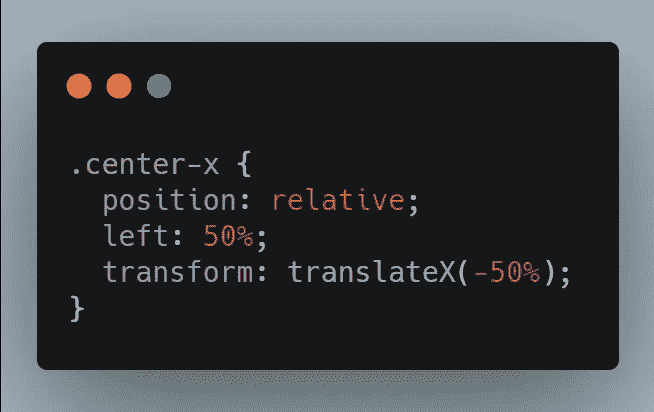

[未加工的](https://carbon.now.sh/?bg=rgba%28171%2C+184%2C+195%2C+1%29&t=seti&wt=none&l=css&ds=true&dsyoff=20px&dsblur=68px&wc=true&wa=true&pv=21px&ph=18px&ln=false&fl=1&fm=Hack&fs=14px&lh=133%25&si=false&es=2x&wm=false&code=.center-x%2520%257B%250A%2520%2520position%253A%2520relative%253B%250A%2520%2520left%253A%252050%2525%253B%250A%2520%2520transform%253A%2520translateX%28-50%2525%29%253B%250A%257D)

下面是他们每个人做的事情:

*   `position:relative` —必需，因为我们希望相对于元素的正常位置来定位元素
*   `left:50%` —设置**左边缘**位置，单位为包含元素的%
*   `transform: translateX(-50%)` —将项目向相反方向(左侧)移动一半宽度

由于`left:50%`设置了在页面上开始绘制元素的位置，即父元素宽度的一半(50%)，它看起来像这样:

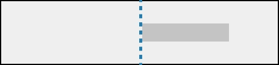

元素的左边缘为 50%

为了使它居中，我们必须把它的一半宽度移到另一边。

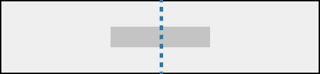

这些 CSS 规则将反映在以下更新中:

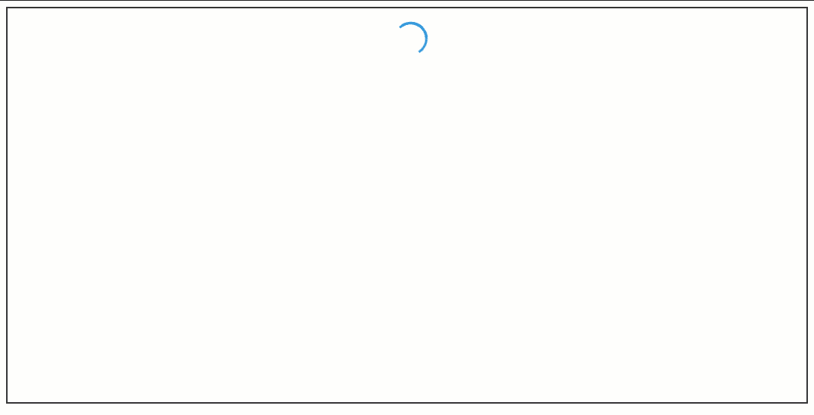

以 X 轴为中心

## 在 Y 轴上居中

为了使其在 Y 轴上居中，我们只需要从`left`切换到`top`以及从`translateX`切换到`translateY`。

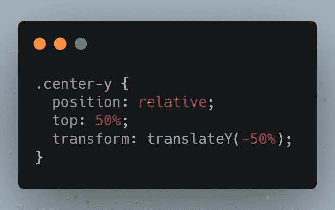

[生](https://carbon.now.sh/?bg=rgba%28171%2C+184%2C+195%2C+1%29&t=seti&wt=none&l=css&ds=true&dsyoff=20px&dsblur=68px&wc=true&wa=false&pv=21px&ph=18px&ln=false&fl=1&fm=Hack&fs=14px&lh=133%25&si=false&es=2x&wm=false&code=.center-y%2520%257B%250A%2520%2520position%253A%2520relative%253B%250A%2520%2520top%253A%252050%2525%253B%250A%2520%2520transform%253A%2520translateY%28-50%2525%29%253B%250A%257D)

还有 UI 上的更新…

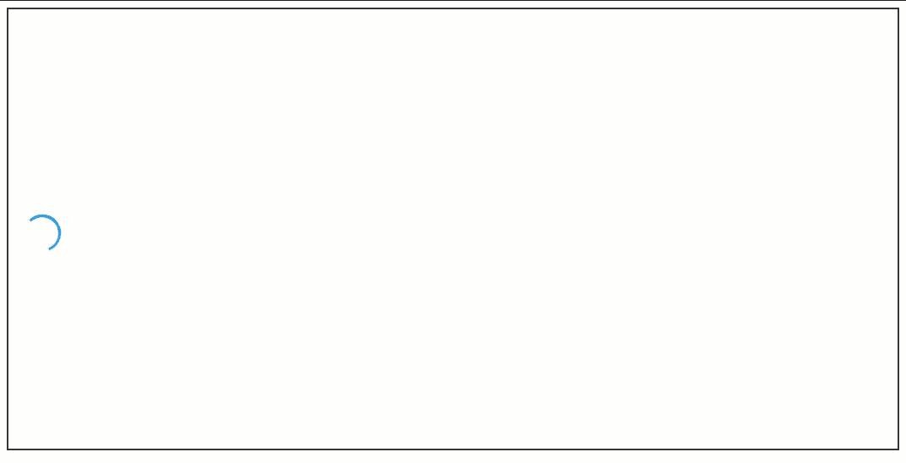

在 Y 轴上居中

## 将两个轴居中

最后，为了使它在两个轴上居中，我们需要结合上述两个 CSS 规则。

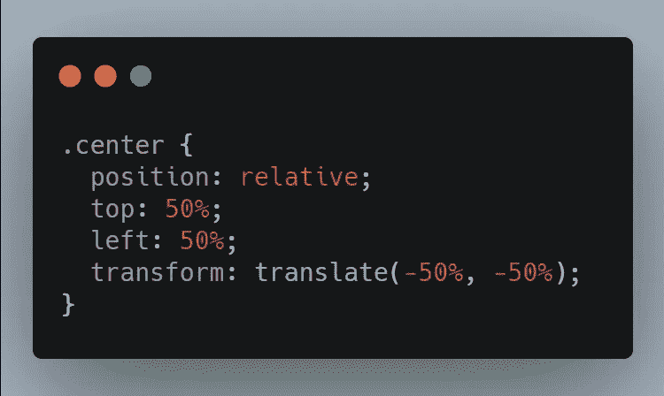

[生](https://carbon.now.sh/?bg=rgba%28171%2C+184%2C+195%2C+1%29&t=seti&wt=none&l=css&ds=true&dsyoff=20px&dsblur=68px&wc=true&wa=false&pv=21px&ph=18px&ln=false&fl=1&fm=Hack&fs=14px&lh=133%25&si=false&es=2x&wm=false&code=.center%2520%257B%250A%2520%2520position%253A%2520relative%253B%250A%2520%2520top%253A%252050%2525%253B%250A%2520%2520left%253A%252050%2525%253B%250A%2520%2520transform%253A%2520translate%28-50%2525%252C%2520-50%2525%29%253B%250A%257D)

这里的`position:relative`可以用`position:absolute`来代替，如果我们有其他的内容会影响元素的位置，我们会把它们放在中间。但是因为在加载过程中，除了微调器之外，我们不显示任何东西，所以我们可以使用相对位置。

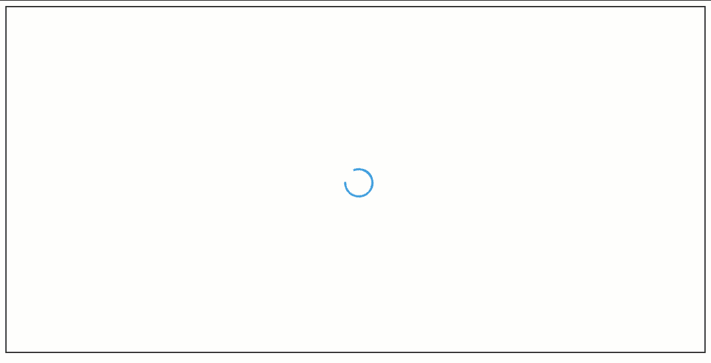

在两个轴上居中