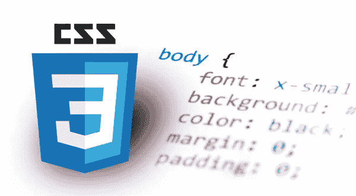
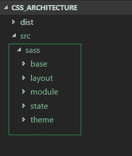
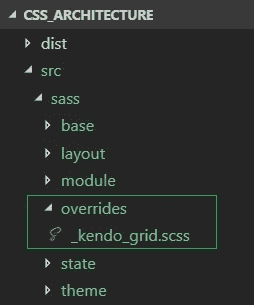
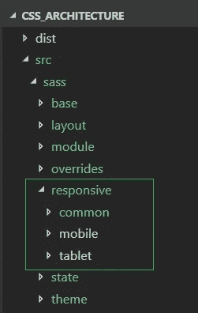
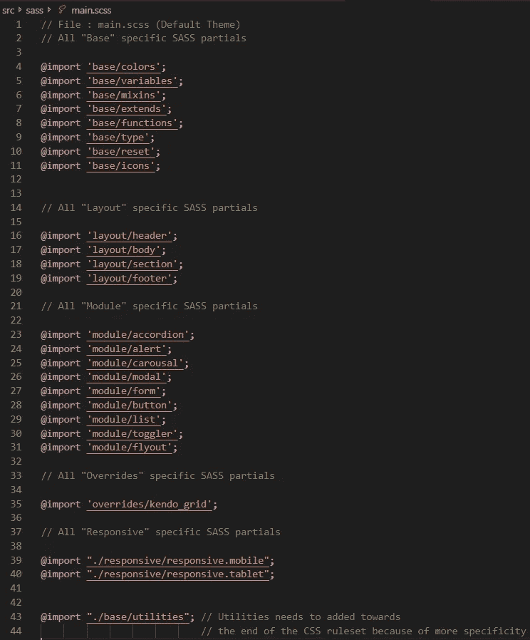
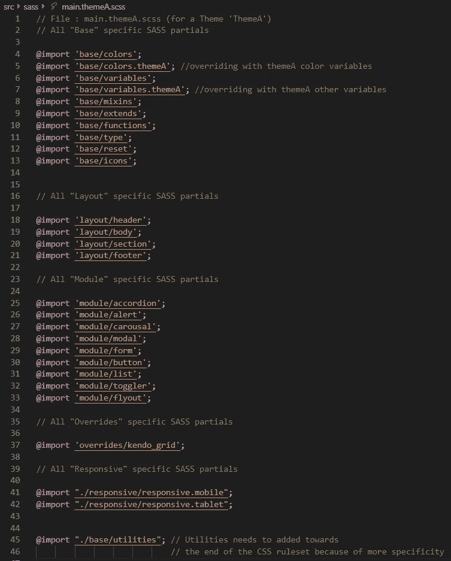

# 带有 SASS、SMACSS 和 BEM 的 CSS 架构。

> 原文：<https://itnext.io/css-architecture-with-sass-smacss-and-bem-cc618392c148?source=collection_archive---------1----------------------->



CSS，*层叠样式表*，是一种在浏览器中设计或呈现 HTML 标记的语言，我们都知道，至少软件/IT 领域的人知道。CSS 使得任何网站的外观和感觉都很吸引人。但是 CSS 不止于此。

在 web 应用程序中，CSS 只是 C#、Java、JavaScript、HTML、SQL 等不同技术中的一种。每一种都有自己的实现方式，并且是特定技术要求所必需的。所有这些都同样重要，都有特定的作用。

大多数时候，我看到 CSS 开发在应用程序开发生命周期中被忽视，被认为是理所当然的。但从长远来看，它可能会严重影响应用程序的性能以及 CSS 代码库的可维护性，尤其是对于大型应用程序。

因此，我想写下我在处理一些大规模应用程序时的经验，以及我们如何使用方法学来管理我们的 CSS 代码库— **SMACSS 和 BEM** 以及 CSS 预处理器 **SASS。** *此外，我还将展示如何在****SMACSS****和****BEM****之上添加我的约定，以实现其他需求，如语言支持、响应性、第三方 CSS 覆盖等。*

> 这篇文章更多的是解释我们应该如何在我们的 CSS 代码库中一起利用**smacs**、 **BEM** 和 **SASS** ，而不是这些主题提供了什么。但是，在展示它的实现之前，我将简要介绍一下这些。
> 
> 要详细了解这些话题，请查看他们的官方网站[**【SMACSS】**](https://smacss.com/)**[**BEM**](http://getbem.com/)和 [**SASS**](https://sass-lang.com/) 。**

## **这篇文章的要点是:**

1.  **对 **SMACSS** 、 **BEM、**和 **SASS 的快速概述。****
2.  **在 **BEM** 和 **SMACCS 之后带有 **SASS** 的 CSS 代码库。****

# **SMACSS、BEM 和 SASS 的快速概述。**

> **我必须对 SMACSS 和 BEM 说，我确信当你们阅读详细的文档时，你们中的大多数人会意识到你们已经在有意或无意地遵循类似的指导方针。但是一旦你读完了文档，它将会促进你的思维过程，并使它们更符合正确的方向或位置。**

## **SMACSS**

**SMACSS 代表**CSS 的可扩展和模块化架构**是一套对 CSS 规则集进行分类的指导方针，以使 CSS 代码库可扩展和模块化。它不是一项技术或实用工具，它只是一套黄金法则，或者你可以说是编写 CSS 的指导方针。**

**根据 SMACSS 原则，我们可以将我们的 CSS 规则集分为这五个类别——**基础、布局、模块、状态**和**主题**。**

****Base —** 所有 CSS 规则集都属于 ***Base*** 规则，这些规则集用于为页面中所有出现的 HTML 元素提供默认样式。我们不使用`class`或`id`选择器来定义这些规则集，而是使用`element` `descendent` 选择器，或`child` 选择器，以及任何伪类。**

**有时，我们也称之为 CSS 重置，以重置 HTML 元素的默认样式。这些规则集通常写在其他 CSS 规则集之上。**

****布局—** 根据 **SMACSS** 原则，一个页面中的所有 UI 元素或组件都可以分为两组—*主要的*和*次要的* UI 组件。主要组件是定义页面结构的组件，一般不会在页面中重复出现，如`headers` *、*、`footers`、*、*、`sidebar`、、`body`、*等。*这些主要组件构成了页面布局，因此，被称为 ***布局*** 规则。**

**另一方面，位于主要组件下的次要组件被称为 ***模块，在下一节中讨论*** 。**

****模块——模块**是单独分离的不同 UI 组件。如上所述，它位于布局组件内部，也位于模块本身内部。它独立于其他 UI 模块或布局。一些非常常见的例子有`accordion`、`modal`、`button`、`carousal`等。**

**CSS 规则集基本上是为 UI 组件的不同状态定义样式。这些基本上覆盖了 UI 模块的默认样式。**

***例如* *—消息可能处于成功或错误状态。***

**由于我们在下一节也要讨论 **BEM** 方法论，你应该知道 BEM 中的 **M(修饰)**基本上就是 SMACSS 中的**态**。**

**CSS 规则集基本上是为了创建特定于主题的样式。它们主要用特定于主题的属性覆盖默认颜色和图像。**

**我们不需要在每个应用程序中都有主题，正因为如此，它们没有被包含在核心类型中。**

## **不列颠帝国勋章**

**BEM 或 Block-Element-Modifier 是一种方法论，它告诉我们如何正确地给 CSS 类命名约定。这将导致创建模块化和可重用的 UI 组件。**

**根据定义—**

> ****块**是独立的实体，其本身是有意义的。虽然块可以嵌套并相互交互，但语义上它们保持相等；没有先后或等级之分。没有 DOM 表示的整体实体(比如控制器或模型)也可以是块。**
> 
> ****元素**是程序块的一部分，没有独立的含义。**
> 
> ****修饰符**是块或元素上改变外观、行为或状态的标志。**

**BEM 有助于将设计中的 UI 组件可视化，并将其分为`Block`、`Element`和`Modifier`。**

**让我们举一个设计的例子，看看如何把它形象化成`Block`、`Element`和 `Modifier`。**

**出于解释的目的，我拍摄了一张***Medium.com***主页的快照，如下所示，并将内容分成五个部分(*高亮显示*)**

********

**正如您在上面看到的，所有这五个部分都可以被视为 UI 块( **B** )，每个块中的内容将是该块的元素( **E** )。有趣的是，如果你注意到所有这些块在内容方面几乎是相似的。这些块分别具有一个`*image*`、一个`*title*` *、一个* `*description*` *、* `*author name*` *、一个* `*date*` 和 *`*read time*`*元素(E)。这仅仅意味着我们只需要开发一个这样的块，并在这五个地方重用它。****

****但是等等，这些区块在视觉上并不相似。对于块(1)和块(5)，图像在顶部，并且对于块(1)，图像比块(5)稍大。而块(2)、(3)和(4)在其左侧具有图像，并且与块(1)和(5)不同，它缺少其内部的元素。这就是修饰语( **M** )出现的地方。我们将使用一个修饰符( **M** )在我们看到基础设计的变化或修改的地方。****

****这就是我们通常如何分解一个给定的视觉设计，并将它们识别为**块**、**元素**和**修饰符**。在识别出不同的 UI 块并找出我们可以在哪里利用同一个块而不做什么修改或变化之后，我们可以开始创建 HTML/UI 标记和 CSS 规则集，记住 **BEM** 模型。****

# ****厚颜无耻****

******SASS** ，又名**语法上令人敬畏的样式表**是一个 CSS 扩展，具有许多多种功能，可以在很大程度上帮助管理和优化您的 CSS 代码库。还有其他这样的 CSS 预处理器，像 [**LESS**](http://lesscss.org/) ，[**Stylus**](http://stylus-lang.com/)**也可以作为 SASS 的替代。******

******您可以用 **SASS** 方式编写 CSS，并将其保存在`.sass`或`.scss`文件扩展名中。您需要在您的系统上安装 **SASS** 来从 SASS 生成最终的 CSS。更多详情，请访问[官方网站](https://sass-lang.com/)。******

******我将只列出 **SASS** 提供的关键特性，并告诉他们在开发 CSS 代码库时如何有用。******

> ********语言扩展像**`***variables***`**`***nesting***` **&**`***mixins***`**。**********

```
******.block{
     position:relative;
     background-color:#ccc;
     height:100px;
     width:100px;
}.block__header{
     font-size:18px;
     line-height:1;
     color:#444;
}.block__description{
     font-size:14px;
     padding:10px 0;
     color:#444;
}******
```

******上面的 CSS 代码片段可以使用如下所示的 SASS 语法编写，它展示了如何应用像`nesting`、`variables`和`mixins`这样的特性。******

```
********$primary-font-color** : #444;**@mixin** **mix-square**($val) {
    height: $val;
    width: $val;
}.block{
     position:relative;
     background-color:#ccc;
     **@include mix-square**(100px);&__header{
         font-size:18px;
         line-height:1;
         color:**$primary-font-color**;
     }&__description{
         font-size:14px;
         padding:10px 0;
         color:**$primary-font-color**;
     }
}******
```

******`nesting`帮助我在上面的代码中把‘block’和类连接起来，而不用重复多次。如果你遵循像 **BEM、**等方法学，它有助于更快地编写你的 CSS 代码和分组类。******

******`$primary-font-color` 是定义用来保存字体颜色的变量，以便在不同的地方使用。类似地，您可以定义多个变量来存储一些重要的 CSS 属性，这些属性对于设计来说是非常具体的&并且是重复的。不要只是创建变量来存储随机的 CSS 属性。它必须是合理的。在变量中包含特定的 CSS 属性的主要优点是，它可以在一个地方轻松更新，并且更改可以应用到整个系统。******

******`@mixin mix-square` 是创建 SASS mixin 的语法。这里，`mix-square`是我创建的 mixin 的名称，它通过传递维度来生成一个正方形。此外，在创建 mixin 之前，您需要明智地思考。******

> ********使用@import 规则创建 SASS partials 和 combine 的能力********

******您可以创建多个 SASS 文件来设计特定的 UI 或对相似的 CSS 规则集进行分组。这将帮助你根据你的需求和架构将一个巨大的 CSS 代码库分成小的`.sass`或`.scss`文件或片段。稍后，您可以将它们全部或部分合并成一个单独的 SASS 文件，并从中生成 CSS 文件。******

******例如——我们可以有一个`main.scss`文件，它包括下面不同 UI 特定 sass 文件的 SASS 部分******

```
******@import "./module/form";
@import "./module/grid";
@import "./module/button";
@import "./module/accordion";******
```

> ********高级功能如** [**控制指令**](https://sass-lang.com/documentation/file.SASS_REFERENCE.html#control_directives__expressions) **为库********

******使用 SASS，您可以添加控制逻辑，如`if-else`条件、`for/each`循环等。******

> ********格式良好、可定制的输出********

******SASS 中有在 SASS 到 CSS 转换期间格式化 CSS 代码的配置。你可以得到任何一种格式的 CSS 代码——嵌套[、](https://sass-lang.com/documentation/file.SASS_REFERENCE.html#nested)[扩展](https://sass-lang.com/documentation/file.SASS_REFERENCE.html#expanded)、[压缩](https://sass-lang.com/documentation/file.SASS_REFERENCE.html#compact)和[压缩](https://sass-lang.com/documentation/file.SASS_REFERENCE.html#compressed)。******

# ******带有 SASS、BEM 和 SMACCS 的 CSS 代码库******

******在这一节中，我将展示我通常如何利用 SASS 并遵循 BEM 和 SMACSS 原则来开发我的 CSS 代码库。我还将展示我在这些基础上应用的一些惯例，以实现其他重要的需求，如—*、 ***第三方控制覆盖、RTL*** (从右到左)等。*******

******我并不完全遵守这些指导方针，而是将这些方针与我的一些方针结合起来以满足我的需要。******

> ********逐步设置********

******1.通常从搭建萨斯/SCSS 代码库开始，遵循 SMACSS 原则，将样式分为五类——基础、布局、模块、状态和主题。******

************

******2.根据项目需要，开始在这些文件夹中添加`.scss`文件或片段。这个文件夹结构帮助我将 CSS 规则集分组，并在将它们添加到各自的文件夹之前创建`.sccs`文件或片段。******

******虽然每个项目的文件都不一样，但我会给你看一些我为自己的项目创建的非常常见的`.scss`文件，只是为了给你一个思路。******

******的类型。这些文件夹包含的 scss 文件如下—******

> ******`*base*`文件夹可能包含以下文件******

*   ********_colors.scss** : *所有保存 css 颜色值的 sass 变量。*******
*   ********_variables.scss** : *保存 css 值的所有 sass 变量。*******
*   ********_mixinss.scss** : *所有萨斯 mixin 都在这里。*******
*   ********_reset.scss** : *所有重置的 css 规则集都在这里。*******
*   ********_utils.scss** : *所有的实用 css 类都放在这里……*******
*   *******……..等等。*******

> ******`*layout*`文件夹中可能包含如下文件******

*   ********_header.scss** : *所有与****header****布局相关的 css 规则集。*******
*   ********_body.scss :** *所有与* ***页眉*** *布局相关的 css 规则集。*******
*   ********_section.scss :** *所有与* ***页眉*** *布局相关的 css 规则集。*******
*   ********_footer:scss :** *所有与* ***页眉*** *布局相关的 css 规则集。*******
*   ******……..等等。******

> ******`*module*`文件夹可能包含以下文件******

*   ********_accordion.scss** : *所有与****accordion****模块相关的 css 规则集。*******
*   ********_grid.scss** : *与* ***网格*** *模块相关的所有 css 规则集。*******
*   ********_modal.scss** : *所有与****modal****模块相关的 css 规则集。*******
*   ******……等等。******

> ******`*state*`我一般不会创建一个单独的**状态**特定文件夹或者。scss 文件。所有与我的状态相关的 CSS 规则集都是与它们各自的 UI 元素/模块一起创建的。但是如果你认为，你需要分离与**状态**相关的 CSS 规则集，那么你可以创建一个状态文件夹或文件。******
> 
> ******`*theme*`文件夹可能包含如下文件。如果你的站点或应用程序有多个主题，我们可以添加特定主题的 SASS 文件，用于生成特定主题的 CSS******

*   ********_ colors . themeA . scss**:*SASS 颜色变量，用于保存主题的特定颜色值等，比如说“themeA”。*******
*   ********_ variables . themeA . scss:***SASS 其他变量用于保存特定于主题的值等，比如说“themeA”。*******
*   ******…等等。******

******3.大多数情况下，您的应用程序或站点可能包含具有自己的 CSS 样式的第三方组件库或框架。在这些情况下，我们最终会覆盖某些第三方 CSS 样式，以匹配我们的品牌指南或设计。******

************

******所以，为了做到这一点，除了`base`、`layout` 、`module`、&、`theme`之外，我更喜欢有一个单独的目录叫做`overrides`。这个将有我所有的第三方覆盖。例如，假设我在应用程序中使用了[*Telerik Kendo UI*](https://www.telerik.com/)组件库，我需要覆盖网格 UI 组件的样式。所以，我会在`overrides`里面添加一个 sass 文件' _kendo_grid.scss '******

******4.我们的应用程序或站点可能需要的另一件重要的事情是使它们能够跨不同的设备和分辨率做出响应。我们通过使用 CSS `media`查询来实现这一点，我们需要为相同的 UI 布局或模块等添加额外的 CSS 样式。对于某些 CSS 断点。******

************

******人们可以将这个 CSS `media` 查询放在为同一文件中的布局或组件编写的 CSS 样式之下。但有时根据设计，我们可能不得不编写大量的 CSS `media`查询来实现某些视觉效果，在这些情况下，我通常会根据移动风格、平板风格和移动&平板之间的常见风格再次将它们分开，如左图所示。******

******5.对于 RTL(语言支持)支持，我更喜欢添加 RTL 特定的 CSS 规则集以及布局或模块`.scss`文件。******

******6.最后，我们需要创建`main.scss`文件，其中包含所有 SASS 部分`.scss`文件。另外，对于另一个主题，比如“themeA ”,我们可以生成`main.themeA.scss`,如下图所示。******

************************

********(左图)—** main.scss 文件，包括所有 SASS 分音和(R**right image)—**main . themaa . scss 文件，包括所有 SASS 分音以及主题特定的颜色和变量 SASS 文件******

******现在，我有了一个代码库结构，它根据类别`base`、`layout`、`module`、`state`、`theme`、`overrides`和`responsive`来分离我的 CSS 规则集。这些类别中的每一个都可能有多个`.SCSS`部分文件，这取决于应用程序的需求，它们内部的 CSS 规则集将按照上面讨论的惯例 **BEM** 创建。******

******类似于`theme`、`overrides`或`responsive`的类别可能并不总是需要的。需要根据需要添加。类似地，根据应用程序或站点的复杂性和需求，我们可能需要在我们讨论的基础上增加额外的分离。******

******还有其他方法，如 **OOCSS、Atomic、SUITCSS、**等。可以使用和遵循。所有这些指导方针和方法都非常有用。只要您正确地遵循它们，并且您的 CSS 代码库是可维护和可伸缩的，那么遵循什么样的准则以及如何将它们与其他方法或技术结合起来就完全取决于您了。******

******查看我的 GitHub repo 中的 CSS 架构文件夹和文件。******

 ******[## bitupon/CSS _ 架构

### 此时您不能执行该操作。您已使用另一个标签页或窗口登录。您已在另一个选项卡中注销，或者…

github.com](https://github.com/bitupon/CSS_Architecture)******