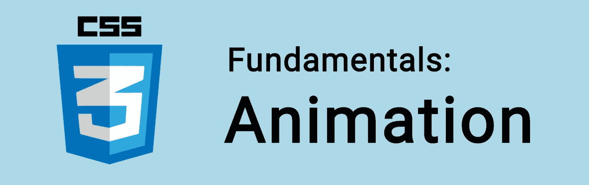

# CSS 基础:动画

> 原文：<https://itnext.io/css-fundamentals-animations-e5970036c632?source=collection_archive---------7----------------------->



**CSS 动画**是将 CSS 属性从一个动画到另一个动画的好方法。虽然我们可以使用[过渡](https://www.easeout.co/blog/2020-06-19-css-transitions)来执行单个动作，但是动画给了我们更好的控制。

我们可能制作动画的一些常见属性包括颜色(`color` & `background-color`)和数字，如`height` & `width`。

查看[动画 CSS 属性的完整列表](https://developer.mozilla.org/en-US/docs/Web/CSS/CSS_animated_properties)。

🤓想要了解最新的 web 开发吗？
🚀想要最新的新闻直接发送到你的收件箱吗？
🎉加入一个不断壮大的设计师&开发者社区！

**在这里订阅我的简讯→**[**https://ease out . EO . page**](https://easeout.eo.page/)

# 创建动画

动画由描述动画的样式规则和指示该样式的开始和结束状态的一组关键帧组成。我们也可以选择添加路点。

让我们看一个例子:

我们的动画是用`animation`属性&定义的，它是用`@keyframes`移动的，就像这样:

```
.ball {
  border-radius: 50%;
  width: 200px;
  height: 200px;
  background-color: pink;
  border: 2px solid #000;
  animation: bounce 1s infinite alternate;
}@keyframes bounce {
  from {
    margin-top: 0;
  }
  to {
    margin-top: -250px;
  }
}
```

我们的元素在不同的开始和结束位置之间移动(在这种情况下，我们已经调整了边距)。

# 子属性

我们可以使用许多子属性，以便进行更多的控制:

*   `animation-name`:指定描述动画关键帧的`@keyframes` at 规则的名称。
*   `animation-duration`:设置动画完成一个循环所需的时间长度。
*   `animation-timing-function`:指定动画的定时；或者它如何“流过”关键帧。
*   `animation-delay`:设置元素加载时间和动画开始时间之间的延迟。
*   `animation-direction`:设定循环后动画的方向。
*   `animation-iteration-count`:设置动画重复播放的次数。我们可以使用`infinite`无限重复动画。
*   `animation-fill-mode`:设置动画执行后在&之前应用哪些值。例如，您可以将动画设置为在完成时保留在屏幕上，或者恢复到其开始状态。
*   `animation-play-state`:让您暂停和恢复动画序列。

让我们看另一个例子:

这里我们使用以下值:

```
.ball {   
  animation-name: grow;
  animation-duration: 2s; 
  animation-timing-function: ease-out; 
  animation-delay: 0;
  animation-direction: alternate;
  animation-iteration-count: infinite;
  animation-fill-mode: none;
  animation-play-state: running;  
}
```

我们可以用`animation`简码来简化这个:

```
.ball {   
  animation: 
    grow
    2s     
    ease-out     
    0s     
    alternate     
    infinite     
    none     
    running; 
}
```

在我们的示例中，关键帧设置如下:

```
@keyframes grow {
  0% {
    transform: scale(.5);
    background-color: yellow;
    border-radius: 100%;
  }
  50% {
    background-color: purple;
  }
  100% {
    transform: scale(1.5);
    background-color: pink;
  }
}
```

如上所述，我们可以使用带`@keyframes`的航路点来进一步控制动画。它们被设置为百分比，0%是动画的开始，100%是结束。

在我们的例子中，我们将初始(0%)状态设置为缩放*. 5*&*黄色，然后在 50%的过程中，我们将颜色更改为*紫色*，在 100%时，它缩放到 *1.5* 并变成*粉红色*。*

# *使用多个动画*

*可以在选择器上声明多个动画，使用逗号分隔的值。*

*在下面的示例中，我们将颜色设置为与一个关键帧规则交换，并将其与另一个关键帧规则并排移动:*

```
*.ball {
  animation: 
    colorswap 2s linear infinite alternate, 
    movement 6s ease-out infinite alternate;
}*
```

# *关于前缀的一个注记*

*现代浏览器现在广泛支持动画属性，所以没有必要担心供应商前缀。在我们想要支持旧浏览器的情况下。我们需要确保我们有合适的前缀，就像这样:*

```
*.element {
  -webkit-animation: YOUR-KEYFRAME-NAME 1s infinite;
  -moz-animation:    YOUR-KEYFRAME-NAME 1s infinite;
  -o-animation:      YOUR-KEYFRAME-NAME 1s infinite;
  animation:         YOUR-KEYFRAME-NAME 1s infinite;
}@-webkit-keyframes YOUR-KEYFRAME-NAME {
  0%   { /* ... */ }
  100% { /* ... */ }
}
@-moz-keyframes YOUR-KEYFRAME-NAME {
  0%   { /* ... */ }
  100% { /* ... */ }
}
@-o-keyframes YOUR-KEYFRAME-NAME {
  0%   { /* ... */ }
  100% { /* ... */ }
}
@keyframes YOUR-KEYFRAME-NAME {
  0%   { /* ... */ }
  100% { /* ... */ }
}*
```

****你准备好让你的 CSS 技能更上一层楼了吗？*** *现在就开始用我的新电子书:*[*《CSS 指南:现代 CSS 完全指南*](https://gum.co/the-css-guide) *。获取从 Flexbox & Grid 等核心概念到动画、架构等更高级主题的最新信息！！**

**

**现已上市！👉*[gum.co/the-css-guide](https://gum.co/the-css-guide)*

# *关于我的一点点..*

*嘿，我是提姆！👋我是一名开发人员、技术作家和作家。如果你想看我所有的教程，可以在我的个人博客上找到。*

*我目前正在构建我的[自由职业者完整指南](http://www.easeout.co/freelance)。坏消息是它还不可用！但是如果这是你可能感兴趣的东西，你可以[注册，当它可用时会通知你](https://easeout.eo.page/news)👍*

*感谢阅读🎉*