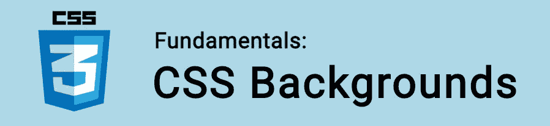

# CSS 基础:背景

> 原文：<https://itnext.io/css-fundamentals-backgrounds-508017b68a77?source=collection_archive---------3----------------------->



在本教程中，我们将学习如何改变 CSS 元素的背景。

属性允许你控制任何元素的背景。这是一个*简写的*属性，所以我们可以在一个代码块中写多个属性。例如:

```
body {
  background:
     fixed                    */* attachment ** blue;                    */* color */* content-box              */* clip */* url(background.jpg)      */* image */* padding-box              */* origin */* top center 300px 300px   */* position & size */*
     no-repeat                */* repeat */*
}
```

这个例子包含了我们可以应用于背景的每一个不同的属性。现在让我们来看看这些..

🤓想要了解最新的 web 开发吗？🚀想要最新的新闻直接发送到你的收件箱吗？
🎉加入一个不断壮大的设计师&开发者社区！

**在这里订阅我的简讯→**[**https://ease out . EO . page**](https://easeout.eo.page/)

# 背景属性

可以使用这些属性中的每一个来更改元素的背景:

*   `background-attachment`
*   `background-color`
*   `background-clip`
*   `background-image`
*   `background-origin`
*   `background-position`
*   `background-repeat`
*   `background-size`

## 背景-附件

使用`background-attachment`我们可以定义背景如何相对于视窗(网站的一部分，在浏览器窗口中可见)移动。

我们可以使用三个值中的任何一个:`scroll`、`fixed`和`local`。

`scroll`是默认行为。背景将随页面滚动。

`fixed`将背景附加到视窗，这样滚动不会影响背景:

```
div {
  background-attachment: fixed;
}
```

这通常用于实现视差效果。

`local`是 CSS3 的新增功能，它使元素的背景固定在元素本身上。这解决了在页面上滚动框内处理背景时的意外行为。

## 背景颜色

属性是不言自明的。它通过接受一个颜色值来改变我们的背景颜色，它可以是一个颜色关键字，一个`rgb`或`hsl`值:

```
body {
  background-color: lime;
}div {
  background-color: #ff0000;
}
```

查看我的帖子，了解[如何使用颜色](https://www.easeout.co/blog/2020-04-23-css-colors)。

## 背景剪辑

我们可以使用`background-clip`来创建一些简洁的效果。它让您选择背景使用的区域。我们可以使用的值有:

*   `border-box`默认值。背景将延伸到元素边框的外部边缘。
*   `padding-box`在元素填充的边缘裁剪背景，不裁剪边框。
*   `content-box` 裁剪内容框边缘的背景，不加填充。
*   `inherit`将父元素的`background-clip`值应用于元素。

## 背景图像

属性将图形应用于元素的背景。

我们使用 URL 指定我们的图像位置，如下所示:

```
div {
  background-image: url(image.png);
}
```

如果位于外部，我们可以使用相对路径(如上)或完整的网址。

## 背景-来源

用`background-origin`我们可以选择在哪里应用背景。它与`background-clip`非常相似，除了*调整*背景的大小，而不是裁剪它。

默认情况下，我们的背景应用于整个元素(包括填充与`padding-box`)。我们也可以使用`border-box`将背景设置为整个元素，包括边框，或者使用`content-box`将背景设置为没有填充的元素。

我们将经常对这个属性使用`background-size: cover`和`background-repeat: no-repeat`。防止背景图像在任何边框或填充下重复出现。稍后将详细介绍这些内容。

## 背景位置

当使用背景图片时，你通常需要设置它的位置。为此，我们使用了`background-position`属性。这样，我们可以将背景图像设置到其容器中指定的位置。

我们可以使用关键字`left`、`right`、&、`center`设置 X(水平)轴的值，使用关键字`top` 或`bottom`设置 Y(垂直)轴的值:

```
div {
  background-position: top right;
} 
```

默认值为 0 0。这将你的背景图片放在容器的左上方。

为了更具体地说明我们的定位，我们可以使用长度值:

```
div {
  background-position: 100px 50px; 
}
```

这里第一个值是水平位置，第二个值是垂直位置。所以`100px 50px`会将图像向右移动 100 像素，向下移动 50 像素。这些值可以在`px`、`em`或任何其他有效的 CSS 长度值中设置。

我们也可以使用百分比:

```
div {
  background-position: 100% 50%; 
}
```

按百分比移动背景图像意味着图像中的 X%点将与容器中的 X%点对齐。所以`50%`会将图像的中间与容器的中间对齐。`100%`将图像的最后一个像素与容器的最后一个像素对齐。

## 背景-重复

当使用比背景小的图像时，你可以用`background-repeat`来设置它的行为，就像这样:

```
html {
  background-image: url(logo.png);
  background-repeat: repeat-x; 
}
```

该属性的可能值为:

*   `repeat`:双向重复图像(这是默认！).
*   `repeat-x`:水平重复图像。
*   `repeat-y`:垂直重复图像。
*   `no-repeat`:不重复图像，只显示一次。
*   `space`:在两个方向上重复图像，均匀隔开。
*   `round`:在两个方向上重复图像，拉伸它们以填充任何可用空间。

我们也可以在一行中对我们的轴应用不同的值:

```
.div {
   background-repeat: repeat space;
}
```

第一个值是我们的横轴，第二个值是我们的纵轴。

## 背景尺寸

最后一个背景属性是`background-size`，它可能是最有用的属性之一！我们可以用 3 个关键词:`auto`、`cover`和`contain`。默认为`auto` 。

`auto`浏览器根据图像的实际尺寸自动计算尺寸，并保持其纵横比。

`cover`扩展图像以覆盖整个元素。如果元素拉伸，图像将在其中一个边缘裁剪一点以适合。

`contain`当一个轴(x 或 y)覆盖了图像的最小边缘，使其完全包含在元素内时，停止扩展背景图像。本质上，整个图像将始终显示，这意味着在两侧或底部可能会有一些空间。

另外可以指定一个长度值，它设置背景图像的宽度(高度将是自动的):

```
div {
  background: url(image.jpg);
  background-size: 100%;
}
```

如果指定第二个值，第一个值是宽度，第二个值是高度:

```
div {
  background: url(image.jpg);
  background-size: 400px 100px;
}
```

注意:可以使用任何 CSS 尺寸单位，包括 px、% s、ems、vh、vw 等。

## **多个背景图像**

您也可以*结合*上述任何方法，将它们应用于多个图像，只需在每个图像之间添加逗号即可:

```
html {
  background: url(firstimage.jpg), url(secondimage.jpg);
  background-size: 500px 100px, cover;
}
```

在这个例子中，我们的第一个图像设置为 500x100 像素，它位于覆盖整个区域的第二个图像之上。

当使用多个图像作为背景时，记住堆叠顺序是很重要的。每个值对应一个层:第一个是顶层，第二个是第二层，依此类推。如果设置了背景色，它将始终是最后一层。

***你准备好让你的 CSS 技能更上一层楼了吗？*** *现在就开始用我的新电子书:*[*《CSS 指南:现代 CSS 完全指南*](https://gum.co/the-css-guide) *。获取从 Flexbox & Grid 等核心概念到动画、架构等更高级主题的最新信息！！*


*现已上市！👉*[gum.co/the-css-guide](https://gum.co/the-css-guide)

# 结论

就是这样！我们已经研究了 CSS 中可以使用的每个背景属性。有了这些知识，你可以创造一些非常独特的布局&释放你内心的创造力！

# 关于我的一点点..

嘿，我是提姆！👋我是一名开发人员、技术作家和作家。如果你想看我所有的教程，可以在我的个人博客上找到。

我目前正在构建我的[自由职业者完整指南](http://www.easeout.co/freelance)。坏消息是它还不可用！但是如果是你感兴趣的东西，你可以[注册，当它可用时会通知](https://easeout.eo.page/news)👍

感谢阅读🎉