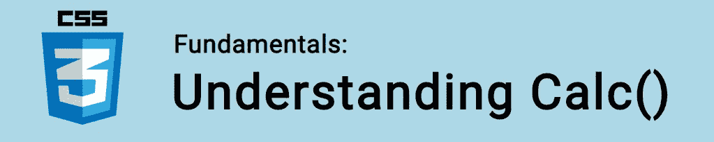

# CSS 基础:Calc()

> 原文：<https://itnext.io/css-fundamentals-calc-c695dda306d0?source=collection_archive---------4----------------------->



在本教程中，我们将学习 CSS 中的`calc()`。

`calc()`函数用于在 CSS 中执行简单的计算。我们可以使用加法(+)、减法(-)、乘法(*)和除法(/)运算符。

这个函数最有用的特性是混合单位的能力。例如，您可以使用它从视口宽度中减去像素:

```
.main {   
   height: calc(100vh - 80px); 
}
```

🤓*想跟上网络发展的步伐吗？*
🚀想要将最新消息直接发送到您的收件箱吗？
🎉加入一个不断壮大的设计师&开发者社区！

**在这里订阅我的简讯→**[**https://ease out . EO . page**](https://easeout.eo.page/)

# 使用 calc

`calc()`功能仅适用于*值*。所以你只有在期望一个像素值的时候才会用到它。

让我们来看看一些可能的用例..

我们可以用它来计算整个视窗的宽度，减去 200 像素的侧导航:

```
div {
   max-width: calc(100vw - 200px);
}
```

或者在页面的右下角放置一个“滚动到顶部”按钮:

```
body {
   background-image: url(arrow.png); 
   background-position: calc(100% - 25px) calc(100% - 25px);
}
```

或者在处理排版时:

```
.text {
  font-size: calc(2vw + 5px);
  width:     calc(100% - 10px);
  height:    calc(100vh - 20px);
}
```

它也可以用作速记属性的一部分:

```
margin: calc(6.25% - 5px) 0;
```

不幸的是，它不适用于媒体查询😢：

```
@media (max-width: 30rem) {
  */* Works! */*
}@media (min-width: calc(30rem + 1px)) {
  */* Doesn't work* **/* 
}
```

`calc()`真正的威力来自于混编单位的能力。上面的每个例子都做到了这一点！处理长度时执行数学运算的能力是开始使用 calc 的一个很好的理由！

***你准备好让你的 CSS 技能更上一层楼了吗？*** *现在就开始用我的新电子书:*[*《CSS 指南:现代 CSS 完全指南*](https://gum.co/the-css-guide) *。获取从 Flexbox & Grid 等核心概念到动画、架构&等更高级主题的最新信息！！*


*现已上市！👉*[gum.co/the-css-guide](https://gum.co/the-css-guide)

# 关于我的一点点..

嘿，我是提姆！👋我是一名开发人员、技术作家和作家。如果你想看我所有的教程，可以在我的个人博客上找到。

我目前正在构建我的[自由职业者完整指南](http://www.easeout.co/freelance)。坏消息是它还不可用！但是如果这是你可能感兴趣的东西，你可以[注册，当它可用时会通知你](https://easeout.eo.page/news)👍

感谢阅读🎉