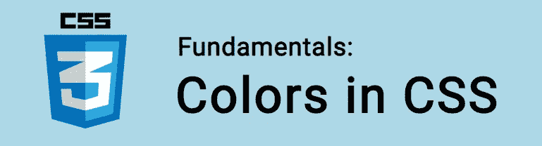

# CSS 基础:颜色

> 原文：<https://itnext.io/css-fundamentals-colors-136cd7e77b17?source=collection_archive---------5----------------------->



在本教程中，我们将学习 CSS 中的颜色。

如果没有 CSS，我们的网页看起来会很单调。在 HTML 中，我们得到一个普通的白色背景，黑色文本和蓝色链接。仅此而已。

所以还是用 CSS 来加点颜色吧！

🤓*想跟上网络发展的步伐吗？*
🚀想要将最新消息直接发送到您的收件箱吗？
🎉加入一个不断壮大的设计师&开发者社区！

**在这里订阅我的简讯→**[**https://ease out . EO . page**](https://easeout.eo.page/)

# 使用颜色

CSS `color`属性设置我们文本的颜色:

```
p {
  color: lime;
}
```

属性可以接受任何 CSS 颜色值。分为:**名为**的颜色、**十六进制**颜色、 **RGB & RGBa** 颜色或 **HSL & HSLa** 颜色。

让我们来看看每一个！

## 命名颜色

```
p {
  color: lime;
}
```

命名颜色(或关键字颜色)是定义颜色的 CSS 关键字。如:红色、蓝色、青柠色、水绿色、浅珊瑚色等。

CSS 最初有 16 种颜色，但是现在有大量的选择。查看[支持颜色列表](https://www.w3schools.com/colors/colors_names.asp)。

命名的颜色非常方便。然而，要获得更具体的颜色，我们应该看看其他选项。

## 十六进制颜色

十六进制(或十六进制)颜色由字母数字值定义。

例如:

```
p {
  color: #00FFFF;
}
```

每种十六进制颜色都表示为由红、绿、蓝(RGB)混合定义的数字和字母的六位数组合。

在上面的例子中，前两个字符代表红色值，后两个代表绿色值，第三个代表蓝色值。范围是从 00 到 FF。

十六进制代码本质上是其 RGB 值的简写！

在我们的红色、蓝色和绿色值对都是双精度的情况下，我们可以将该值缩写为 3 个字符的简写形式。所以#FFFFFF 可以缩写成#FFF。

```
color: #FFFFFF; */* white */*
color: #FFF;    */* also white! */*
```

## RGB 和 RGBa 颜色

或者，您可以使用`rgb()`从 RGB 符号计算颜色。

为了定义我们的颜色，我们使用三个数值的逗号分隔列表(范围从 0 到 255)。第一个代表红色值，第二个代表绿色值，第三个代表蓝色值。例如:

```
color: rgb(255, 255, 255);  /* white */
color: rgb(0, 0, 0);        /* black */
color: rgb(255, 0, 0);      /* red */
color: rgb(34, 139, 34);    /* forest green*/
```

我们可以用`rgba()`来调整不透明度。对于 RGBa，我们添加了第四个值。该值是一个介于 0.0(完全透明)到 1(完全不透明)之间的数字。例如:

```
p {
  color: rgba(0, 255, 255, .5);
}
```

## HSL 和 HSLa 颜色

HSL(色调、饱和度、亮度)颜色是 CSS 中较新的元素。

和 RGB 一样，我们也使用三个值的逗号分隔列表。首先是**色相**的度数(从 0 到 360)，然后是**饱和度**百分比(从 0%到 100%)，然后是**明度**百分比(从 0%到 100%)。

```
color: hsl(0, 0%, 0%);    /* black */
color: hsl(0, 0%, 100%);  /* white */
```

默认情况下，HSL 颜色是不透明的。

要添加不透明度，使用`hsla()`添加第四个值，范围从 0.0(完全透明)到 1(完全不透明)。

```
color: hsla(180, 100%, 50%, .5);
```

## 色彩可及性

当使用颜色时，我们应该始终注意可及性。通过确保文本的颜色和背景之间的对比度满足一定的标准。这样，有视力问题的人仍然能够阅读页面内容。

该比率是通过比较文本的亮度和背景颜色值来确定的。我们可以用网页内容可访问性指南(WCAG) [颜色检查器](https://contrastchecker.com/)工具来比较颜色。

***你准备好让你的 CSS 技能更上一层楼了吗？*** *现在就开始用我的新电子书:*[*CSS 指南:现代 CSS 完全指南*](https://gum.co/the-css-guide) *。获取从 Flexbox & Grid 等核心概念到动画、架构&等更高级主题的最新信息！！*


*现已上市！👉*[gum.co/the-css-guide](https://gum.co/the-css-guide)

# 结论

这就对了。我们已经看到了如何用命名、十六进制、RGB 和 HSL 颜色给页面添加颜色。

# 关于我的一点点..

嘿，我是提姆！👋我是一名开发人员、技术作家和作家。如果你想看我所有的教程，可以在我的个人博客上找到。

我目前正致力于构建我的自由职业者完整指南。坏消息是它还不可用！但是如果是你感兴趣的东西，你可以[注册，当它可用的时候会通知你](https://easeout.eo.page/news)👍

感谢阅读🎉