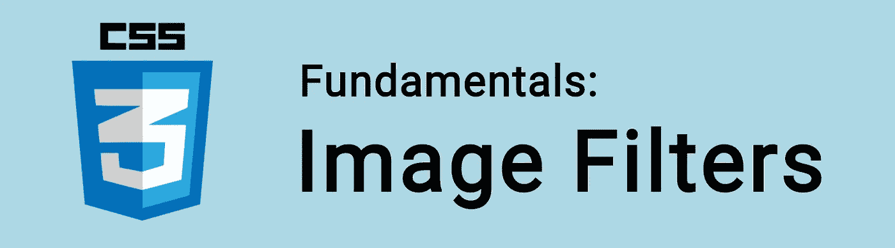

# CSS 基础:过滤器

> 原文：<https://itnext.io/css-fundamentals-filters-cfd802ee7eee?source=collection_archive---------3----------------------->



CSS 滤镜是对元素应用视觉效果的一种非常有用的方式。

通常可以用 Photoshop 或其他图片编辑软件完成的任务，在 CSS 中也可以完成！

我们可以使用`filter`属性来添加模糊或饱和度等效果，或者改变不透明度或亮度，等等！

🤓想要了解最新的 web 开发吗？
🚀想要将最新消息直接发送到您的收件箱吗？
🎉加入一个不断壮大的设计师&开发者社区！

**在这里订阅我的简讯→**[**https://ease out . EO . page**](https://easeout.eo.page/)

虽然在图像效果中使用`filter`很常见，但它实际上可以用在任何元素的*上。*

语法是:

```
img {
  filter: *value*;
}
```

其中*value*是下列值之一:

*   `blur()`
*   `brightness()`
*   `contrast()`
*   `drop-shadow()`
*   `grayscale()`
*   `hue-rotate()`
*   `invert()`
*   `opacity()`
*   `sepia()`
*   `saturate()`
*   `url()` —用于 SVG 过滤器

每个过滤器都有一个括号，这是我们指定其值的地方。

例如:

```
img {
  filter: opacity(0.5);
}
```

这将使我们的图像 50%透明，因为`opacity()`的范围是 0 到 1，或者是一个百分比值。

我们还可以在一行中应用多个过滤器:

```
img {
  filter: blur(20px) grayscale(20%);
}
```

让我们来详细看看每个过滤器。

# `blur()`

`blur()`对元素应用模糊效果。

选择的值决定了模糊半径的大小。该值越高，混合在一起的像素就越多，这会产生更多的模糊。

```
img {
  filter: blur(4px);
}
```

该值可以用`px`、`em`或`rem`单位表示。

# `opacity()`

`opacity()`对元素应用透明度。

它取 0 到 1 之间的一个值，或一个百分比(如 0.5 代表 50%)，它决定了图像的透明度。

`0`或`0%`，完全透明。`1`或`100%`，完全可见。

```
img {
  filter: opacity(0.5);
}
```

CSS 还有一个`opacity`属性。然而，使用`filter`属性浏览器性能会更好，所以这应该是首选方法。

# `drop-shadow()`

`drop-shadow()`对元素应用阴影。

它最多接受 5 个参数，前两个(如下)是必需的:

*   *偏移量-x* 定义水平偏移量。
*   *偏移-y* 定义垂直偏移。

```
img {
  filter: drop-shadow(10px 10px);
}
```

*   *模糊半径*(可选)，定义阴影的模糊半径。默认为 0(无模糊)。

```
img {
  filter: drop-shadow(10px 10px 2px);
}
```

*   *扩散半径*(可选)，定义扩散半径。在`px`、`rem`或`em`中。

```
img {
  filter: drop-shadow(10px 10px 2px 5px);
}
```

*   *颜色*(可选)，定义颜色。

```
img {
  filter: drop-shadow(10px 10px 2px 5px red);
}
```

# `grayscale()`

将元素转换为灰度。

该值设置比例，100%为完全灰度，0%保持元素不变。

```
img {
  filter: grayscale(50%);
}
```

# `sepia()`

将元素转换为棕褐色。

同样，该值设置比例，100%为完全棕褐色，0%保持元素不变。

```
img {
  filter: sepia(50%);
}
```

# `invert()`

反转元素的颜色。

反转根据 HSL [色轮](https://color.adobe.com/create/color-wheel)选择相反的颜色。

值 100%完全反转，0%保持元素不变。

50%将始终呈现灰色，因为你最终在轮子的中间。

```
img {
  filter: invert(50%);
}
```

# `hue-rotate()`

色轮用度数表示。`hue-rotate()`让您使用正向或反向旋转来旋转颜色。

该函数接受一个`deg`值。0 度保持输入不变&360 度为最大值。

```
img {
  filter: hue-rotate(90deg);
}
```

# `brightness()`

`brightness()`使一个元素显得或多或少的明亮。

值为 0%时，元素将显示为全黑。100%将保持元素不变。

```
img {
  filter: brightness(50%);
}
```

# `contrast()`

`contrast()`改变元素的对比度。

值为 0%时，元素将完全显示为灰色。100%将保持元素不变。

```
img {
  filter: contrast(150%);
}
```

# `saturate()`

`saturate()`将改变元素的饱和度。

0%的值是完全不饱和的(它将完全是灰度的)。值为 100%时，元素保持不变。

```
img {
  filter: saturate();
}
```

# `url()`

`url()`允许您应用 SVG 文件中定义的过滤器。

参数将是文件的位置。

```
img {
  filter: url(filter.svg);
}
```

关于 SVG 过滤器的更多信息，请查看:[https://tympanus.net/codrops/2019/01/15/svg-filters-101/](https://tympanus.net/codrops/2019/01/15/svg-filters-101/)

***你准备好让你的 CSS 技能更上一层楼了吗？*** *现在就开始用我的新电子书:*[*《CSS 指南:现代 CSS 完全指南*](https://gum.co/the-css-guide) *。获取从 Flexbox & Grid 等核心概念到动画、架构等更高级主题的最新信息！！*


*现已上市！👉*[gum.co/the-css-guide](https://gum.co/the-css-guide)

# 关于我的一点点..

嘿，我是提姆！👋我是一名开发人员、技术作家和作家。如果你想看我所有的教程，可以在我的个人博客上找到。

我目前正在构建我的[自由职业者完整指南](http://www.easeout.co/freelance)。坏消息是它还不可用！但是如果是你感兴趣的东西，你可以[注册，当它可用时会通知](https://easeout.eo.page/news)👍

感谢阅读🎉