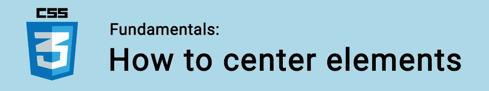
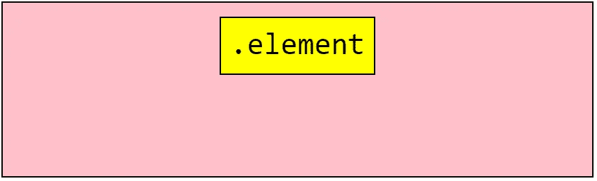
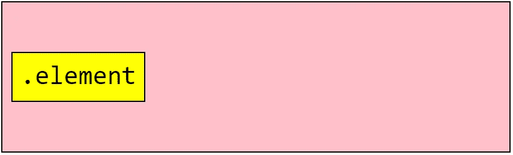
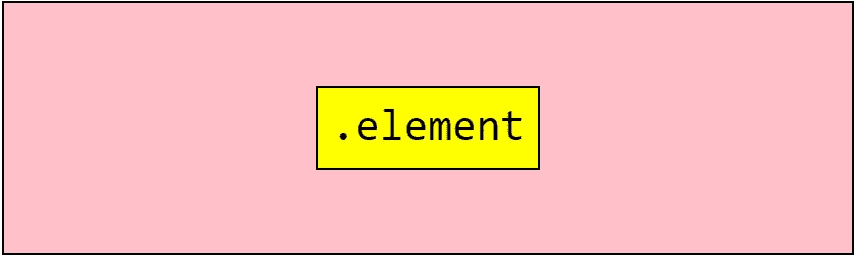

# CSS 基础:如何使元素居中

> 原文：<https://itnext.io/css-fundamentals-how-to-center-elements-15ae82946aa0?source=collection_archive---------3----------------------->



在 CSS 中居中传统上是一个令人沮丧的原因。这是一项日常任务，但却有如此多的可能解决方案！根据您是水平居中、垂直居中还是两者都居中，您采取的方法会有所不同！

在本教程中，我们将看看在每个场景中哪些方法是最好的。

🤓*想与 web dev 保持同步吗？*
🚀*想要将最新消息直接发送到您的收件箱？
🎉加入一个不断壮大的设计师&开发者社区！*

**在这里订阅我的简讯→**[**https://ease out . EO . page**](https://easeout.eo.page/)

# 水平居中

## 内嵌元素

文本(和链接)等行内元素使用`text-align`属性水平居中非常简单:

```
p {
  text-align: center;
}
```

这适用于内联、内联块、内联伸缩、内联表等。

## 块状元素

如果块级元素的`margin-left`和`margin-right`属性都被设置为`auto`(假设该元素有一个`width`)，则该元素可以居中。通常用`margin`简写来完成:

```
.element {
  margin: 0 auto;
}
```

然而，将块级元素(任何不是文本的东西)居中的现代方法是使用 [Flexbox](https://www.easeout.co/blog/2020-05-22-the-flexbox-guide) ！

假设我们有这样的 HTML:

```
<div class="container">
  <div>.element</div>
</div>
```

添加以下 CSS:

```
.container {
  display: flex;
  justify-content: center;
}
```

这将使`.container`元素内的任何元素水平居中。



# 垂直居中

垂直居中传统上是相当棘手的。通常情况下，这是通过如下代码完成的:

```
.parent {   
  position: relative; 
} .child {   
  position: absolute;   
  top: 50%;   
  transform: translateY(-50%); 
}
```

这确实有效，因为它将子元素向上移动了其高度的一半。并且它将子元素的中间定位在其父元素的中间。

然而，我们可以用 Flexbox 更简单地做到这一点:

```
.container {
  display: flex;
  align-items: center;
}
```

这将使`.container`元素内的任何元素垂直居中。



# 垂直和水平居中

要垂直和水平居中，我们只需结合这些技术！

要将元素完美地居中在其容器的中间:

```
.container {
  display: flex;
  justify-content: center;
  align-items: center;
}
```



如果使用 CSS 网格，我们也可以很容易地做到这一点:

```
.container {
  display: grid;
  place-items: center;
}
```

任何东西都可以在 CSS 中居中！

一旦你了解了 [Flexbox](https://www.easeout.co/blog/2020-05-22-the-flexbox-guide) 和 [Grid](https://www.easeout.co/blog/2020-05-29-the-css-grid-guide) 的基本知识，你就会发现它是多么简单！👍

***你准备好让你的 CSS 技能更上一层楼了吗？*** *现在就开始用我的新电子书:*[*《CSS 指南:现代 CSS 完全指南*](https://gum.co/the-css-guide) *。获取从 Flexbox & Grid 等核心概念到动画、架构等更高级主题的最新信息！！*


*现已上市！👉*[gum.co/the-css-guide](https://gum.co/the-css-guide)

# 关于我的一点点..

嘿，我是提姆！👋我是一名开发人员、技术作家和作家。如果你想看我所有的教程，可以在我的个人博客上找到。

我目前正在构建我的[自由职业者完整指南](http://www.easeout.co/freelance)。坏消息是它还不可用！但是如果是你感兴趣的东西，你可以[注册，当它可用时会通知](https://easeout.eo.page/news)👍

感谢阅读🎉