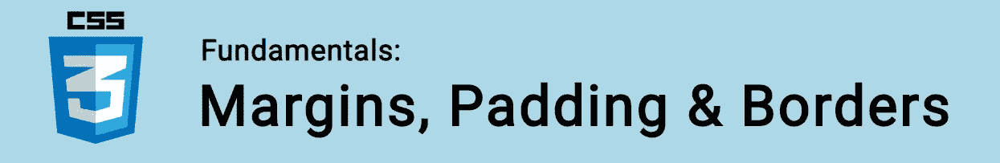

# CSS 基础:边距、填充和边框

> 原文：<https://itnext.io/css-fundamentals-margins-padding-borders-3a3fef69958b?source=collection_archive---------4----------------------->



在本教程中，我们将探讨三个重要的 CSS 属性，以了解布局页面时:边距，填充和边框。

🤓*想了解最新的 web 开发吗？*🚀*想要将最新消息直接发送到您的收件箱吗？
🎉加入一个不断壮大的设计师&开发者社区！*

**在这里订阅我的简讯→**[**https://ease out . EO . page**](https://easeout.eo.page/)

# 边距、填充和边框

如果你读过我以前关于 [box model](https://www.easeout.co/blog/2020-04-14-the-css-box-model) 的文章，你会知道 margin、padding & border 属性保存的值直接影响元素的盒子大小。

本教程的重点将是这些属性如何与盒子模型相关联。所以请确保你[首先阅读了这方面的内容。](https://www.easeout.co/blog/2020-04-14-the-css-box-model)

现在让我们详细研究一下这些属性。

# 边缘

属性定义了盒子模型的外部，它在元素周围创建了空间，在任何边界之外。换句话说，是你盒子周围看不见的空间将其他元素推离了盒子。

我们可以指定元素每边的边距，如下所示:

```
margin-top: 10px:
margin-right: 20px;
margin-bottom: 10px
margin-left: 20px;
```

## `Margin`速记

我们也可以使用速记形式的`margin`，它允许我们同时指定多个边距。

使用单个值，我们将该值应用于所有的页边距:上、右、下、左:

```
margin: 10px;
```

如果我们使用 2 个值，第一个设置**上&下**边距，第二个设置**左&右:**

```
margin: 10px 20px;
```

使用 3 个值将第一个应用于**顶部**，第二个应用于**左侧&右侧**，第三个应用于**底部:**

```
margin: 10px 20px 30px;
```

使用 4 个值将第一个应用于**顶部**，第二个应用于**右侧**，第三个应用于**底部**，第四个应用于**左侧:**

```
margin: 10px 20px 30px 0px;
```

记住的顺序是*顶部>右侧>底部>左侧*。

`margin`接受 em、rem 或任何 CSS 长度单位的值。以及百分比值和`auto`值，我们现在就来看看！

## `Auto` &定心

我们使用`auto`来告诉浏览器自动定义一个边距。

它通常用于水平居中，像这样:

```
.element {
  width: 500px;
  margin: 0 auto;
}
```

使用这个代码，我们的元素将在可用空间内水平居中。这将作为:

*   我们已经指定了元素宽度
*   左右页边距被设置为`auto`

没有指定的宽度，`auto`值将不起作用。因为无法确定可用空间(来自父元素)。

更现代的方法是使用 flexbox 通过`justify-content: center;`进行对中。然而，由于`margin: 0 auto`在过去几年中被如此频繁地使用——知道这一点还是有好处的，尤其是在处理遗留代码时。

注意:`auto`仅对水平(非垂直)对中有用！

# 填料

`padding`属性定义了[盒子模型](https://www.easeout.co/blog/2020-04-14-the-css-box-model)的内部。它在元素的内容周围，在任何边距和边框内创建空间。

我们在每一侧指定元素的填充，如下所示:

```
padding-top: 10px:
padding-right: 20px;
padding-bottom: 10px
padding-left: 20px;
```

## 填充速记

与我们使用空白速记的方式相同，我们可以使用`padding`速记:

```
padding: 10px 20px 30px 0px;
```

# 边界

`border`包围填充和边距之间的元素。我们可以用它在一个元素周围画一条边。

我们用属性`border-width`、`border-style`、&、`border-color`，来定义我们的边界。

## 边框宽度

`border-width`:指定边框粗细。

```
p {
  border-width: 2px;
}
```

或者您可以分别设置每个边缘(顶部>右侧>底部>左侧)，如下所示:

```
p {
  border-width: 2px 1px 2px 1px;
}
```

我们也可以使用以下值:

*   `thin`:等于`1px`
*   `medium`:等于`3px`
*   `thick`:等于`5px`

## 边框样式

`border-style`:指定我们边框的线条类型。

我们可以使用的值有:

*   `none`:默认(不显示边框)。
*   `solid`:实线。
*   `hidden`:画了一条线，但不可见。可用于增加一些额外的宽度，而不显示边框。
*   `dashed`:虚线。
*   `dotted`:虚线。
*   `double`:围绕元素画两条直线。
*   `groove`:显示带有雕刻外观的边框，其效果是使元素看起来“压入”页面。
*   `ridge`:凹槽的反面，给人凸起的效果。
*   `inset`:使元素看起来是嵌入的。
*   `outset`:和插图相反，有浮雕效果。

可以组合多个`border-style`值。例如:

```
p {
  border-style: none dashed solid dashed;
}
```

## 边框颜色

`border-color`:指定边框的颜色。

任何有效的颜色都可以传递给这个值。如果不设置颜色，边框将默认为元素中文本的颜色。

```
p {
  border-color: red;
}
```

您也可以分别选择每条边的颜色(上>右>下>左)，如下所示:

```
p {
  border-color: red green yellow blue;
}
```

## 将边框应用于特定的边

如果我们希望仅将属性应用于个别面，我们可以使用:

*   `border-top`
*   `border-right`
*   `border-bottom`
*   `border-left`

并单独设计每一面的样式:

*   `border-top-width`
*   `border-top-style`
*   `border-top-color`
*   `border-right-width`
*   `border-right-style`
*   `border-right-color`
*   `border-bottom-width`
*   `border-bottom-style`
*   `border-bottom-color`
*   `border-left-width`
*   `border-left-style`
*   `border-left-color`

## 边框速记

谢天谢地，你可以一次设置所有这些属性！使用`border`速记法。语法是这样的:

```
border:  <border-width> <border-style> <color>
```

例如:

```
border: 5px solid red;
```

这给了我们一个 5px 厚，我们的元素周围的固体红色边框。

***你准备好让你的 CSS 技能更上一层楼了吗？*** *现在就开始用我的新电子书:*[*CSS 指南:现代 CSS 完全指南*](https://gum.co/the-css-guide) *。获取从 Flexbox & Grid 等核心概念到动画、架构等更高级主题的最新信息！！*


*现已上市！👉*[gum.co/the-css-guide](https://gum.co/the-css-guide)

# 结论

这就对了。我们已经介绍了边距、填充和边框的基本知识&并了解了它们如何适应 CSS box 模型。对这些概念有了坚实的理解，你就可以很好地掌握 CSS 了！

# 关于我的一点点..

嘿，我是提姆！👋我是一名开发人员、技术作家和作家。如果你想看我所有的教程，可以在我的个人博客上找到。

我目前正在构建我的[自由职业完全指南](http://www.easeout.co/freelance)。坏消息是它还不可用！但是如果这是你可能感兴趣的东西，你可以[注册，当它可用时会通知你](https://easeout.eo.page/news)👍

感谢阅读🎉