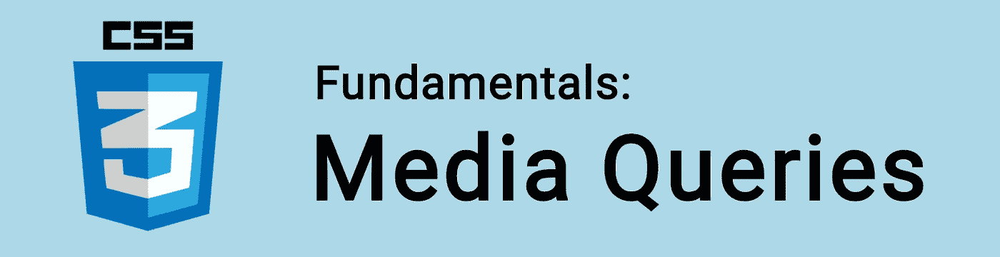

# CSS 基础:媒体查询

> 原文：<https://itnext.io/css-fundamentals-media-queries-83e101c3d6fb?source=collection_archive---------1----------------------->



*媒体查询*是一种 CSS 技术，我们可以利用它来提高页面的响应性。

我们使用`@media`来创建一个 CSS 规则，它只在指定的条件为真时执行**。**

例如，如果设备浏览器窗口为 600 像素或更小，则将`background-color`设置为橙色:

```
@media only screen and (max-width: 600px) {
  body {
    background-color: orange;
  }
}
```

就像这样，我们有一个针对小型设备的规则！

🤓想要了解最新的 web 开发吗？
🚀想要最新的新闻直接发送到你的收件箱吗？
🎉加入一个不断壮大的设计师&开发者社区！

**在这里订阅我的简讯→**[**https://ease out . EO . page**](https://easeout.eo.page/)

# 使用媒体查询

我们可以通过媒体查询来检查一些东西，比如:

*   视口的宽度和高度
*   设备的宽度和高度
*   屏幕方向(设备是横向还是纵向？)
*   屏幕分辨率

通过检查这些信息，我们能够为用户提供更好的体验。我们可以创建规则，以最适合所用设备的方式显示布局。

为了理解媒体查询的结构，让我们看看媒体类型、媒体特性和逻辑运算符的选项。

# 媒体类型

*媒体类型*允许我们根据设备类型加载 CSS。

以下**介质类型**可用:

*   `all`适用于所有媒体设备
*   `print`用于打印机
*   `screen`用于在屏幕上显示(电脑、平板电脑、手机等)
*   `speech`用于屏幕阅读器

`screen`是最常用的类型。

# 媒体特征

*媒体特征*描述用户设备的具体特征。

当评估为“true”时，将应用媒体查询。

以下是我们可以测试的功能列表:

*   `width`
*   `height`
*   `device-width`
*   `device-height`
*   `aspect-ratio`
*   `device-aspect-ratio`
*   `resolution`
*   `orientation`
*   `scan`
*   `grid`
*   `color`
*   `color-index`
*   `monochrome`

注意，每个都有相应的`min-*`和`max-*`值。而且都是可选的！

# 逻辑运算符

我们使用*逻辑操作符* `not`、`and`和`only`来创建更复杂的媒体查询。

## `and`

我们使用`and`将多个媒体特征组合成一个单一的媒体查询。每个特征必须为真，查询才能返回真。它还用于将媒体功能与媒体类型相结合。

## `not`

`not`运算符用于否定媒体查询。如果查询返回 false，则为 true。使用`not`时，您*还必须*指定媒体类型。

## `only`

`only`操作符用于仅在整个查询匹配时应用样式，这对于防止旧浏览器应用选定的样式很有用。使用`only`时，您*还必须*指定媒体类型。

## `,`(逗号)

我们还可以将多个媒体查询合并到一个规则中，用逗号分隔它们。如果列表中的任何查询为真，则整个媒体声明返回 true。因此可以认为它的行为类似于一个`or`操作符。

# 媒体查询语法

有了这些知识，让我们重新回顾一下媒体查询语法！

媒体查询由一个媒体类型(在本例中为`screen`)组成，并且可以包含一个或多个表达式(这里我们使用`max-width`):

```
@media screen and (max-width: 600px) {
  /* ... */
}
```

如果媒体类型与显示页面的设备类型匹配&如果媒体查询中的所有表达式都为真，查询将返回真。

当媒体查询返回 true 时，将应用相应的样式规则！

让我们看一个更复杂的例子..

这里，当用户使用`screen`设备(电脑、平板电脑或手机)，宽度在 600 到 768 像素之间，方向为横向时，该规则适用:

```
@media screen and (max-width: 768px) and (min-width: 600px) and (orientation: landscape) {
  /* ... */
}
```

# 典型设备断点

有大量不同高度和宽度的屏幕和设备，所以很难为每个设备创建一个精确的断点。

通常，为了简化响应性布局的编码过程，我们基于屏幕尺寸范围创建针对设备的媒体查询:

```
/* Extra small devices (phones, less than 600px wide) */
@media only screen and (max-width: 600px) {...}/* Small devices (portrait tablets & large phones, 600px and up) */
@media only screen and (min-width: 600px) {...}/* Medium devices (landscape tablets, 768px and up) */
@media only screen and (min-width: 768px) {...}/* Large devices (laptops/desktops, 992px and up) */
@media only screen and (min-width: 992px) {...}/* Extra large devices (large laptops & desktops, 1200px and up) */
@media only screen and (min-width: 1200px) {...}
```

然而，更好的做法是根据您内容的需要创建您的媒体查询。这样，你可以减少布局在你可能没有考虑到的设备上中断的可能性。

***你准备好让你的 CSS 技能更上一层楼了吗？*** *现在就开始用我的新电子书:*[*《CSS 指南:现代 CSS 完全指南*](https://gum.co/the-css-guide) *。获取从 Flexbox & Grid 等核心概念到动画、架构等更高级主题的最新信息！！*


*现已上市！👉*[gum.co/the-css-guide](https://gum.co/the-css-guide)

# 关于我的一点点..

嘿，我是提姆！👋我是一名开发人员、技术作家和作家。如果你想看我所有的教程，可以在我的个人博客上找到。

我目前正在构建我的[自由职业者完整指南](http://www.easeout.co/freelance)。坏消息是它还不可用！但是如果是你感兴趣的东西，你可以[注册，当它可用时会通知](https://easeout.eo.page/news)👍

感谢阅读🎉