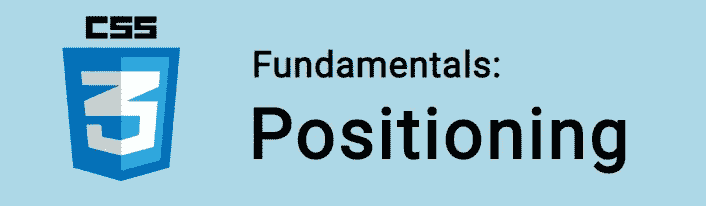
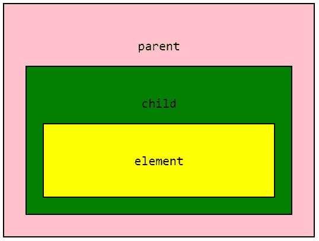
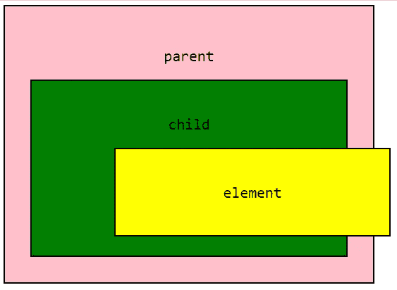
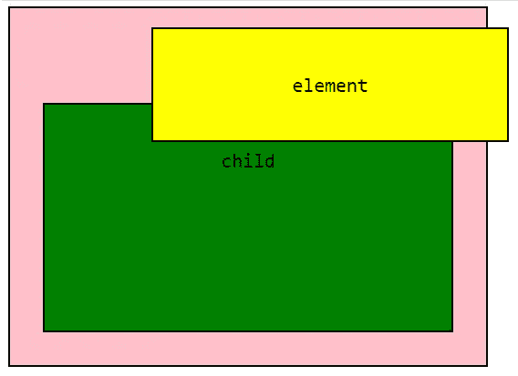
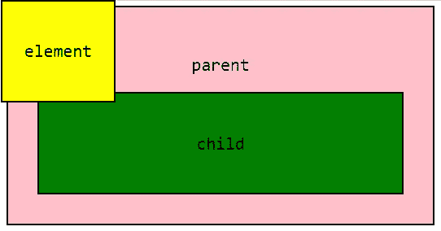
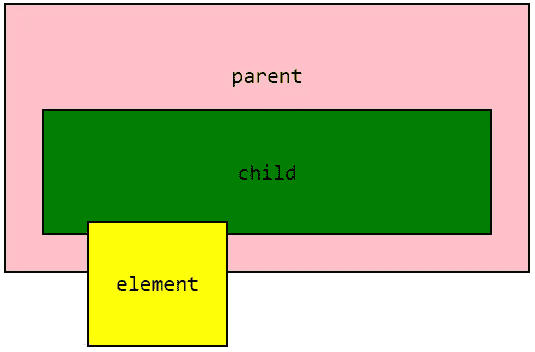
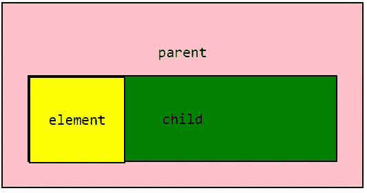
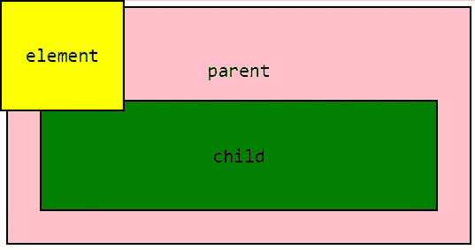
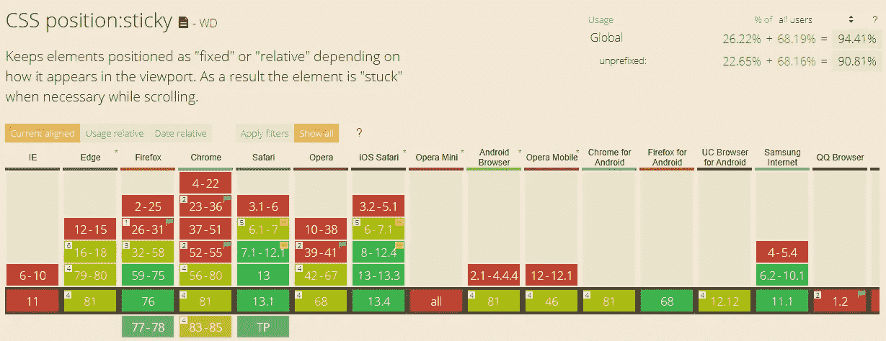

# CSS 基础:定位

> 原文：<https://itnext.io/css-fundamentals-positioning-b0d60a0fdd3b?source=collection_archive---------4----------------------->



在 CSS 中，我们通过使用`position`属性来设置元素的位置。

例如:

```
.element {
  position: relative;
  top: 10px;
}
```

相对于它在文档中的原始位置，我们元素的位置将从顶部向下移动 10px。

`position`属性可以有 5 个值之一:

*   `static`
*   `relative`
*   `absolute`
*   `fixed`
*   `sticky`

让我们来看看每一个！

🤓想要了解最新的 web 开发吗？🚀想要最新的新闻直接发送到你的收件箱吗？
🎉加入一个不断壮大的设计师&开发者社区！

**在这里订阅我的简讯→**[**https://ease out . EO . page**](https://easeout.eo.page/)

# 价值观念

## 静态

默认情况下，每个元素都有一个`static`位置。静态定位的元素显示在普通页面流中。

让我们以下面的 HTML 为例:

```
<div class="parent">
  <p>parent</p>
  <div class="child">
     <p>child</p>
     <div class="element">
       <p>element</p>
     </div>
  </div>
</div>
```

和一些基本的 CSS:

```
* {
  font-family: monospace;
  text-align: center;
  font-size: 24px;
}
.parent {
  background-color: pink;
  padding: 40px;
  width: 500px;
  border: 2px solid #000;
}
.child {
  background-color: green;
  padding: 30px;  
  border: 2px solid #000;
}
.element {
  background-color: yellow;
  padding: 30px;
  border: 2px solid #000;
}
```

这为我们提供了以下信息:



我们有默认的`static`布局。`static`位置不需要设定为其假设的位置。

如果我们试图将属性如`top`、`bottom`、`left`或`right`应用于静态元素，将不会有任何效果。

## 亲戚

具有`relative` 位置的元素也将保留在文档流中，只是现在`top`、`bottom`、`left`、&、`right`将起作用！

这些属性(称为“偏移”属性)将元素从原始位置向指定方向移动。

它们接受任何长度值或百分比。

让我们将偏移值为 100px 的`position: relative` & `left`添加到我们的元素中:

```
.element {
  /* other styles ... */
  position: relative;
  left: 100px;
}
```



我们的元素将相对于它的容器从左边移动 100 像素。

我们还可以设置多个值:

```
.element {
  /* other styles ... */
  position: relative;
  top: -200px;
  left: 100px;
}
```



`top`的负值会使盒子相对于它的容器向上移动。

你还会注意到先前被`element`框占据的空间仍然存在。因为它的位置相对于它的原始位置偏移了。

我们还可以将 [z-index](https://www.easeout.co/blog/2020-05-19-the-z-index-property) 应用于相对定位的元素！

## 绝对的

当`absolute`位置被设置在一个元素上时，它被完全从文档流中移除。这意味着所有其他页面元素将表现得好像它不再存在。

让我们给元素一个`position: absolute`，我们可以看到它的原始空间现在已经折叠，因为元素存在于文档流之外。

```
.element {
  /* other styles ... */
  position: absolute;
}
```


我们可以对一个`absolute`元素使用位置属性。所以我们可以使用`top`、`right`、`bottom`或`left`来移动它:

```
.element {
  /* other styles ... */
  position: absolute;
  top: 0px;
  left: 0px;
}
```



它会将自己定位在浏览器窗口的 0，0 坐标处(左上角)。

或者:

```
.element {
  /* other styles ... */
  position: absolute;
  top: 250px;
  left: 100px;
}
```



我们的偏移属性总是设置相对于最近容器的位置，即**而不是** `static`。

如果所有的父容器都是静态的，它将相对于窗口放置。

但是如果我们将`position: relative`添加到`.child`元素中，并将`top`和`left`设置为 0，则该元素将定位在`.child`的 0，0 坐标处:

```
.child {
  /* other styles ... */
  position: relative;
}.element {
  /* other styles ... */
  position: absolute;
  top: 0px;
  left: 0px;
}
```



当在页面上定位元素时，这是一个需要记住的技巧！

您也可以使用`z-index`绝对定位放置。

## 固定的；不变的

具有`fixed`值的元素类似于 absolute，因为它也被从文档流中删除。

一个固定定位的元素是**总是**相对于*窗口本身*、**而不是**任何特定的父容器:

```
.element {
  /* other styles ... */
  position: fixed;
  top: 0;
  left: 0;
}
```



另外，`fixed`元素不受滚动的影响。这意味着即使当页面滚动时，它的位置也保持不变。

例如，您可以使用`fixed`元素在页面的右下角放置一个“滚动到顶部”图标！

## 粘的

`sticky`值是`relative`和`fixed`值的混合。它被视为一个`relative`值，直到(视口的)滚动位置达到指定的阈值。在这一点上，它“粘”在原地，就像一个`fixed`元素。

您可能想要一个下方带有导航菜单的登录图像。当你向下滚动经过着陆图像时，你可以让菜单“粘”在窗口的顶部。

例如:

```
.element {
  position: sticky; 
  top: 0;
}
```

我们的元素将被相对定位，直到视窗的滚动位置到达它。然后它会粘在屏幕顶部的`fixed`位置(`0`)。

在这个阶段，`sticky`仍然是一个实验值，只有部分被主流浏览器采用:



至少就目前而言，如果您希望在生产中使用这种技术，那么考虑 JavaScript 解决方案是值得的。

***你准备好让你的 CSS 技能更上一层楼了吗？*** *现在就开始用我的新电子书:*[*《CSS 指南:现代 CSS 完全指南*](https://gum.co/the-css-guide) *。获取从 Flexbox & Grid 等核心概念到动画、架构等更高级主题的最新信息！！*


*现已上市！👉*[gum.co/the-css-guide](https://gum.co/the-css-guide)

# 关于我的一点点..

嘿，我是提姆！👋我是一名开发人员、技术作家和作家。如果你想看我所有的教程，可以在我的个人博客上找到。

我目前正致力于建立我的[自由职业完全指南](http://www.easeout.co/freelance)。坏消息是它还不可用！但是如果这是你可能感兴趣的东西，你可以[注册，当它可用时会通知你](https://easeout.eo.page/news)👍

感谢阅读🎉