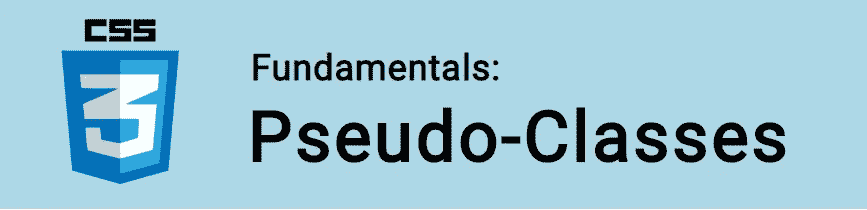

# CSS 基础:伪类

> 原文：<https://itnext.io/css-fundamentals-pseudo-classes-55ed6cdf9ceb?source=collection_archive---------5----------------------->



在本教程中，我们将学习 CSS 伪类！

伪类选择器是预定义的关键字，用于定义元素的状态，或者定位子元素。当一个元素后跟一个冒号时，我们可以看到它们的作用。你可能经常见到他们，例如:

```
a:hover {   
   */* Hover is a pseudo-class! */* 
}
```

它们在很多情况下都非常有用！

🤓*想了解最新的 web 开发吗？*
🚀想要将最新消息直接发送到您的收件箱吗？
🎉加入一个不断壮大的设计师&开发者社区！

**在这里订阅我的简讯→**[**https://ease out . EO . page**](https://easeout.eo.page/)

# 常见的伪类选择器

下面是最常见的伪类，分为以下几类:状态类、验证类、结构类和关系类。

我们来看看吧！

## 状态伪类选择器

当期望用户完成特定动作时，使用状态伪类。例如点击或悬停在链接上。

`:link` -表示*未*访问过的链接。它匹配所有不存在的`a`元素，只要它们有一个`href`属性。

```
a:link {
  color: red;
}
```

由`:link`伪类定义的样式将被任何后续的状态伪类(`:active`、`:hover`或`:visited`)覆盖。所以最好是把`:link`规则放在其他之前。

`:visited` -选择当前浏览器已经访问过的链接。

```
a:visited {
    color: blue;
}
```

`:hover` -每当用户的鼠标光标滑过一个链接时，该链接就处于悬停状态。我们可以用`:hover`伪类将样式应用到这个状态。

在下面的示例中，`a`元素在悬停时将变为橙色:

```
a:hover {
    color: orange;
}
```

`:active` -激活时选择一个链接。这可能是当它被点击、轻击(在触摸屏上)时，或者甚至是当它在键盘上被定位(在导航项目中)时。

```
a:active {
    color: coral;
}
```

## 验证伪类选择器

在使用验证伪类时，我们可能会使用表单。现在让我们来看看这些极其方便的选择器。

`:focus` -选择通过定点设备获得焦点的元素。这可以用于链接，例如:

```
a:focus {
    color: green;
}
```

或者用于表单输入或文本区域，比如:

```
input:focus {
    background: yellow;
}textarea:focus {
    background: pink;
}
```

`:target` -这个伪类与 ID 一起使用，当当前 URL 中的散列标签与那个 ID 匹配时，它匹配。它用于内部导航，如果你在 www.website.com/#projects,，选择器#projects:target 将匹配。

我们可以用它在页面上创建选项卡。当面板通过匹配`:target`选择器“激活”时，标签链接到散列标签。

`:enabled` -选择启用的输入(默认状态)。默认情况下，每个表单元素都是启用的，除非我们添加了`:disabled`。

`:disabled` -选择处于禁用状态的表单元素。在这种状态下，我们的元素不能被选择、检查、激活或获得焦点。

例如，这里我们禁用了 HTML 中的`name`字段的输入:

```
<input type="text" id="name" disabled>
```

并通过降低元素的不透明度来表明这一点:

```
:disabled {
    opacity: .5;
}
```

`:checked` -选择已被选中的复选框&单选按钮。

`:required` -选择具有`required`属性的输入元素。

例如:

```
<input type="email" required>
```

我们可以设计这个元素的样式来表示这个字段是强制的:

```
:required {
    color: black;
    font-weight: bold;
}
```

`:optional` -选择没有`required`属性的输入。

## 结构化伪类选择器

结构化伪类在 [DOM](https://developer.mozilla.org/en-US/docs/Web/API/Document_Object_Model/Introduction) 中选择额外的信息，否则这些信息不能被定位。

`:root` -选择文件中最高的元素。这几乎可以保证是`<html>`元素。除非我们使用不同的标记语言，比如 SVG 或 XML。

```
:root {
    background: coral;
}
```

我们也可以使用`html`作为选择器，来设置我们的背景。然而，`:root` 比元素选择器具有更高的特异性——这在某些场景中可能很有用。

`:first-child` -选择其父元素中的第一个元素。

在下面的例子中，第一个`li`元素将是唯一一个带有红色文本的元素。

**HTML:**

```
<ul>
    <li>This text will be red.</li>
    <li>Lorem ipsum.</li>
    <li>Lorem ipsum.</li>
</ul>
```

**CSS:**

```
li:first-child {
    color: red;
}
```

`:last-child` -选择其父元素中的最后一个元素。

在以下示例中，最后一个`li`元素将是唯一一个带有红色文本的元素。

**HTML:**

```
<ul>
    <li>Lorem ipsum.</li>
    <li>Lorem ipsum.</li>
    <li>This text will be red.</li>
</ul>
```

**CSS:**

```
li:last-child {
    color: red;
}
```

`:nth-child()` -使用简单的公式根据顺序选择元素。

所有的`:nth`伪类都有一个参数，也就是我们在括号中输入的公式。公式可以是单个整数，也可以是结构为`an+b`或使用关键字`odd`或`even`的公式。

`an+b`公式:

*   `a`是一个数字
*   `n`是字面上的`n`
*   `+`是一个运算符(也可以设置为负号`-`)
*   `b`是可选数字(仅在使用操作符时需要)

让我们用元素列表来展示这一点！

HTML:

```
<ol>
    <li>Pacific Ocean</li>
    <li>Atlantic Ocean</li>
    <li>Indian Ocean</li>
    <li>Southern Ocean</li>
    <li>Arctic Ocean</li>
    <li>Philippine Sea</li>
    <li>Coral Sea</li>
    <li>Arabian Sea</li>
    <li>South China Sea</li>
</ol>
```

**CSS:**

选择第二个子“大西洋”，并将颜色设置为黄色:

```
ol :nth-child(2) {
    color: yellow;
}
```

从第二个孩子开始，每隔一个孩子选择一个。所以，“大西洋”、“南大洋”、“菲律宾海”和“阿拉伯海”会是紫色的:

```
ol :nth-child(2n) {
    color: purple;
}
```

选择所有偶数子节点:

```
ol :nth-child(even) {
    color: yellow;
}
```

从第五个孩子开始，每隔一个孩子选择一个。所以，“北冰洋”、“珊瑚海”和“南海”将是紫色的:

```
ol :nth-child(2n+5) {
    color: purple;
}
```

`:nth-of-type()` -工作方式与`:nth-child`类似，仅用于同一级别元素类型不同的地方。

比方说，您有一个包含许多段落和许多图像的`<div>`。如果你想选择奇数图像。`:nth-child`不起作用，你可以用`div img:nth-of-type(odd)`来代替。

`:first-of-type` -选择父元素中该类型的第一个元素。

例如，第一个`li`元素和第一个`span`元素将使用红色文本:

**HTML:**

```
<ul>
    <li>This text will be red.</li>
    <li>Lorem ipsum. <span>This text will be red.</span></li>
    <li>Lorem ipsum.</li>
</ul>
```

**CSS:**

```
ul :first-of-type {
    color: red;
}
```

`:last-of-type` -同上，仅选择最后一个元素:

**HTML:**

```
<ul>
    <li>Lorem ipsum. <span>Lorem ipsum.</span> <span>This text will be red.</span></li>
    <li>Lorem ipsum.</li>
    <li>This text will be red.</li>
</ul>
```

**CSS:**

```
ul :last-of-type {
    color: red;
}
```

`:nth-last-of-type()` -像`:nth-of-type,`一样工作，但是它反过来计数，从底部而不是顶部开始。

`:nth-last-child()` -工作方式与`:nth-child`类似，但也是反向计数。

`:only-of-type` -仅当元素是其父元素中唯一的同类元素时选择。

## 关系伪类选择器

`:not()` -它接受括号内的参数(可以是任何选择器)。并选择父元素中由参数表示的*而不是*的所有元素。

例如:

**HTML:**

```
<ul>
    <li class="first-item">Lorem ipsum.</li>
    <li>Lorem ipsum.</li>
    <li>Lorem ipsum.</li>
    <li>Lorem ipsum.</li>
</ul>
```

**CSS:**

在下面的代码中，除了类为`.first-item`的`li`元素外，所有文本都是红色的:

```
li:not(.first-item) {
    color: red;
}
```

我们甚至可以将`:not`伪类链接在一起。

例如，下面的所有元素都有蓝色文本，除了具有类`.first-item`的`li`元素和列表中的最后一个`li`元素:

```
li:not(.first-item):not(:last-of-type) {
    color: blue;
}
```

`:empty` -选择不包含文本和子元素的元素。如:`<p></p>`而不是`<p> </p>.`注意，空格被认为是字符，因此不是空的。

***你准备好让你的 CSS 技能更上一层楼了吗？*** *现在就开始用我的新电子书:*[*CSS 指南:现代 CSS 完全指南*](https://gum.co/the-css-guide) *。获取从 Flexbox & Grid 等核心概念到动画、架构等更高级主题的最新信息！！*


*现已上市！👉*[gum.co/the-css-guide](https://gum.co/the-css-guide)

# 结论

就是这样！我们已经看了常见的伪类选择器，它们是如何被分类为状态、验证、结构和关系伪选择器的。以及研究一些工作实例。

我希望这篇文章对你有用。可以[跟着我](https://medium.com/@timothyrobards?source=post_page---------------------------)上媒。我也在[推特](https://twitter.com/easeoutco)上。欢迎在下面的评论中留下任何问题。我很乐意帮忙！

# 关于我的一点点..

嘿，我是提姆！👋我是一名开发人员、技术作家和作家。如果你想看我所有的教程，可以在我的个人博客上找到。

我目前正在构建我的[自由职业者完整指南](http://www.easeout.co/freelance)。坏消息是它还不可用！但是如果你对它感兴趣，你可以[注册，当它可用时会通知你](https://easeout.eo.page/news)👍

感谢阅读🎉