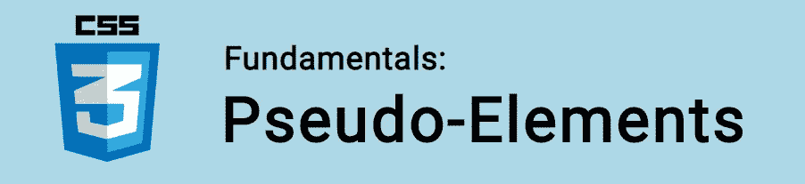

# CSS 基础:伪元素

> 原文：<https://itnext.io/css-fundamentals-pseudo-elements-14cfbc85be02?source=collection_archive---------5----------------------->



在本教程中，我们将学习 CSS 伪元素！

伪元素用于样式化元素的指定部分。例如，我们可以用它来设计一个元素的第一个字母(`::first-letter`)或者第一行(`::first-line`)的样式。或者我们可以使用它在元素的内容之前(`::before`)或之后(`::after`)添加内容。

例如:

```
p::first-letter {
  color: red;
  text-transform: uppercase;
}
```

这里每个`<p>`的第一个字母用`::first-letter`伪元素选择。颜色更改为红色，文本设置为大写。

当您看到伪元素时，您就会知道，因为它们以双冒号`::`开头。虽然也可以使用单个冒号，但惯例是使用双冒号来区分它们和伪类。

🤓*想跟上网络发展的步伐吗？*
🚀想要最新的新闻直接发送到你的收件箱吗？
🎉加入一个不断壮大的设计师&开发者社区！

**在这里订阅我的简讯→**[**https://ease out . EO . page**](https://easeout.eo.page/)

# 伪元素列表

`::first-letter`用于样式化文本块的第一个字母。
`::first-line`用于样式化一个文本块的第一行。
`::before`让你在一个元素前添加内容。
`::after`让你在一个元素后添加内容。
`::selection`目标用户选择的文本。

还有更多，但是它们被认为是实验性的。在本教程中，我们的重点将是这些主要的伪元素。

# *首字母

正如我们前面看到的，`::first-letter`伪元素用于向文本的*首字母*添加样式。

例如，让我们将所有`<p>`元素中文本的第一个字母改为更大的字体:

```
p::first-letter {
  font-size: 150%;
}
```

需要注意的是`::first-letter`只能应用于块级元素。即从新行开始的任何元素&占据页面的整个宽度，例如`<div>`、`<h1>`到`<h6>`、`<p>`等。它不能应用于内嵌元素，如`<span>`或`<code>`。

一个巧妙的技巧是将伪元素选择器与类结合起来:

```
p.summary::first-letter {
  color: red;
}
```

所以这里我们可以用 *summary* 类来设计每段的第一个字母。

# *一线

`::first-line`伪元素用于样式化文本块的第一行。

例如，为了给所有`<p>`元素的第一行一个更粗的字体，我们可以使用如下:

```
p::first-line {
  font-weight: 600;
}
```

请注意，只有可用 CSS 属性的子集可以用于样式化`::first-line.`，通常只有字体、文本&背景相关的属性。

# *之前和之后

这些可能是最常用的伪元素。使用`::before`和`::after`，我们可以在页面上插入内容，而不需要在我们的 HTML 中。最终结果实际上并不在 [DOM](https://developer.mozilla.org/en-US/docs/Web/API/Document_Object_Model/Introduction) 中，尽管它在页面上看起来好像在。

为了说明这一点，请参见下面的 CSS:

```
div::before {   
   content: "before"; 
} div::after {   
   content: "after"; 
}
```

*注意:*`content`属性是必需的，因为它指定了要添加的内容！

这转换成以下 HTML:

```
<div>   
   before   
   *<!-- Everything else in our div -->*   
   after 
</div>
```

## *以前

所以`::before`伪元素可以用来在元素内容之前插入一些内容。

一个常见的用例是在每个`<h1>`元素的内容前添加一个图标*:*

```
h1::before {
  content: url(icon.png);
}
```

使用`content`属性，您可以插入任何种类的内容:

```
p::before {
  content: "Check this out: ");
  color: green;
  font-weight: bold;
}.company::before {
   content: url("images/logo.png");
}
```

## *之后

`::after`伪元素可用于在元素内容之后插入一些内容。

这里我们在每个`<h1>`元素的内容后插入一个图标*:*

```
h1::after {
  content: url(icon.png);
}
```

或者我们可以在任何链接后添加一个箭头:

```
a::after {
  content: "→";
}
```

# *选择

`::selection`伪元素是另一个非常有用的属性。它匹配用户选择的元素部分。

我们可以用它来突出显示文本。这里我们将其设置为灰色背景的绿色:

```
::selection {
  color: green;
  background: grey;
}
```

可以应用到`::selection`的属性有:`color`、`background`、`cursor`和`outline`。

***你准备好让你的 CSS 技能更上一层楼了吗？*** *现在就开始用我的新电子书:*[*《CSS 指南:现代 CSS 完全指南*](https://gum.co/the-css-guide) *。获取从 Flexbox & Grid 等核心概念到动画、架构等更高级主题的最新信息！！*


*现已上市！👉*[gum.co/the-css-guide](https://gum.co/the-css-guide)

# 结论

我们走吧！我们已经了解了如何使用伪元素来设计我们的内容。伪元素太棒了！它们提供了一些非常有用的解决方案，当我们需要对部分元素进行样式化的时候。

# 关于我的一点点..

嘿，我是提姆！👋我是一名开发人员、技术作家和作家。如果你想看我所有的教程，可以在我的个人博客上找到。

我目前正在构建我的[自由职业者完整指南](http://www.easeout.co/freelance)。坏消息是它还不可用！但是如果是你感兴趣的东西，你可以[注册，当它可用时会通知](https://easeout.eo.page/news)👍

感谢阅读🎉