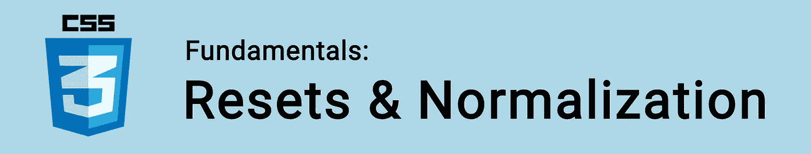

# CSS 基础:重置和规范化

> 原文：<https://itnext.io/css-fundamentals-resets-normalization-eb5f6d2cae4f?source=collection_archive---------0----------------------->



作为开发人员，我们希望我们的 HTML 元素看起来一样，不管使用哪种浏览器来查看我们的页面。不幸的是，由于浏览器的运行方式，情况并非如此。

每个浏览器都有自己的默认样式表，它指定了一些适用于元素的最小规则。

例如:一个无样式的`<h1>`元素通常会有稍微不同的填充量，这取决于使用的浏览器。

大多数情况下，这些默认样式是有用的。然而，由于这些不同的缺省值，在特定的浏览器中会出现错误。

为了避免这些不一致，我们使用 CSS 重置和规范化！

🤓*想与 web dev 保持同步？*🚀*想把最新消息直接发到你的收件箱里吗？
🎉加入一个不断壮大的设计师&开发者社区！*

**在这里订阅我的简讯→**[**https://ease out . EO . page**](https://easeout.eo.page/)

# CSS 重置

CSS 重置将删除所有浏览器的默认样式。让我们根据自己的需要来定义自己想要的风格。

web 上有多种类型的 CSS 重置。到目前为止，最流行的是[迈耶重置](https://meyerweb.com/eric/tools/css/reset/reset.css):

```
/* http://meyerweb.com/eric/tools/css/reset/ 
   v2.0 | 20110126
   License: none (public domain)
*/

html, body, div, span, applet, object, iframe,
h1, h2, h3, h4, h5, h6, p, blockquote, pre,
a, abbr, acronym, address, big, cite, code,
del, dfn, em, img, ins, kbd, q, s, samp,
small, strike, strong, sub, sup, tt, var,
b, u, i, center,
dl, dt, dd, ol, ul, li,
fieldset, form, label, legend,
table, caption, tbody, tfoot, thead, tr, th, td,
article, aside, canvas, details, embed, 
figure, figcaption, footer, header, hgroup, 
menu, nav, output, ruby, section, summary,
time, mark, audio, video {
	margin: 0;
	padding: 0;
	border: 0;
	font-size: 100%;
	font: inherit;
	vertical-align: baseline;
}
```

这里所有的 HTML 标签都没有填充，没有空白，没有边框，相同的字体大小和基线对齐。

虽然在一个公平的环境中开始一个项目是很棒的。如您所见，CSS 重置非常难看&有许多不必要的覆盖。

在 HTML5 之后还有一些更广泛使用的重置，比如理查德·克拉克的 [HTML5 重置](http://html5doctor.com/html-5-reset-stylesheet/)、 [Cleanslate](http://cleanslatecss.com/) & [迷你重置](http://www.vcarrer.com/2010/05/css-mini-reset.html)等等。

许多开发人员采用一种更简单的方法，即删除任何填充和边距:

```
* {
  padding: 0;
  margin: 0;
}
```

# 正常化

规范化是重置的一种替代方法，不太“激进”。它不会移除**所有的默认设置，只会移除浏览器的不一致性，同时保留一组基本的默认设置。**

创建 Normalize.css 就是为了提供这种跨浏览器的一致性。

根据 W3C 标准，它不会从已经跨浏览器保持一致的元素中移除样式。

下面是代码，加了很多注释，这样你就能确切地知道它在做什么:

```
/*! normalize.css v8.0.1 | MIT License | github.com/necolas/normalize.css *//* Document
   ============================================================== *//**
 * 1\. Correct the line height in all browsers.
 * 2\. Prevent adjustments of font size after orientation changes in iOS.
 */html {
  line-height: 1.15; /* 1 */
  -webkit-text-size-adjust: 100%; /* 2 */
}/* Sections
   ============================================================== *//**
 * Remove the margin in all browsers.
 */body {
  margin: 0;
}/**
 * Render the `main` element consistently in IE.
 */main {
  display: block;
}/**
 * Correct the font size and margin on `h1` elements within `section` and
 * `article` contexts in Chrome, Firefox, and Safari.
 */h1 {
  font-size: 2em;
  margin: 0.67em 0;
}/* Grouping content
   ============================================================== *//**
 * 1\. Add the correct box sizing in Firefox.
 * 2\. Show the overflow in Edge and IE.
 */hr {
  box-sizing: content-box; /* 1 */
  height: 0; /* 1 */
  overflow: visible; /* 2 */
}/**
 * 1\. Correct the inheritance and scaling of font size in all browsers.
 * 2\. Correct the odd `em` font sizing in all browsers.
 */pre {
  font-family: monospace, monospace; /* 1 */
  font-size: 1em; /* 2 */
}/* Text-level semantics
   ============================================================== *//**
 * Remove the gray background on active links in IE 10.
 */a {
  background-color: transparent;
}/**
 * 1\. Remove the bottom border in Chrome 57-
 * 2\. Add the correct text decoration in Chrome, Edge, IE, Opera, and Safari.
 */abbr[title] {
  border-bottom: none; /* 1 */
  text-decoration: underline; /* 2 */
  text-decoration: underline dotted; /* 2 */
}/**
 * Add the correct font weight in Chrome, Edge, and Safari.
 */b,
strong {
  font-weight: bolder;
}/**
 * 1\. Correct the inheritance and scaling of font size in all browsers.
 * 2\. Correct the odd `em` font sizing in all browsers.
 */code,
kbd,
samp {
  font-family: monospace, monospace; /* 1 */
  font-size: 1em; /* 2 */
}/**
 * Add the correct font size in all browsers.
 */small {
  font-size: 80%;
}/**
 * Prevent `sub` and `sup` elements from affecting the line height in
 * all browsers.
 */sub,
sup {
  font-size: 75%;
  line-height: 0;
  position: relative;
  vertical-align: baseline;
}sub {
  bottom: -0.25em;
}sup {
  top: -0.5em;
}/* Embedded content
   ============================================================== *//**
 * Remove the border on images inside links in IE 10.
 */img {
  border-style: none;
}/* Forms
   ============================================================== *//**
 * 1\. Change the font styles in all browsers.
 * 2\. Remove the margin in Firefox and Safari.
 */button,
input,
optgroup,
select,
textarea {
  font-family: inherit; /* 1 */
  font-size: 100%; /* 1 */
  line-height: 1.15; /* 1 */
  margin: 0; /* 2 */
}/**
 * Show the overflow in IE.
 * 1\. Show the overflow in Edge.
 */button,
input { /* 1 */
  overflow: visible;
}/**
 * Remove the inheritance of text transform in Edge, Firefox, and IE.
 * 1\. Remove the inheritance of text transform in Firefox.
 */button,
select { /* 1 */
  text-transform: none;
}/**
 * Correct the inability to style clickable types in iOS and Safari.
 */button,
[type="button"],
[type="reset"],
[type="submit"] {
  -webkit-appearance: button;
}/**
 * Remove the inner border and padding in Firefox.
 */button::-moz-focus-inner,
[type="button"]::-moz-focus-inner,
[type="reset"]::-moz-focus-inner,
[type="submit"]::-moz-focus-inner {
  border-style: none;
  padding: 0;
}/**
 * Restore the focus styles unset by the previous rule.
 */button:-moz-focusring,
[type="button"]:-moz-focusring,
[type="reset"]:-moz-focusring,
[type="submit"]:-moz-focusring {
  outline: 1px dotted ButtonText;
}/**
 * Correct the padding in Firefox.
 */fieldset {
  padding: 0.35em 0.75em 0.625em;
}/**
 * 1\. Correct the text wrapping in Edge and IE.
 * 2\. Correct the color inheritance from `fieldset` elements in IE.
 * 3\. Remove the padding so developers are not caught out when they zero out
 *    `fieldset` elements in all browsers.
 */legend {
  box-sizing: border-box; /* 1 */
  color: inherit; /* 2 */
  display: table; /* 1 */
  max-width: 100%; /* 1 */
  padding: 0; /* 3 */
  white-space: normal; /* 1 */
}/**
 * Add the correct vertical alignment in Chrome, Firefox, and Opera.
 */progress {
  vertical-align: baseline;
}/**
 * Remove the default vertical scrollbar in IE 10+.
 */textarea {
  overflow: auto;
}/**
 * 1\. Add the correct box sizing in IE 10.
 * 2\. Remove the padding in IE 10.
 */[type="checkbox"],
[type="radio"] {
  box-sizing: border-box; /* 1 */
  padding: 0; /* 2 */
}/**
 * Correct the cursor style of increment and decrement buttons in Chrome.
 */[type="number"]::-webkit-inner-spin-button,
[type="number"]::-webkit-outer-spin-button {
  height: auto;
}/**
 * 1\. Correct the odd appearance in Chrome and Safari.
 * 2\. Correct the outline style in Safari.
 */[type="search"] {
  -webkit-appearance: textfield; /* 1 */
  outline-offset: -2px; /* 2 */
}/**
 * Remove the inner padding in Chrome and Safari on macOS.
 */[type="search"]::-webkit-search-decoration {
  -webkit-appearance: none;
}/**
 * 1\. Correct the inability to style clickable types in iOS and Safari.
 * 2\. Change font properties to `inherit` in Safari.
 */::-webkit-file-upload-button {
  -webkit-appearance: button; /* 1 */
  font: inherit; /* 2 */
}/* Interactive
   ============================================================== *//*
 * Add the correct display in Edge, IE 10+, and Firefox.
 */details {
  display: block;
}/*
 * Add the correct display in all browsers.
 */summary {
  display: list-item;
}/* Misc
   ============================================================== *//**
 * Add the correct display in IE 10+.
 */template {
  display: none;
}/**
 * Add the correct display in IE 10.
 */[hidden] {
  display: none;
}
```

# 包扎

至于该用哪个，真的由你自己决定！你也可以选择两者的结合，甚至自己写。

然而，根据需要在几次重置中运行 Normalize CSS & peppering 不会出错👌。

***你准备好让你的 CSS 技能更上一层楼了吗？*** *现在就开始用我的新电子书:*[*《CSS 指南:现代 CSS 完全指南*](https://gum.co/the-css-guide) *。获取从 Flexbox & Grid 等核心概念到动画、架构等更高级主题的最新信息！！*


*现已上市！👉*[gum.co/the-css-guide](https://gum.co/the-css-guide)

# 关于我的一点点..

嘿，我是提姆！👋我是一名开发人员、技术作家和作家。如果你想看我所有的教程，可以在我的个人博客上找到。

我目前正在构建我的[自由职业者完整指南](http://www.easeout.co/freelance)。坏消息是它还不可用！但是如果是你感兴趣的东西，你可以[注册，当它可用时会通知](https://easeout.eo.page/news)👍

感谢阅读🎉