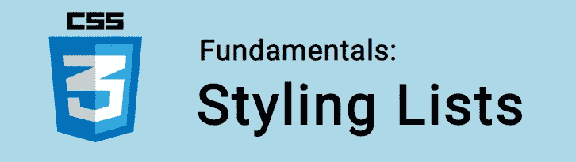

# CSS 基础:样式列表

> 原文：<https://itnext.io/css-fundamentals-styling-lists-ae54e99bf8c6?source=collection_archive---------4----------------------->



在本教程中，我们将学习如何用 CSS 样式化列表！

记住，在 HTML 中，我们有两种列表类型:

**无序列表**

*   咖啡
*   茶
*   饼干

**有序列表** `<ol>` —列表项用数字(或字母 i. ii)定义。三。):

1-咖啡
2-茶
3-饼干

而且每一件物品都被赋予了`<li>`的标签，就像这样:

```
<ol>
  <li>Coffee</li>
  <li>Tea</li>
  <li>Biscuits</li>
</ol>
```

我们在构建网站的时候一直在使用列表！公平地说，大多数导航菜单本质上是 HTML 列表，使用 CSS 进行了样式化。

🤓想要了解最新的 web 开发吗？🚀想要最新的新闻直接发送到你的收件箱吗？
🎉加入一个不断壮大的设计师&开发者社区！

**在这里订阅我的简讯→**[**https://ease out . EO . page**](https://easeout.eo.page/)

# 如何用 CSS 设计列表样式

CSS 有几个属性可以用来设计样式。我们可以设置不同的列表项标记，使用图像作为标记，以及添加颜色和背景色。

让我们来看看语法！

## 列表样式类型

我们使用`list-style-type`为我们的列表设置一个标记:

```
li {
  list-style-type: square;
}
```

事实上有很多可能的值！如`circle`、`square`、`decimal`、`upper-roman`、`none`。查看所有[列表样式类型](https://developer.mozilla.org/en-US/docs/Web/CSS/list-style-type)。

值得一提的是，如果你正在设置列表标记的颜色——它将默认为元素的颜色。

此外，您将经常使用`list-style-type:none`属性来完全删除标记！

## 列表样式位置

使用`list-style-position`可以定位列表内容的标记`outside`(默认)或`inside`:

```
li {
  list-style-position: outside;
}li {
  list-style-position: inside;
}
```

例如，当对文本列表使用`inside`时，每个标记都将包含在文本框中，从而缩进每个列表项的第一行文本。

## 列表样式图像

`list-style-image`可用于放置自定义图像作为标记:

```
li {
  list-style-image: url(goldstar.png);
}
```

URL 指向图像的位置。

最好还设置一个`list-style-type`作为后备，以防图像不可用。

## 列表样式(速记)

`list-style`速记属性让我们在一个声明中指定我们的`list-style-type`、`list-style-position`、&、`list-style-image`。

例如:

```
ul {
 list-style: square inside url(“goldstar.png”);
}
```

这相当于:

```
ul {
 list-style-type: square;
 list-style-position: inside;
 list-style-image: url(goldstar.png);
}
```

当使用这个简写属性时，要注意顺序:`list-style-type`，然后是`list-style-position`，最后是`list-style-image`。如果缺少这些属性中的任何一个，它们将恢复到默认状态。

***你准备好让你的 CSS 技能更上一层楼了吗？*** *现在就开始用我的新电子书:*[*CSS 指南:现代 CSS 完全指南*](https://gum.co/the-css-guide) *。获取从 Flexbox & Grid 等核心概念到动画、架构&等更高级主题的最新信息！！*


*现已上市！👉*gum.co/the-css-guide

# 关于我的一点点..

嘿，我是提姆！👋我是一名开发人员、技术作家和作家。如果你想看我所有的教程，可以在我的个人博客上找到。

我目前正致力于构建我的[自由职业完整指南](http://www.easeout.co/freelance)。坏消息是它还不可用！但是如果是你感兴趣的东西，你可以[注册，当它可用的时候会通知你👍](https://easeout.eo.page/news)

感谢阅读🎉