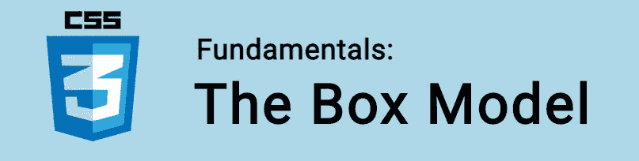
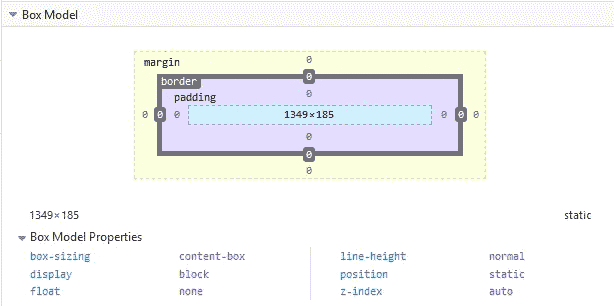

# CSS 基础:盒子模型

> 原文：<https://itnext.io/css-fundamentals-the-box-model-3b73a966f6d4?source=collection_archive---------4----------------------->



在本教程中，我们将学习 CSS 盒子模型！

理解盒子模型是 CSS 中要掌握的一个关键概念。对于许多人来说，学习盒子模型提供了一个真正清晰的时刻 CSS 布局开始真正有意义了！

需要记住的是，网页设计中的每个元素都是一个矩形框。

🤓*想跟上网络发展的步伐吗？*
🚀*想要将最新消息直接发送到您的收件箱？
🎉加入一个不断壮大的设计师&开发者社区！*

**在这里订阅我的简讯→**[**https://ease out . EO . page**](https://easeout.eo.page/)

# 盒子模型

当呈现文档时，浏览器将每个元素视为一个矩形框，这就是框模型。CSS 根据几个属性确定盒子的大小:

*   内容
*   填料
*   边境
*   边缘

也许最好的形象化方法是打开您的浏览器 DevTools，看看它是如何显示的:



在这里你可以检查页面上任何元素的盒子模型！通过右键单击一个元素并选择 *Inspect* 来检查它，然后查看 DevTools 中的布局面板。

浅蓝色的区域是内容框，在它的周围是填充，然后是边框，最后是边距。这是我们的盒子！其中我们有:

**内容:**这是显示您的内容的区域，可以使用*宽度* & *高度*属性来调整大小。它通常是文本和图像出现的地方。

**填充**:填充位于内容区域周围，它是透明的，其大小使用*填充*属性设置。

**边框:**边框框环绕填充(如果有的话)和内容。它的大小和样式是使用 *border* 属性设置的。

**Margin:**Margin 清除边框之外的区域，在这个框和其他元素之间用空白环绕内容、填充和边框。使用*边距*属性设置其大小。

使用盒子模型，我们还可以在元素周围添加边框，并定义元素之间的空间。

通常，当您在元素上设置宽度(或高度)时，这些规则将应用于**内容区域**。任何填充、边框或边距都将添加到该宽度和高度中，以给出该框的总大小。

## 计算盒子大小

让我们用一个例子来看看我们如何计算我们的盒子的大小:

```
.box {
  width: 300px;
  height: 200px;
  margin: 10px;
  padding: 25px;
  border: 2px solid black;
}
```

用上面的 CSS，我们的盒子宽度其实是 354px (300 + 25 + 25 + 2+ 2)，高度是 254px (200 + 25 + 25 + 2+ 2)。因为填充和边框被添加到用于内容区域的宽度。

边距是**而不是**计入盒子的大小。它影响页面上的空间，但只影响框外的空间。框的区域止于边框，没有延伸到页边距。

*注意:*如果填充或边框未声明，它们要么是零(如果您使用了 css 重置或框架)，要么是浏览器默认值(可能不是零)。

# CSS 框大小调整

CSS `box-sizing`属性让我们在计算框大小时包括填充和边框——也就是总的框宽&高度。

## 无框尺寸

正如我们已经看到的，元素的宽度和高度是这样计算的:

*宽度+填充+边框=实际元素宽度
高度+填充+边框=实际元素高度*

因此，当您设置元素的宽度或高度时，它通常会比您想象的要大(因为元素的边框和填充被添加到指定的宽度和高度)。

在下面的例子中，两个元素的大小不同，因为 *item2* 指定了填充:

```
.item1 {
  width: 300px;
  height: 200px;
  border: 3px solid green;
}.item2 {
  width: 300px;
  height: 200px;
  padding: 50px;
  border: 3px solid red;
}
```

`box-sizing`属性解决了这个问题！

## 使用框尺寸

用`box-sizing` CSS 在元素的总宽度和高度中包含填充和边框。

在一个元素上设置`box-sizing: border-box;`，就像这样:

```
.item1 {
  width: 300px;
  height: 200px;
  border: 3px solid green;
  box-sizing: border-box;
}

.item2 {
  width: 300px;
  height: 200px;
  padding: 50px;
  border: 3px solid red;
  box-sizing: border-box;
}
```

现在，当我们布置元素时，会更有意义。因为它们以更直观的方式调整大小，填充和边框包含在总高度/宽度中。

许多开发人员希望这适用于他们页面上的所有元素。确保这一点的简单方法是实现以下 CSS 规则:

```
* {
  box-sizing: border-box;
}
```

***你准备好让你的 CSS 技能更上一层楼了吗？*** *现在就开始用我的新电子书:*[*《CSS 指南:现代 CSS 完全指南*](https://gum.co/the-css-guide) *。获取从 Flexbox & Grid 等核心概念到动画、架构&等更高级主题的最新信息！！*


*现已上市！👉*[gum.co/the-css-guide](https://gum.co/the-css-guide)

# 结论

这就对了。我们已经看了盒子模型&它是如何定义的，以及如何计算元素的盒子大小&如何应用`box-sizing`属性来更直观地处理我们的尺寸。

# 关于我的一点点..

嘿，我是提姆！👋我是一名开发人员、技术作家和作家。如果你想看我所有的教程，可以在我的个人博客上找到。

我目前正在构建我的[自由职业者完整指南](http://www.easeout.co/freelance)。坏消息是它还不可用！但是如果你对它感兴趣，你可以[注册，当它可用时会通知你](https://easeout.eo.page/news)👍

感谢阅读🎉