# CSS 基础:CSS 网格指南

> 原文：<https://itnext.io/css-fundamentals-the-css-grid-guide-1efe31542cfe?source=collection_archive---------7----------------------->

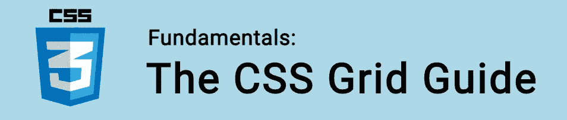

CSS Grid 是一个现代化的布局系统，我们可以在布局页面时使用。

经常被拿来和 [Flexbox](https://www.easeout.co/blog/2020-05-22-the-flexbox-guide) 比较。虽然它们都是处理复杂布局的优秀系统，但有一个主要区别:CSS Grid 处理二维(行**和**列)，而 Flexbox 只处理一维(行**或**列)。

如果您只需要将布局定义为行或列，那么 flexbox 可能会满足您的需求。当在两个维度上工作时——是时候使用 CSS 网格了！

🤓*想了解最新的 web 开发吗？*
🚀想要将最新消息直接发送到您的收件箱吗？
🎉加入一个不断壮大的设计师&开发者社区！

**在这里订阅我的简讯→**[**https://ease out . EO . page**](https://easeout.eo.page/)

# CSS 网格基础

我们通过使 HTML 元素成为网格容器来激活网格布局:

我们的 HTML:

```
<div class="grid-container">
  <!-- content -->
</div>
```

在我们的 CSS 中，我们简单地将其`display`属性设置为*网格*:

```
.grid-container {
  display: grid;
}
```

网格布局由一个父元素和一个或多个子元素组成。

有一组属性可以应用于容器元素以及任何子元素(网格中的每个单独的项目)。

在本指南中，我们将使用以下代码:

**HTML:**

```
<div class="grid-container">
  <div class="grid-item">1</div>
  <div class="grid-item">2</div>
  <div class="grid-item">3</div>
  <div class="grid-item">4</div>
  <div class="grid-item">5</div>
  <div class="grid-item">6</div>
  <div class="grid-item">7</div>
  <div class="grid-item">8</div>
</div>
```

我们的 **CSS** 风格:

```
* {
  font-family: monospace;
  text-align: center;
  font-size: 44px;
}.grid-container {
  display: grid;
  padding: 30px;
  background-color: pink;
  border: 2px solid #000;
}.grid-container > div {
  background-color: yellow;
  border: 2px solid #000;
}
```

# 定义列和行

最常见的容器属性是`grid-template-columns`和`grid-template-rows.`，通过这些属性，我们定义了列的数量&行以及每一行的宽度。

例如，让我们告诉网格以 200px 宽的 4 列、150px 高的 2 行来布局它的项目(子元素)。

```
.grid-container {
  display: grid;
  grid-template-columns: 200px 200px 200px 200px;
  grid-template-rows: 150px 150px;
}
```

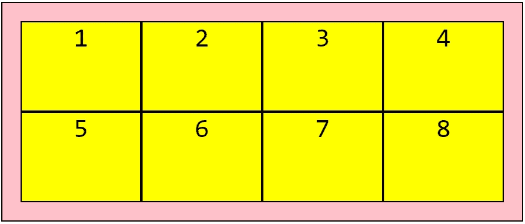

现在让我们把它变成一个更小的 3x3 网格:

```
.grid-container {
  display: grid;
  grid-template-columns: 150px 150px 150px;
  grid-template-rows: 100px 100px 100px;
}
```

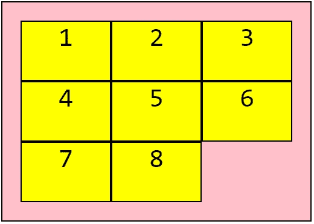

# 自动标注尺寸

通常，您将使用没有固定大小的元素。例如，您可以有一个固定的导航栏，后跟一个灵活的内容部分，然后是一个固定的页脚部分。为此，我们可以使用`auto`，布局将适应我们内容的大小:

```
.grid-container {
  display: grid;
  grid-template-rows: 50px auto 150px;
}
```

# 在网格项目之间添加空间

我们可以使用`grid-column-gap`和/或`grid-row-gap`来增加网格项目之间的间距:

```
.grid-container {
  display: grid;
  grid-template-columns: 100px 200px 100px;
  grid-template-rows: 100px 50px;
  grid-column-gap: 25px;
  grid-row-gap: 25px;
}
```

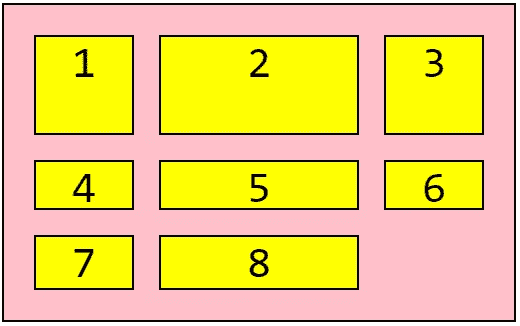

我们也可以使用简写方式`grid-gap`来同时设置这两个选项:

```
.grid-container {
  display: grid;
  grid-template-columns: 100px 200px 100px;
  grid-template-rows: 100px 50px;
  grid-gap: 25px;
}
```

# 网格项目定位

我们可以使用以下属性控制每个网格项在列或行中占用的空间:

*   `grid-column-start`
*   `grid-column-end`
*   `grid-row-start`
*   `grid-row-end`

让我们看一个例子:

```
.grid-container {
  display: grid;
  grid-template-columns: 200px 200px 200px 200px;
  grid-template-rows: 150px 150px;
}
.grid-item1 {
  grid-column-start: 1;
  grid-column-end: 3;
}
.grid-item6 {
  grid-column-start: 3;
  grid-column-end: 5;
}
```

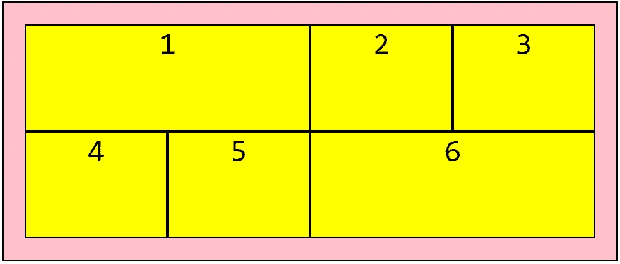

下面是我们在网格的第一和第六项中添加的类。

这些数字对应于分隔每列的垂直线。所以通过设置`grid-column-start`为 1 和`grid-column-end`为 3，我们告诉我们的元素从第一行开始&在第三行结束。

类似地，我们已经告诉我们的第六个元素从第三行开始，在第五行结束。

这当然也适用于`grid-row-start`和`grid-row-end`，单元格是跨行而不是列扩展的。

## 项目位置速记

我们可以使用`grid-column` & `grid-row`的简写属性重复上面的内容，就像这样:

```
.grid-container {
  display: grid;
  grid-template-columns: 200px 200px 200px 200px;
  grid-template-rows: 150px 150px;
}
.grid-item1 {
  grid-column: 1 / 3;
}
.grid-item6 {
  grid-column: 3 / 5;
}
```

我们可以进一步将`grid-area`作为`grid-column`和`grid-row`的简写。这只适用于我们需要一个项目跨越两个行&列**的情况:**

```
.grid-item1 {
  grid-row: 1 / 4;
  grid-column: 3 / 5;
}
```

会变成:

```
.grid-item1 {
  grid-area: 1 / 3 / 4 / 5;
}
```

顺序为:`grid-row-start`>`grid-column-start`>`grid-row-end`>`grid-column-end`。

# 使用'`span' to position items`

我们在摆放商品时的另一个选择是`span`:

```
.grid-container {
  display: grid;
  grid-template-columns: 200px 200px 200px 200px;
  grid-template-rows: 150px 150px;
}
.grid-item1 {
  grid-column: 1 / span 2;
}
.grid-item6 {
  grid-column: 3 / span 2;
}
```

`grid-column: 1 / span 2`从第 1 行开始，跨越 2 列。

# 使用分数单位

网格的最大好处之一是能够轻松创建高度灵活的布局。

分数单位使我们能够在不需要指定固定尺寸的情况下构建布局。

例如，让我们将一个网格分成 3 个等宽的列，每个列占可用空间的 1/3:

```
.grid-container {
  grid-template-columns: 1fr 1fr 1fr;
}
```

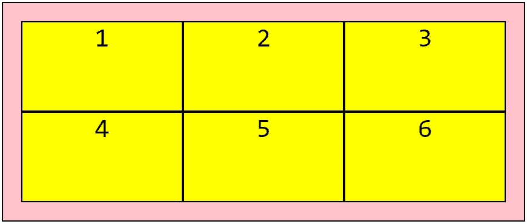

太简单了！

# 使用其他 CSS 单元

我们可以使用任何 CSS [长度单位](https://www.easeout.co/blog/2020-04-30-css-units)。因此，请随意混合使用百分比、像素、rem、em 和分数:

```
.grid-container {
  grid-template-columns: 2rem 25% 2fr 1fr
}
```

# 使用`repeat()`

我们可以使用`repeat()`来指定一行或一列将被重复的次数，以及每个的长度。

这是一种快速组合布局的简便方法&它还减少了代码行！例如，您可以如下定义 3 个等宽的列:

```
.grid-container {
  grid-template-columns: repeat(3, 1fr);
}
```

# 使用最小最大值()

我们使用`minmax()`来指定网格轨迹的最小或最大宽度。

假设您想要一个介于 100 像素和 300 像素之间的列，后跟一个 1fr 列:

```
.grid-container {
  grid-template-columns: minmax(100px, 300px) 1fr;
}
```

最小值必须小于最大值。并且`fr`单位不能用于最小值，但是可以用于最大值！

通过使用`1fr`作为最大值，您将确保轨迹扩展并占用可用空间:

```
.grid-container {   
  grid-template-columns: minmax(250px, 1fr) 1fr;   
}
```

通过这种方式，`minmax()`允许我们创建适应可用空间的网格轨迹，但不会缩小到小于指定的大小。

现在，如果调整浏览器的大小，第一列不会缩小到 250 像素以下。

您也可以使用`auto`、`min-content`和`max-content`关键字作为最小值或最大值。

# 使用对齐内容

我们使用`justify-content`来对齐容器内的整个网格。

我们可以使用许多价值观:

*   `space-evenly`
*   `space-around`
*   `space-between`
*   `center`
*   `start`
*   `end`

请记住，网格宽度必须小于容器宽度，这样`justify-content`才能工作！

让我们来看一个例子:

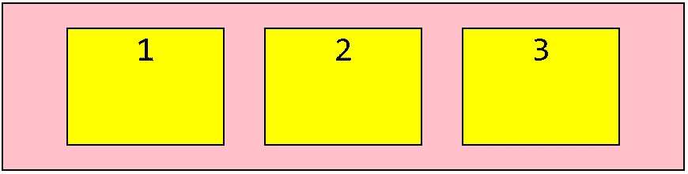

```
.grid-container {
   display: grid;
   justify-content: space-evenly;
}
```

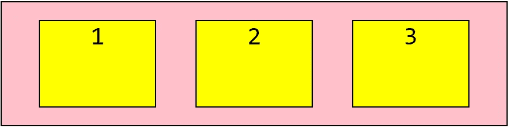

```
.grid-container {
   display: grid;
   justify-content: space-around;
}
```

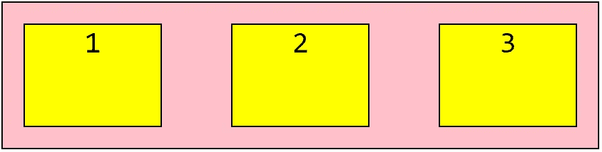

```
.grid-container {
   display: grid;
   justify-content: space-between;
}
```

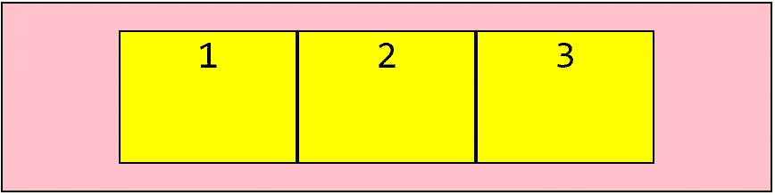

```
.grid-container {
   display: grid;
   justify-content: center;
}
```

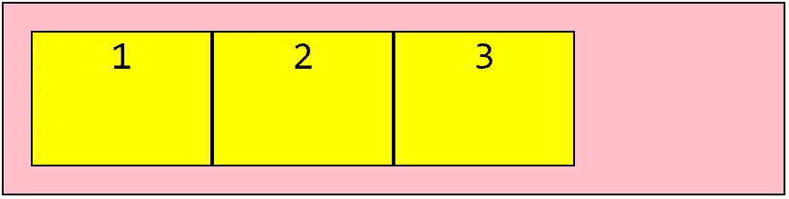

```
.grid-container {
   display: grid;
   justify-content: start;
}
```

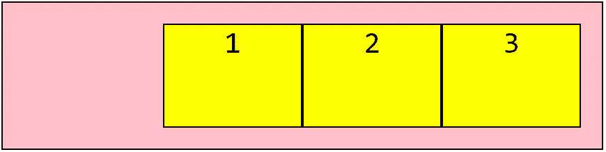

```
.grid-container {
   display: grid;
   justify-content: end;
}
```

# 使用对齐内容

我们使用`align-content`属性来*垂直*对齐容器内的整个网格。

我们的网格高度需要小于容器高度，这个属性才能起作用。


```
.grid-container {
   display: grid;
   align-content: space-evenly;
}
```

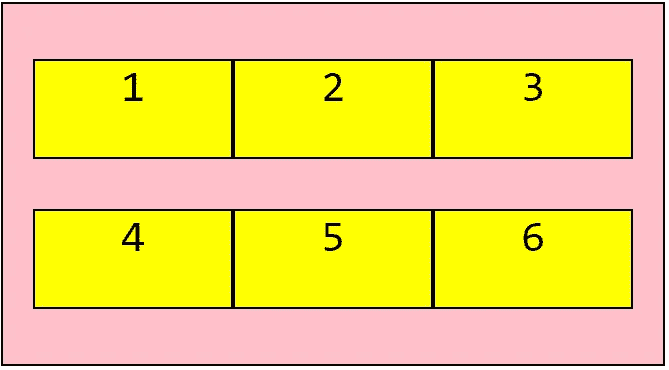

```
.grid-container {
   display: grid;
   align-content: space-around;
}
```

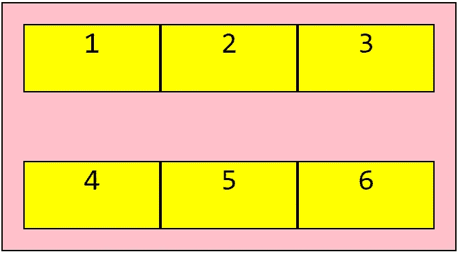

```
.grid-container {
   display: grid;
   align-content: space-between;
}
```

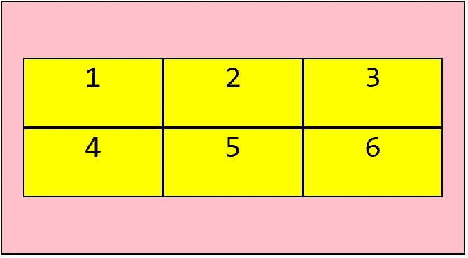

```
.grid-container {
   display: grid;
   align-content: center;
}
```


```
.grid-container {
   display: grid;
   align-content: start;
}
```

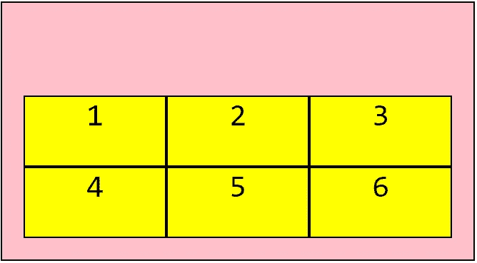

```
.grid-container {
   display: grid;
   align-content: end;
}
```

# 使用`grid-template-areas`

我们可以使用`grid-template-areas`来定义命名区域&在网格内移动它们，还可以跨多行和/或多列扩展网格项目。

让我们使用`grid-template-areas`来构建一个典型的布局，在顶部有一个标题，在主要内容的左边有一个侧边栏，后面有一个页脚:

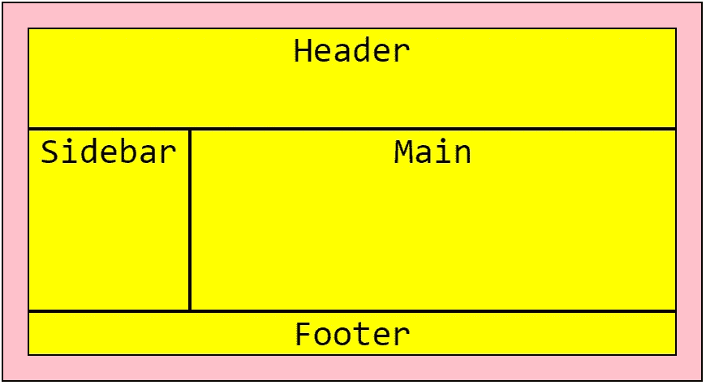

使用的代码:

**HTML:**

```
<div class="grid-container">
  <main>
    Main
  </main>
  <aside>
    Sidebar
  </aside>
  <footer>
    Footer
  </footer>
  <header>
    Header
  </header>
</div>
```

**CSS:**

```
.grid-container {
  display: grid;
  grid-template-columns: 200px 200px 200px 200px;
  grid-template-rows: 125px 225px;
  grid-template-areas:
    "header header header header"
    "sidebar main main main"
    "footer footer footer footer";
}main {
  grid-area: main;
}
aside {
  grid-area: sidebar;
}
header {
  grid-area: header;
}
footer {
  grid-area: footer;
}
```

请注意，尽管标题是 HTML 中的最后一个元素，但它仍然位于页面的顶部。这是因为我们已经使用`grid-area`属性定义了它在 CSS 中的位置。

## 使其具有响应性

如果我们想让侧边栏移动到移动设备上主内容的下方，我们可以使用媒体查询轻松实现:

```
@media (max-width: 500px) {
  .grid-container {
    grid-template-columns: 1fr;
    grid-template-areas:
      "header"
      "main"
      "sidebar"
      "footer";
  }
}
```

***你准备好让你的 CSS 技能更上一层楼了吗？*** *现在就开始用我的新电子书:*[*《CSS 指南:现代 CSS 完全指南*](https://gum.co/the-css-guide) *。获取从 Flexbox & Grid 等核心概念到动画、架构等更高级主题的最新信息！！*


*现已上市！👉*[gum.co/the-css-guide](https://gum.co/the-css-guide)

# 关于我的一点点..

嘿，我是提姆！👋我是一名开发人员、技术作家和作家。如果你想看我所有的教程，可以在我的个人博客上找到。

我目前正在构建我的[自由职业者完整指南](http://www.easeout.co/freelance)。坏消息是它还不可用！但是如果是你感兴趣的东西，你可以[注册，当它可用时会通知](https://easeout.eo.page/news)👍

感谢阅读🎉