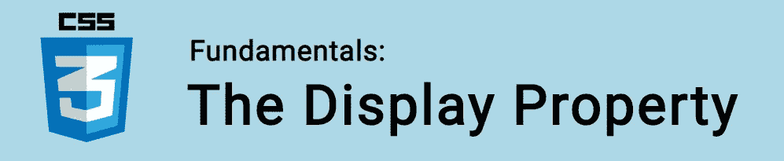
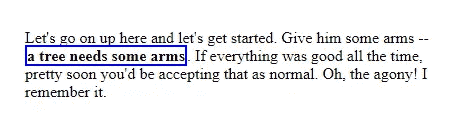

# CSS 基础:显示属性

> 原文：<https://itnext.io/css-fundamentals-the-display-property-6d31f898c2bf?source=collection_archive---------8----------------------->



属性可能是 CSS 中最重要的属性之一。

HTML 文档中的每一个元素都被当作一个框来对待，而决定这些框如何显示的是属性。

这个属性可以使用大量的值。但是，其中只有一些是常用的，我们将重点介绍这些:

*   `inline`
*   `inline-block`
*   `block`
*   `flexbox`
*   `grid`
*   `none`
*   `table`

🤓想要与 web dev 保持同步吗？
🚀想要将最新消息直接发送到您的收件箱吗？
🎉加入一个不断壮大的设计师&开发者社区！

**在这里订阅我的简讯→**[**https://ease out . EO . page**](https://easeout.eo.page/)

# 在一条直线上的

`inline`值是 CSS 中每个元素的默认值。

```
display: inline;
```

形象化`inline`的一个简洁方法是想象一个段落，其中包含一些用粗体`<b>`或`<span>`标记包裹的单词:



这里的`<span>`元素应用了蓝色边框，并且文本流没有中断。它和文本放在一起。

我们可以对内嵌元素应用填充和边距，但是周围的元素只会在水平方向(而不是垂直方向)被推开。另外，`height`和`width`被`inline`元素忽略。

除非另有说明，每个 HTML 标签都以内联方式显示，只有少数例外，如`div`、`p`和`section`，它们被设置为`block`。

# 内嵌块

```
display: inline-block;
```

带有`inline-block`的元素与`inline`非常相似，但是`width`和`height`可以按规定应用。

# 街区

```
display: block;
```

如上所述，默认情况下，许多元素被设置为`block`。它们是布局元素，如`<div>`、`<section>`和`<ul>`。还有文本元素，如`<p>`和`<h1>`。

块级元素在垂直方向上一个接一个地堆叠。默认情况下，每个元素占据 100%的页面宽度。

如果指定，分配给`width`和`height`以及`margin`和`padding`的值都将被遵守。

# Flexbox

使用 flexbox 时也使用`display`属性:

```
display: flex; 
```

查看[柔性盒指南](https://www.easeout.co/blog/2020-05-22-the-flexbox-guide)以了解更多关于此方法的信息。

# 格子

当使用 CSS Grid 时，我们还要设置 display 属性:

```
display: grid;
```

查看完整的 [CSS 网格指南](https://www.easeout.co/blog/2020-05-29-the-css-grid-guide)以了解关于此方法的更多信息。

# `None`

```
display: none;
```

我们使用`display: none`让一个元素消失。

它仍然加载在我们的 HTML 中，只是不被浏览器显示。

# 表格值

```
display: table;
```

随着 flexbox & grid 等现代布局方法的出现，`<table>` HTML 元素有点过时了。

但是，如果我们愿意的话，我们可以使用一些显示值让非表格元素表现得像表格元素一样:

```
element {
  display: table;
  display: table-cell;
  display: table-column;
  display: table-row;
  display: table-caption;
}
```

我们可以这样使用它:

```
<div style="display: table;">
  <div style="display: table-row;">
    <div style="display: table-cell;">
      Cell content.
    </div>
  </div>
</div>
```

这不是一种常见的技术，因为它会导致混乱的标记，但是它可能有奇怪的用例。

***你准备好让你的 CSS 技能更上一层楼了吗？*** *现在就开始用我的新电子书:*[*《CSS 指南:现代 CSS 完全指南*](https://gum.co/the-css-guide) *。从 Flexbox & Grid 等核心概念到动画、架构&等更高级的主题，获取一切最新信息！！*


*现已上市！👉*[gum.co/the-css-guide](https://gum.co/the-css-guide)

# 关于我的一点点..

嘿，我是提姆！👋我是一名开发人员、技术作家和作家。如果你想看我所有的教程，可以在我的个人博客上找到。

我目前正在构建我的[自由职业者完整指南](http://www.easeout.co/freelance)。坏消息是它还不可用！但是如果你对它感兴趣，你可以[注册，当它可用时会通知你](https://easeout.eo.page/news)👍

感谢阅读🎉