# CSS 基础:Flexbox 指南

> 原文：<https://itnext.io/css-fundamentals-the-flexbox-guide-5eb7440f706e?source=collection_archive---------4----------------------->

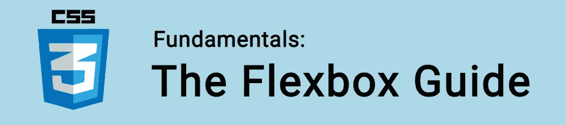

在本教程中，我们将学习如何使用 Flexbox 为我们的布局增加大量的灵活性！

我们使用*柔性盒模块(* aka。Flexbox)，在容器中创建响应元素，这些元素可以根据屏幕大小自动排列。它还有许多属性，让我们可以完全控制页面上项目之间的空间分配。

也称为“一维”模型，Flexbox 非常适合单向布局元素(行或列)。 [CSS 网格布局](https://www.easeout.co/blog/2020-05-29-the-css-grid-guide)是“二维”模型，更适合同时在两个方向布局元素。

Flexbox 为我们提供了一些非常强大的功能，我们将在本指南中探索这些功能！

🤓*想了解最新的 web 开发吗？*
🚀*想要将最新消息直接发送到您的收件箱吗？
🎉加入一个不断壮大的设计师&开发者社区！*

**在这里订阅我的简讯→**[**https://ease out . EO . page**](https://easeout.eo.page/)

# Flexbox 布局

这里我们有一个容器(粉红色)，包含许多元素(在黄色框中):

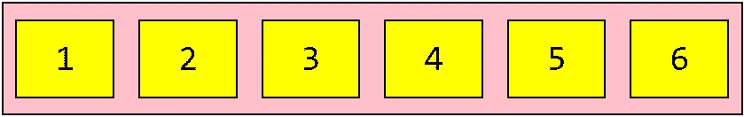

**HTML:**

```
<div class="flex-container">
  <div>1</div>
  <div>2</div>
  <div>3</div>  
  <div>4</div>
  <div>5</div>
  <div>6</div> 
</div>
```

**CSS:**

```
* {
  font-family: monospace;
  text-align: center;
  font-size: 44px;
}.flex-container {
  display: flex;
  flex-wrap: nowrap;
  background-color: pink;
  border: 2px solid #000;
}.flex-container > div {
  width: 100px;
  margin: 20px 15px;
  padding: 10px;
  line-height: 75px;
  background-color: yellow;
  border: 2px solid #000;
}
```

这是我们将在整个指南中使用的代码。现在让我们通过检查关键属性来分解它！

# 容器元素

使用 Flexbox 的第一步是定义一个 flex 容器。我们通过将`display`属性设置为 *flex* 来实现这一点，如下所示:

```
.flex-container {
  display: flex;
}
```

我们现在有许多可用的 flex 容器属性:

*   `flex-direction`
*   `flex-wrap`
*   `flex-flow`
*   `justify-content`
*   `align-items`
*   `align-content`

设置容器还会为其所有直接子容器(称为 flex items)启用上下文。稍后将详细介绍。现在，让我们关注 flex 容器的属性！

# 弯曲方向

属性定义了主轴，从而定义了放置项目的方向。

柔性物品或者与*行*水平放置，或者与*列*垂直放置。

使用*行*值以水平顺序放置物品(从左到右):

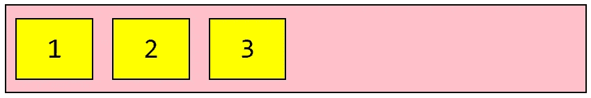

```
.flex-container {
  display: flex;
  flex-direction: row;
}
```

用*排倒*可以颠倒顺序(项目从右到左):

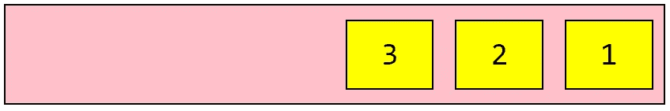

```
.flex-container {
  display: flex;
  flex-direction: row-reverse;
}
```

为了垂直放置我们的项目(从上到下)，我们使用*列的*值:

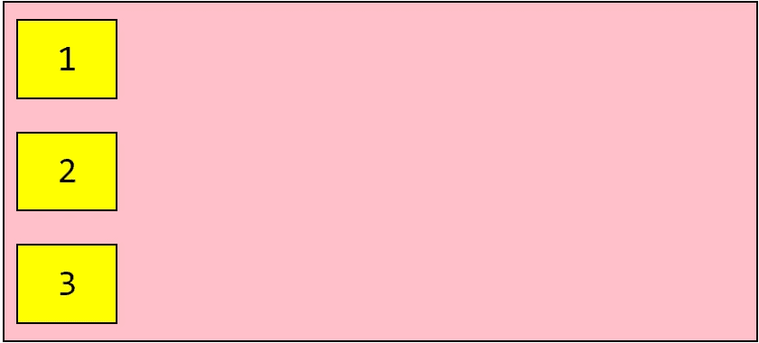

```
.flex-container {
  display: flex;
  flex-direction: column;
}
```

*倒柱*将颠倒顺序(自下而上):

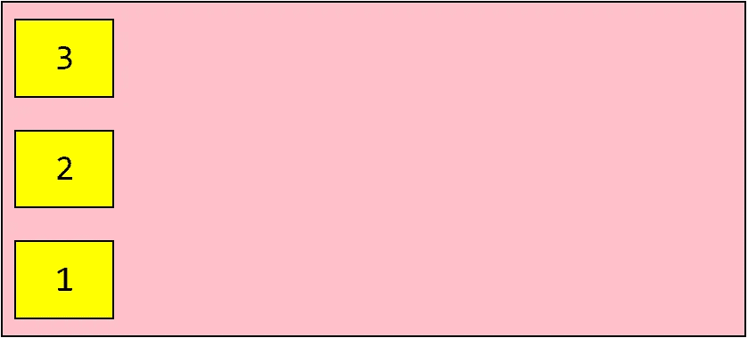

```
.flex-container {
  display: flex;
  flex-direction: column-reverse;
}
```

# 柔性包装

属性让我们选择我们的项目是否应该换行。

默认情况下，flex 项目将总是试图适合一行:

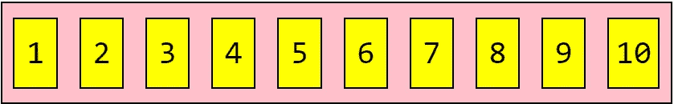

```
.flex-container {
  display: flex;
  flex-wrap: nowrap;
}
```

注意，因为是默认设置，所以不需要设置 *nowrap* 。我们的弹性物品不会包装。

当我们设置 *wrap* 值时，我们的 flex 项目将在必要时换行:

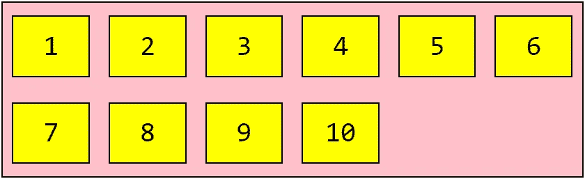

```
.flex-container {
  display: flex;
  flex-wrap: wrap;
}
```

我们也可以使用*缠绕反转*来反转顺序:

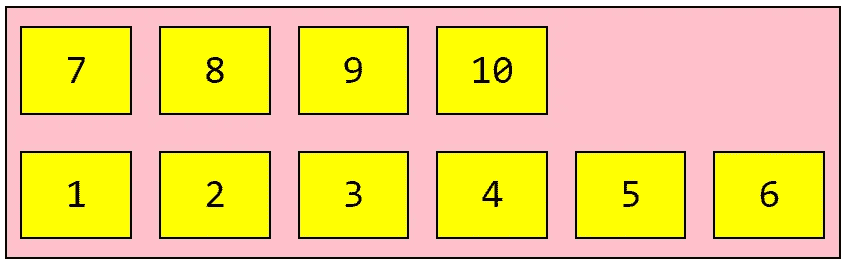

```
.flex-container {
  display: flex;
  flex-wrap: wrap-reverse;
}
```

# 柔性流

`flex-flow`属性是`flex-direction`和`flex-wrap`属性的简称。默认值为`row nowrap`。

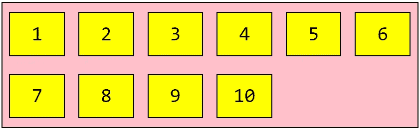

```
.flex-container {
  display: flex;
  flex-flow: row wrap;
}
```

# 调整内容

`justify-content`属性定义伸缩项在主轴上的对齐方式:

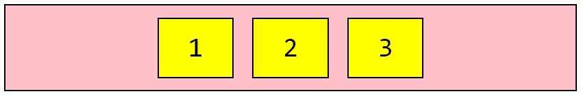

```
.flex-container {
  display: flex;
  justify-content: center;
}
```

让我们的 flex 产品居中就是这么简单！

我们还可以使用 *flex-start* 将我们的项目放在容器的开头(这是默认设置):

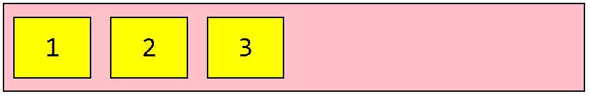

```
.flex-container {
  display: flex;
  justify-content: flex-start;
}
```

要将我们的项目放在最后，使用 *flex-end:*

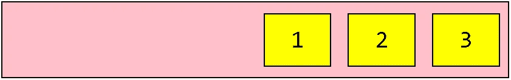

```
.flex-container {
  display: flex;
  justify-content: flex-end;
}
```

使用*空格环绕*显示前后有空格的伸缩项目:


```
.flex-container {
  display: flex;
  justify-content: space-around;
}
```

这与 *space-between* 不同，后者在我们的 flex 项目之间分配空间:

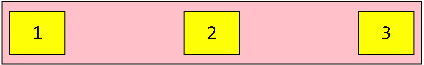

```
.flex-container {
  display: flex;
  justify-content: space-between;
}
```

# 对齐-项目

`align-items`属性定义项目如何沿横轴布局。

为了更好地展示效果，我在演示代码中将容器的高度增加到了 250 像素。

为了在容器中间对齐项目，我们使用*居中*:

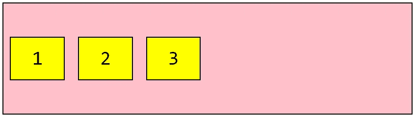

```
.flex-container {
  display: flex;
  align-items: center;
}
```

要放置在顶部，使用*柔性启动:*

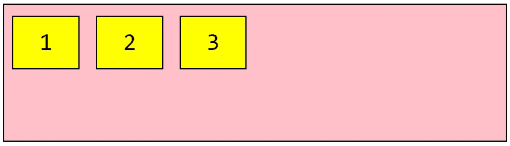

```
.flex-container {
  display: flex;
  align-items: flex-start;
}
```

或使用*挠性端*放置在容器底部；

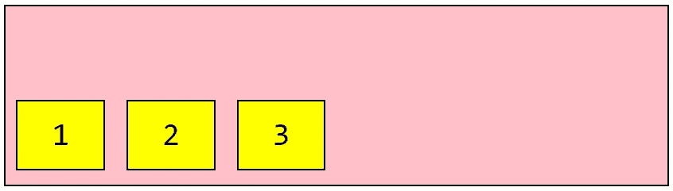

```
.flex-container {
  display: flex;
  align-items: flex-end;
}
```

*拉伸*的默认值将拉伸我们的物品以填充容器:

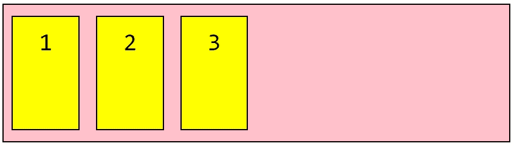

```
.flex-container {
  display: flex;
  align-items: stretch;
}
```

*基线*值将根据项目的基线对齐项目(我使用了交替的字体大小值进行说明):

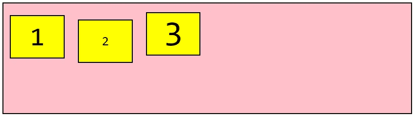

```
.flex-container {
  display: flex;
  align-items: baseline;
}
```

# 对齐内容

属性用于对齐 flex 容器的线条。

在这些示例中，演示容器的高度已经增加到 350px，并且`flex-wrap`属性设置为 *wrap* ，以更好地说明`align-content`的工作方式。

**注意:**只有一行弹性项目时，该属性无效！

设置*间距*将显示每条挠曲线，间距相等:


```
.flex-container {
  display: flex;
  flex-wrap: wrap;
  align-content: space-between;
}
```

*空间环绕*值将在每条挠曲线之前、之间和之后分配空间:

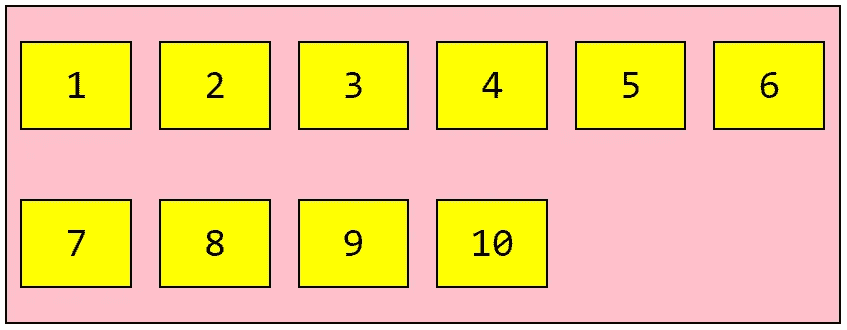

```
.flex-container {
  display: flex;
  flex-wrap: wrap;
  align-content: space-around;
}
```

默认的*拉伸*值拉伸挠曲线以填充任何剩余空间:

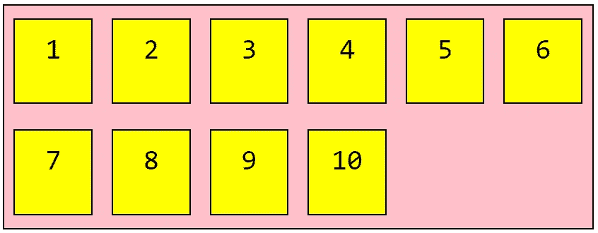

```
.flex-container {
  display: flex;
  flex-wrap: wrap;
  align-content: stretch;
}
```

我们可以使用*中心*来显示容器中间的弯曲线:

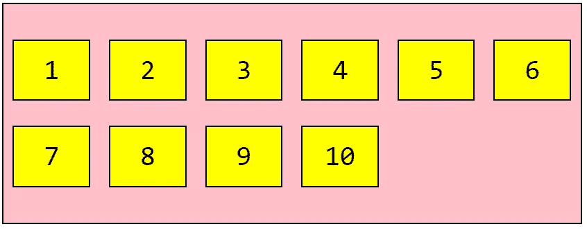

```
.flex-container {
  display: flex;
  flex-wrap: wrap;
  align-content: center;
}
```

或*弯曲启动*到容器的开始位置:

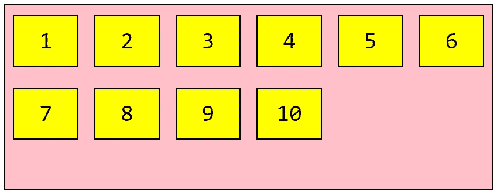

```
.flex-container {
  display: flex;
  flex-wrap: wrap;
  align-content: flex-start;
}
```

最后*弯曲端*将我们的线定位在集装箱的末端:

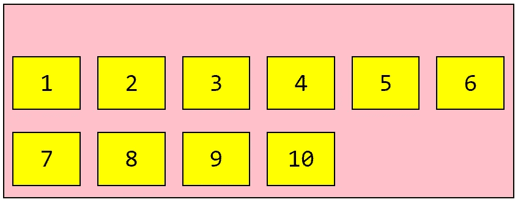

```
.flex-container {
  display: flex;
  flex-wrap: wrap;
  align-content: flex-end;
}
```

# 如何实现完美对中

用 Flexbox 相当简单！只要确保`justify-content`和`align-items`都设置到*中心:*

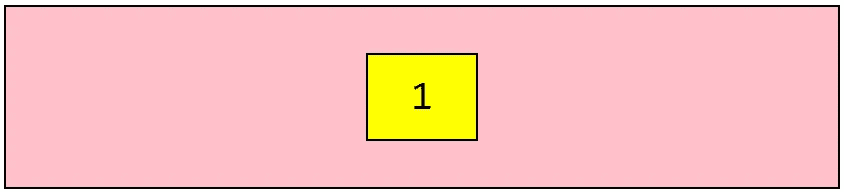

```
.flex-container {
  display: flex;
 **justify-content: center;
  align-items: center;** }
```

# 子元素(弹性项目)

现在我们来看看可以应用于子元素的属性集(也称为 flex 项目)。

flex 容器的任何直接子元素都将自动成为 flex 项目。

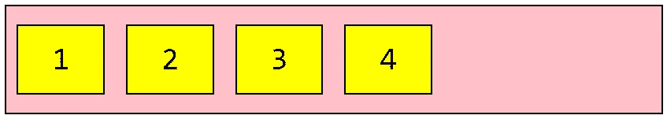

```
<div class="flex-container">
  <div>1</div>
  <div>2</div>
  <div>3</div>
  <div>4</div>
</div>
```

所以这四个黄框是我们的 flex 项目，因为它们是`flex-container`的直接子项目。

弹性项目属性包括:

*   `order`
*   `flex-grow`
*   `flex-shrink`
*   `flex-basis`
*   `align-self`
*   `flex`

# 命令

`order`属性控制 flex 项目在 flex 容器中出现的顺序。

该值必须是一个数字，如下所示:

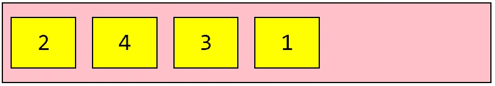

```
<div class="flex-container">
  <div style="order: 4">1</div>
  <div style="order: 1">2</div>
  <div style="order: 3">3</div>
  <div style="order: 2">4</div>
</div>
```

# 灵活增长

`flex-grow`属性赋予了 flex 项目增长的能力。它定义了该项目相对于其余 flex 项目应占用的可用空间量。

该值必须是一个数字。

如果所有项目的`flex-grow`都设置为 1，容器中的剩余空间将平均分配给每个 flex 项目。

如果其中一个孩子的值为 2，剩余的空间将(试图)占据其他孩子空间的两倍:

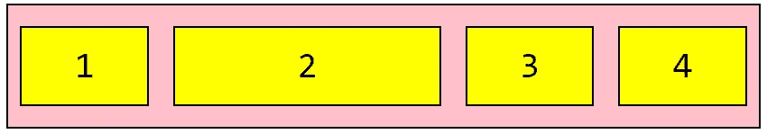

```
<div class="flex-container">
  <div style="flex-grow: 1">1</div>
  <div style="flex-grow: 2">2</div>
  <div style="flex-grow: 1">3</div>
  <div style="flex-grow: 1">4</div>
</div>
```

# 弯曲收缩

`flex-shrink`属性定义了一个伸缩项相对于其余伸缩项收缩的能力。

例如，我们可能不希望第二个伸缩项像其他伸缩项一样收缩:

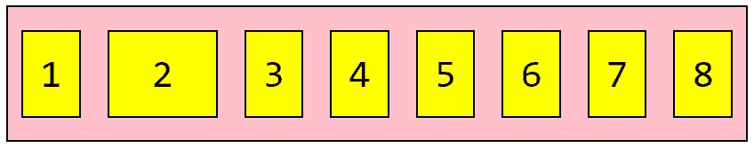

```
<div class="flex-container">
  <div>1</div>
  <div style="flex-shrink: 0">2</div>
  <div>3</div>
  <div>4</div>
  <div>5</div>
  <div>6</div>
  <div>7</div>
  <div>8</div>
</div>
```

# 弹性基础

属性定义了在分配任何剩余空间之前元素的默认大小。

让我们将第三个项目的初始长度设置为 300 像素:

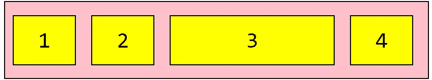

```
<div class="flex-container">
  <div>1</div>
  <div>2</div>
  <div style="flex-basis: 300px">3</div>
  <div>4</div>
</div>
```

# 自我对齐

`align-self`属性允许单个 flex 项目的默认对齐(由`align-items`指定)被覆盖。

在这些例子中，我们将使用一个 200 像素高的容器，以更好地说明`align-self`属性。

让我们在容器中间对齐第三个伸缩项(其他的默认为*拉伸*:

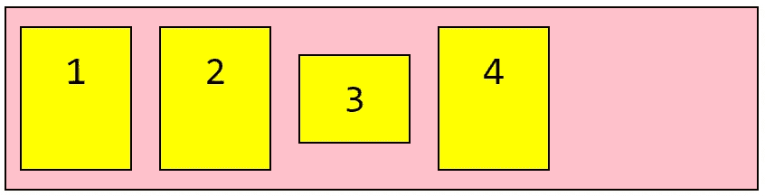

```
<div class="flex-container">
  <div>1</div>
  <div>2</div>
  <div style="align-self: center">3</div>
  <div>4</div>
</div>
```

让我们将第二个 flex 项与底部对齐，将第三个 flex 项与顶部对齐:

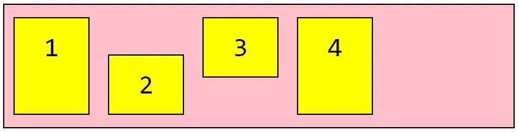

```
<div class="flex-container">
  <div>1</div>
  <div style="align-self: flex-end">2</div>
  <div style="align-self: flex-start">3</div>
  <div>4</div>
</div>
```

# flex(速记)

`flex`属性是`flex-grow`、`flex-shrink`和`flex-basis`组合的简写。`flex-shrink`和`flex-basis`属性是可选的，默认为`0 1 auto`。

例如，让我们使第二个 flex 项目不可增长(`0`)，不可收缩(`0`)，并赋予它 300px 的初始长度:

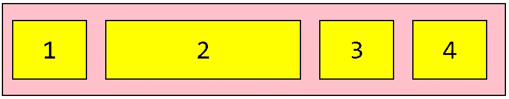

```
<div class="flex-container">
  <div>1</div>
  <div style="flex: 0 0 300px">2</div>
  <div>3</div>
  <div>4</div>
</div>
```

***你准备好让你的 CSS 技能更上一层楼了吗？*** *现在就开始用我的新电子书:*[*CSS 指南:现代 CSS 完全指南*](https://gum.co/the-css-guide) *。获取从 Flexbox & Grid 等核心概念到动画、架构&等更高级主题的最新信息！！*


*现已上市！👉*[gum.co/the-css-guide](https://gum.co/the-css-guide)

# 关于我的一点点..

嘿，我是提姆！👋我是一名开发人员、技术作家和作家。如果你想看我所有的教程，可以在我的个人博客上找到。

我目前正致力于构建我的自由职业者完整指南。坏消息是它还不可用！但是如果是你感兴趣的东西，你可以[注册，当它可用的时候会通知你](https://easeout.eo.page/news)👍

感谢阅读🎉