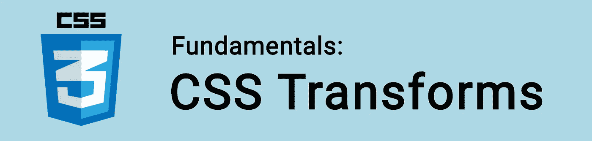

# CSS 基础:转换

> 原文：<https://itnext.io/css-fundamentals-transforms-6d046084ac45?source=collection_archive---------1----------------------->



属性允许我们通过缩放、倾斜、旋转或平移来可视化地操作元素。

例如:

```
.element {   
  width: 30px;   
  height: 30px;   
  transform: scale(10); 
}
```

尽管我们声明了高度和宽度，转换还是将元素缩放到原始大小的十倍！

当与动画结合时，变换特别有趣。

🤓*想与 web dev 保持同步吗？*
🚀想要最新的新闻直接发送到你的收件箱吗？
🎉加入一个不断壮大的设计师&开发者社区！

**在这里订阅我的简讯→**[**https://ease out . EO . page**](https://easeout.eo.page/)

# 转换函数

我们可以使用以下功能:

*   `scale()`:缩放元素的大小。
*   `skew()`:向左或向右旋转一个元素。
*   `rotate()`:从当前位置顺时针旋转元素。
*   `translate()`:在水平或垂直方向重新定位元素。
*   `perspective()`:设置 3D 变换中使用的深度。

让我们来看看每一个！

## 规模

`scale()`功能是`scaleX()`和`scaleY()`的简写。

`scaleX()`沿 x 轴(水平)和 y 轴(垂直)调整元素的大小。

例如，让我们将`.element`的宽度缩放 2 倍(宽度加倍)，高度减少 0.5 倍(减少一半):

```
.element {
  transform: scale(2, 0.5);
}
```

第一个参数是`scaleX()`，第二个是`scaleY()`。

## 斜交

`skew()`功能向左或向右倾斜一个元素。也是`skewX()`和`skewY()`的简写。

沿 x 轴倾斜(水平):

```
transform: skewX(15deg);
```

沿 y 轴倾斜(垂直):

```
transform: skewY(15deg);
```

同时沿两个轴倾斜:

```
transform: skew(15deg, 15deg);
```

## 辐状的

`rotate()`功能从原始位置顺时针旋转一个元素:

```
transform: rotate(25deg);
```

我们可以使用负值将其向相反方向旋转:

```
transform: rotate(-25deg);
```

## 翻译

`translate()`功能在水平或垂直方向(从其原始位置)移动元素:

```
transform: translate(50px, 10px);
```

这里我们的元素在水平轴上移动了 50px(向右),在垂直轴上移动了 10px(向下)。

这是以下内容的简写:

```
transform: translateX(50px);
transform: translateY(10px);
```

相反，向左或向上移动，我们可以简单地使用负值。

我们可以使用任何有效的长度值，比如`px`、`em`、&、`rem`。

# 组合多个变换

通过用空格分隔每个函数，可以组合多个转换:

```
transform: rotateY(30deg) scaleX(2) translateX(200px);
```

# 3D 转换

对于 3D 变换，我们添加第三个“z”轴，这增加了深度维度。

以下附加功能控制 Z 轴:

*   `translateZ()`
*   `rotateZ()`
*   `scaleZ()`

对于这些我们有相应的`translate3d()`、`rotate3d()`和`scale3d()`的简写。用于我们要组合`translateX()`、`translateY()`和`translateZ()`的时候。

## 远景

`perspective`属性指定 3D 对象出现在离查看者多远的地方:

```
.element {
  perspective: 100px;
}
```

较低的值会比较高的值产生更强烈的 3D 效果。

注意，当定义一个元素的`perspective`时，**子**元素得到透视图，**而不是**元素本身。

## 透视原点

`perspective-origin`属性定义了用户在哪个位置观看 3D 对象:

```
.element {
  perspective: 100px;
  perspective-origin: left;
}
```

它定位 3D 对象，就像从不同的角度观看一样。

***你准备好让你的 CSS 技能更上一层楼了吗？*** *现在就开始用我的新电子书:*[*CSS 指南:现代 CSS 完全指南*](https://gum.co/the-css-guide) *。获取从 Flexbox &网格等核心概念到动画、架构等更高级主题的最新信息！！*


*现已上市！👉*[gum.co/the-css-guide](https://gum.co/the-css-guide)

# 关于我的一点点..

嘿，我是提姆！👋我是一名开发人员、技术作家和作家。如果你想看我所有的教程，可以在我的个人博客上找到。

我目前正在构建我的[自由职业者完整指南](http://www.easeout.co/freelance)。坏消息是它还不可用！但是如果这是你可能感兴趣的东西，你可以[注册，当它可用时会通知你](https://easeout.eo.page/news)👍

感谢阅读🎉