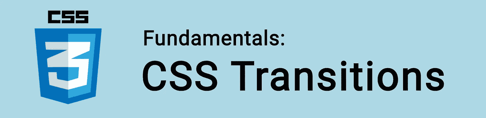

# CSS 基础:过渡

> 原文：<https://itnext.io/css-fundamentals-transitions-e8ddb1859c3?source=collection_archive---------2----------------------->



在本教程中，我们来看看如何使用 CSS 转场制作组件动画！

当我们告诉一个 CSS 属性值在一段特定的时间内改变时，就会发生一个**转换**。

我们使用`transition`属性来实现这一点，它是以下属性的简写:

*   `transition-property`
*   `transition-duration`
*   `transition-timing-function`
*   `transition-delay`

```
.element {
  transition-property: property;
  transition-duration: duration;
  transition-timing-function: timing-function;
  transition-delay: delay;
} 
```

这相当于:

```
.element {
  transition: property duration timing-function delay;
}
```

🤓想要了解最新的 web 开发吗？🚀想要最新的新闻直接发送到你的收件箱吗？
🎉加入一个不断壮大的设计师&开发者社区！

**在这里订阅我的简讯→**[**https://ease out . EO . page**](https://easeout.eo.page/)

# 过渡属性

`transition-property`是您希望转换的属性。

`transition-duration`是过渡的持续时间。该值以秒为单位(如`5s`为 5 秒)。

`transition-timing-function`过渡是如何发生的。我们稍后再看这个。

`transition-delay`是您希望在持续时间开始前等待的时间。同样，该值以秒为单位指定(例如，`5s`为 5 秒)。

# 激活转换

您可以使用[伪类](https://www.easeout.co/blog/2020-03-31-css-pseudo-classes)激活 CSS 转换，如`:hover`(当鼠标悬停在元素上时)、`:focus`(当用户点击输入元素时)或`:active`(当用户点击元素时)。

让我们看一个例子:

```
.button {
  background-color: pink;
  transition: background-color 2s ease-out;
}.button:hover {
  background-color: yellow;
}
```

# 什么是过渡时间函数？

`transition-timing-function`指示如何发生转换。默认情况下，所有过渡都设置为`linear`，这意味着属性在整个过渡过程中均匀变化。

例如:

```
.element {
  transition-property: transform;
  transition-duration: 1s;
  transition-timing-function: linear;
}
```

这与以下内容相同:

```
.element {
  transition: transform 1s linear;
}
```

有许多值可以用于我们的`transition-timing-function`:

*   `ease` -过渡有一个缓慢的开始，快速的中间，然后缓慢的结束
*   `linear` -过渡从开始到结束速度一致
*   `ease-in` -过渡将缓慢开始
*   过渡会有一个缓慢的结束
*   `ease-in-out` -过渡缓慢开始和结束
*   `cubic-bezier(n,n,n,n)` -我们自己指定的可定制的过渡值。使用 https://cubic-bezier.com/等生成器工具很方便。

让我们来看看他们的行动:

# 转换多个属性

我们可以一次转换多个属性，用逗号分隔它们。

```
.element {
  transition: color 2s ease-out,
              background-color 2s ease-out;
}
```

# 哪些属性可以制作动画？

很多！完整列表如下:[https://developer . Mozilla . org/en-US/docs/Web/CSS/CSS _ animated _ properties](https://developer.mozilla.org/en-US/docs/Web/CSS/CSS_animated_properties)。

你准备好让你的 CSS 技能更上一层楼了吗？ *现在就开始用我的新电子书:*[*CSS 指南:现代 CSS 完全指南*](https://gum.co/the-css-guide) *。获取从 Flexbox & Grid 等核心概念到动画、架构等更高级主题的最新信息！！*


*现已上市！👉*[gum.co/the-css-guide](https://gum.co/the-css-guide)

# 关于我的一点点..

嘿，我是提姆！👋我是一名开发人员、技术作家和作家。如果你想看我所有的教程，可以在我的个人博客上找到。

我目前正在撰写我的[自由职业完整指南](http://www.easeout.co/freelance)。坏消息是它还不可用！但是如果是你可能感兴趣的东西，你可以[注册，当它可用的时候会通知你👍](https://easeout.eo.page/news)

感谢阅读🎉