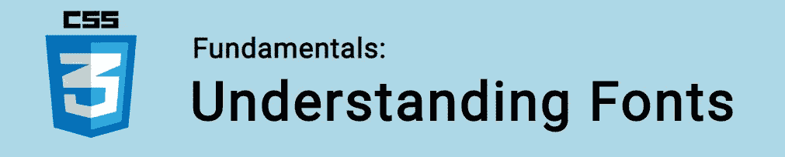

# CSS 基础:了解字体

> 原文：<https://itnext.io/css-fundamentals-understanding-fonts-82e9930528fa?source=collection_archive---------3----------------------->



在本教程中，我们将学习如何在 CSS 中使用字体！

属性是一个简写属性，它可以在一个声明中组合多个子属性。例如:

```
font: normal italic small-caps bold 16px/120% "Helvetica", sans-serif;
```

这相当于:

```
font-stretch: normal;
font-style: italic; 
font-variant: small-caps; 
font-weight: bold; 
font-size: 16px; 
line-height: 120%; 
font-family: "Helvetica", sans-serif;
```

让我们详细回顾一下这些属性！

🤓*想与 web dev 保持同步吗？*🚀想要最新的新闻直接发送到你的收件箱吗？
🎉加入一个不断壮大的设计师&开发者社区！

**在这里订阅我的简讯→**[**https://ease out . EO . page**](https://easeout.eo.page/)

# CSS 字体属性

## `font-family`

属性`font-family`设置元素将使用的字体*系列*。

所选字体不是单一字体，而是“系列”中的一种，因为字体是由许多子字体组成的。如粗体、斜体、浅色等。

```
body {
    font-family: Helvetica;
}
```

字体系列名称与页面上嵌入的字体或用户系统上可用的字体相匹配。

我们也可以选择多种字体，如下所示:

```
body {
    font-family: Helvetica, Arial, sans-serif;
}
```

在这种情况下，如果第一种字体不能使用，浏览器将选择下一种字体。如果在用户的本地计算机上找不到它，或者托管该字体的服务器关闭，就可能会发生这种情况。

字体类型通常分为衬线字体、无衬线字体或等宽字体。以下是一些最受欢迎的:

乔治亚，泰晤士报新罗马

**无衬线字体:** Arial，Helvetica，Verdana，Lucida Grande，Trebuchet MS

**等宽:**快递，快递新，Lucida 控制台

## `line-height`

属性`line-height`设置了元素上下的空间大小。

```
p {
    line-height: 1.5;
}
```

我们还可以使用关键字值`normal`、`none`以及数字、长度(任何有效的 [CSS 单元](https://www.easeout.co/blog/2020-04-30-css-units))或百分比(元素的字体大小乘以%)。

## `font-weight`

`font-weight`属性设置字体中每个字符的宽度(或粗细)。您可以使用下列值:

*   `normal`
*   `bold`
*   `bolder`
*   `lighter`

注意`bolder` & `lighter` 是相对于元素的父元素的。

也可以使用数值:

*   `100`
*   `200`
*   `300`
*   `400`(相当于`normal`)
*   `500`
*   `600`
*   `700`(相当于`bold`)
*   `800`
*   `900`

其中`100`是最浅的字体，`900`是最粗的字体。

为了使`400`或`700`以外的值产生效果，所使用的字体必须具有与这些权重相匹配的内置字体。

## `font-stretch`

用`font-stretch`我们可以选择字体的窄面或宽面。假设正在使用的字体包含相应的字体。

可能的值有:

*   `ultra-condensed`
*   `extra-condensed`
*   `condensed`
*   `semi-condensed`
*   `normal`
*   `semi-expanded`
*   `expanded`
*   `extra-expanded`
*   `ultra-expanded`

## `font-style`

属性接受三个可能值之一:`normal`、`italic`和`oblique`。

例如，要将我们的字体设置为斜体:

```
p {
  font-style: italic;
}
```

使用`italic`和`oblique`差别很小。两者都对文本应用倾斜效果。

## `font-size`

`font-size`属性用于确定字体的大小。例如:

```
p {
  font-size: 20px;
}
```

你可以使用一个有效的长度值(比如`px`、`em`、`rem`一个百分比等)，或者一个预定义的值关键字。

可用的关键字值有:

*   `xx-small`
*   `x-small`
*   `small`
*   `medium`
*   `large`
*   `x-large`
*   `xx-large`
*   `smaller`
*   `larger`

两个`smaller` & `larger`都相对于父元素。

注意`font-size`是强制值。使用`font`速记属性时，必须设置大小(否则无效)！

## `font-variant`

`font-variant`房产有点遗迹了。它最初用于将文本设置为小型大写，它有 3 个值:

*   `normal`
*   `inherit`
*   `small-caps`

小型大写字母将文本设置为“小型大写字母”，即比常规大写字母小。

***你准备好让你的 CSS 技能更上一层楼了吗？*** *现在就开始用我的新电子书:*[*CSS 指南:现代 CSS 完全指南*](https://gum.co/the-css-guide) *。获取从 Flexbox & Grid 等核心概念到动画、架构等更高级主题的最新信息！！*


*现已上市！👉*gum.co/the-css-guide

# 关于我的一点点..

嘿，我是提姆！👋我是一名开发人员、技术作家和作家。如果你想看我所有的教程，可以在我的个人博客上找到。

我目前正致力于建立我的自由职业者完整指南。坏消息是它还不可用！但是如果是你感兴趣的东西，你可以[注册，当它可用的时候会通知你👍](https://easeout.eo.page/news)

感谢阅读🎉