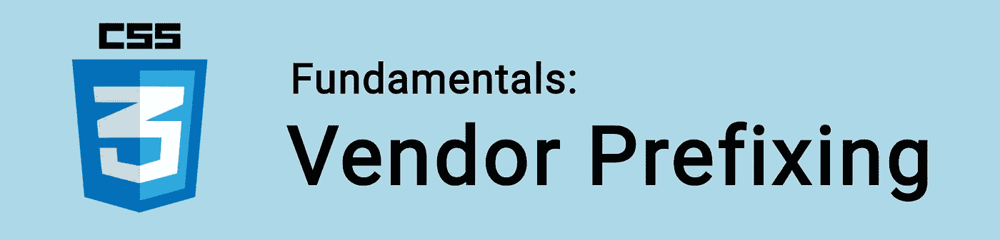

# CSS 基础:供应商前缀

> 原文：<https://itnext.io/css-fundamentals-vendor-prefixing-b339d3c9859a?source=collection_archive---------5----------------------->



CSS 供应商前缀(或浏览器前缀)是浏览器访问尚未稳定的新 CSS 功能的一种方式。

通过使用前缀，我们可以在支持它们的浏览器上使用这些新的 CSS 特性，而不是等待所有浏览器都跟上。

🤓*想跟上网络发展的步伐吗？*
🚀想要将最新消息直接发送到您的收件箱吗？
🎉加入一个不断壮大的设计师&开发者社区！

**在这里订阅我的简讯→**[**https://ease out . EO . page**](https://easeout.eo.page/)

例如，在完全支持 CSS 转换之前，您应该添加前缀，如下所示:

```
.element {
	-webkit-transition: all 1s ease-out;
	-moz-transition: all 1s ease-out;
	-ms-transition: all 1s ease-out;
	-o-transition: all 1s ease-out;
	transition: all 1s ease-out;
}
```

使用的前缀有:

*   `-webkit-` (Chrome、Safari、iOS Safari / iOS WebView、Android)
*   `-moz-`(火狐)
*   `-ms-` (Edge，Internet Explorer)
*   `-o-`(歌剧，迷你歌剧)

书写前缀传统上是一件麻烦事。所以像 [Autoprefixer](https://github.com/postcss/autoprefixer) 这样的项目出现了，通过自动添加任何需要的前缀来自动化这个过程。该工具根据[can use](https://caniuse.com/)提供的信息生成前缀。

许多现代框架(例如 create-react-app、Vue cli 和 postcss)都使用现成的 autoprefixer，因此记住添加前缀已经成为过去！

# 前缀还有必要吗？

前缀是一个迅速衰落的问题。

浏览器在支持新功能方面变得越来越好。现在，实验性 CSS 的兴起正在鼓励客户端测试新功能(通过本地浏览器设置)，而不是在生产网站上。

如果您在没有构建工具的情况下处理一个需要在旧浏览器上运行的项目，那么通过 autoprefixer 运行 CSS 是值得的。看看这个方便的在线工具:[https://autoprefixer.github.io/](https://autoprefixer.github.io/)。否则，您可以放心，您的 CSS 将得到支持！

***你准备好让你的 CSS 技能更上一层楼了吗？*** *现在就开始用我的新电子书:*[*《CSS 指南:现代 CSS 完全指南*](https://gum.co/the-css-guide) *。获取从 Flexbox & Grid 等核心概念到动画、架构等更高级主题的最新信息！！*


*现已上市！👉gum.co/the-css-guide*T2

# 关于我的一点点..

嘿，我是提姆！👋我是一名开发人员、技术作家和作家。如果你想看我所有的教程，可以在[我的个人博客](http://www.easeout.co)上找到。

我目前正在构建我的[自由职业者完整指南](http://www.easeout.co/freelance)。坏消息是它还不可用！但是如果这是你可能感兴趣的东西，你可以[注册，当它可用的时候会通知你](https://easeout.eo.page/news)👍

感谢阅读🎉