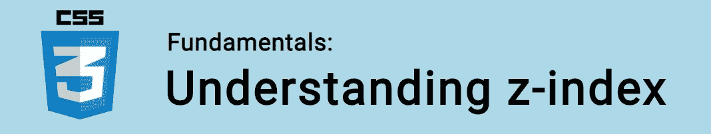
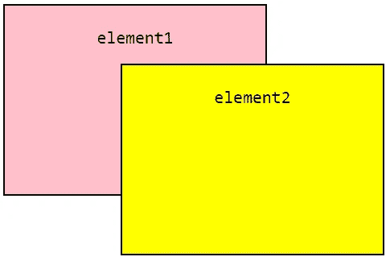
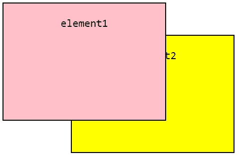

# CSS 基础:z 索引

> 原文：<https://itnext.io/css-fundamentals-z-index-e53418289ed5?source=collection_archive---------9----------------------->



在 CSS 中，每个[框](https://www.easeout.co/blog/2020-04-14-the-css-box-model)都有一个三维位置。除了 x 轴(水平)和 y 轴(垂直)位置之外，盒子还有一个“z 轴”,在这里它们相互堆叠。

🤓*想与 web dev 保持同步吗？*
🚀*想要将最新消息直接发送到您的收件箱？
🎉加入一个不断壮大的设计师&开发者社区！*

**在这里订阅我的简讯→**[**https://ease out . EO . page**](https://easeout.eo.page/)

`z-index`属性定义了 **z 轴**上元素的**堆叠顺序**。它只对定义了[位置](https://www.easeout.co/blog/2020-05-15-css-positioning)的元素有效(除了默认的`position:static;`)。

因此，当你在一个页面上有多个重叠的元素时，`z-index`让你决定哪一个是可见的(或者离用户更近)，以及它后面的任何元素的顺序。

例如:

```
.element1 {   
   /* other styles ... */
   position: absolute;
   z-index: 1; 
}.element2 {   
   /* other styles ... */
   position: absolute;
   z-index: 2; 
}
```

属性采用一个数字，数字越大，元素与用户的关系越密切。



更直观地说，如果我们像这样交换订单值:

```
.element1 {   
   /* other styles ... */
   position: absolute;
   z-index: 2; 
}.element2 {   
   /* other styles ... */
   position: absolute;
   z-index: 1; 
}
```

堆叠顺序将会改变:



也可以使用负数。

当没有设置`z-index`值时，元素按照它们在 HTML 中出现的顺序堆叠。

一个很好的经验法则是在与`z-index`合作时考虑到数字差距。比如用“10”再用“20”。这样就有足够的空间在你的堆叠顺序中放置一个元素，而不必对每个元素重新编号！

还应该注意，嵌套元素的行为是不同的。例如，元素 A 的子元素**永远不会**高于元素 B，如果 B 具有更低的`z-index`值(因此具有更高的堆叠顺序！).

***你准备好让你的 CSS 技能更上一层楼了吗？*** *现在就开始用我的新电子书:*[*《CSS 指南:现代 CSS 完全指南*](https://gum.co/the-css-guide) *。获取从 Flexbox & Grid 等核心概念到动画、架构&等更高级主题的最新信息！！*


*现已上市！👉gum.co/the-css-guide*T2

# 关于我的一点点..

嘿，我是提姆！👋我是一名开发人员、技术作家和作家。如果你想看我所有的教程，可以在[我的个人博客](http://www.easeout.co)上找到。

我目前正在构建我的[自由职业者完整指南](http://www.easeout.co/freelance)。坏消息是它还不可用！但是如果这是你可能感兴趣的东西，你可以[注册，当它可用的时候会通知你](https://easeout.eo.page/news)👍

感谢阅读🎉