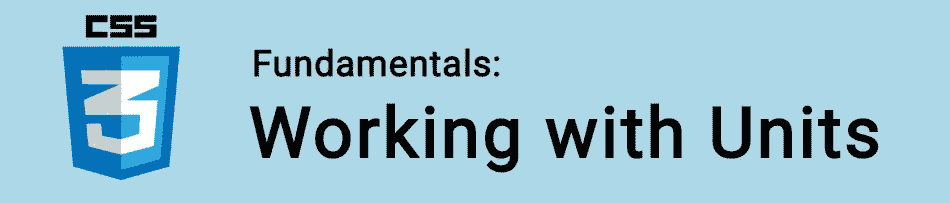

# CSS 基础:单位

> 原文：<https://itnext.io/css-fundametals-units-5f300594e68b?source=collection_archive---------2----------------------->



在本教程中，我们将学习 CSS 单位！

我们使用单位(`px`、`em`、`rem`、百分比、`vw`、`vh`等)来确定应用于长度、填充、边距& align 等属性的大小。

了解每种单元类型将有助于您创建更加灵活和易于管理的样式表！

🤓*想与 web dev 保持同步吗？*
🚀想要最新的新闻直接发送到你的收件箱吗？
🎉加入一个不断壮大的设计师&开发者社区！

**在这里订阅我的简讯→**[**https://ease out . EO . page**](https://easeout.eo.page/)

# 什么是 CSS 单元？

CSS 单位决定了你在元素上设置的属性的大小。

例如，要在一个段落上设置`padding`，我们可以像这样选择`10px`:

```
p {
  padding: 10px;
}
```

值“10px”包括 CSS 单位“px”(或像素)。

问题是:`px`是最好用的单位吗？那么`em`，或者`rem`，或者`vw`呢？

让我们来了解一下！

# 像素

```
.element {   
  width: 500px;  
}
```

像素是最常见的度量单位。允许您以“像素”为单位设置长度。

有趣的是，它们与你的显示设备的屏幕像素没有任何关系。这是一种在网络上使用的标准化测量方法。

正如我们将看到的，像素在某些情况下缺乏灵活性&通常有更好的选择。

# 百分比

百分比允许您将值指定为相对于元素父级中相同属性的百分比。例如:

```
.parent {
  width: 600px;
}.child {
  width: 50%;  /* 300px */
}
```

因此，如果父元素的宽度为 600px，则宽度为 50%的子元素将以 300px 呈现。

# 字体相关单位

## 全身长的

```
.element {
  width: 30em; 
}
```

`em`是分配给元素的`font-size`的值，因此它的确切值在元素之间是变化的。测量本身`m`字母的宽度。

注意当你改变`font-size`时，长度只改变**而不改变`font-family`的长度。**

默认情况下`1em`等于`16px`。

如果任何 CSS 改变了字体大小，1em 就等同于新的`font-size`是什么。

## 雷姆

```
.element {
  width: 30rem; 
}
```

`rem`与`em`类似，只是不是根据当前元素的字体大小来改变，而是根据根元素(即`:root {}`)的字体大小来改变。

这样你可以设置一次`font-size`，并且`rem`将会是所有页面的一致度量！

## 前夫;前妻;前男友;前女友

```
.element {
  width: 40ex;
}
```

`ex`与`em`相似，但它基于`x`字母的高度。

与 ems 不同，它可以根据`font-size`上使用的`font-family`和&来改变。

## 荣誉勋爵

```
.element {
  width: 40ch;
}
```

`ch`与`ex`相似，只是它不测量`x`的高度，而是测量`0`的宽度(数字零)。

它也随着`font-family`的变化而变化。

# 视口单位

## 大众汽车（Volkswagen 的缩写）

```
.element {
  width: 20vw;
}
```

视口宽度单位表示用户视口宽度的百分比。

所以`50vw`等于视口宽度的 50%。

它类似于 percentage，只是值保持一致，而不考虑父元素持有的值。类似于`rem`单元相对于根部保持的方式。

`vw`单位常用于上浆反应型。

## vh

```
.element {
  width: 20vh;
}
```

视口高度单位表示用户视口高度的百分比。

`50vh`等于视口高度的 50%。

这与`vw`相同，只是它基于身高。

## vmin

```
.element {
  width: 10vmin;
}
```

视口最小值是高度或宽度之间的最小值，以百分比表示。

该值将是当前*中较小的*、`vw`或`vh`。

所以`20vmin`是当前宽度或高度的 20%，看哪个小。

## vmax

```
.element {
  width: 20vmax;
}
```

视口最大值是高度或宽度之间的最大值，以百分比表示。

与`vmin`相反，当前值*大于*、`vw`或`vh`。

所以`20vmax`是当前宽度或高度的 20%，看哪个大。

# 我应该使用哪些单位？

你可以问自己，找出最合适的 CSS 单位:

*   当视口大小改变时，我希望这个元素缩放吗？
*   如果“是”，我希望它相对于什么进行缩放？

当你回答了这些问题，知道最合适的单位就简单多了！

***你准备好让你的 CSS 技能更上一层楼了吗？*** *现在就开始用我的新电子书:*[*《CSS 指南:现代 CSS 完全指南*](https://gum.co/the-css-guide) *。获取从 Flexbox & Grid 等核心概念到动画、架构等更高级主题的最新信息！！*


*现已上市！👉*[gum.co/the-css-guide](https://gum.co/the-css-guide)

# 关于我的一点点..

嘿，我是提姆！👋我是一名开发人员、技术作家和作家。如果你想看我所有的教程，可以在我的个人博客上找到。

我目前正在构建我的[自由职业者完整指南](http://www.easeout.co/freelance)。坏消息是它还不可用！但是如果是你感兴趣的东西，你可以[注册，当它可用时会通知](https://easeout.eo.page/news)👍

感谢阅读🎉