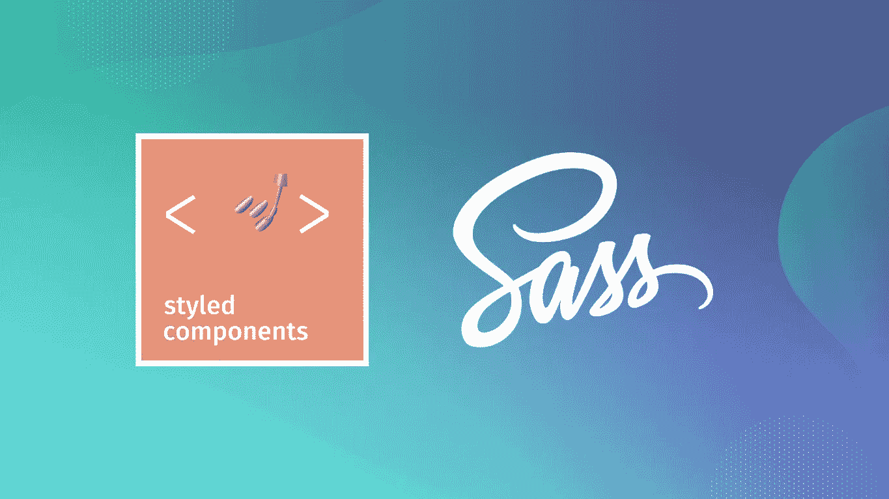
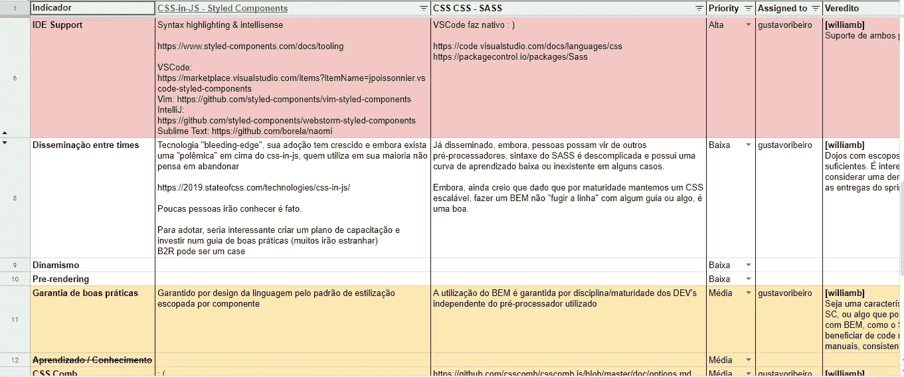

# 2019 年风格组件 vs Sass

> 原文：<https://itnext.io/css-in-js-vs-pre-post-processors-in-2019-8b1e20c066ed?source=collection_archive---------1----------------------->

2019 年即将结束，但仍有时间以一篇关于造型的非常酷的帖子来结束。这篇文章基于一个演示文稿，该演示文稿是对 JS 与前后处理器中的 CSS 进行研究的结果，分为五个不同的方面:**可重用性**、**性能、可规避性、可组合性和开发人员体验(DX)** 。在这里，我将比较两种编写 CSS 的最重要的工具，它们是:**风格的组件和 Sass**

随着时间的推移，编写 CSS 的活动变得越来越自然，越来越简单，尽管这并不是一个相对复杂的活动。CSS 语言在没有很多逻辑的全球范围内工作，随着时间的推移，这意味着根据你的写作方式可能会有很多冲突，特别是如果你没有使用任何方法，如 OOCSS，SMACSS，BEM，DRY CSS，ITCSS。

Jeff Atwood 在他们的博客中解释了如何开发设计良好的系统，这句话是这篇文章的指导。我们需要创造一个系统，把人们引向正确的道路，或者更好地说，把人们引向“成功之坑”。

> 一个设计良好的系统使做正确的事情变得容易，做错误的事情变得恼人(但不是不可能)。 [**落入成功的陷阱**](https://blog.codinghorror.com/falling-into-the-pit-of-success/)

## **样式组件**

Styled Components 是一个用于组件样式 React & React Native 的库，现在是我们称之为 CSS-in-JS 的最流行的实现。这项技术与现代前端开发越来越相关，尤其是在 React 社区。

## 厚颜无耻

在 LESS，Stylus 和 PostCSS 之间，最大的预处理器。Sass 已经有 12 年的历史了，仍然是当今最受欢迎和使用最多的 CSS 预处理程序之一。

## 复用性

当系统增长时，我们希望确保我们的 CSS 在组件之间是灵活的和可重用的，下面你将看到这两个工具是如何处理这个问题的。

**风格组件:优缺点**

**的主要优点**是:

*   由 props 控制变更的基于组件的体系结构
*   样式是共享的，因为组件的使用是共享的

**的主要缺点**是:

*   组件越通用，就越有可能变得复杂，难以调试和阅读

**萨斯:优缺点**

的主要**优势是:**

*   SASS 的可重用性与所使用的方法密切相关:BEM、OOCSS、ITCSS。
*   使用在您的代码库/团队中运行良好的方法

**的主要缺点**是:

*   正如样式化组件是可能的一样，也有 BEM 生成带有不可读 HTML 的组件的情况。

## 表演

当我们创建 web 应用程序时，我们仍然需要在这个主题上获得一些关注点。随着 web 应用程序的增长，它们变得越来越重，取决于它的使用方式，css 可能是 web 应用程序性能不佳的一个重要因素，特别是如果您只使用客户端渲染

**风格组件:优缺点**

**的主要优势**是:

*   与组件一样，只有当组件在屏幕上时，才会呈现样式。
*   服务器端渲染 post React 16 通过[流渲染 API](https://www.zcfy.cc/original/zeit-streaming-server-side-rendering-and-caching-at-spectrum) 和插件就绪如果你用的是 Next.js 或者 Gatsby

**的主要缺点**是:

*   与它的“竞争对手”风格相关的——组件，仍然不在第一位，[情感在第一位](https://blog.primehammer.com/the-performance-of-styled-react-components/)。
*   样式化组件的第 5 版本之前，他们在使用上下文 API 时遇到了性能问题，但在那之后，React 团队对其进行了改进，您可以在此处跟踪此[问题](https://github.com/styled-components/styled-components/issues/2215)

**萨斯:优缺点**

**的主要优点**是:

*   你不必担心一些常见的问题，如 dirt components tree，使用上下文 API 通过深层组件传递样式。

**的主要缺点**是:

*   在 DOM 中使用呈现组件的灵活性，即使没有在页面中呈现，您的样式也会消耗客户端处理，这取决于您使用的逻辑
*   没有自己的服务器端渲染解决方案，或任何插件准备与应用程序一起工作

## 可扩展性和良好实践

对我来说，这场讨论是推动这场讨论的动力，这里收集的数据给了我们答案，我们将走哪条路

**风格部件:优缺点**

**的主要优点**是:

*   由框架设计和良好的基于组件的架构保证

> BEM 是通过纪律获得的安全。CSS-in-JS 通过 API 设计是安全的。前者有效，但很容易被破坏。后者永远有效。 [**检查此螺纹**](https://twitter.com/kyleshevlin/status/925978213964066816)

主要的**缺点**是:

*   厂商锁定(很好的支持 React 和 Vue，如果你在用 Angular 你应该试试****)****
*   **乍一看，js 中的 css 对您的团队来说可能很难，学习曲线比使用 sass 要长**

****萨斯:优缺点****

****的主要优点**是:**

*   **使用对你的上下文最有意义的东西 BEM 或 OOCSS 或 ITCSS 或类似函数式 CSS 的东西**

****的主要缺点**是:**

*   **这取决于团队的成熟度和良好的代码审查模式，而不是良好的 API 设计**

## **可组合性**

**设计系统正在发展，在这一项中，我们将比较当你试图创建和维护一个设计系统或创建一个白色标签产品时，这两个工具是如何工作的。**

****风格组件:优点****

****的主要优点**是:**

*   **[**主题提供者**](https://www.styled-components.com/docs/advanced) **，**这个 API 将简化你如何为你的应用程序使用不同的主题**
*   **更好地记录组件属性，即[更好地定义范围](https://github-ds.now.sh/#44)**

****萨斯:优点****

****的主要优点**是:**

*   **[**SASS 变量的用法**](https://sass-lang.com/documentation/variables) **、**用于白色标签产品**

**这两个工具都很好地支持 Storybook、React Styleguist 和 Docz 等组件库。**

## **开发者体验**

**对于这一项，这两个工具都有很好的开发经验，都有很好的工具，也就是说，很好地扩展了今天使用的主要 IDE(vs code，sublime 和 vim)，sonar 插件到静态分析代码，js 中的 css 社区正在增长并变得更加流行，他们有很多技术文章，主要是在 React 社区和 sass 社区，这些社区和技术仍然强大而坚实。**

## **我们有赢家了吗？**

**这取决于，正如我为这个决定所说的，我们按照本帖中使用的主题制作一个决策矩阵:可重用性、性能、可扩展性、可组合性和开发人员体验(DX)。赢家(对我们来说)是 Sass，因为当时 Styled Components 没有发布版本 5，性能问题对我们来说是一个真正的问题，我们希望确保我们在这个问题上没有任何问题，因为框架内部。我们的代码库主要是 Sass，也就是说，团队的知识有一个角度背景，在这项研究之前，我们在 Sass 方面没有任何问题。**

****

**为本研究做出的矩阵决策**

## **替代品？**

**不一定你必须使用这两个工具，如果有些东西不太适合你的应用，你可以评估使用以下工具**

*   **[**Emotion**](http://emotion.sh/) **:** 没有锁定厂商，Emotion 可以用在任何框架甚至香草 js 上**
*   **[**CSS 模块**](https://css-tricks.com/css-modules-part-1-need/) **:** 混合了 javascript 中的普通 CSS，没有任何框架，默认情况下所有的类名都在本地范围内**