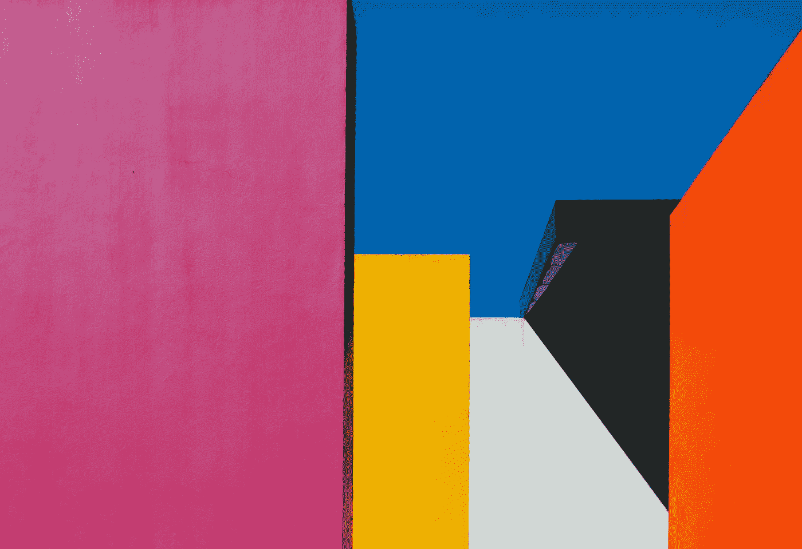
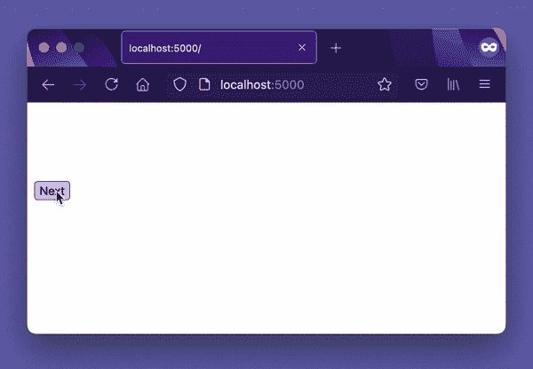
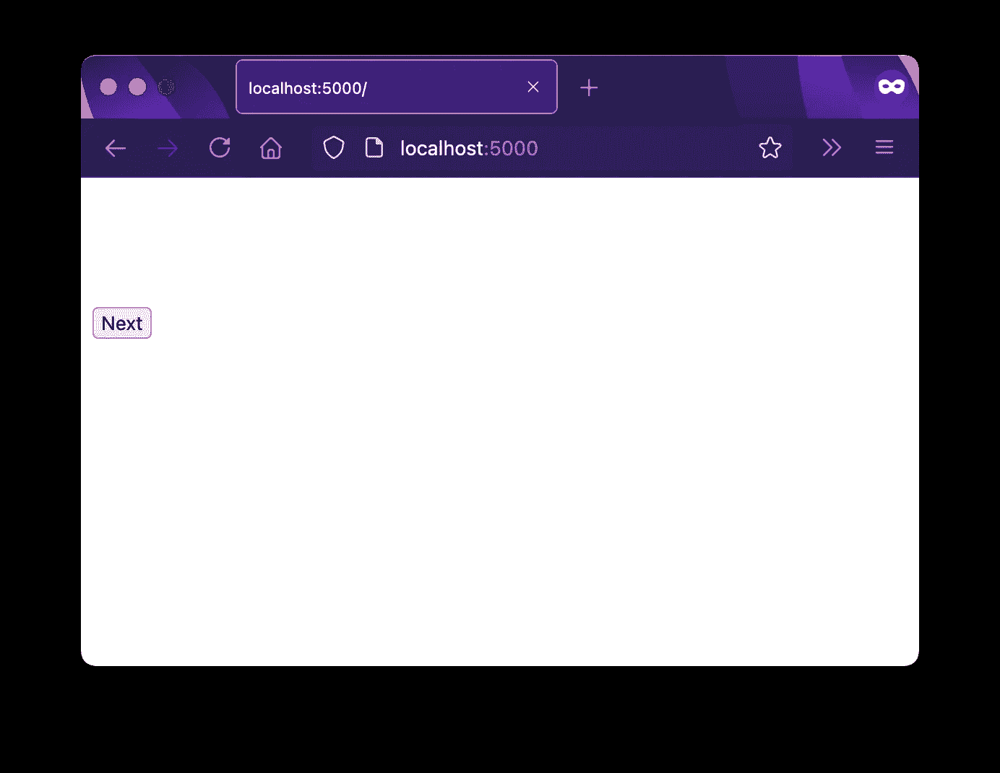
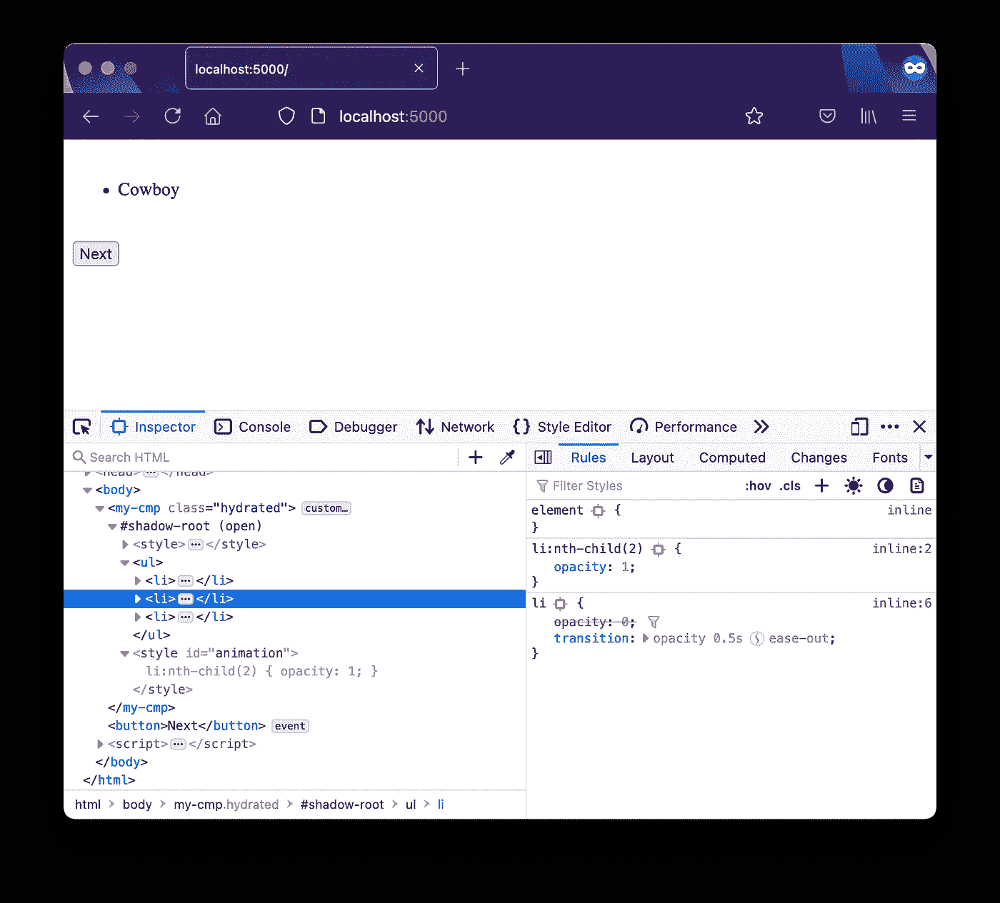
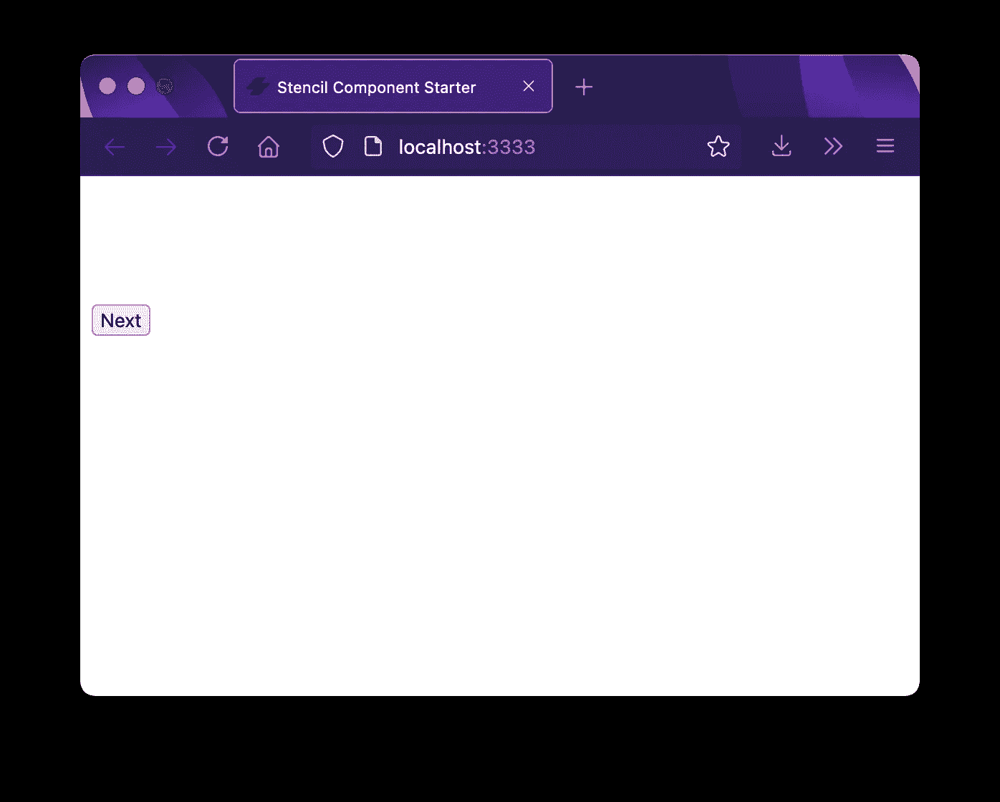
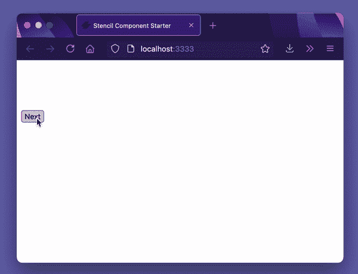

# CSS 第 n 个选择器变量

> 原文：<https://itnext.io/css-nth-selectors-variable-502eccae2e03?source=collection_archive---------1----------------------->

## 让 CSS 第 n 个选择器在 Web 组件中可变的实用技巧。



[马里奥·高](https://unsplash.com/@mariogogh?utm_source=unsplash&utm_medium=referral&utm_content=creditCopyText)在 [Unsplash](https://unsplash.com/?utm_source=unsplash&utm_medium=referral&utm_content=creditCopyText) 上拍摄的照片

使用 CSS 变量，至少当我在 2021 年 6 月写这几行的时候，在媒体查询或选择器中是不支持的，例如`:nth-child(var(--my-variable))`不起作用。

这有点不幸，但并非无法解决。在最近的一些开发中，我通过将 DOM 中的`style`元素注入到我的 Web 组件中，绕过了这个限制，以便在 [DeckDeckGo](https://deckdeckgo.com) 中动画化代码块。

# 介绍

严格来说，下面的技巧并不局限于 Web 组件，可能也适用于任何元素。我只是到目前为止只使用了这种技术😜。

我将首先在一个普通组件的帮助下展示这个想法，然后用同样的方法结束这篇文章，但是用一个 [StencilJS](https://stenciljs.com/) 功能组件实现。

# 教程的目标

我们将开发一个 Web 组件来呈现一个`<ul/>`列表，并可以动画显示其条目。



一旦加载了组件，就不会在 DOM 中添加或删除任何语义元素。动画将通过修改`style`来实现，更准确地说是通过在选中的`li:nth-child(n)`上应用不同的样式。

# 香草 JS

为了展示这个想法，我们创建了一个`index.html`页面。它消耗了我们将要开发的普通组件。我们还添加了一个`button`来触发动画。

```
<html>
    <head>
        <script type="module" src="./my-component.js"></script>
    </head>
    <body>
        <my-component></my-component>

        <button>Next</button>

        <script>
            document
              .querySelector('button')
              .addEventListener(
                 'click', 
                 () => document.querySelector('my-component').next()
              );
        </script>
    </body>
</html>
```

在一个名为`my-component.js`的单独文件中，我们创建了 Web 组件。此时没有任何动画。我们声明[打开](https://developer.mozilla.org/en-US/docs/Web/Web_Components/Using_shadow_DOM)以便能够访问阴影 DOM(通过`shadowRoot`，我们创建一个样式来隐藏所有的`li`并定义`transition`。最后，我们添加`ul`列表及其子列表`li`。

```
class MyComponent extends HTMLElement {

    constructor() {
        super();

        this.attachShadow({mode: 'open'});

        const style = this.initStyle();
        const ul = this.initElement();

        this.shadowRoot.appendChild(style);
        this.shadowRoot.appendChild(ul);
    }

    connectedCallback() {
        this.className = 'hydrated';
    }

    next() {
        // TODO in next chapter
    }

    initStyle() {
        const style = document.createElement('style');

        style.innerHTML = `
          :host {
            display: block;
          }

          li {
            opacity: 0;
            transition: opacity 0.5s ease-out;
          }
        `;

        return style;
    }

    initElement() {
        const ul = document.createElement('ul');

        const li1 = document.createElement('li');
        li1.innerHTML = 'Spine';

        const li2 = document.createElement('li');
        li2.innerHTML = 'Cowboy';

        const li3 = document.createElement('li');
        li3.innerHTML = 'Shelving';

        ul.append(li1, li2, li3);

        return ul;
    }
}

customElements.define('my-component', MyComponent);
```

此时，如果我们在浏览器(`npx serve .`)中打开我们的示例，我们应该会发现一个组件，它有一个隐藏的内容和一个还没有生效的按钮。没什么可看的，但这是个开始😁。



为了开发动画，我们必须跟踪显示的`li`，这就是为什么我们给组件添加一个状态(`index`)。

```
class MyComponent extends HTMLElement { index = 0;

    constructor() {...
```

多亏了它，我们可以实现`next()`方法，这个方法是从我们之前在 HTML 页面中添加的按钮调用的。

> 不是我最漂亮的代码。让我们承认它只是一个演示目的😅。

```
next() {
    this.index = this.index === 3 ? 1 : this.index + 1;

    const selector = `
      li:nth-child(${this.index}) {
        opacity: 1;
      }
    `;

    let style = this.shadowRoot.querySelector('style#animation');

    if (style) {
        style.innerHTML = selector;
        return;
    }

    style = document.createElement('style');
    style.setAttribute('id', 'animation');

    style.innerHTML = selector;

    this.shadowRoot.appendChild(style);
}
```

那里发生了什么事？

它首先设置要显示的下一个`index`、`li`，并创建一个 CSS `selector`来应用`opacity`样式。简而言之，这取代了我们不能使用的 CSS 变量。

然后，我们检查 Web 组件的阴影内容是否已经包含了一个应用动画的专用样式。如果是，我们用新的值选择器更新样式，如果不是，我们创建一个新的样式标签。

每次调用该方法时，都会应用一个新的`style`，因此会显示另一个`li:nth-child(n)`。

如果我们再次打开我们的浏览器尝试一下，在点击我们的按钮`next`时项目应该是动画的，如果我们进一步观察检查器中的组件，我们应该注意到隐藏的`style`元素在每次方法调用时都发生了变化。



# StencilJS

让我们用同样的例子来增加乐趣，但是使用一个 [StencilJS](https://stenciljs.com/) 功能组件🤙。

> 您可以使用命令行`npm init stencil`启动一个新项目

因为我们正在开发完全相同的组件，所以我们可以复制以前的 HTML 内容(声明组件，并在项目的`./src/index.html`中添加一个`button`),只有一点小小的不同，方法`next()`必须声明，并用 async-await 调用。这是一个要求—模板的最佳实践，组件的公共方法必须是`async`。

```
<!DOCTYPE html>
<html dir="ltr" lang="en">
  <head>
    <meta charset="utf-8" />
    <meta name="viewport" content="width=device-width, initial-scale=1.0, minimum-scale=1.0, maximum-scale=5.0" />
    <title>Stencil Component Starter</title>

    <script type="module" src="/build/demo-stencil.esm.js"></script>
    <script nomodule src="/build/demo-stencil.js"></script>
  </head>
  <body> <!-- Same code as in previous chapter --> <my-component></my-component>

  <button>Next</button>

  <script>
    document.querySelector('button')
       .addEventListener(
          'click', 
          async () => await document
                             .querySelector('my-component').next()
            );
  </script> <!-- Same code as in previous chapter --> </body>
</html>
```

我们也可以重复前面的步骤，首先创建一个组件，它除了呈现一个`ul`列表和隐藏项目`li`之外什么也不做。

```
import { Component, h } from '@stencil/core';

@Component({
  tag: 'my-component',
  styles: `:host {
      display: block;
    }

    li {
      opacity: 0;
      transition: opacity 0.5s ease-out;
    }
  `,
  shadow: true,
})
export class MyComponent {
  render() {
    return <ul>
      <li>Spine</li>
      <li>Cowboy</li>
      <li>Shelving</li>
    </ul>
  }
}
```

通过测试组件(`npm run start`)，我们也应该得到相同的结果😉。



为了跟踪要突出显示的`li`，我们需要一个状态和函数`state`。我们将两者都添加到我们的组件中。

```
@State()
private index: number = 0;

@Method()
async next() {
  this.index = this.index === 3 ? 1 : this.index + 1;
}
```

与普通组件相比，因为我们使用了一个简化开发的捆绑器，所以我们不需要自己负责重新渲染。对`state`的每次修改都会触发一次重新渲染，最终更新那些必须更新的节点(并且只更新那些必须更新的节点)。

尽管如此，我们必须实现 CSS 选择器变量。出于这样的目的，如前所述，我们将使用一个功能组件。它可能与类组件一起工作，但是我觉得函数组件更适合这项工作。

```
const Animate: FunctionalComponent<{index: number;}> = ({index}) => {
  return (
    <style>{`
    li:nth-child(${index}) {
      opacity: 1;
    }
  `}</style>
  );
};
```

该组件为我们作为参数传递的值(我们的`state`)呈现一个`style`元素。

最后，我们必须使用功能组件，并将其绑定到我们的状态值。这样，每当它的值改变时，它将被重新呈现。

```
render() {
  return <Host>
    <Animate index={this.index}></Animate>
    <ul>
      <li>Spine</li>
      <li>Cowboy</li>
      <li>Shelving</li>
    </ul>
  </Host>
}
```

已经完成了，我们能够复制相同的组件🥳.



单个代码块中的上述组件:

```
import { Component, FunctionalComponent, h, Host, Method, State } from '@stencil/core';

const Animate: FunctionalComponent<{index: number;}> = ({index}) => {
  return (
    <style>{`
    li:nth-child(${index}) {
      opacity: 1;
    }
  `}</style>
  );
};

@Component({
  tag: 'my-component',
  styles: `:host {
      display: block;
    }

    li {
      opacity: 0;
      transition: opacity 0.5s ease-out;
    }
  `,
  shadow: true,
})
export class MyComponent {

  @State()
  private index: number = 0;

  @Method()
  async next() {
    this.index = this.index === 3 ? 1 : this.index + 1;
  }

  render() {
    return <Host>
      <Animate index={this.index}></Animate>
      <ul>
        <li>Spine</li>
        <li>Cowboy</li>
        <li>Shelving</li>
      </ul>
    </Host>
  }
}
```

# 摘要

老实说，我不确定这篇文章是否会找到读者，也不认为它有一天会对某个人有用，但是，我喜欢用这个技巧😜。此外，为了演示的目的，用普通的 JS 或 Stencil 开发同样的代码也很有趣。

到无限和更远的地方！

大卫

你可以通过 [Twitter](https://twitter.com/daviddalbusco) 或我的[网站](https://daviddalbusco.com/)联系我。

为您的下一个演示，尝试一下 [DeckDeckGo](https://deckdeckgo.com/) 。

[](https://deckdeckgo.com)