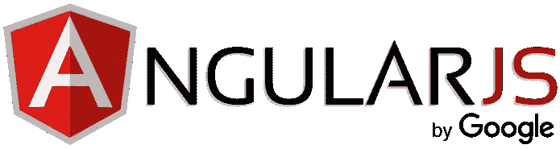

# 角度 2+中的 CSS 样式

> 原文：<https://itnext.io/css-styling-in-angular-2-7530aa2718e7?source=collection_archive---------4----------------------->



昨天，当我在做一个 Angular 项目时，有必要根据我在特定元素上的数据量来定制不同设备上的布局，这显然需要媒体查询 CSS。我想我应该写一篇关于如何在 Angular 2+中设计风格的文章，所以就有了:)

在 Angular 2+中有很多方法来设计元素的样式。我们将逐一讨论几乎所有的问题。

**请注意，在 Angular 2+中，您可以通过将 CSS 样式放在 html 文件的头部或直接嵌入 html 标签本身来设置元素的样式。*

1.  **内联风格**

您直接从组件中设计元素的样式—我不喜欢这样。

```
@Component({
  templateUrl: 'box.html',
  **styles: [`
    .box {
      height: 100px;
      width: 100px;
    }
  `],**
})
```

2.**外部样式表**

我更喜欢这种方法。它很容易管理。

```
@Component({
  **styleUrls: ['css/style.css'],**
  templateUrl: 'box.html',
})
```

**关于内联和内外样式，请阅读更多关于* [*视图封装*](https://angular.io/api/core/ViewEncapsulation)

3.**使用[style.property]绑定**

您可以直接在模板中使用样式属性绑定。

```
<div **[style.color]="'red'"**> This should be red </div>
```

或者你可以通过一种方法

```
<div **[style.color]="color"**> This should be red </div>
```

getColor 方法将从组件中获取颜色。

```
...
export class App {
    //set a property that holds a color for our style.
    color = this.getColor();

    //function to get color
    public getColor() {
        return 'red';
    }
}
```

4.**使用[className]指令**

这真的很简单:

```
<p**[className]="'active'**"> Will change based on class name! </p>
```

你可能会奇怪为什么我们不一开始就把 **class="style"** 。是的，它可以工作，但是通过使用指令，您将对类名有更多的控制。

```
<p[className]="**condition ? 'active' : 'inactive'**"> 
   Will change based on class name! 
</p>
```

5.**使用【class.property】绑定**

这与样式属性绑定是一样的，但是您将获得一个类名。

```
<div **[class.active]="condition"**></div>
```

只有当**条件**返回**真**时，类名**活动**才会显示。

6.**使用【ngClass】指令**

当有多个类可以添加到元素中时，将使用 ngClass 指令。

```
<div **[ngClass]="['class-1', 'class-2']"**></div>
```

我们还可以通过应用条件来控制类名。

```
<div [ngClass]="{
   'class-1': condition, 
   'class-2': condition
}">
</div>
```

7.**使用【style.property】绑定**

样式属性绑定会将样式直接应用到您放入的元素中。

```
<p **[style.background-color]="'White'"**>White background</p>
<p **[style.font-size.px]="16"**>Font size 16px</p>
```

样式属性绑定也可以通过给它一个条件来应用。

```
<p **[style.font-size.px]="condition ? 16 : 10"**>
   Font size 16px or 10px
</p>
```

8.**使用【ngStyle】指令**

ngStyle 指令将一个对象作为输入，因此您可以对一个元素应用多种样式。

```
<div [ngStyle]="{ 
   'color': 'teal', 
   'font-size': '16px', 
   'background-color': **background_color** 
}"> 
   Multi-style values
</div>
```

您可以直接为样式赋值，也可以从组件中获取值

```
...
export class AppComponent { 
   public **background_color** = "white";
}
```

9.**在角度 2+中添加数据属性**

这对你来说可能听起来很奇怪，但是在我的一个项目中，当我想要对元素的样式有更多的控制时，我不得不使用这个。

```
<p **[attr.data-text]="condition ? 'active' : 'inactive'"**> 
 Custom data attribute
</p>
```

有了数据属性值之后，就可以使用普通的 CSS 来定位它。

```
[data-text='active']{display: none;}
[data-text='inactive']{display: block;}
```

以上这些方法并不是我们可以用来控制元素样式的唯一方法。我很高兴了解更多关于其他方法和用户案例的信息。如果你对你的项目有很好的解决方案，请留下你的评论！