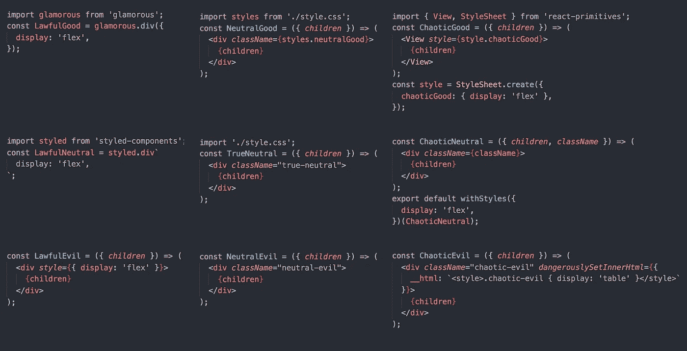
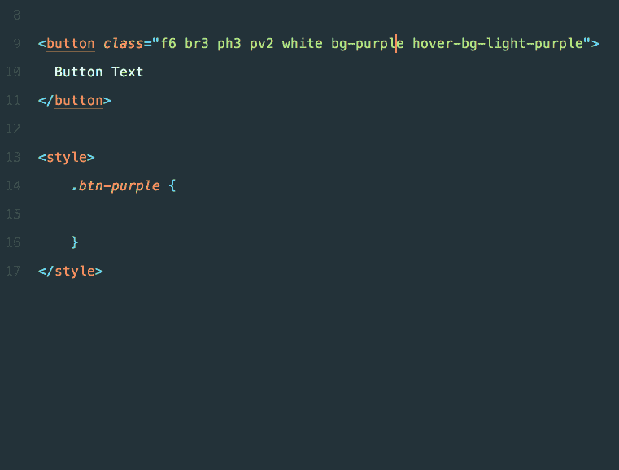
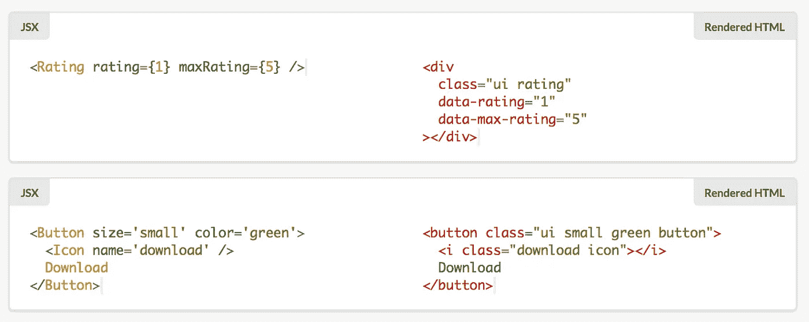

# CSS 到 JS

> 原文：<https://itnext.io/css-to-js-1a2ac587df12?source=collection_archive---------1----------------------->

不是中的**而是**到**。这就是区别？**

首先让我们回顾一下历史:

1.  有人开始用 JavaScript 写 SPA。
2.  接下来，有人发明了一种方法来处理 React 应用程序中样式。
3.  然后有人发现了一种从 JS 创建样式表的方法
4.  >我们到了。<

Right now, we have got **JS 中至少有 9 种不同的 CSS 放置方式**



[https://twitter.com/ZackArgyle/status/898739346995527680](https://twitter.com/ZackArgyle/status/898739346995527680)

这篇文章是关于在 JS 中使用 CSS 的另一种方法。是的，另一个。

# 第 1 部分— CSS

现代网络是由 3 个元素组成的——HTML、CSS 和 JavaScript。而这三人组里只有 JS 是`free`。只有 JS 才能独当一面。

HTML 和 CSS 纠缠在一起。因此，您可能会面临:

*   HTML 驱动的 CSS。当一个`blue primary button`发生时，你正在创造一个`.btn-primary-blue`。还是`.blue-primary-btn`？

> 没有区别。无论如何你都会犯错误。迟早的事。如果你想要一个有悬停效果的按钮呢？如果不是呢？

*   CSS 驱动的 HTML。当一个`blue primary button`你会写`<button class='btn blue primary'>`。这种方法要好得多。但仅限于 CSS。

> PS:你可以使用`<button class='btn' blue primary/>`，但是在属性匹配上有一些性能问题。

主题化呢？把蓝色的按钮换成红色的怎么样？为什么使用了数百万次的标准按钮必须由 10 个不同的类组成？*(不是 React 的情况)*

也许你应该创建`.blue-primary-btn`，并在中的某个地方**使用原子 CSS？**



这是下面文章中的图片。

[](https://adamwathan.me/css-utility-classes-and-separation-of-concerns/) [## CSS 实用程序类和“关注点分离”

### 在过去的几年里，我写 CSS 的方式已经从“语义”方法转变为更像…

adamwathan.me](https://adamwathan.me/css-utility-classes-and-separation-of-concerns/) 

但是结果 CSS 文件将是…胖。复制品的复制品。

你可能还记得 BEM、OOCSS、SMACSS 和其他解决 CSS 问题的忍术，并且只是理解:

# 第 2 部分——CSS……不是一种设计良好的语言。

这些年来，我们只是尽可能地使用它。而不是修复语言本身。

由于 HTML、CSS 和 JS 是由不同类型的人使用的(HTML/CSS“网站管理员”通常是设计师，而不是程序员)，JS 人通常不知道(或不尊重)CSS 人的成就。

换句话说—

> 你不知道 JS？不，你不懂 CSS。

现代前端不是很`*aware*`的`css-only`解决方案。他们通常不学习 CSS，因为他们把所有的空闲时间都用来学习 JS。此外，在 React 应用程序中使用现有的 css 框架并不容易。

> 并不容易。

# CSS 到 JS


百分百匹配

首先，有人说 CSS-in-JS 只是一个坏主意。甚至有人说 LESS/PASS/PostCSS 是一种恶。要对抗恶龙，你必须是恶龙。这是一篇老文章，但是有什么变化？

[](https://medium.com/@gajus/stop-using-css-in-javascript-for-web-development-fa32fb873dcc) [## 停止在 JavaScript 中使用 CSS 进行 web 开发

### 9 个童话故事

medium.com](https://medium.com/@gajus/stop-using-css-in-javascript-for-web-development-fa32fb873dcc) 

在那篇文章中@ [Gajus Kuizinas](https://medium.com/@gajus) 也提到，使用`styled-components`你将会“放松”CSS。你实际上——会的。

> CSS 代码不是 JS 代码。

我所说的 CSS-to-JS 就是解决这个问题的方法。它只是将 CSS 代码转换成 JS 代码，将 CSS 类转换成样式组件混合，甚至是真正的样式组件。

如果你只需要样式的 div，为什么要调用`styled.div`？

```
style.css:.MyDiv {
    font-size: 14px;
    color: #0F0;
    --css-to-js-component: div; <<--- :P
}Component.js:import {MyDiv} from 'style.css'
export default ({children}) => <MyDiv>{children}</MyDiv>
```

这就是 webpack 的加载器 css-to-js-loader 的工作方式。

> CSS-to-JS 甚至比 CSS-in-JS 更好。它用 JS 代码代替 CSS。

不幸的是，所有在线编码沙箱都不支持定制加载器，所以我们必须使用另一个例子—[styled-components-mixins](https://github.com/theKashey/styled-components-mixins)

观看它的实际应用:

[https://twitter.com/theKashey/status/898880712400527361](https://twitter.com/theKashey/status/898880712400527361)

这只是将`old` CSS 框架移植到`new` JS 世界的一种方式。而且它很难看，不灵活，不能提供任何好的体验。

说实话——这种方法只适用于原子 css，只要默认情况下任何嵌套选择器或“双”选择器(没有主题)不工作。

> 这是样式组件的限制。你就是不能使用复杂的选择器。

样式化组件 mixins 只是提供了一些流行的 CSS 框架，这些框架是可以移植的(抱歉是语义 UI):

*   [https://github.com/tachyons-css/tachyons/](https://github.com/tachyons-css/tachyons/)
*   [https://github.com/twbs/bootstrap](https://github.com/twbs/bootstrap)
*   [https://github.com/turretcss/turretcss](https://github.com/turretcss/turretcss)
*   [https://github.com/Dogfalo/materialize](https://github.com/Dogfalo/materialize)
*   [https://github.com/monarkee/beard](https://github.com/monarkee/beard)
*   [https://github.com/basscss/basscss](https://github.com/basscss/basscss)

它们都是“功能”或“原子”框架，您可以使用以下代码:

```
import {
    br3, pa3, bg_blue, white, grow <-- classes from tachyons
} from "styled-components-mixins/tachyons";const Button = styled.a`
   ${br3} ${pa3} ${bg_blue} ${white} ${grow} <-- mixins
`;
```

您还获得了足够好的类名自动完成功能，并保持了应用程序代码的紧凑性，因为 long 样式是在运行时组装的。

# 它是如何工作的

样式组件混合和 css-to-js-loader 都非常简单。他们只是对另一个 npm 模块 [postcss-to-js](https://github.com/theKashey/postcss-to-js) 进行了一次调用。

Postcss-to-js 也很简单——它只是使用 Postcss 为 css 创建 AST，稍微转换一下规则，在 CSS 规则中移动媒体选择器和伪类。

> 基本上，它只是提取了第一条规则，并把其他的都放进去。

接下来，所有的名字都必须被翻译成 JS 兼容的变量:

*   。阶级变成阶级
*   div 变成 tag_div
*   #id 解码$id
*   `reserved`关键字将在末尾得到 _$号
*   而且所有“js 不友好”的名字一开始都会 got _ 或者不会完全导出。

因此，某些内容将不会被导出，而“double”类，如“ui BTN”-->“ui . BTN”将变成“ui_and_btn”。不牛逼，但也没别的办法:(。

它是好的还是可用的？不。至少现在是。

# 从头开始一切

寻找更好的方法？成为你寻求的改变！

例如，Semantic-UI 移植了他们令人敬畏的纯 css 框架来做出反应。**成绩是**更是**牛逼**。

[](https://github.com/Semantic-Org/Semantic-UI-React) [## 语义-组织/语义-用户界面-反应

### 官方的语义-用户界面-反应集成

github.com](https://github.com/Semantic-Org/Semantic-UI-React) 

这种方式比我提供的假 automagic 好得多。

# 时尚的方式

样式组件很棒，但是我们大多数人都没有正确使用它。你可能会有点惊讶，但是 Styled-Components 是采用 BEM 的最佳方式，而不是原子 CSS。

> 关键是传承！

```
const button = styled.button`
  color: #000;
  font: 1rem;
`const blueButton = styled(button)`
  background-color: blue;
` const bigBlueButton = styled(blueButton)`
  width: 200px;
`; 
```

您可以从另一个“样式”中继承一个，产生“类堆叠”，完美地匹配**关注点分离**，如 BEM 或 SMACSS 所示。

这是一个超级重要的时刻，对于“正确的”CSS 来说至关重要。

# 结论:

我在 Yandex 呆了 6 年，Yandex 是 BEM 的“发明者”,我喜欢他们两个。

我现在正在使用样式组件，我喜欢它，也讨厌它。

助推器？对于不懂 CSS 的人来说，这总是一个解决方案。💩

> 但是**我**我也是**还是**不知道 CSS** 。还在寻找更好的使用方法。**

说实话——我不知道一个人如何能“了解”CSS。每个人都要反抗。

## 要读的东西

[](https://github.com/theKashey/styled-components-mixins) [## kashey/样式组件混合

### 风格化组件混合使用流行的框架和风格化组件

github.com](https://github.com/theKashey/styled-components-mixins) [](https://medium.com/@gajus/stop-using-css-in-javascript-for-web-development-fa32fb873dcc) [## 停止在 JavaScript 中使用 CSS 进行 web 开发

### 9 个童话故事

medium.com](https://medium.com/@gajus/stop-using-css-in-javascript-for-web-development-fa32fb873dcc) [](https://adamwathan.me/css-utility-classes-and-separation-of-concerns/) [## CSS 实用程序类和“关注点分离”

### 在过去的几年里，我写 CSS 的方式已经从“语义”方法转变为更像…

adamwathan.me](https://adamwathan.me/css-utility-classes-and-separation-of-concerns/)