# 带有 CSS 变量和 JavaScript 的动态应用程序主题🎨

> 原文：<https://itnext.io/css-variables-dynamic-app-themes-86c0db61cbbb?source=collection_archive---------1----------------------->

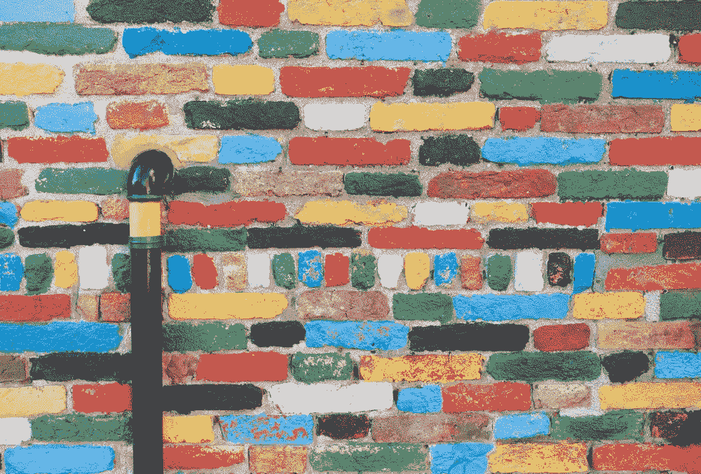

你好。在这篇文章中，我想讨论我在 web 应用程序中创建动态主题加载器的方法。我会讲一点关于 react，create-react-app，portals，sass，css 变量和其他有趣的东西。如果你对此感兴趣，请继续阅读！

我正在开发的应用程序是一个音乐应用程序，是 Spotify 的迷你克隆。客户端代码用 create-react-app 引导。我用 [node-sass-chokidar](https://github.com/michaelwayman/node-sass-chokidar) 为 CRA 设置添加了 sass 支持。

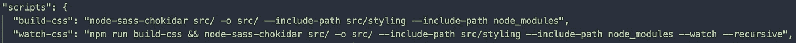

sass 集成

将 sass 添加到 CRA 设置中并不太困难。我只需要安装`node-sass-chokidar`并在 package.json 文件中添加几个脚本，告诉它如何构建 sass 文件，并在开发过程中观察它们的重新编译。`include-path`标志是让它知道在哪里寻找通过`@import`导入 sass 文件的文件。选项的完整列表在[这里](https://github.com/michaelwayman/node-sass-chokidar#options)。

随着 sass 集成的加入，我做的下一件事是开始定义一个颜色列表，这将是应用程序的基础模板。它不必是一个详尽的列表，只是基本模板所需的最少颜色。接下来，我定义了应用程序中使用颜色的部分，并给它们起了描述性的名字。有了这些变量，就可以将它们应用于应用程序的各个组件，这些组件将定义应用程序的主题。

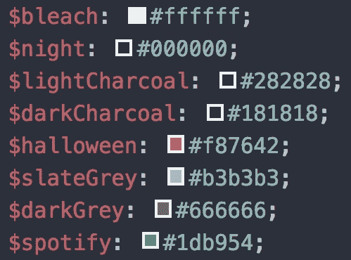

sass 颜色变量

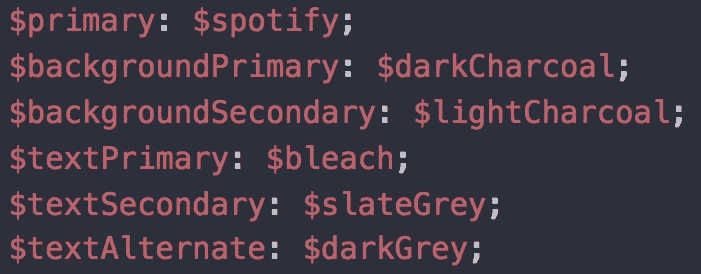

sass 主题变量

在这里你可以看到我已经定义了一组基本的颜色变量，并将它们应用到默认的 sass 主题变量中。这些主题变量将在整个代码库的样式表中使用，以将调色板应用于应用程序并赋予其生命！

接下来，我需要一种方法来轻松地动态更新这些变量。这就是 CSS 变量发挥作用的地方。

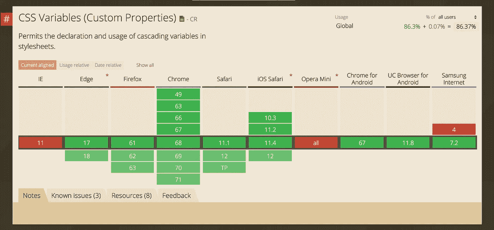

CSS 变量浏览器支持

CSS 变量是较新的浏览器规范。它非常接近 100%的浏览器支持。考虑到这一点，我正在构建的应用程序是一个原型，所以我不太担心在这里支持旧浏览器。也就是说，有些人已经为 IE 推出了一些[垫片。](https://github.com/luwes/css-var-shim)

对于我的用例，我需要将 SASS 变量同步到 CSS 变量。为此，我选择使用 [css-vars](https://github.com/malyw/css-vars) 包。

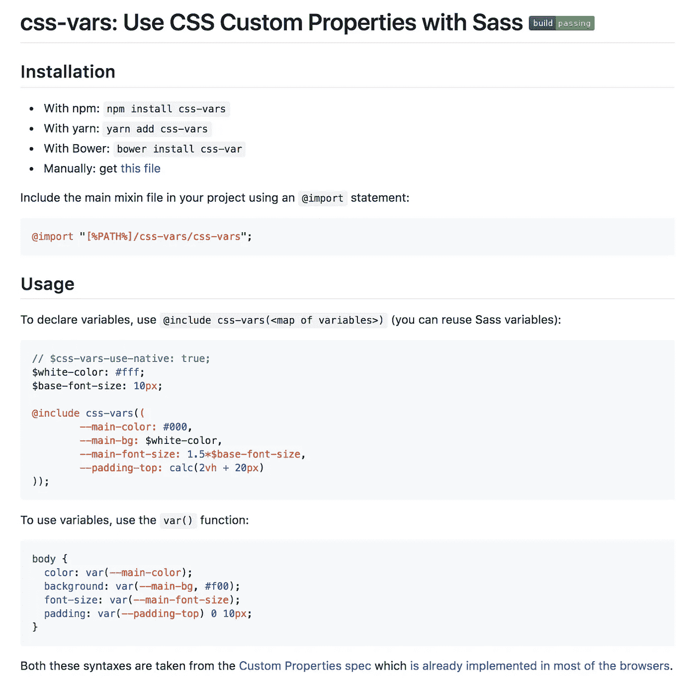

CSS-var

我基本上为我的应用程序做了同样的事情，如上面的`README` …

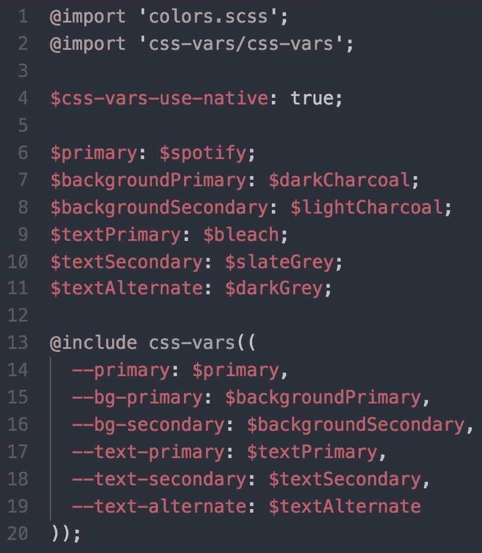

用 SASS 添加 CSS 变量支持

有了这个，我就可以在我的样式表中使用 CSS 变量，而不是 SASS 变量。上面重要的一行是`$css-vars-use-native: true;`，它告诉`css-vars`包编译后的 CSS 应该编译成实际的 CSS 变量。这对于以后需要动态更新它们是很重要的。

下一步是给应用程序添加一个“主题选择器”。为此，我想找点乐子，选择添加一个隐藏菜单。这给了它一点复活节彩蛋的感觉，只是让它更有趣。我不太担心这个 UX 是否合适——将来我可能会把它移出来，让它更显眼。但现在，让我们为应用程序添加一个秘密菜单，当用户按下键盘上的某个组合键时，就会显示该菜单。

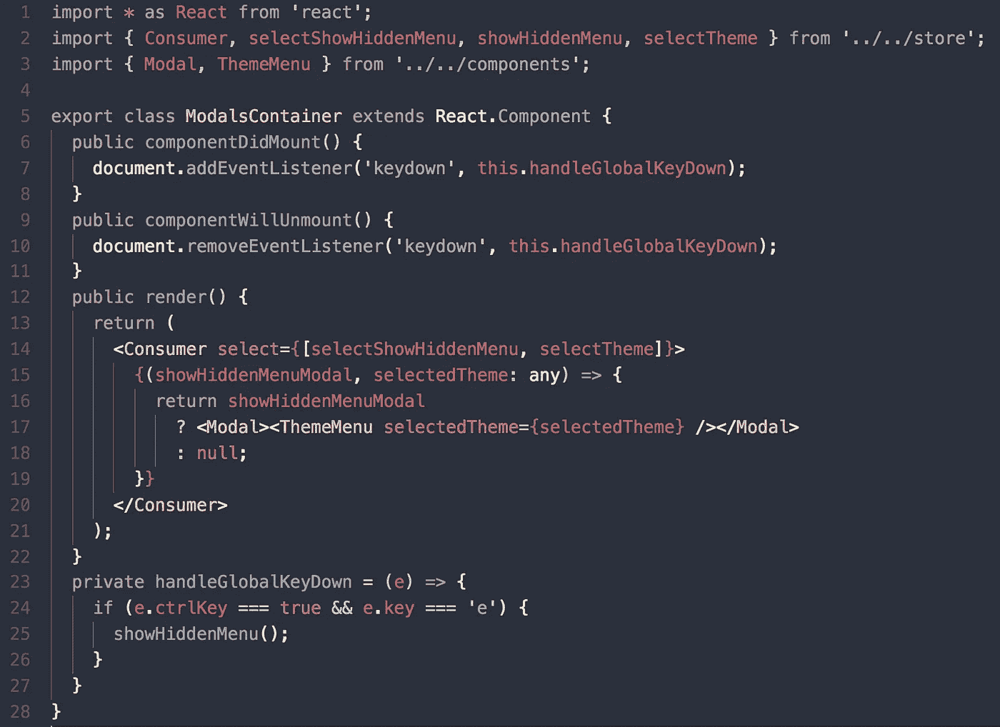

模态容器

这个容器将监听组合键`CTRL + E`，当它听到组合键时，它将显示隐藏的菜单模式。这里的`Modal`组件是一个 react 门户…

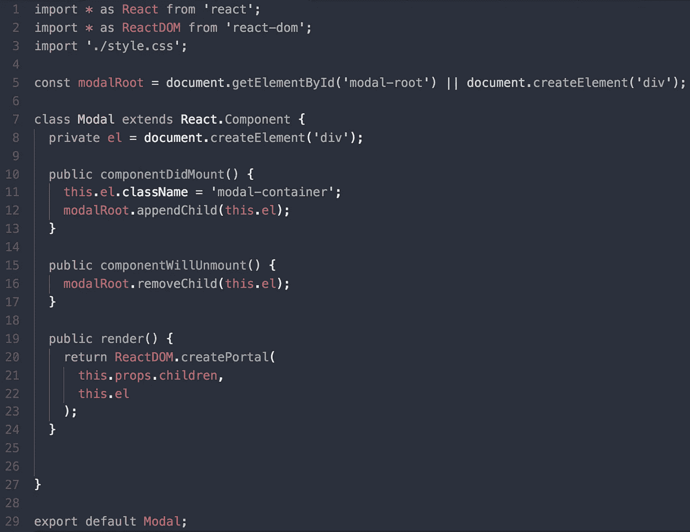

模态门户

它将自己与`modal-root`页面元素连接和分离。有了这个，我可以创建包含选择菜单的`Theme`组件来选择各种不同的主题调色板。

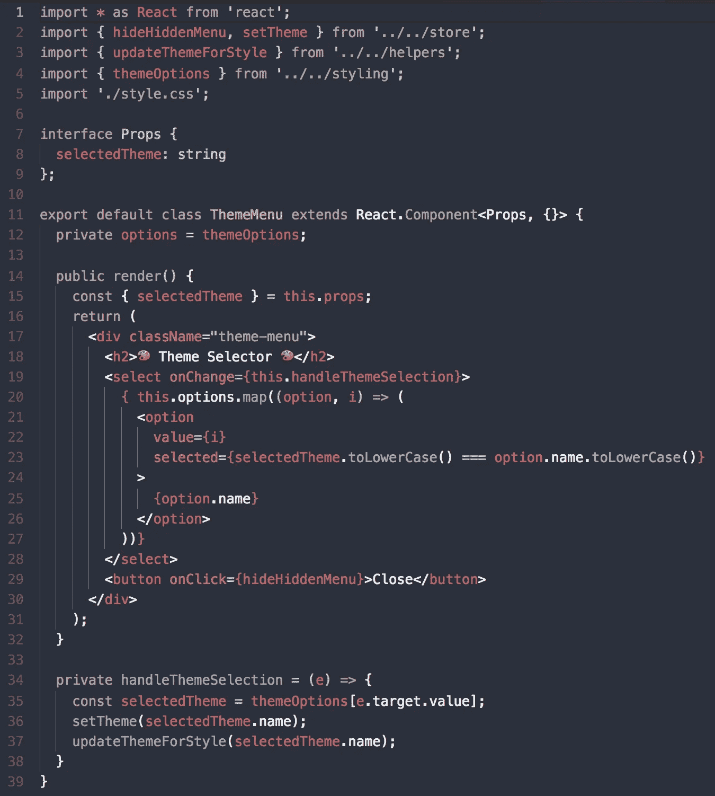

主题组件

这里，我导入了一个调色板列表，其中的颜色变量与我们之前定义的变量相匹配。选择后，它将在应用程序状态中全局设置主题，然后它将调用`updateThemeForStyle`，这是一个使用 JavaScript 更新 CSS 变量的函数。

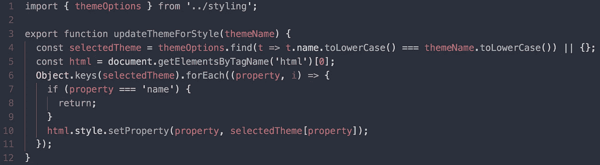

更新 CSS 变量

该函数获取所选主题的名称，在`themeOptions`中找到主题调色板，然后为每个属性更新`html`元素的`style`属性。

主题选项只是一个选项列表，其中的变量与为 CSS 变量定义的变量相同。

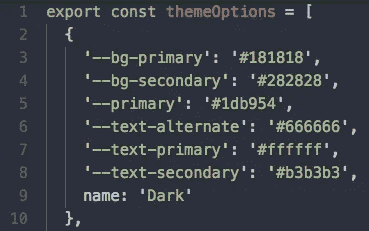

主题选项

有了这些，主题选择器现在可以动态更新了！

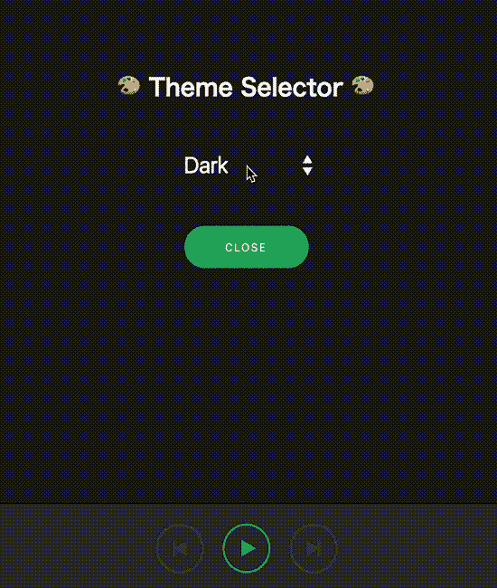

主题选择

这就是结果，动态主题更新！

这是我添加特性的[提交](https://github.com/mjw56/wavves/commit/7fd2210c69617c33c4244d4755f1d33770d3c57d)。完整的代码库是[这里是](https://github.com/mjw56/wavves)。

你可以在这里试用这个应用的工作版本[。(需要 spotify 高级会员资格)。是的，如果你在应用程序中按下`CTRL + e`，隐藏的主题模式将会显示！😄](https://wavves-nxnczahctp.now.sh)

感谢您的阅读和快乐的黑客！