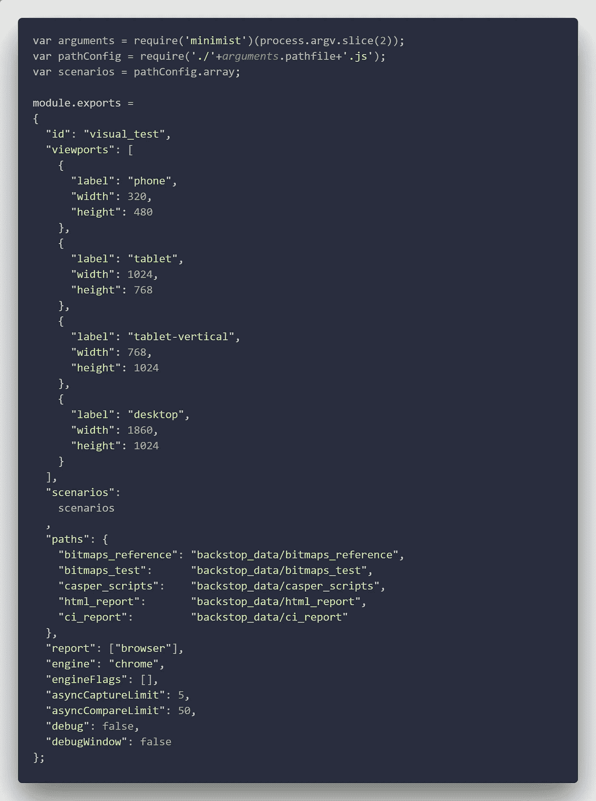
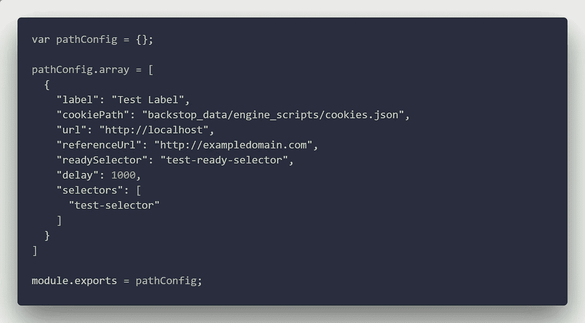
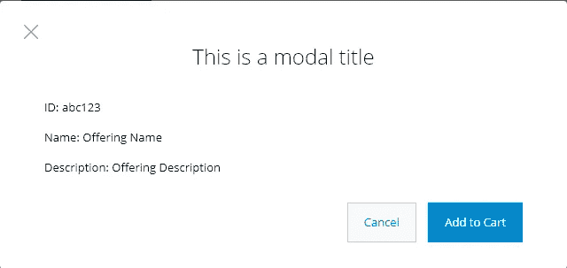
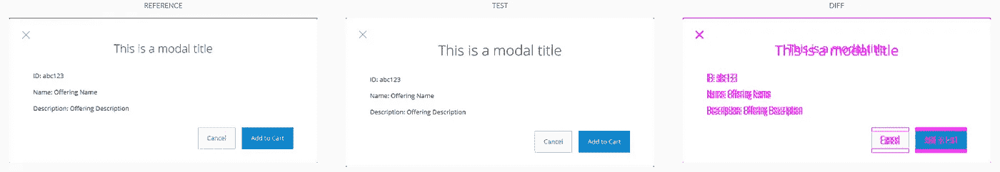
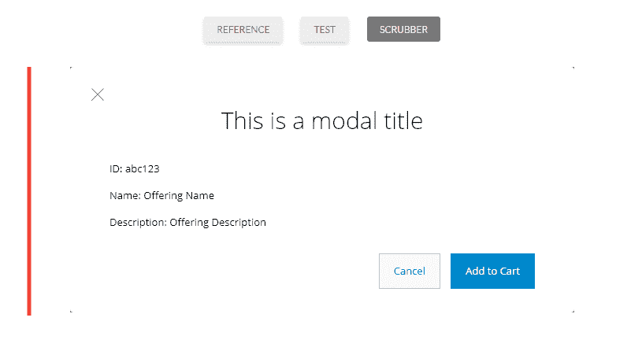

# 用 BackstopJS 进行 CSS 可视化回归测试

> 原文：<https://itnext.io/css-visual-regression-testing-with-backstopjs-9b66be11339f?source=collection_archive---------6----------------------->

作为一名使用大型产品代码库的前端开发人员，有时一些新的 CSS 会破坏产品中其他地方的元素。我知道基于组件的风格可以解决这种情况，但是当你处理遗留代码的时候，组件并不总是存在。

视觉回归测试可以跟踪任何突破性的风格变化。回归测试有很多选择。我决定用[背刺](https://github.com/garris/BackstopJS)。BackstopJS 使用 Chrome Headless、Phantom 或 Slimmer 呈现页面。它还可以模拟用户与 ChromyJS 或 CasperJS 的交互。它非常容易使用，测试报告也是一流的。

BackstopJS 安装可以在全球范围内完成，也可以根据项目在本地完成。纱线或 npm 均可用于安装:

```
npm install backstopjs --save-dev
```

或者

```
yarn add backstopjs --dev
```

安装后，BackstopJS 会在项目的根目录下添加一个 backstop.json 文件。这是您的主配置文件，在某些情况下可以正常工作。当使用大型应用程序时，使用单个文件配置方法可能会有点令人生畏。幸运的是，BackstopJS 允许我们使用 JS 模块作为配置文件。我们只需要记住显式指定配置文件路径并指向一个. js 文件，就像这样:

```
backstop test --configPath=backstop-settings.js --pathfile=backstop-tests
```

我们的 backstop-settings.js 文件包含您计划运行的每个测试的所有默认设置，比如视口大小、测试引擎和调试选项。在下面的例子中，我们使用 Chrome 设置测试来运行多种浏览器大小，并将我们的参考文件放在 back stop _ data/bitmaps _ reference 文件夹中。



测试命令的下一部分是路径文件。这个文件包含了我们将要测试的不同场景。如果您运行的应用程序有多个环境，您可以使用不同的路径文件分别测试这些环境。运行单一场景测试的简单路径文件可能如下所示:



使用 pathConfig 数组，我们可以将多个场景传递给我们的配置文件。这种方法还允许我们在不同的文件中管理应用程序每个区域的测试场景，这有助于保持事情的条理性。

设置好配置文件后，下一步是使用以下工具收集参考图像:

```
backstop reference --configPath=backstop-settings.js --pathfile=backstop-tests
```

这将为我们在配置文件中指定的视口大小中的每个场景创建参考图像。每个都存储在我们在配置中指定的文件夹中。



桌面视口的模式图像示例

现在我们有了所有的参考，我们可以运行一个测试，看看是否有任何偏离的风格可能会影响我们的模式。在一个完美的世界中，您将运行测试，一切都将通过，但是开发并不总是完美的，杂散代码会导致一些问题。下面是我们的测试命令:

```
backstop test --configPath=backstop-settings.js --pathfile=backstop-tests
```

所有测试运行后，将会打开一个新的浏览器窗口，显示测试结果。对我来说，这是 BackstopJS 真正闪光的地方。对于任何失败的测试，您可以使用擦洗工具并通过并排图像比较来直观地检查更改。在下面的例子中，我改变了模态标题的字体大小。正如你所看到的，仅仅改变字体大小就极大地改变了我们模型的外观。



并排图像比较



洗涤器图像比较

使用不同的可视化报告，您可以轻松地看到应用程序中是否有任何重大变化。接下来的问题就是找到并修复它们。一旦修复到位，就可以运行另一个测试。如果所有测试案例都已通过，可以使用以下方法创建一组新的主参考图像:

```
backstop approve --configPath=backstop-settings.js --pathfile=backstop-tests
```

这篇文章仅仅触及了所有可能的测试选项。BackstopJS 允许我们测试应用程序中的任何元素。例如，对于我们应用程序的一个部分，我目前有超过 100 个视觉测试。

我发现这种可视化回归测试的方法在处理大型代码库时非常有用。也可以小规模使用。尤其是对 CSS 代码的微小变化进行抽查。

有关 BackstopJS 的更多信息，请查看 GitHub repo 文档。如果您对我的方法有任何反馈或任何问题，欢迎在下面评论。